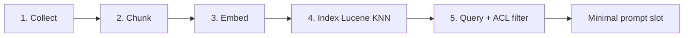
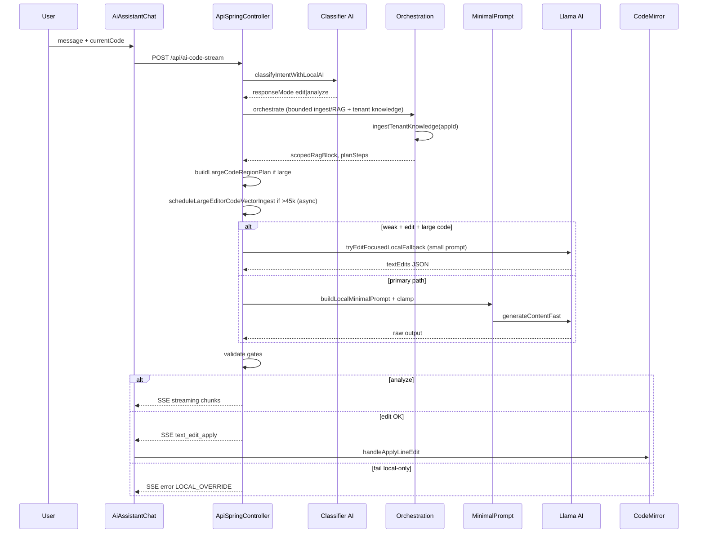
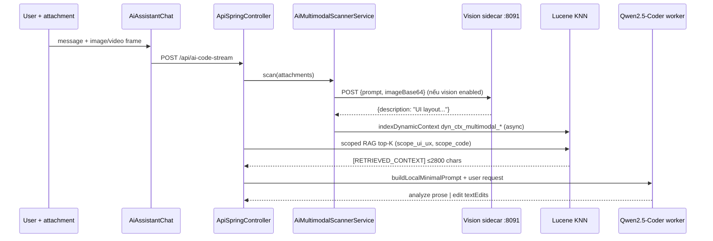
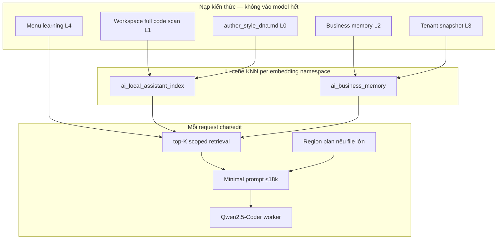
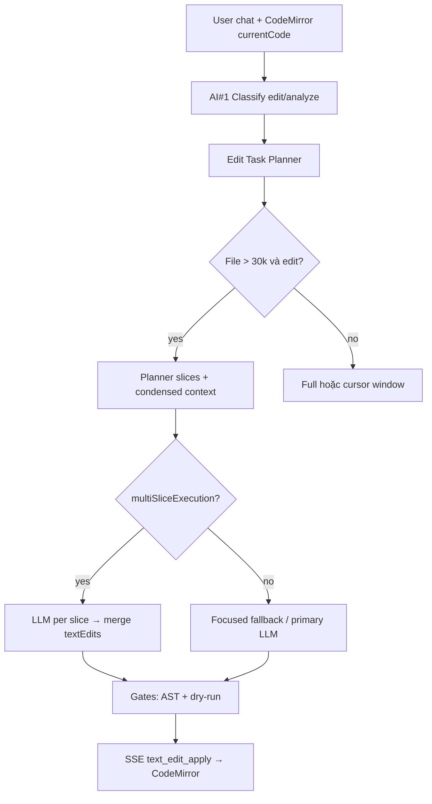
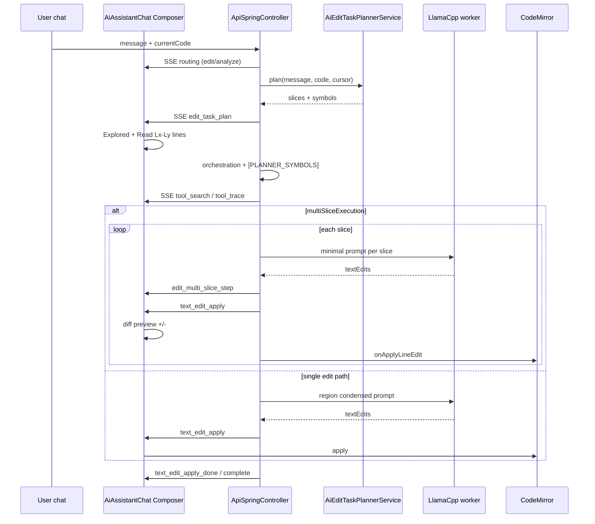
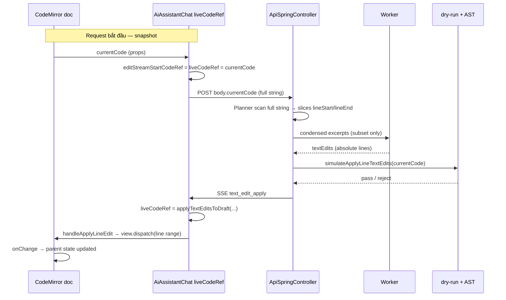
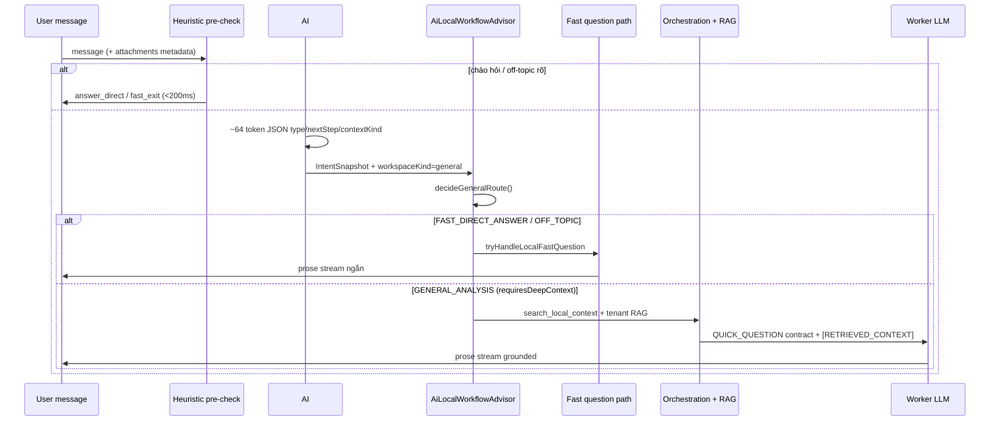
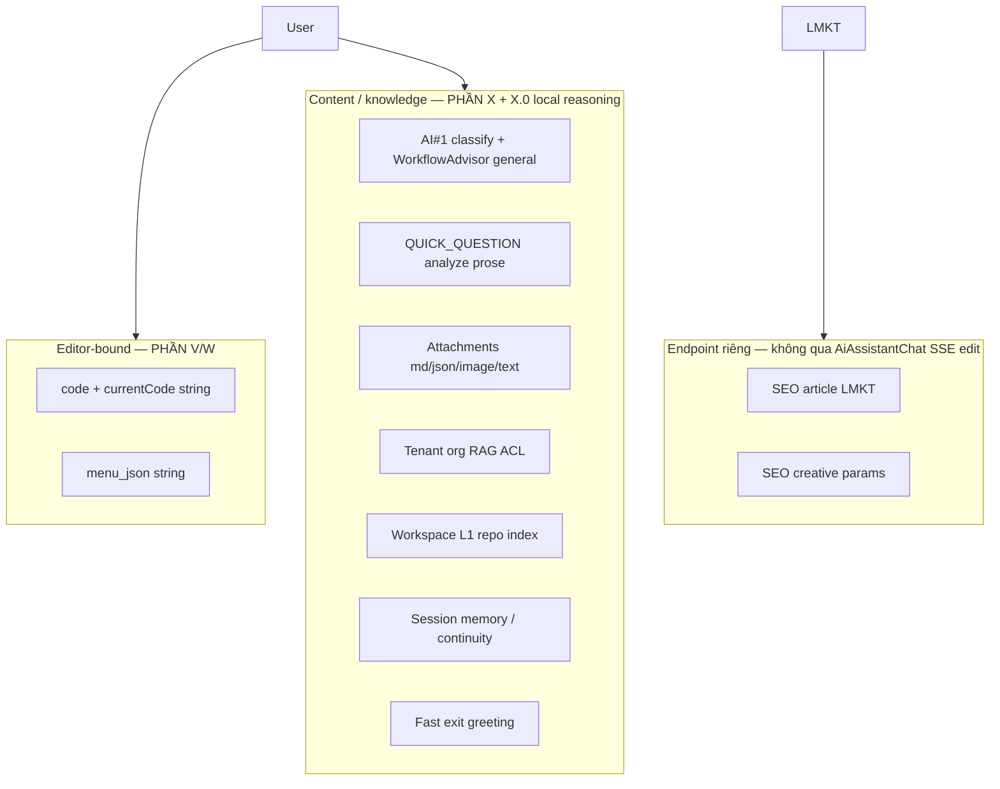
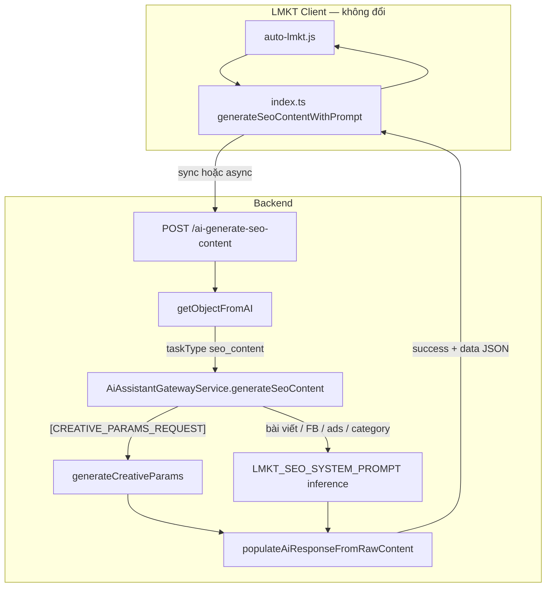

# CSM AI LOCAL — MASTER BRIEF CHO CURSOR AI
## Một file duy nhất để yêu cầu Cursor làm lại / hoàn thiện hệ thống

Version: **3.3** · 2026-05-26  
Repo: `csm_server`  
**Single source of truth** — dùng file này khi yêu cầu Cursor implement / làm lại CSM AI Local **và** domain System Management liên quan RAG.

### Changelog v3.3

| Mục | Trạng thái |
|-----|------------|
| **Composer unified card** — một khung: Trạng thái request + Đã khám phá + diff (edit mode) | ✅ |
| Ẩn **Tiến độ xử lý** / **N bước agentic** trùng khi `COMPOSER_PRIMARY_EDIT_TIMELINE` + edit | ✅ |
| `appendStageEvent` bỏ qua mốc Chuẩn bị/orchestration thường trong edit (chỉ giữ error/blocked) | ✅ |
| `COMPOSER_INTERNAL_AGENTIC_STAGES` — route/plan/schema không hiện dock Agentic | ✅ |
| Tự thu gọn **Đã khám phá** sau khi hoàn tất; mở rộng khi lỗi | ✅ |

### Changelog v3.2

| Mục | Trạng thái |
|-----|------------|
| **PHẦN Y — LMKT lane** — hợp đồng đầy đủ `auto-lmkt.js` + `index.ts`, **không đổi JS** | ✅ |
| Backend: `LMKT_SEO_SYSTEM_PROMPT` — follow schema user prompt (`content`, không ép `html_content`) | ✅ |
| Backend: alias `html_content` ↔ `content` trước khi trả `data` | ✅ |
| `isSeoContentPayload` nhận cả `content` lẫn `html_content` | ✅ |

### Changelog v3.1

| Mục | Trạng thái |
|-----|------------|
| **Composer timeline thống nhất** — một panel thay vì 3–4 block trùng (Explored + Trạng thái request + Agentic plan lặp) | ✅ |
| `COMPOSER_PRIMARY_EDIT_TIMELINE` — ẩn duplicate `edit_task_plan` / slice steps trong Agentic dock | ✅ |
| **Trạng thái request** gom vào Composer (header `Đang xử lý · …` / `Trạng thái request · …`, progress bar, req id) | ✅ |
| Plan gọn: **1 dòng** `Lập kế hoạch N vùng · symbols · Lx–Ly…` (không spam N dòng Read) | ✅ |
| Agentic dock edit mode → chỉ **「Chi tiết kỹ thuật」** (orch, verify, approval…) | ✅ |
| Backend: alias JSON `replacementText` → `replacement`; remap line relative → absolute trong multi-slice | ✅ |
| Panel **Ngữ cảnh editor** (slice click navigate) tắt khi Composer primary — navigate ⏳ roadmap U.9 | ⚠️ |
| Patch cards nhiều block (`+138`, `+12` từng bước) như Cursor Agent — vẫn **1 diff block** tích lũy | ⏳ |

### Changelog v3.0

| Mục | Trạng thái |
|-----|------------|
| **PHẦN X.0** — Luồng nội dung cũng do **AI Local tự tư duy nhanh** (classifier + workflow advisor) | ✅ |
| Ma trận route `GENERAL_ANALYSIS` / `FAST_DIRECT_ANSWER` / fast question path | ✅ |
| Nguyên tắc: **một** stack local quyết định — không tách “content = cloud” | ✅ |

### Changelog v2.9

| Mục | Trạng thái |
|-----|------------|
| **PHẦN X — Luồng nội dung** (ngoài code/menu): analyze, attachment, tenant, SEO, multimodal | ✅ |
| **Scope rule:** không bôi đen → xử lý **toàn bộ code/menu string**; bôi đen → thu hẹp vùng | ✅ code + backend |
| Planner `code_full` fallback (giống `menu_full`) khi không selection/symbol | ✅ |

### Changelog v2.8

| Mục | Trạng thái |
|-----|------------|
| **PHẦN W — Frontend integration** — ma trận mọi call site `AiAssistantChat` / `CodeMirrorWithAiAssistant` | ✅ |
| `resolveOutgoingEditorSnapshot` — gửi `liveCodeRef` + cursor/selection lên backend | ✅ |
| Backend planner: selection từ `editorMetadata` → `planFocusStart/End` | ✅ |
| `CodeEditor` + `AiMenuDesigner` wire `pName`/appId/currentCode đúng | ✅ |

### Changelog v2.7

| Mục | Trạng thái |
|-----|------------|
| **PHẦN V — Code String Editor** — mô hình không file, hợp đồng dòng, chuỗi đồng bộ CodeMirror | ✅ |
| Quy tắc patch chính xác trên `currentCode` (DynamicCode / menu JSON string) | ✅ |
| Sửa thuật ngữ UI: `seo.js` = nhãn hiển thị, không phải đọc file disk | ✅ |

### Changelog v2.6

| Mục | Trạng thái |
|-----|------------|
| **Composer UI** — activity log (Explored · reads/searches) + inline diff +/- trong chat | ✅ PHẦN U |
| Map SSE → Cursor-style lines: Read Lx–Ly, Searched Lucene, Editing region | ✅ |
| Diff preview realtime khi `text_edit_apply` | ✅ |

### Changelog v2.5

| Mục | Trạng thái |
|-----|------------|
| **Audit plan→execute** — ma trận đối chiếu Copilot/Cursor vs CSM | ✅ PHẦN T |
| **UI Trò chuyện** — panel ngữ cảnh editor + plan slices + multi-slice SSE | ✅ `AiAssistantChat.tsx` |
| Orchestration nhận `[PLANNER_SYMBOLS]` từ Edit Task Planner | ✅ |
| Agentic workflow hiển thị từ 1 bước (khi có plan) | ✅ |

### Changelog v2.4

| Mục | Trạng thái |
|-----|------------|
| **Edit Task Planner** — phân tích yêu cầu → xác định vùng code/menu → multi-slice edit (Cursor/Copilot style) | ✅ PHẦN S |
| `AiEditTaskPlannerService` + SSE `edit_task_plan` / `edit_multi_slice` | ✅ |
| Symbol search ưu tiên lifecycle + multi-occurrence trong `buildCodeStreamRelatedSymbolExcerpts` | ✅ |
| Config `ai.edit.task-planner.*` | ✅ |

### Changelog v2.3

| Mục | Trạng thái |
|-----|------------|
| **Knowledge Mastery** — AI học phong cách + nghiệp vụ qua Lucene, portable pack | ✅ PHẦN R |
| **Portable Knowledge Pack** `scripts/csm-knowledge-pack.sh` export/import | ✅ |
| **Author Style DNA** `author_style_dna.md` | ✅ Template |
| **Daily learning loop** spec (menu learning + tenant + workspace) | ✅ |
| API rebuild workspace full code scan | ✅ `/api/ai-local/knowledge/rebuild-workspace` |

### Changelog v2.2

| Mục | Trạng thái |
|-----|------------|
| **Model stack 3 vai trò** (reasoning + embedding + vision sidecar) | ✅ Spec + scripts |
| **SmolVLM2-256M-Video** cho máy 5GB / 2 CPU | ✅ Khuyến nghị chính |
| **Lucene vector + multimodal ingest** (ảnh → text → RAG → worker) | ✅ Luồng tích hợp |
| Script `download-ai-local-models.sh`, `start-ai-local-vision.sh` | ✅ Repo root `/scripts` |

### Changelog v2.1

| Mục | Trạng thái |
|-----|------------|
| **SEO creative-params lane** (`[CREATIVE_PARAMS_REQUEST]`) tách khỏi full SEO article | ✅ Lane riêng + seed fallback |

### Changelog v2.0

| Mục | Trạng thái |
|-----|------------|
| P0 routing edit/analyze, region plan, async large-code ingest | ✅ Đã triển khai (v1.1) |
| System admin UX: org tables, role_code, combo dedupe, data_app_ids | ✅ Commit `cba701ed` trên `main` |
| **Phase 2 RAG:** tenant snapshot + ACL-filtered retrieval | ✅ Commit `e45eae92` trên `origin/main` |
| Phase 3: embedding model riêng, BM25 hybrid, unified index, citations | ⏳ Roadmap |

---

## CÁCH DÙNG FILE NÀY VỚI CURSOR

Copy toàn bộ file (hoặc @-mention file này) vào Cursor Chat, kèm prompt mẫu:

```txt
Đọc @CSM_AI_LOCAL_CURSOR_MASTER_BRIEF.md và triển khai đầy đủ theo spec Cursor-aligned.
Ưu tiên: (1) routing edit/analyze đúng, (2) prompt nhỏ trên file lớn, (3) edit trả textEdits apply CodeMirror,
(4) tenant RAG + ACL filter khi hỏi domain org/permission/menu.
(5) Mọi patch tính trên **full currentCode string** (1-based lines) — KHÔNG coi như file path (PHẦN V).
Không over-engineer. Sửa đúng các file đã liệt kê. Compile backend + không phá frontend SSE.
Máy target: local-5gb (5GB RAM, 2 CPU, qwen2.5-coder-1.5b Q4_K_M).
Sau khi xong: commit + push theo PHẦN P nếu user yêu cầu đồng bộ git.
```

---

# PHẦN A — BỐI CẢNH DỰ ÁN

## A.1 Hệ thống là gì

CSM là ERP legacy (Java Spring Boot + React admin). Trợ lý AI local chạy **llama.cpp JNI** (model ~1.5B), index context qua **Lucene KNN + RocksDB**, chat tại màn **Trò chuyện Trợ lý AI** (`AiAssistantChat.tsx`), edit code qua **CodeMirror** (DynamicCode runtime ~hàng trăm nghìn ký tự).

## A.4 Mô hình Code String — không phải file (đọc PHẦN V)

CSM **không** sửa file trên disk như Cursor/Copilot. Toàn bộ editor là **một chuỗi code** (`currentCode`) trong memory/React state, lưu DB qua DynamicCode (`p_name` + `p_type`).

| Cursor / Copilot | CSM |
|------------------|-----|
| Workspace = nhiều file path | **Một** buffer string / request |
| Patch theo path + offset file | Patch theo **`startLine`/`endLine` trên full string** |
| `read_file("src/foo.ts")` | `Read seo · L5810–5890` = đọc **vùng dòng trong string** |
| Diff `foo.ts +12 -8` | Diff `seo.js +12 -8` = **nhãn hiển thị** (`pName`), không phải path thật |

**Quy tắc vàng (bổ sung):**

```txt
NẠP ĐỦ VÀO HỆ THỐNG  (ingest + index theo editor key pName_pType)
KHÔNG NẠP HẾT VÀO MODEL  (minimal prompt + slice)
PATCH LUÔN TRÊN FULL currentCode  (số dòng 1-based, không relative trong slice)
```

Chi tiết hợp đồng dòng, chuỗi đồng bộ frontend↔backend↔CodeMirror, lỗi thường gặp → **PHẦN V**.  
Ma trận màn hình gọi `AiAssistantChat` / props bắt buộc → **PHẦN W**.

## A.2 Mô hình làm việc mục tiêu (giống Cursor)

| Hành vi Cursor | CSM phải làm |
|----------------|--------------|
| Index workspace, không đọc cả repo mỗi lần hỏi | Ingest/index đủ vào Lucene; model chỉ nhận slice + top-K RAG |
| Chat Ask → giải thích | `responseMode=analyze` → stream prose (tiếng user) |
| Agent Edit → apply patch | `responseMode=edit` → JSON `textEdits` (dòng trên **full code string**) → CodeMirror line edit |
| Hỏi đáp / domain / attachment (không sửa buffer) | AI Local **tự classify + route** → prose hoặc RAG — **PHẦN X.0** |
| Context nhỏ, chính xác | Region plan + symbol-aware retrieval |
| Patch validate trước apply | Buffer LLM output → gate → mới emit SSE |

## A.3 Nguyên tắc vàng

```txt
NẠP ĐỦ VÀO HỆ THỐNG  (ingest + index)
KHÔNG NẠP HẾT VÀO MODEL  (minimal prompt + slot budget)
```

---

# PHẦN B — VẤN ĐỀ HIỆN TẠI CẦN SỬA DỨT ĐIỂM

Cursor AI **phải** đảm bảo các lỗi sau không còn:

| # | Triệu chứng | Nguyên nhân | Cách sửa bắt buộc |
|---|-------------|-------------|-------------------|
| 1 | `LOCAL_OVERRIDE_NO_CLOUD_FALLBACK` sau ~5 phút | Prompt 13k–15k tokens × nhiều lần; model 1.5B không ra JSON hợp lệ | Edit-focused-first trên weak; cap prompt ≤18k; bỏ RAG nặng khi weak+edit |
| 2 | Log `mode=analyze type=EDIT_CODE` | Classifier trả `responseMode=analyze` dù user nói "sửa" | `EDIT_CODE`/`EDIT_MENU` **luôn** `edit` trong `resolvedResponseMode()` và sau parse classifier |
| 3 | RAG neo `trackSelection` thay vì lifecycle | Symbol lấy từ digest file, không từ message | Prepend lifecycle symbols khi message có webview/process/proxy |
| 4 | Ingest 371k sync mỗi request edit | Orchestration ingest full code sync chặn request | **Async** chunk ingest vào Lucene KNN (`ingestLargeCodeAsync`); request hiện tại dùng region plan, request sau hit scoped RAG |
| 5 | UI báo "chỉ rõ node id/label" trên code editor | Failure message copy từ menu | `buildLocalOnlyFailureMessage` phân biệt code vs menu |
| 6 | Stream raw JSON/token rác lên chat | Emit trước validate | Edit/menu: buffer → validate → `text_edit_apply` |
| 7 | Agentic 26 bước xong mới fail | Generation phụ thuộc orchestration nặng | Fast path generation không chờ deep path xong mới gọi LLM chính |

---

# PHẦN C — KIẾN TRÚC MỤC TIÊU

## C.1 Hai AI (Router + Worker) + RAG layer

> **Quan trọng (v3.0):** Router AI#1 + `AiLocalWorkflowAdvisorService` phục vụ **cả ba** workspace: `code`, `menu`, **`general`** (nội dung không sửa buffer). Luồng nội dung **không** chuyển sang cloud mặc định — local suy luận nhanh trước, rồi mới orchestration/RAG/worker.

```
┌─────────────────────────────────────────────────────────────────┐
│ AI #1 — Intent Classifier (~64 tokens)                          │
│ ApiSpringController.classifyIntentWithLocalAI()                 │
│ Output: type, action, responseMode, nextStep, contextKind, conf │
│ Áp dụng: EDIT_CODE / EDIT_MENU / QUESTION / GENERAL             │
└────────────────────────────┬────────────────────────────────────┘
                             │
┌────────────────────────────▼────────────────────────────────────┐
│ AI Local Workflow Advisor (heuristic + route plan)              │
│ AiLocalWorkflowAdvisorService.advise()                          │
│ workspaceKind: code | menu | general                            │
│ Route: CODE_CONTEXT | MENU_CONTEXT | GENERAL_ANALYSIS | FAST_*  │
└────────────────────────────┬────────────────────────────────────┘
                             │
┌────────────────────────────▼────────────────────────────────────┐
│ Context layer (không vào model hết)                             │
│ · AiTenantKnowledgeIngestionService — DB snapshot org/roles     │
│ · AiScopedContextIngestionService — async vector ingest (large) │
│ · AiLocalOrchestrationService — scoped RAG, plan (bounded)      │
│ · AiRetrievalAuthContextResolver — ACL trước async SSE thread   │
│ · AiBusinessMemoryVectorService — Lucene KNN + ACL tag filter   │
│ · buildLargeCodeRegionPlan — condensed editor (request hiện tại)│
│ · scopedRagBlock top-K (hit index từ ingest trước / cùng phiên) │
└────────────────────────────┬────────────────────────────────────┘
                             │
┌────────────────────────────▼────────────────────────────────────┐
│ AI #2 — Worker                                                  │
│ AiAssistantGatewayService.buildLocalMinimalPrompt()             │
│ LlamaCppNativeService.generateContentFast / stream              │
└────────────────────────────┬────────────────────────────────────┘
                             │
┌────────────────────────────▼────────────────────────────────────┐
│ Gates → SSE → Frontend                                          │
│ analyze: streaming chunks | edit: text_edit_apply                 │
└─────────────────────────────────────────────────────────────────┘
```

## C.4 RAG pipeline — 5 bước (Collect → Query)



| Bước | Nguồn dữ liệu | Service / hàm |
|------|---------------|---------------|
| **1 Collect** | Attachments, editor `currentCode`, menu JSON, multimodal scan, **tenant DB snapshot** (`csm_roles`, `csm_depts`, `csm_branches`), domain rules markdown | `AiScopedContextIngestionService`, `AiTenantKnowledgeIngestionService`, `AiMultimodalScannerService` |
| **2 Chunk** | Code theo declaration; markdown theo section; menu theo node | `chunkCodeByDeclaration`, `indexMarkdown`, `indexDynamicContext` |
| **3 Embed** | Vector per chunk (nomic / hash fallback) | `AiBusinessMemoryVectorService.embedText` |
| **4 Index** | Lucene KNN per `appId`, tags + scope mask | `indexDynamicContext`, `indexMarkdown`, `searchWithScopes` |
| **5 Query** | Symbol-aware queries + scope mask + **ACL tag filter** | `AiRetrievalPolicyEngine`, `buildRagBlockWithScopes`, `passesRetrievalAuthFilter` |

**Nguyên tắc:** Collect/Index đủ vào Lucene; model chỉ nhận top-K slice qua `[RETRIEVED_CONTEXT]` (≤2800 chars weak).

## C.2 Ba flow intent (chỉ một contract mỗi request)

```java
enum AiFlowIntent {
    MENU_JSON,       // menu patch / full menu JSON
    FRONTEND_CODE,   // textEdits JSON
    QUICK_QUESTION   // prose, RAG nhẹ
}
```

Chọn tại `AiAssistantGatewayService.classifyLocalIntent(contextType, responseMode, message)`.

**Luồng nội dung không patch (analyze, attachment, tenant, SEO…):** **PHẦN X.0 + X**.

## C.2.1 Bốn lane HTTP — không trộn contract

| Lane | Endpoint | Client | Output contract | RAG / master prompt |
|------|----------|--------|-----------------|---------------------|
| **Code editor** | `POST /api/ai-code-stream` (SSE) | `AiAssistantChat.tsx` | `textEdits` hoặc prose analyze | Region plan + scoped RAG + code master |
| **Menu JSON** | `POST /api/ai-code-stream` hoặc sync AI | Admin menu designer | `{ menu: [...] }` / patch JSON | Menu master + menu gate |
| **SEO article** | `POST /ai-generate-seo-content` | LMKT `generateSeoContentWithPrompt` | `{ title, description, html_content }` hoặc `{ title, content, content_en, … }` | **Không** inject code/menu master; system prompt LMKT flexible |
| **SEO creative params** | `POST /ai-generate-seo-content` | LMKT `requestCreativeParams()` | `{ personaKey, contentPattern, … }` hoặc `{ angle, persona }` | **Lane riêng** — detect `[CREATIVE_PARAMS_REQUEST]` |

**Quan trọng:** Creative params **không** dùng `SEO_SYSTEM_PROMPT` (title/html_content). Model 1.5B trên weak-5gb thường echo schema → backend **bắt buộc** có seed fallback deterministic.

### Creative-params flow (LMKT)

```
auto-lmkt.js: buildCreativeParamsPrompt(kind)
  → requestCreativeParams('anti_ai' | 'facebook_post' | 'category_landing')
  → generateSeoContentWithPrompt(prompt)  // taskType: seo_content
  → POST /ai-generate-seo-content
       │
       ▼
ApiSpringController.getObjectFromAI()
  → isSeoContentTask(taskType=seo_content) → fetchAiRawContent()
  → AiAssistantGatewayService.generateSeoContent()
       ├─ prompt contains [CREATIVE_PARAMS_REQUEST]?
       │     YES → generateCreativeParams()
       │            · CREATIVE_PARAMS_SYSTEM_PROMPT
       │            · max tokens ≈ 384, temp ≈ 0.05
       │            · parse JSON → validate allowlist từ prompt
       │            · fail → buildDeterministicCreativeParamsFallback(SEED, KIND)
       └─ NO  → full SEO / LMKT article (schema theo user prompt)
       │         · LMKT_SEO_SYSTEM_PROMPT (follow JSON schema in prompt)
       │         · alias html_content ↔ content trước khi trả data
       │
       ▼
populateAiResponseFromRawContent()
  → isCreativeParamsPayload(data) || isSeoContentPayload(data)
  → { success: true, data: { personaKey, … } }
       │
       ▼
auto-lmkt.js: parseCreativeParamsResponse() → buildAntiAICreativeOverrides()
```

**Kinds & schema (client `buildCreativeParamsPrompt`):**

| KIND | Trường bắt buộc |
|------|-----------------|
| `anti_ai` | `personaKey`, `contentPattern`, `sellingIntent`, `hook`, `angle`, `tone` |
| `facebook_post` | `angle`, `persona.{label,tone,focus}` |
| `category_landing` | `angle`, `persona`, `role`, `style`, `avoid`, `focus` |

Config:

```properties
ai.seo.creative-params.max-tokens=384
ai.seo.creative-params.temperature=0.05
ai.seo.creative-params.fallback-enabled=true
```

Hàm backend:

- `AiAssistantGatewayService.isCreativeParamsRequest()`
- `AiAssistantGatewayService.generateCreativeParams()`
- `ApiSpringController.isCreativeParamsPayload()`

## C.3 Routing edit vs analyze (model-driven)

**Không** dùng toggle Ask/Edit trên UI (backend suy luận).

| User message (Ví dụ) | responseMode |
|----------------------|--------------|
| "Hãy xem tại sao…", "giải thích…", "phân tích…" | `analyze` |
| "Hãy sửa…", "fix…", "patch…", "thêm…", "xóa…" | `edit` |
| Classifier `type=EDIT_CODE` hoặc `EDIT_MENU` | **`edit` bắt buộc** |

Config:

```properties
ai.local.routing.model-driven.enabled=true
ai.local.routing.model-driven.min-confidence=55
ai.local.analyze.guardrail.heuristic-fallback.enabled=false
```

Hàm liên quan:

- `classifyIntentWithLocalAI()`
- `reconcileCodeResponseModeWithIntent()`
- `inferAiAssistantResponseModeFromText()`
- `LocalIntentClassification.resolvedResponseMode()` — **isEditTask() trước explicit analyze**

---

# PHẦN D — LUỒNG END-TO-END

## D.1 Request HTTP

```
POST /api/ai-code-stream
Content-Type: application/json
→ SseEmitter (async worker thread)
```

Body chính (frontend `AiAssistantChat.tsx`):

```json
{
  "appId": "csm",
  "jobId": "job_xxx",
  "message": "Hãy sửa lỗi webview...",
  "currentCode": "...",
  "contextType": "code",
  "responseMode": "",
  "language": "javascript",
  "flowType": "code_editor",
  "taskType": "code_assistant",
  "pName": "seo",
  "pType": 0,
  "editorMetadata": { "cursorLine": 120, "focusStart": 1, "focusEnd": 5973 },
  "uiLanguage": "vi",
  "attachments": []
}
```

**Quy tắc frontend:** Không gửi `responseMode` cố định trừ khi user dùng directive `/edit`, `/analyze`, `/local-plan`. Backend classifier quyết định.

## D.2 Pipeline backend (thứ tự)

1. **Route** — `decideRouteForCodeStream` → thường `LOCAL_ONLY` khi `ai.local.only.enabled=true`
2. **Classify** — AI#1 → `responseMode`, `preclassifiedIntent`
3. **Resolve ACL** — `AiRetrievalAuthContextResolver.resolve()` **trên request thread** (trước async SSE)
4. **Orchestration** (bounded) — `AiLocalOrchestrationService.orchestrateResilient(..., authContext)`
   - `ingestTenantKnowledge(appId)` — snapshot org + domain rules (debounce 60s/app)
   - `bindRetrievalAuthContext(authContext)` → RAG search
   - Scan attachments → scope mask
   - Ingest: menu sync / code async / skip large edit lightweight
   - RAG: `buildRagBlockWithScopes(topK=3, maxChars≈2800)` + ACL filter
   - Output: `scopedRagBlock`, `planSteps`, `compressedContextBlock`
   - `clearRetrievalAuthContext()` trong finally
5. **Condense editor** — `promptCodeContext`:
   - Nếu `currentCode` > 30k → `buildLargeCodeRegionPlan` (~13–22k chars)
   - Symbol lifecycle từ message (fnResetIP, closeAllTabsAndCleanup, …)
6. **Prompt** — `resolveLocalProviderPrompt` → `composeLayeredLocalProviderPrompt` → `buildLocalMinimalPrompt` → `clampPromptForLocalProvider`
7. **Generation fast path (weak + large + edit):**
   - Nếu `edit` + `code` + weak + code >30k → **`tryEditFocusedLocalFallback()` TRƯỚC** primary LLM
   - Thành công → skip prompt nặng
8. **Primary LLM** — `runLocalProviderWithProgress` (local_provider)
9. **Normalize / validate** — `normalizeLocalStructuredOutput`, `shouldAcceptLocalCodeStreamOutput`
10. **Adaptive retry** (edit, bounded) — prompt ngắn trên weak; không append full original 12k+
11. **Fallback cuối** — `tryEditFocusedLocalFallback` nếu primary fail
12. **Emit SSE** — analyze stream | edit text_edit_apply | error LOCAL_OVERRIDE

## D.3 Frontend SSE handling

File: `frontend-admin/src/pages/system/developer/AiAssistantChat.tsx`

| `stage` | Hành vi |
|---------|---------|
| `streaming` | Append text chunk (analyze only) |
| `text_edit_apply` | Gọi `onApplyLineEdit({ startLine, endLine, replacement, action })` |
| `text_edit_apply_done` | Kết thúc batch edits |
| `complete` | Done |
| `error` | Hiển thị lỗi (code-aware message) |
| `tool_trace`, `agentic_step_result` | Progress UI (optional) |

File apply: `CodeMirrorWithAiAssistant.tsx` → `handleApplyLineEdit` → `view.dispatch({ changes })`.

**Lưu ý code string:** Backend validate/dry-run trên **cùng** `currentCode` gửi lên; frontend giữ `liveCodeRef` đồng bộ trong lúc stream; mỗi `text_edit_apply` map dòng → ký tự trong doc CodeMirror. Chi tiết → **PHẦN V**.

---

# PHẦN E — DANH SÁCH FILE PHẢI SỬA / GIỮ NHẤT QUÁN

## E.1 Backend — bắt buộc

| File | Trách nhiệm | Việc Cursor phải làm |
|------|-------------|----------------------|
| `backend/src/main/java/net/phanmemmottrieu/controller/ApiSpringController.java` | SSE, classify, prompt, gates, fallback | Routing, region plan, focused-first, failure messages, clamp; **`resolveRetrievalAuthContext()` → orchestrateResilient(..., authContext)** |
| `backend/src/main/java/net/phanmemmottrieu/service/AiScopedContextIngestionService.java` | Async ingest currentCode/menu → Lucene | `ingestLargeCodeAsync`, `buildEditorIngestKey` |
| `backend/src/main/java/net/phanmemmottrieu/service/AiLocalOrchestrationService.java` | RAG, agentic | Lifecycle symbol prepend; large code → async ingest; **`ingestTenantKnowledge` + auth bind** |
| `backend/src/main/java/net/phanmemmottrieu/service/AiAssistantGatewayService.java` | Minimal prompt, validate | Slot budget, contracts, language block |
| `backend/src/main/java/net/phanmemmottrieu/service/AiBusinessMemoryVectorService.java` | Lucene KNN RAG | topK/maxChars; `bindRetrievalAuthContext`; `passesRetrievalAuthFilter` |
| `backend/src/main/java/net/phanmemmottrieu/service/AiTenantKnowledgeIngestionService.java` | **Mới** — tenant org snapshot + domain rules | `ingestTenantKnowledge(appId)`; tags `acl:tenant`, `knowledge:org` |
| `backend/src/main/java/net/phanmemmottrieu/service/AiRetrievalAuthContext.java` | **Mới** — ACL context cho retrieval | principal, appId, dev, csmAdmin, roles, dataScope, branch/dept ids |
| `backend/src/main/java/net/phanmemmottrieu/service/AiRetrievalAuthContextResolver.java` | **Mới** — resolve từ Spring Security | Gọi trước async SSE trong controller |
| `backend/src/main/java/net/phanmemmottrieu/service/AiScopedContextIngestionService.java` | Ingest menu/code | async/sync policy |
| `backend/src/main/java/net/phanmemmottrieu/service/AiRetrievalPolicyEngine.java` | topK adaptive | Weak machine cap |
| `backend/src/main/java/net/phanmemmottrieu/service/AiEditTaskPlannerService.java` | **v2.4** — request→region→multi-slice plan | `plan()`, `buildCondensedContextFromPlan` |
| `backend/src/main/java/net/phanmemmottrieu/service/LlamaCppNativeService.java` | JNI inference | context-window, max-tokens, prompt cap |
| `backend/src/main/resources/application-local-5gb.properties` | Profile 5GB | Config mục tiêu |
| `backend/src/main/resources/application.properties` | Defaults | Không revert model-driven flags |

## E.2 Backend — prompt assets (chỉ load MỘT theo intent)

| File | Khi nào |
|------|---------|
| `backend/csm_datas/ai_local/ai_code_master_prompt.md` | FRONTEND_CODE edit |
| `backend/csm_datas/ai_local/ai_menu_master_prompt.md` | MENU_JSON edit |
| `backend/csm_datas/ai_local/ai-assistant-instructions.md` | Policy — **không** nhét full vào mọi prompt |

## E.3 Frontend — bắt buộc

| File | Việc Cursor phải làm |
|------|----------------------|
| `frontend-admin/src/pages/system/developer/AiAssistantChat.tsx` | Không hardcode `responseMode=analyze`; SSE router; progress không misleading |
| `frontend-admin/src/.../CodeMirrorWithAiAssistant.tsx` | Wrapper duy nhất → `AiAssistantChat`; `handleApplyLineEdit` 1-based lines — **PHẦN W** |
| `frontend-admin/src/pages/system/developer/CodeEditor.tsx` | DynamicCode primary — `pName`/`pType`/`currentCode` — **PHẦN W.7** |
| `frontend-admin/src/pages/system/menu/components/AiMenuDesigner.tsx` | Menu JSON string — **PHẦN W.8** |

## E.4 Frontend — System Management (domain org/permission, không phải AI chat)

Các thay đổi này **ảnh hưởng UX admin** và **là nguồn truth** cho tenant RAG domain rules. Cursor phải giữ đồng bộ với `AiTenantKnowledgeIngestionService.buildDomainRulesMarkdown()`.

| File | Trách nhiệm | Quy tắc bắt buộc |
|------|-------------|------------------|
| `frontend-admin/src/pages/system/admin/index.tsx` | Grid dept/branch/roles/sub-user | `shouldHideDeptBranchField()` ẩn audit + permission internals; branch→dept cascade; merge role combo dedupe by `role_code` |
| `frontend-admin/src/pages/system/admin/system-user-menu-config.ts` | Form schema, beforeSave | `PERMISSION_GROUP_BEFORE_SAVE` auto `role_code` từ `role_name`; `role_level` → dataScope; field `data_app_ids` multi_tag |
| `frontend-admin/src/pages/system/admin/combo-utils.ts` | Role combo options | **Một option per role id**; dedupe by `role_code` (không thêm cả id lẫn role_code làm 2 option) |
| `frontend-admin/src/components/CsmEditModal.tsx` | Form modal | `group_id` dùng id-only options; clear `dept_id` khi đổi `branch_id` |
| `frontend-admin/src/components/CsmDynamicGrid.tsx` | Dynamic grid | Role combo id-only |
| `frontend-admin/src/locales/vi/system.json` (+ en/zh) | i18n | `system.role.code`, `role_level` labels, `data_app_ids` |

**Org model (AI + UI phải hiểu giống nhau):**

```
Branch (csm_branches)
  └── Department (csm_depts.branch_id required)
        └── Permission group (csm_roles) — optional branch_id/dept_id scope
              └── Sub-user (csm_group_members.group_id → csm_roles.id)
```

**Ẩn trên grid dept/branch:** `created_by`, `updated_by`, `create_time`, `update_time`, `dept_full_name`, `branch_full_name`, `is_global`, permission internals, `dept_id` trên branch grid.

**role_level → dataScope:** admin/director=ALL, manager=BRANCH, dept_head/team_lead=DEPARTMENT, staff=OWNER.

---

# PHẦN F — CHI TIẾT IMPLEMENTATION (CHECKLIST CHO CURSOR)

## F.1 Intent classifier (AI#1)

**File:** `ApiSpringController.classifyIntentWithLocalAI`

Prompt classifier output JSON:

```json
{
  "type": "EDIT_CODE",
  "action": "modify",
  "responseMode": "edit",
  "nextStep": "load_code_context",
  "contextKind": "code",
  "confidence": 85
}
```

**Sau parse, bắt buộc:**

```java
if ("EDIT_CODE".equals(type) || "EDIT_MENU".equals(type)) {
    classifiedResponseMode = "edit";
}
```

**resolvedResponseMode():**

```java
if (isEditTask()) return "edit";  // trước mọi explicit analyze
```

**reconcileCodeResponseModeWithIntent:** tin classifier khi `model-driven` + confidence ≥ min; `hasExplicitCodeEditIntent(message)` → edit.

## F.2 Region plan (file lớn)

**File:** `ApiSpringController.buildLargeCodeRegionPlan`

Kích hoạt khi `source.length() >= 30000`.

Thứ tự vùng:

1. Cursor/focus window (nếu có line)
2. Symbol excerpts — **message-driven lifecycle trước**
3. Lucene excerpts
4. File head + tail (edge window)

Cap: `ai.local.orchestration.large-code-region-plan.max-chars` (22000 trên local-5gb).

Gọi sớm trên `promptCodeContext` trước `buildCodingPrompt`.

## F.3 Lifecycle symbols (RAG + region plan)

Khi message chứa: `webview`, `process`, `proxy`, `tắt`, `treo`, `kill`, `resetip`, …

**Prepend symbols (ưu tiên search):**

```txt
closeAllTabsAndCleanup
fnResetIP
waitForAllTabsClose
clearInterval
CallMouseEvent
sophutLamtuoi
stopProcess / killProcess
webview
```

Implement tại:

- `prependLifecycleDebugSymbols()` + `extractCodeStreamSymbolCandidates()` — Controller
- `prependLifecycleSymbolsFromRequest()` — Orchestration (trước `buildSymbolAwareQueries`)

## F.4 Minimal prompt builder

**File:** `AiAssistantGatewayService.buildLocalMinimalPrompt(intent, editor, rag, memory, userRequest, uiLang)`

Cấu trúc:

```txt
BASE_SYSTEM_MIN
+ CONTRACT (menu | code | quick — một cái)
+ [ACTIVE_EDITOR_CODE] hoặc [ACTIVE_EDITOR_MENU_JSON]
+ [RETRIEVED_CONTEXT]  (có thể rỗng)
+ [SESSION_MEMORY]     (có thể rỗng)
+ [USER_REQUEST]
+ [NGON_NGU_TRA_LOI]   (vi/en/zh)
```

Slot cap (weak / 1.5B):

| Slot | Max chars (weak) |
|------|------------------|
| system + contract | ~1800 |
| active editor | ~6000–14000 (region plan) |
| RAG | 0 (weak edit) hoặc ≤2800 |
| memory/digest | 0 (weak edit) hoặc ≤900 |
| user request | không cắt nếu ngắn |
| **TOTAL sau clamp** | **≤18000** |

**composeLayeredLocalProviderPrompt** khi weak + edit + code:

```java
boolean weakCodeEditLight = editMode && isWeakLocalRuntime() && isCodeContext(contextType);
if (weakCodeEditLight) {
    rag = "";
    // skip memory + planning digest
}
```

## F.5 Edit-focused-first (fast path)

**File:** `ApiSpringController.tryEditFocusedLocalFallback`

Điều kiện gọi **trước** primary LLM:

```java
"edit".equals(responseMode)
&& isCodeContext(contextType)
&& isWeakLocalRuntime()
&& promptCodeContext.length() > 30000
```

Steps:

1. Region plan + lifecycle message hint
2. `buildLocalMinimalPrompt(FRONTEND_CODE, condensedCode, "", "", userRequest, uiLang)`
3. `generateContentFast` max tokens ~768–1536
4. `extractJsonObjectCandidate` + `salvageSearchReplaceAsTextEdits`
5. `shouldAcceptLocalCodeStreamOutput` → emit hoặc fall through primary

## F.6 Output gates

**shouldAcceptLocalCodeStreamOutput(text, responseMode, contextType):**

- Edit code: `extractLineTextEditsCount > 0` OR valid SEARCH/REPLACE
- Edit menu: valid JSON patches / menu schema
- Analyze: length ≥ 24, không low-signal

**Không accept:**

- CJK garbage (`containsCjkGarbage`)
- Prompt echo (`### currentCode`, `"startLine":N`)
- `need_more_context` status cho edit apply

**Pipeline:**

```txt
raw → extractAiResultText → extractJsonObjectCandidate
→ sanitizePromptEchoLeakage → validate schema
→ repair once (small prompt) → fallback JSON empty textEdits
```

## F.7 Adaptive edit retry (weak)

**buildEditAdaptiveRetryPrompt:** trên weak + code → dùng `buildTextEditsRetryPrompt` với original prompt truncated ≤5000 chars; **không** append full assembled prompt.

## F.8 Failure messages

**buildLocalOnlyFailureMessage** — nếu `looksLikeCodeEditorContext(baseCode)`:

- Gợi ý: hàm/vùng code (`fnResetIP`, `closeAllTabs`)
- **Không** nói "node id/label" (menu wording)

Error code giữ: `LOCAL_OVERRIDE_NO_CLOUD_FALLBACK` khi local-only và không có output usable.

## F.9 Orchestration trên weak

**AiLocalOrchestrationService:**

- Code ≤ 45k → `ingestCode(..., async=true)` (chuẩn, không block lâu)
- Code > 45k → **KHÔNG** sync ingest; gọi `AiScopedContextIngestionService.ingestLargeCodeAsync(...)`
- Status telemetry: `scopedCodeIngestionMode=async_large_code_vector`, `scopedCodeIngestionStatus=pending_async_large_code|completed_async_large_code|cached_unchanged`
- Request **hiện tại** vẫn dùng `buildLargeCodeRegionPlan` + symbol lifecycle (không chờ embed xong)
- Request **tiếp theo** (cùng `pName`/`pType`) → `scopedRagBlock` lấy chunk liên quan từ Lucene KNN
- `ai.local.runtime.weak-5gb.skip-orchestration-refine=true`
- `ai.orchestration.speculative.enabled=false`
- scope-rag topK=3, maxChars=2800

Agentic UI steps OK — nhưng **LLM worker không được block** chờ hết 26 bước mới chạy lần đầu (generation có thể chạy sau orchestration context ready, nhưng dùng fast path khi có thể).

## F.11 Large DynamicCode — async Lucene vector ingest (BẮT BUỘC)

> **Nguyên tắc:** NẠP ĐỦ VÀO HỆ THỐNG (index vector), KHÔNG NẠP HẾT VÀO MODEL (region plan ~13–22k).

### F.11.1 Ba lớp index (phân biệt rõ)

| Lớp | Khi nào | Persistent? | Dùng cho |
|-----|---------|-------------|----------|
| **Startup project index** | Server start (`LocalAiAssistantContextService`) | Có | README, prompts, docs dự án — **không** phải DynamicCode user |
| **Ephemeral in-memory Lucene** | Mỗi request trong `buildCodeStreamLuceneExcerpts` / region plan | Không | Hotspot keyword trong request hiện tại |
| **Async editor vector index** | Code > 45k, mỗi request chat (`ingestLargeCodeAsync`) | Có (Lucene KNN per appId) | Scoped RAG request sau + orchestration khi không skip |

### F.11.2 Luồng async ingest

```
currentCode > 45k
    → ApiSpringController.scheduleLargeEditorCodeVectorIngest()   [non-blocking]
    → AiScopedContextIngestionService.ingestLargeCodeAsync()
         editorKey = buildEditorIngestKey(pName, pType)   // vd. seo_t0
         sourceSuffix = dyn_ctx_editorCode_seo_t0
         → AiBusinessMemoryVectorService.indexDynamicContext()
              chunkCodeByDeclaration (DynamicCode JS)
              embed nomic + Lucene KNN per chunk
    → status pending_async_large_code (request hiện tại tiếp tục)
    → status completed_async_large_code (request sau RAG hit)
```

**Dedup:** content hash per `appId:editorKey` — không re-embed nếu code không đổi (`cached_unchanged`).

### F.11.3 File & hàm bắt buộc (Cursor phải giữ / mở rộng tại đây)

| File | Hàm / trách nhiệm |
|------|-------------------|
| `AiScopedContextIngestionService.java` | `ingestLargeCodeAsync`, `buildEditorIngestKey`, `buildLargeCodeIngestDocument` |
| `AiLocalOrchestrationService.java` | Thay `skipped_large_code_lightweight` bằng gọi `ingestLargeCodeAsync` |
| `ApiSpringController.java` | `scheduleLargeEditorCodeVectorIngest` — gọi khi `effectiveCodeContext.length()>45000` |
| `AiBusinessMemoryVectorService.java` | `indexDynamicContext`, `searchWithScopes`, `chunkCodeByDeclaration` (nhận diện DynamicCode) |

### F.11.4 Config

```properties
ai.context.ingestion.large-code.enabled=true
ai.context.ingestion.large-code.threshold-chars=45000
ai.context.ingestion.large-code.max-chars=600000
```

Env (local-5gb): `AI_CONTEXT_INGESTION_LARGE_CODE_*` trong `config.local-5gb.env`.

### F.11.5 Telemetry / UI agentic

Tool trace SSE: `large_code_vector_ingest` — input `editorKey`, `sourceChars`; output `status=pending_async_large_code|...`.

Orchestration stats: `scopedCodeIngestionMode=async_large_code_vector`.

### F.11.6 CẤM

```txt
✗ Sync ingest full 369k trước mỗi edit request (block 30s–5 phút)
✗ Bỏ qua ingest hoàn toàn khi code >45k (chỉ region plan — RAG session sau sẽ trống)
✗ Feed full 369k vào model vì "cho chắc"
✗ Tạo service ingest mới nếu đã sửa được AiScopedContextIngestionService
```

## F.12 Tenant knowledge ingest + ACL retrieval (Phase 2 — BẮT BUỘC GIỮ)

> **Mục tiêu:** AI local hiểu org/permission thực tế của tenant khi user hỏi/sửa menu, sub-user, nhóm quyền — không chỉ dựa prompt tĩnh.

### F.12.1 AiTenantKnowledgeIngestionService

Gọi đầu `orchestrate()` / `orchestrateResilient()`:

```java
aiTenantKnowledgeIngestionService.ingestTenantKnowledge(appId);
```

| Source | Nội dung | Tags |
|--------|----------|------|
| `tenant_knowledge_org_snapshot` | Markdown rows từ DB: `csm_roles`, `csm_depts`, `csm_branches` | `acl:tenant`, `knowledge:tenant`, `knowledge:org` |
| `tenant_knowledge_domain_rules` | Static rules (org hierarchy, combo cascade, role_code, hidden fields) | `acl:tenant`, `knowledge:domain_rules`, `knowledge:permissions` |

- Debounce: **60s/appId** (`recently_indexed` nếu gọi lại sớm)
- Non-csm app: `merge-csm-roles=true` → merge roles từ app `csm` dedupe by `role_code`
- Max rows/table: `ai.context.ingestion.tenant-snapshot.max-rows-per-table=120`

**Domain rules markdown** phải khớp frontend (PHẦN E.4). Khi sửa UX admin → cập nhật `buildDomainRulesMarkdown()` **và** file frontend tương ứng.

### F.12.2 AiRetrievalAuthContext + filter

**Resolve trên request thread** (SecurityContext mất sau async):

```java
// ApiSpringController — trước CompletableFuture / SseEmitter worker
AiRetrievalAuthContext authContext = retrievalAuthContextResolver.resolve();
orchestrationService.orchestrateResilient(..., authContext);
```

**Orchestration:**

```java
businessMemoryVectorService.bindRetrievalAuthContext(authContext);
try { /* RAG search */ }
finally { businessMemoryVectorService.clearRetrievalAuthContext(); }
```

**Tag filter** (`passesRetrievalAuthFilter`):

| Tag | Rule |
|-----|------|
| (no `acl:`) | Pass — public/project chunks |
| `acl:admin` | Block cho non-admin retrieval |
| `acl:tenant` | Require authenticated |
| `branch:{id}` | Pass nếu user scope ALL hoặc branch match |
| `dept:{id}` | Pass nếu user scope ALL/BRANCH hoặc dept match |

Config: `ai.retrieval.auth.filter-enabled=true` (tắt = pass all, chỉ dev debug).

### F.12.3 Config tenant snapshot

```properties
ai.context.ingestion.tenant-snapshot.enabled=true
ai.context.ingestion.tenant-snapshot.tables=csm_roles,csm_depts,csm_branches
ai.context.ingestion.tenant-snapshot.merge-csm-roles=true
ai.context.ingestion.tenant-snapshot.max-rows-per-table=120
ai.retrieval.auth.filter-enabled=true
```

### F.12.4 Telemetry

Orchestration stats có thể gồm: `tenantKnowledgeIngestStatus=indexed|skipped:recently_indexed|skipped:disabled`.

Log: `Tenant knowledge indexed appId=... orgChunks=... ruleChunks=...`

### F.12.5 CẤM

```txt
✗ Resolve SecurityContext bên trong async SSE thread (authContext null → filter sai)
✗ Index tenant snapshot mỗi chunk riêng lẻ không debounce (DB hammer)
✗ Domain rules markdown lệch frontend (AI trả lời sai combo/role_code)
✗ Thêm option combo group_id cả id lẫn role_code (duplicate UI)
```

## F.10 Frontend

**AiAssistantChat.tsx:**

- Default không gửi `responseMode: "analyze"` — để backend classify
- Chỉ gửi explicit mode với `/edit`, `/analyze`, `/local-plan`
- `text_edit_apply` → apply CodeMirror, không hiển thị raw JSON trong bubble (edit mode)
- Analyze → `streaming` chunks, prose tiếng Việt nếu `uiLanguage=vi`

---

# PHẦN G — CONTRACT OUTPUT (EMBED CHO CURSOR)

## G.1 FRONTEND_CODE — edit mode (trên code string)

Model **chỉ** trả JSON (không markdown). Mọi `startLine`/`endLine` là **số dòng tuyệt đối 1-based** trên **toàn bộ** `currentCode` lúc request — không phải dòng trong slice condensed, không phải offset file.

```json
{
  "summary": "Sửa cleanup webview/process khi tab đóng",
  "changes": [],
  "textEdits": [
    {
      "startLine": 120,
      "endLine": 125,
      "replacement": "// fixed cleanup\n...",
      "action": "edit"
    }
  ]
}
```

Rules:

- `startLine` / `endLine`: **1-based**, inclusive, số nguyên thật (không `"N"`), tính trên **full string** (dòng 1 = ký tự đầu tiên trước `\n` đầu tiên)
- Backend **bắt buộc** dry-run `simulateApplyLineTextEdits(currentCode, textEdits)` trước emit SSE — không validate chỉ trên excerpt slice
- Multi-slice: mỗi slice LLM vẫn trả dòng **tuyệt đối**; backend merge rồi gate lại trên full string
- Frontend `applyTextEditsToDraft` + `handleApplyLineEdit` dùng cùng semantics (splice dòng, sort desc khi batch)
- DynamicCode: browser only; **no** import/export/require/Node APIs
- Allowed globals: `window`, `document`, `window.React`, `window.antd`, `window.csmApi`, …
- Fallback:

```json
{
  "summary": "Không tạo được patch an toàn",
  "changes": [],
  "textEdits": []
}
```

## G.2 MENU_JSON — edit mode

Patch envelope:

```json
{
  "status": "success",
  "patches": [
    {
      "action": "edit",
      "nodeId": "existing-id",
      "parentId": "",
      "path": "Module / Feature",
      "before": null,
      "after": { }
    }
  ],
  "i18n": { "vi": {}, "en": {}, "zh": {} },
  "warnings": []
}
```

Fallback: `{ "status": "need_more_context", "patches": [], "warnings": [...] }`

Required menu fields: `id`, `parentId`, `label`, `label_en`, `label_zh`, `icon`, `path`, `type_form`, `table_name`, `trigger`, `children`.

## G.3 ANALYZE / QUICK_QUESTION

- Prose only, cùng ngôn ngữ user (`uiLanguage` / detect từ message)
- Không bắt buộc JSON
- Stream qua SSE `stage=streaming`

---

# PHẦN H — CONFIG ĐÍCH (local-5gb)

File: `backend/src/main/resources/application-local-5gb.properties`

```properties
ai.local.runtime.tier=weak-5gb
ai.local.only.enabled=true
ai.local.llama.prefer-local-first=true

ai.local.llama.context-window=8192
ai.local.llama.max-tokens=768
ai.local.llama.max-prompt-chars=32000
ai.local.llama.threads=1
ai.local.llama.batch-size=32

ai.local.routing.model-driven.enabled=true
ai.local.routing.model-driven.min-confidence=55
ai.local.analyze.guardrail.heuristic-fallback.enabled=false
ai.local.analyze.language-alignment.enabled=true

ai.local.prompt.composition.mode=auto
ai.local.prompt.composition.auto-orchestration-max-chars=16000
ai.local.prompt.composition.orchestration-memory-max-chars=900

ai.local.orchestration.large-code-region-plan.max-regions=5
ai.local.orchestration.large-code-region-plan.max-chars=22000
ai.local.chunking.threshold-chars=45000

ai.orchestration.multimodal.scope-rag.top-k=3
ai.orchestration.multimodal.scope-rag.max-chars=2800
ai.business.memory.chunk-max-chars=1600
ai.business.memory.search-default-k=3

ai.code-stream.auto-continue.enabled=false
ai.assistant.edit-structured.required=true
ai.code-stream.edit.patch-validator.enabled=true

ai.local.runtime.weak-profile.local-provider.max-prompt-chars=18000

# Phase 2 — tenant RAG
ai.context.ingestion.tenant-snapshot.enabled=true
ai.context.ingestion.tenant-snapshot.tables=csm_roles,csm_depts,csm_branches
ai.context.ingestion.tenant-snapshot.merge-csm-roles=true
ai.retrieval.auth.filter-enabled=true
```

Launch:

| Môi trường | Lệnh |
|------------|------|
| **Dev máy mạnh** | `cd backend && set -a && source ../config.local-strong.env && set +a && mvn spring-boot:run` |
| **Server yếu 5GB** | `./run-server.sh` (repo root) |

`config.local-strong.env` / `config.local-5gb.env` tự nạp `config.env` khi `source`.  
Chuẩn bị lần đầu: `cp config.env.example config.env`.

---

# PHẦN I — SSE EVENT SCHEMA (TÓM TẮT)

Backend emit JSON lines qua `SseEmitter`:

```json
{ "stage": "streaming", "requestId": "job_xxx", "chunk": "..." }
```

```json
{
  "stage": "text_edit_apply",
  "requestId": "job_xxx",
  "attempt": 1,
  "textEdit": {
    "startLine": 10,
    "endLine": 12,
    "replacement": "...",
    "action": "edit"
  }
}
```

```json
{ "stage": "text_edit_apply_done", "requestId": "job_xxx", "count": 3 }
```

```json
{
  "stage": "error",
  "requestId": "job_xxx",
  "reason_code": "LOCAL_OVERRIDE_NO_CLOUD_FALLBACK",
  "message": "Local AI không tạo được patch an toàn..."
}
```

```json
{ "stage": "complete", "requestId": "job_xxx", "model": "local_provider" }
```

---

# PHẦN J — TIÊU CHÍ NGHIỆM THU (ACCEPTANCE TESTS)

Cursor **phải** verify các case sau trên profile **local-5gb**, file DynamicCode **~371k chars** (p_name=seo):

## J.1 Analyze

**Input:** `Hãy xem tại sao khi webview tắt process vẫn không tắt và đôi lúc treo proxy?`

| Kiểm tra | Pass |
|----------|------|
| Log `responseMode=analyze` | ✓ |
| Không full ingest 371k sync | ✓ |
| `promptChars` effective ≤ ~20k | ✓ |
| Response prose tiếng Việt | ✓ |
| Không `text_edit_apply` | ✓ |
| Hoàn thành < ~3 phút trên 2 CPU | ✓ |

## J.2 Edit

**Input:** `Hãy sửa lỗi khi webview tắt process vẫn không tắt...`

| Kiểm tra | Pass |
|----------|------|
| Log `responseMode=edit`, `type=EDIT_CODE` | ✓ |
| Region plan ~13k chars (không 371k trong prompt) | ✓ |
| Symbol retrieval gồm fnResetIP/closeAllTabs (không chỉ trackSelection) | ✓ |
| Output JSON `textEdits` hợp lệ HOẶC focused-first success log | ✓ |
| `textEdits` dòng **tuyệt đối** trên full `currentCode` (không lệch vùng symbol thật) | ✓ PHẦN V |
| Dry-run gate pass trên full string trước SSE | ✓ |
| CodeMirror apply đúng dòng (so sánh trước/sau quanh patch) | ✓ |
| Không `LOCAL_OVERRIDE` nếu textEdits count > 0 | ✓ |
| Failure message code-aware nếu fail | ✓ |

## J.3 Menu edit

**Input:** Kiểm tra trigger + sửa label 3 ngôn ngữ

| Kiểm tra | Pass |
|----------|------|
| `AiFlowIntent.MENU_JSON` | ✓ |
| Buffered patch JSON, không stream raw | ✓ |
| Validate trigger keys + labels | ✓ |

## J.4 Compile

```bash
cd backend && mvn compile -DskipTests
```

Exit code 0.

## J.5 Tenant / permission domain (Phase 2)

**Input (analyze):** `Nhóm quyền sub-user đang hiện trùng option — nguyên nhân và cách sửa?`

| Kiểm tra | Pass |
|----------|------|
| Log `Tenant knowledge indexed` hoặc `skipped:recently_indexed` | ✓ |
| RAG block mention dedupe `role_code`, one option per id | ✓ |
| Không leak org data ngoài ACL user | ✓ |

**Input (analyze):** `Khi đổi chi nhánh thì phòng ban combo phải làm gì?`

| Kiểm tra | Pass |
|----------|------|
| Trả lời cascade branch→dept, clear stale dept_id | ✓ |
| Khớp `buildDomainRulesMarkdown()` + frontend cascade | ✓ |

---

# PHẦN K — CẤM TUYỆT ĐỐI (DO NOT)

```txt
✗ Ghép ai_menu_master_prompt + ai_code_master_prompt + ai-assistant-instructions + full code vào một prompt
✗ truncateMiddle(giantAssembledPrompt) là chiến lược chính thay vì slot budget
✗ Stream raw LLM token JSON vào chat bubble ở edit mode
✗ Auto-continue cho edit/menu JSON
✗ Classifier EDIT_CODE → responseMode analyze
✗ Cloud fallback khi user bật local-only (trừ khi config cho phép)
✗ Failure message "node id/label" cho code editor
✗ Full sync ingest 371k trước mỗi edit request
✗ Skip ingest hoàn toàn khi code >45k (phải async vector ingest)
✗ Adaptive retry append original prompt 12k+ trên weak machine
✗ Over-engineer thêm service/layer mới nếu sửa được trong file hiện có
✗ Domain rules RAG lệch code frontend system admin
✗ Combo group_id duplicate (id + role_code as separate options)
✗ Coi pName là file path hoặc đọc/ghi disk thay vì currentCode string (PHẦN V)
✗ textEdits với startLine/endLine relative trong slice excerpt — phải absolute trên full string
✗ Validate patch chỉ trên condensed excerpt mà không dry-run full currentCode
✗ Apply full doc replace khi đã có text_edit_apply line-range (trừ menu full-tree fallback)
```

---

# PHẦN L — ƯU TIÊN THỰC HIỆN (THỨ TỰ CHO CURSOR)

```
P0 — Routing & mode [DONE]
  ☑ resolvedResponseMode: EDIT_* → edit
  ☑ Classifier post-parse force edit
  ☑ Frontend không hardcode analyze

P0 — Prompt budget [DONE]
  ☑ Region plan >30k
  ☑ composeLayered weak edit: rag="" memory skip
  ☑ clampPromptForLocalProvider ≤18k weak

P0 — Edit path [DONE]
  ☑ edit-focused-first trước primary LLM
  ☑ tryEditFocusedLocalFallback + salvage JSON
  ☑ shouldAcceptLocalCodeStreamOutput + code failure message

P1 — Retrieval & large-code index [DONE]
  ☑ Lifecycle symbol prepend (controller + orchestration)
  ☑ Async large-code vector ingest (>45k)
  ☑ Region plan cho request hiện tại
  ☑ scopedRag hit editorCode_* chunks

P1 — Tenant RAG Phase 2 [DONE — e45eae92]
  ☑ AiTenantKnowledgeIngestionService
  ☑ AiRetrievalAuthContext + Resolver + ACL filter
  ☑ orchestrateResilient(..., authContext) từ controller
  ☑ Config tenant-snapshot + auth filter

P1 — System admin UX [DONE — cba701ed]
  ☑ shouldHideDeptBranchField, branch→dept cascade
  ☑ role_code editable on add, auto-generate beforeSave
  ☑ buildRoleComboOptions dedupe by role_code
  ☑ data_app_ids multi_tag field + i18n

P2 — Knowledge Mastery [v2.3]
  ☑ PHẦN R spec + author_style_dna.md
  ☑ csm-knowledge-pack.sh export/import
  ☑ API rebuild-workspace + knowledge/status
  □ ai_code_learning jsonl sau edit thành công (v2.4)
  □ Hybrid BM25 + vector retrieval
  □ Citations trong analyze response

P2 — Polish
  □ Agentic progress không block fast path
  □ Log telemetry: promptChars, textEditsCount, tenantKnowledge status
```

---

# PHẦN M — SƠ ĐỒ MERMAID (THAM CHIẾU)



---

# PHẦN N — GHI CHÚ CHO CURSOR KHI CODE

1. **Minimize diff** — sửa đúng chỗ trong file lớn (`ApiSpringController` ~34k lines); không refactor toàn file.
2. **Match conventions** — naming, logging style, `@Value` config keys như codebase hiện tại.
3. **Không thêm test** trừ khi user yêu cầu; compile là đủ cho pass cơ bản.
4. **Không commit** trừ khi user yêu cầu — khi user yêu cầu đồng bộ git, làm theo **PHẦN P**.
5. **Comments** — chỉ cho logic không hiển nhiên (lifecycle symbol boost, weak edit light path, ACL bind).
6. Document thay đổi ngắn trong PR description nếu user tạo PR sau.
7. **Domain rules sync:** sửa UX system admin → cập nhật cả frontend (E.4) và `buildDomainRulesMarkdown()` (F.12).

---

# PHẦN Q — MODEL STACK: ẢNH / VIDEO / CODE / LUCENE VECTOR (5GB & 2 CPU)

> **Câu trả lời ngắn:** Không có **một** model nhỏ làm tốt mọi thứ cùng lúc trên 5GB RAM. CSM dùng **3 vai trò tách biệt** — chỉ load đúng lúc cần — và **nạp tri thức vào Lucene**, không nhét hết vào prompt worker.

## Q.1 Kiến trúc 3 model (Cursor-aligned)

```
┌─────────────────────────────────────────────────────────────────────────┐
│ VAI TRÒ 1 — REASONING / CODE WORKER (luôn trong JVM, llama.cpp JNI)     │
│ Model: Qwen2.5-Coder-1.5B-Instruct Q4_K_M                               │
│ File:  backend/csm_datas/ai_local/model/qwen2.5-coder-1.5b-...gguf      │
│ RAM:   ~1.0–1.6 GB khi infer | Threads: 1 trên weak-5gb                 │
│ Việc:  classify (64 tok), analyze prose, edit JSON textEdits            │
│ Ngôn ngữ: JS/TS, Java, Python, SQL, JSON menu, vi/en/zh prompt          │
└─────────────────────────────────────────────────────────────────────────┘
                                    ▲
                                    │ top-K [RETRIEVED_CONTEXT]
┌───────────────────────────────────┴─────────────────────────────────────┐
│ LUCENE KNN + RocksDB (AiBusinessMemoryVectorService)                    │
│ · Code/menu/tenant/org chunks (async ingest)                            │
│ · dyn_ctx_* từ multimodal scanner (ảnh/JSON → markdown technical)       │
│ · Embed weak-5gb: hash 128D | strong: nomic-embed Q4 (~84MB file)       │
└───────────────────────────────────▲─────────────────────────────────────┘
                                    │
┌───────────────────────────────────┴─────────────────────────────────────┐
│ VAI TRÒ 2 — EMBEDDING (optional, không load cùng vision trên 5GB)       │
│ weak-5gb: hash 128D (mặc định, 0 model file)                             │
│ strong:   nomic-embed-text-v1.5 Q4_K_M (~84MB, ~200–400MB RAM)          │
│ Việc:     vector hóa chunk trước khi index Lucene KNN                   │
└─────────────────────────────────────────────────────────────────────────┘

┌─────────────────────────────────────────────────────────────────────────┐
│ VAI TRÒ 3 — VISION / VIDEO (sidecar riêng, ON-DEMAND — không trong JVM) │
│ weak-5gb: SmolVLM2-256M-Video Q8_0 + mmproj (~280MB disk, ~400–700MB RAM)│
│ strong:   SmolVLM2-500M-Video hoặc Qwen2-VL-2B Q4_K_M                   │
│ Process:  llama-server :8090 + Python proxy :8091                       │
│ Việc:     ảnh UI/diagram → mô tả kỹ thuật → ingest Lucene → worker RAG  │
│ Video:    extract frame (ffmpeg) → vision từng frame → merge → Lucene   │
└─────────────────────────────────────────────────────────────────────────┘
```

**Nguyên tắc RAM 5GB (tổng ~5GB máy, heap JVM 1.5GB):**

| Thành phần | Cùng lúc được phép? |
|------------|---------------------|
| Spring Boot + Qwen2.5-Coder-1.5B | ✅ Luôn (worker chính) |
| + hash embedding | ✅ (không load thêm GGUF) |
| + nomic embed | ⚠️ Chỉ khi **tắt** vision sidecar |
| + SmolVLM2-256M sidecar | ✅ Khi cần ảnh/video — **unload** sau scan |
| + Qwen2.5-VL-3B (đã có trên disk) | ❌ **Không** chạy cùng coder trên 5GB |

## Q.2 Bảng model khuyến nghị

| Vai trò | Model | Quant | Disk | RAM infer | 5GB | Strong | Ghi chú |
|---------|-------|-------|------|-----------|-----|--------|---------|
| **Code worker** | Qwen2.5-Coder-1.5B-Instruct | Q4_K_M | ~986MB | ~1.0–1.6GB | ✅ **default** | ✅ | Đa ngôn ngữ lập trình tốt ở size 1.5B |
| Code ultra-light | Qwen2.5-Coder-0.5B-Instruct | Q4_K_M | ~491MB | ~0.5–0.9GB | ✅ fallback | — | Khi 1.5B OOM hoặc classify-only |
| **Embedding** | hash fallback | — | 0 | ~0 | ✅ **default weak** | — | Lucene KNN 128D, không mismatch dim |
| Embedding quality | nomic-embed-text-v1.5 | Q4_K_M | ~84MB | ~0.2–0.4GB | ⚠️ tắt vision trước | ✅ **default strong** | Vi + code retrieval tốt hơn hash |
| **Vision ảnh+video** | SmolVLM2-256M-Video-Instruct | Q8_0 + mmproj | ~279MB | ~0.4–0.7GB | ✅ **khuyến nghị** | ✅ | llama.cpp mtmd, video frame native |
| Vision chất lượng hơn | SmolVLM2-500M-Video-Instruct | Q8_0 + mmproj | ~546MB | ~0.7–1.0GB | ⚠️ | ✅ | OCR/layout tốt hơn 256M |
| Vision OCR mạnh | Qwen2-VL-2B-Instruct | Q4_K_M | ~986MB | ~1.2–2.0GB | ❌ | ✅ | Sidecar only, không cùng 1.5B trên 5GB |
| Vision (có sẵn, nặng) | Qwen2.5-VL-3B-Instruct | Q4_K_M | ~1.9GB | ~2.5–3.5GB | ❌ | ⚠️ | Chỉ máy ≥16GB, **không** profile local-5gb |

**Không khuyến nghị trên 5GB:** moondream2-20250414 f16 (~3.7GB), Qwen2.5-VL-7B+, Gemma-3-4B vision.

## Q.3 Thư mục model (bắt buộc)

Tất cả GGUF đặt tại (đường dẫn tương đối từ `backend/`):

```txt
backend/csm_datas/ai_local/model/
├── qwen2.5-coder-1.5b-instruct-q4_k_m.gguf          # worker (required)
├── qwen2.5-coder-0.5b-instruct-q4_k_m.gguf          # optional ultra-light
├── nomic-embed-text-v1.5.Q4_K_M.gguf                  # embedding (strong)
├── SmolVLM2-256M-Video-Instruct-Q8_0.gguf             # vision weak
├── mmproj-SmolVLM2-256M-Video-Instruct-Q8_0.gguf
├── SmolVLM2-500M-Video-Instruct-Q8_0.gguf             # vision strong
├── mmproj-SmolVLM2-500M-Video-Instruct-Q8_0.gguf
└── Qwen2-VL-2B-Instruct-Q4_K_M.gguf                   # vision OCR strong
```

`AiLocalOpsController` (`GET /api/ai-local/models`) quét thư mục này và gợi ý theo RAM budget.

## Q.4 Tải model

```bash
cd /path/to/csm_server
chmod +x scripts/download-ai-local-models.sh scripts/start-ai-local-vision.sh

# Server yếu 5GB — worker 1.5B + vision 256M video
./scripts/download-ai-local-models.sh 5gb

# Máy dev mạnh — thêm nomic + Qwen2-VL-2B
./scripts/download-ai-local-models.sh strong

# Chỉ vision weak
./scripts/download-ai-local-models.sh vision-weak

# Xem file đã có
./scripts/download-ai-local-models.sh list
```

Cần `curl` hoặc `pip install huggingface_hub` (`huggingface-cli`).

## Q.5 Chạy vision sidecar (ảnh / video frame)

**Bước 1 — Cài llama.cpp** (macOS): `brew install llama.cpp`

**Bước 2 — Start sidecar** (terminal riêng, **không** trong Spring Boot):

```bash
./scripts/start-ai-local-vision.sh          # SmolVLM2-256M (weak)
./scripts/start-ai-local-vision.sh 500m     # SmolVLM2-500M (strong)
```

**Bước 3 — Bật trong `config.env`:**

```bash
AI_ORCHESTRATION_MULTIMODAL_VISION_ENABLED=true
AI_ORCHESTRATION_MULTIMODAL_VISION_ENDPOINT=http://127.0.0.1:8091/
AI_ORCHESTRATION_MULTIMODAL_VISION_TIMEOUT_MS=12000
```

**Bước 4 — Restart backend**, verify:

```bash
curl -s http://127.0.0.1:8091/health
curl -s http://127.0.0.1:15300/api/ai-local/health | jq .vision
```

## Q.6 Luồng tích hợp ảnh/video → Lucene → worker local



**Video (5GB):** chưa có native video attachment trong scanner — pipeline khuyến nghị:

1. Client hoặc script extract **≤8 keyframes** (`ffmpeg -i clip.mp4 -vf fps=1/5 frame_%03d.jpg`)
2. Gửi từng frame như `attachments[].kind=image` **hoặc** batch qua `/api/ai-local/scan-dry-run`
3. Vision sidecar mô tả từng frame → merge markdown → `AiScopedContextIngestionService` → Lucene
4. Worker chỉ nhận **tóm tắt đã index**, không nhận raw video

**SmolVLM2-*-Video** hỗ trợ clip ngắn qua `llama-mtmd-cli` trực tiếp (roadmap tích hợp Java).

## Q.7 Config theo profile

### weak-5gb (`config.local-5gb.env`)

```bash
# Worker — giữ nguyên
AI_LOCAL_LLAMA_MODEL_PATH=./csm_datas/ai_local/model/qwen2.5-coder-1.5b-instruct-q4_k_m.gguf
AI_LOCAL_LLAMA_THREADS=1

# Embedding — hash (không load thêm model)
AI_EMBEDDING_PROVIDER=hash
AI_EMBEDDING_LLAMA_ENABLED=false

# Vision — sidecar, tắt mặc định; bật khi chạy start-ai-local-vision.sh
AI_ORCHESTRATION_MULTIMODAL_VISION_ENABLED=false
AI_ORCHESTRATION_MULTIMODAL_VISION_ENDPOINT=http://127.0.0.1:8091/
AI_ORCHESTRATION_MULTIMODAL_LOCAL_ONLY_REQUIRE_VISION=false
```

### strong (`config.local-strong.env`)

```bash
AI_LOCAL_LLAMA_MODEL_PATH=./csm_datas/ai_local/model/qwen2.5-coder-1.5b-instruct-q4_k_m.gguf
AI_EMBEDDING_PROVIDER=llama_cpp_embedding
AI_EMBEDDING_LLAMA_ENABLED=true
AI_LOCAL_LLAMA_EMBEDDING_MODEL_PATH=./csm_datas/ai_local/model/nomic-embed-text-v1.5.Q4_K_M.gguf
AI_ORCHESTRATION_MULTIMODAL_VISION_ENABLED=true
AI_ORCHESTRATION_MULTIMODAL_VISION_ENDPOINT=http://127.0.0.1:8091/
```

## Q.8 Đa ngôn ngữ lập trình — kỳ vọng thực tế

| Model | JS/TS DynamicCode | Java/Spring | Python/SQL | Menu JSON vi/en/zh | Ảnh UI |
|-------|-------------------|-------------|------------|-------------------|--------|
| Qwen2.5-Coder-1.5B | ✅ tốt (contract textEdits) | ✅ khá | ✅ khá | ✅ (menu master) | ❌ không nhìn ảnh |
| SmolVLM2-256M | ❌ | ❌ | ❌ | ❌ | ✅ mô tả layout/OCR cơ bản |
| Lucene + hash/nomic | ✅ retrieval symbol | ✅ tenant/docs | ✅ | ✅ org rules | ✅ caption đã ingest |

**Phối hợp:** Vision mô tả ảnh → Lucene; Coder + RAG sửa code/menu theo mô tả — **không** ép một model làm cả hai.

## Q.9 API ops liên quan

| Endpoint | Mục đích |
|----------|----------|
| `GET /api/ai-local/models` | Liệt kê GGUF trên disk + gợi ý theo RAM |
| `GET /api/ai-local/models/recommendations?ramBudgetGb=2&includeVision=true` | Gợi ý weak machine |
| `GET /api/ai-local/health` | `vision.localVisionReady` |
| `POST /api/ai-local/scan-dry-run` | Test multimodal scanner không ghi Lucene |

## Q.10 Checklist nghiệm thu multimodal (5GB)

| # | Test | Pass |
|---|------|------|
| 1 | `./scripts/download-ai-local-models.sh 5gb` — đủ coder + SmolVLM256 | ✓ |
| 2 | `./scripts/start-ai-local-vision.sh` + curl health | ✓ |
| 3 | Chat kèm screenshot UI → log `Vision:` trong scanner | ✓ |
| 4 | Lucene ingest `dyn_ctx_*` scope_ui_ux | ✓ |
| 5 | Worker vẫn dùng Qwen2.5-Coder-1.5B, prompt ≤18k weak edit | ✓ |
| 6 | Không load Qwen2.5-VL-3B cùng lúc worker trên 5GB | ✓ |

## Q.11 CẤM trên máy 5GB

```txt
✗ Dùng Qwen2.5-VL-3B làm worker chat trong JVM (OOM / treo 5 phút)
✗ Bật nomic embed + vision sidecar + preload coder cùng lúc không giám sát RAM
✗ Feed ảnh base64 trực tiếp vào prompt Qwen2.5-Coder (model không multimodal)
✗ Kỳ vọng model 1.5B sửa file 371k không chọn vùng code
```

---

# PHẦN R — KNOWLEDGE MASTERY: HỌC PHONG CÁCH & CHÉP SANG MÁY KHÁC

> **Mục tiêu:** AI local **hiểu cách bạn làm hệ thống**, bám pattern/algorithm/code length theo thời gian, **thông minh dần mỗi ngày** — và khi chuyển máy **không học lại từ đầu** nhờ Knowledge Pack portable.

## R.1 Nguyên lý (model nhỏ ≠ não lớn)

Model 1.5B **không thể** “nhớ hết repo” trong weights. CSM dùng **bộ nhớ bên ngoài model**:

```txt
TRÍ NHỚ DÀI HẠN  = Lucene KNN + RocksDB + JSONL learning  (copy được)
TRÍ NHỚ PHIÊN    = conversation history + dyn_ctx_*         (session)
PROMPT MỖI LẦN   = top-K slice + region plan               (≤18k weak)
MODEL WEIGHTS    = Qwen2.5-Coder 1.5B                      (cố định, không “học”)
```

**“Học như bạn code”** = index đủ **patterns + quyết định + patch thành công** → RAG đưa vào worker → output giống phong cách bạn hơn theo ngày.

## R.2 Bốn lớp tri thức (4-Layer Memory)

| Lớp | Tên | Service / storage | Nội dung | Portable? |
|-----|-----|-------------------|----------|-----------|
| **L1** | Workspace DNA | `LocalAiAssistantContextService` → `ai_local_assistant_index/` | Toàn bộ source roots: Java, TS, DynamicCode patterns, structural summary per chunk | ✅ Pack |
| **L2** | Business memory | `AiBusinessMemoryVectorService` → `ai_business_memory/{appId}/` | Code editor async chunks, multimodal ingest, menu, tenant org | ✅ Pack |
| **L3** | Domain rules | `AiTenantKnowledgeIngestionService` | `csm_roles`, `csm_depts`, `csm_branches` + markdown rules | ✅ Pack (re-ingest 60s debounce) |
| **L4** | Daily learning | `AiMenuLearningMemoryService` → `ai_menu_learning_{appId}.jsonl` | Menu patch thành công, critical rules extracted | ✅ Pack |
| **L0** | Author Style DNA | `author_style_dna.md` | **Bạn viết tay** — triết lý, naming, anti-patterns, bảng quyết định theo ngày | ✅ Pack |



## R.3 Workspace scan — “quét hết hệ thống”

**Source roots** (config `ai.local.assistant.source-roots`):

```properties
frontend-admin/src,backend/src/main/java,backend/csm_datas/ai_local,lmkt/src
```

| Profile | Startup index | Full code scan |
|---------|---------------|----------------|
| **weak-5gb** | markdown only (`startup-index-only-markdown=true`) | Chạy **một lần trên máy mạnh** → export pack |
| **strong** | có thể full code | `POST .../knowledge/rebuild-workspace?fullCode=true` |

**Mỗi chunk index kèm structural summary** (symbols, imports, menu table_name, permission hints) — đây là “DNA kỹ thuật” AI dùng để bám pattern.

**Chunk strategy:**

| File type | Cách chunk |
|-----------|------------|
| Java | Theo member boundary (`AiBusinessMemoryVectorService`) |
| JS/TS/DynamicCode | Theo declaration |
| Markdown | Theo section / heading |
| Menu JSON | Theo node |

## R.4 Author Style DNA — bạn dạy AI “phong cách tôi”

File: `backend/csm_datas/ai_local/author_style_dna.md`

**Cursor / bạn cập nhật hàng tuần:**

- Triết lý thiết kế (surgical edit, không bulk delete)
- Bảng naming conventions
- Anti-patterns CẤM
- Bảng **Quyết định theo ngày** (algorithm tweak, rút gọn code)

Sau khi sửa → rebuild index hoặc export pack mới.

## R.5 Vòng học hằng ngày (Daily Learning Loop)

```txt
Sáng / deploy
  └─ ingestTenantKnowledge(appId)     [debounce 60s — org snapshot]

Mỗi chat request
  └─ orchestrateResilient
       ├─ scoped RAG (L1+L2+L3)
       ├─ menu learning block (L4) nếu menu intent
       └─ region plan nếu code lớn

Sau menu edit THÀNH CÔNG
  └─ AiMenuLearningMemoryService.recordSuccess(appId, request, resultJson)
       → ai_menu_learning_{appId}.jsonl

Sau code edit THÀNH CÔNG (roadmap v2.4)
  └─ ai_code_learning_{appId}.jsonl — patch summary, symbols touched, lines delta

Cuối tuần (máy mạnh)
  └─ cập nhật author_style_dna.md
  └─ rebuild-workspace?fullCode=true
  └─ csm-knowledge-pack.sh export
  └─ copy .tar.gz sang server yếu
```

**Model không fine-tune** — “thông minh lên” = **retrieval tốt hơn + style DNA đầy đủ hơn + learning entries mới**.

## R.6 Portable Knowledge Pack — chép sang máy khác

Script: `scripts/csm-knowledge-pack.sh`

### Quy trình A — Tạo pack (máy MẠNH, một lần/tuần)

```bash
# 1. Backend đang chạy (strong profile, nomic embed OK)
cd backend && set -a && source ../config.local-strong.env && set +a && mvn spring-boot:run

# 2. Terminal khác — quét FULL codebase vào Lucene
chmod +x ../scripts/csm-knowledge-pack.sh
../scripts/csm-knowledge-pack.sh rebuild --full-code

# 3. Export
../scripts/csm-knowledge-pack.sh export ../csm-knowledge-pack-$(date +%Y%m%d).tar.gz

# 4. Verify
../scripts/csm-knowledge-pack.sh verify ../csm-knowledge-pack-*.tar.gz
```

### Quy trình B — Nhập pack (máy YẾU 5GB)

```bash
# 1. Dừng backend
# 2. Import (không re-embed — copy Lucene nguyên xi)
./scripts/csm-knowledge-pack.sh import ./csm-knowledge-pack-20260526.tar.gz

# 3. config.local-5gb.env — GIỮ hash embedding nếu manifest dim=128
AI_EMBEDDING_PROVIDER=hash
AI_EMBEDDING_HASH_DIMENSIONS=128

# 4. Restart
./run-server.sh

# 5. Verify
./scripts/csm-knowledge-pack.sh status
```

**Pack gồm:**

```txt
manifest.json                    # embeddingDimensions, provider, createdAt
csm_datas/ai_local/
  ai_business_memory/            # Lucene per appId
  ai_local_assistant_index/      # workspace DNA
  ai_menu_learning_*.jsonl       # daily menu learning
  author_style_dna.md
  ai_*_master_prompt.md
  ai-assistant-instructions.md
```

**Quan trọng:** `embeddingDimensions` trong manifest phải khớp target:

| Pack dim | Target config |
|----------|---------------|
| 128 (hash) | `AI_EMBEDDING_PROVIDER=hash` — **mặc định weak-5gb** |
| 768 (nomic) | `AI_EMBEDDING_PROVIDER=llama_cpp_embedding` + nomic GGUF — strong only |

## R.7 API Knowledge Ops

| Method | Endpoint | Mục đích |
|--------|----------|----------|
| GET | `/api/ai-local/knowledge/status` | doc count, embedding dim, paths |
| POST | `/api/ai-local/knowledge/rebuild-workspace?fullCode=true` | Quét full code → Lucene L1 |
| POST | `/api/ai-local/knowledge/ingest-tenant?appId=csm` | Snapshot org L3 |

## R.8 Làm sao AI “bám sát phong cách” khi sửa code?

**Thứ tự ưu tiên retrieval khi user hỏi/sửa:**

1. `author_style_dna.md` chunks (L0) — triết lý + anti-patterns
2. Symbol excerpts từ message (lifecycle, fnResetIP, …)
3. Workspace L1 — file/class cùng pattern gần nhất
4. Business memory L2 — DynamicCode chunks đã ingest async
5. Menu learning L4 — nếu menu intent

**Prompt worker chỉ nhận top-K** — không full repo. Model 1.5B **bám style** nhờ:

- Structural summary trong index (“vueLikeComponent”, “securitySensitiveLogic”)
- Learning entries (“Preserve nested children”, “m_icon Ant Design”)
- Style DNA (“surgical edit”, “no bulk delete”)

## R.9 Tối ưu algorithm / độ dài code theo ngày

| Hành động của bạn | AI học qua |
|-------------------|------------|
| Sửa `author_style_dna.md` mục “Quyết định theo ngày” | L0 RAG |
| Accept menu patch trong UI | L4 jsonl |
| Chat thành công + conversation history | Session context |
| Refactor lớn trong repo | L1 rebuild weekly → export pack |

**Roadmap v2.4 — Code learning jsonl:**

- Sau `text_edit_apply` thành công → ghi `{request, summary, symbols, lineDelta}` vào `ai_code_learning_{appId}.jsonl`
- Pattern giống `AiMenuLearningMemoryService`

## R.10 Config khuyến nghị

### Máy mạnh (build pack)

```bash
AI_LOCAL_ASSISTANT_STARTUP_INDEX_ONLY_MARKDOWN=false
AI_LOCAL_ASSISTANT_REBUILD_ON_STARTUP=true
AI_EMBEDDING_PROVIDER=llama_cpp_embedding
AI_LOCAL_LLAMA_EMBEDDING_MODEL_PATH=./csm_datas/ai_local/model/nomic-embed-text-v1.5.Q4_K_M.gguf
```

### Máy yếu (consume pack)

```bash
AI_LOCAL_ASSISTANT_STARTUP_INDEX_ONLY_MARKDOWN=true   # không quét lại full — dùng pack
AI_EMBEDDING_PROVIDER=hash
AI_EMBEDDING_HASH_DIMENSIONS=128
# Pack built with hash dim=128 → import trực tiếp
```

**Nếu pack build bằng nomic (768D) mà target dùng hash (128D):** phải **rebuild pack trên strong với hash** hoặc re-index trên strong trước export — **không trộn dimension**.

## R.11 Checklist Knowledge Mastery

| # | Việc | Pass |
|---|------|------|
| 1 | `author_style_dna.md` có nội dung phong cách thật của bạn | ✓ |
| 2 | `rebuild-workspace?fullCode=true` → documentCount > 0 | ✓ |
| 3 | Chat “combo group_id duplicate” → RAG mention role_code dedupe | ✓ |
| 4 | Export pack → import máy khác → cùng câu trả lời RAG | ✓ |
| 5 | Menu edit success → `ai_menu_learning_csm.jsonl` tăng dòng | ✓ |
| 6 | Weak 5GB không chạy full scan mỗi startup | ✓ |

## R.12 CẤM

```txt
✗ Kỳ vọng fine-tune Qwen 1.5B hàng ngày trên 5GB
✗ Copy pack nomic-768 sang máy hash-128 mà không rebuild
✗ Bỏ qua author_style_dna.md — đây là ADN phong cách duy nhất do bạn kiểm soát
✗ Full sync ingest 371k mỗi request thay vì async + pack
✗ Feed toàn bộ repo vào prompt vì “cho AI hiểu hết”
```

---

# PHẦN O — TÀI LIỆU LIÊN QUAN TRONG REPO

| File | Mục đích |
|------|----------|
| `CSM_AI_LOCAL_CURSOR_MASTER_BRIEF.md` | **File này** — spec + checklist triển khai (duy nhất ở root) |
| `scripts/download-ai-local-models.sh` | Tải GGUF theo profile 5gb/strong |
| `scripts/start-ai-local-vision.sh` | Sidecar SmolVLM2 + proxy :8091 |
| `scripts/csm-knowledge-pack.sh` | Export/import Lucene + learning portable |
| `backend/csm_datas/ai_local/author_style_dna.md` | ADN phong cách — cập nhật hàng tuần |
| `backend/csm_datas/ai_local/ai_code_master_prompt.md` | Contract runtime code edit (load theo intent) |
| `backend/csm_datas/ai_local/ai_menu_master_prompt.md` | Contract runtime menu edit |
| `backend/csm_datas/ai_local/ai-assistant-instructions.md` | Policy runtime (không nhét full vào prompt) |
| `backend/src/main/resources/application-local-5gb.properties` | Profile máy 5 GB |
| `backend/src/main/resources/application.properties` | Defaults incl. tenant-snapshot + auth filter |

> Các file `CSM_AI_LOCAL_*.md` khác ở root (nếu còn) là **draft cũ** — không dùng làm spec; merge nội dung vào file này rồi xóa hoặc bỏ qua.

---

# PHẦN P — GIT ĐỒNG BỘ (CHO CURSOR / DEV)

## P.1 Trạng thái commit (2026-05-23)

| Nhóm thay đổi | Commit | Ghi chú |
|---------------|--------|---------|
| System admin UX, combo dedupe, data_app_ids, role_code | `cba701ed` | Đã trên `origin/main` |
| Phase 2 tenant RAG (3 class mới + 4 file sửa + brief v2.0) | `e45eae92` | Đã trên `origin/main` |

## P.2 Commit Phase 2 (khi user yêu cầu)

```bash
cd /Volumes/Datas/CSM/JavaProjects/csm_server

# Verify compile
cd backend && mvn compile -DskipTests && cd ..

git add \
  CSM_AI_LOCAL_CURSOR_MASTER_BRIEF.md \
  backend/src/main/java/net/phanmemmottrieu/service/AiRetrievalAuthContext.java \
  backend/src/main/java/net/phanmemmottrieu/service/AiRetrievalAuthContextResolver.java \
  backend/src/main/java/net/phanmemmottrieu/service/AiTenantKnowledgeIngestionService.java \
  backend/src/main/java/net/phanmemmottrieu/service/AiBusinessMemoryVectorService.java \
  backend/src/main/java/net/phanmemmottrieu/service/AiLocalOrchestrationService.java \
  backend/src/main/java/net/phanmemmottrieu/controller/ApiSpringController.java \
  backend/src/main/resources/application.properties

git commit -m "$(cat <<'EOF'
feat: tenant org RAG snapshot and ACL-filtered retrieval for local AI

Index csm_roles/depts/branches plus domain rules into Lucene; filter retrieval
by auth context so orchestration answers org/permission questions accurately.
EOF
)"

git push origin main   # chỉ khi user yêu cầu push
```

## P.3 Quy tắc cho AI agent

1. **Luôn đọc file này trước** khi sửa AI local hoặc system admin domain.
2. **Cập nhật changelog + PHẦN L** khi hoàn thành mục mới.
3. **Không commit** trừ khi user nói rõ "commit", "push", "đồng bộ git".
4. Sau commit Phase 2 → sửa bảng P.1 (đánh dấu đã commit, ghi hash).
5. Draft MD ở root (`CSM_AI_LOCAL_*.md` khác) — merge vào đây, không tạo spec song song.

## P.4 Verify sau deploy / restart

```bash
# Backend log khi chat AI lần đầu mỗi appId (trong 60s):
# Tenant knowledge indexed appId=csm orgChunks=N ruleChunks=M

# Frontend system admin:
# - Sub-user group_id: không duplicate options
# - Thêm nhóm quyền: role_code tự sinh từ role_name
# - Đổi branch: dept combo filter + clear dept_id
```

---

# PHẦN S — EDIT TASK PLANNER (CURSOR / COPILOT WORKFLOW)

> **Mục tiêu:** AI local vận hành giống GitHub Copilot / Cursor: **hiểu yêu cầu user → xác định chính xác vùng code (dòng/khối) → chia nhỏ → thực hiện từng phần → validate → apply CodeMirror**.

## S.1 Điểm chung Copilot / Cursor mà CSM phải có

| Bước Copilot/Cursor | CSM tương đương | Service / SSE |
|---------------------|-----------------|---------------|
| Hiểu intent (sửa / giải thích / thêm menu) | Classifier AI#1 + `responseMode` | `classifyIntentWithLocalAI` |
| Xác định file/vùng liên quan | **Edit Task Planner** — symbol + dòng | `AiEditTaskPlannerService.plan()` |
| Index/RAG không đọc hết repo | Lucene top-K + scoped `dyn_ctx_*` | `AiBusinessMemoryVectorService` |
| Prompt nhỏ, đúng vùng | Region plan / planner condensed | `buildCondensedContextFromPlan` |
| Edit từng phần | **Multi-slice execution** | `tryMultiSliceEditFromPlan` |
| Patch an toàn | AST gate + dry-run | `editsPassCodeAstGateFromEdits` |
| Apply editor | `textEdits` → CodeMirror | `text_edit_apply` SSE |

**Khác biệt quan trọng:** Cursor sửa **file trên disk**; CSM sửa **code string trong CodeMirror** (DynamicCode ~371k). Không có path file → mọi patch dùng **số dòng 1-based trên full `currentCode`**. Xem **PHẦN V** cho hợp đồng đầy đủ.

## S.2 Luồng 6 bước (bắt buộc hiểu)



### Bước 1 — Thu thập ngữ cảnh (frontend)

`AiAssistantChat.tsx` gửi:

```json
{
  "message": "Hãy sửa lỗi webview...",
  "currentCode": "...",
  "contextType": "code",
  "language": "javascript",
  "cursorLine": 5820,
  "editorMetadata": { "cursorLine": 5820 },
  "pName": "seo",
  "pType": 0
}
```

| `contextType` | Editor | Contract output |
|---------------|--------|-----------------|
| `code` | JS/TS/Java/Python/SQL/HTML/CSS | `{ textEdits: [...] }` |
| `menu_json` | JSON menu tree | `{ patches / menu }` |

Dropdown ngôn ngữ CodeMirror → `language` (planner dùng pattern symbol theo ngôn ngữ).

### Bước 2 — Phân loại intent (AI#1)

- `EDIT_CODE` / `EDIT_MENU` → **`responseMode=edit` bắt buộc**
- Analyze → prose stream, không emit patch

### Bước 3 — Edit Task Planner (`AiEditTaskPlannerService`)

**Input:** message, contextType, language, responseMode, fullCode, cursorLine, focusStart/End

**Output:** `EditTaskPlan`

| Field | Ý nghĩa |
|-------|---------|
| `targetSymbols` | Hàm/biến/node từ message + lifecycle hints + backtick |
| `ragQueries` | Query cho Lucene scoped RAG |
| `slices[]` | Vùng thực thi: `lineStart`, `lineEnd`, `kind`, `symbols` |
| `multiSliceExecution` | `edit` + code > 30k + slices > 1 |

**Logic xác định vùng (code):**

1. **Selection (bôi đen)** — ưu tiên cao nhất: chỉ vùng `selectionFromLine`–`selectionToLine`
2. **Không bôi đen** — phạm vi = **toàn bộ string**: quét symbol từ message trên full code → merge slices; không tìm thấy → `code_full` L1–Ln (giống `menu_full`)
3. **Symbol hits** — `function X`, `window.X =`, lifecycle hints
4. **Merge anchors** gần nhau → tối đa `max-slices` (6)

> **Không** dùng `cursor_window` khi user chỉ đặt cursor mà không bôi đen (v2.9).

**Logic menu JSON:**

- Extract node id / label từ message
- Slice quanh vị trí node trong JSON string

**SSE:** `stage=edit_task_plan` — UI/agentic hiển thị danh sách vùng.

### Bước 4 — Condensed context (không feed full 371k vào model)

Thứ tự ưu tiên prompt editor:

1. `buildCondensedContextFromPlan(plan)` — **mới v2.4**
2. `buildLargeCodeRegionPlan` — cursor + symbol + Lucene ephemeral
3. `buildAnalyzeCondensedPromptContext` — fallback analyze

Mỗi slice trong prompt có header:

```txt
/* SLICE 2/4 kind=symbol___forceKillWebviewProcess lines 5810-5890 */
```

### Bước 5 — Thực thi edit

| Mode | Khi nào | Hành vi |
|------|---------|---------|
| **Multi-slice** | `multiSliceExecution=true` | 1 LLM call / slice, max ~2 textEdits/slice, merge + AST gate full file |
| **Focused fallback** | Large edit, 1 vùng | `tryEditFocusedLocalFallback` |
| **Primary LLM** | Còn lại | Full pipeline + adaptive retry |

**SSE:** `edit_multi_slice`, `edit_multi_slice_step`

### Bước 6 — Gates + apply

```txt
raw JSON → normalize → dry-run simulate trên full currentCode
→ AST gate (ngoặc {}, JS structure)
→ SSE text_edit_apply → CodeMirrorWithAiAssistant.handleApplyLineEdit
```

Reject → `LOCAL_OVERRIDE_NO_CLOUD_FALLBACK` (local-only).

## S.3 Ba lớp “biết code ở đâu” (không nhầm lẫn)

| Lớp | Storage | Dùng khi nào | Model thấy gì |
|-----|---------|--------------|---------------|
| **L1 Workspace** | `ai_local_assistant_index/` | Câu hỏi domain, README, Java repo | `LOCAL_SEMANTIC_SEARCH_CONTEXT` |
| **L2 Editor vector** | `ai_business_memory/` `dyn_ctx_editorCode_{pName}_{pType}` | Request sau async ingest **code string** lớn | `scopedRagBlock` |
| **L3 Planner slices** | In-memory per request | Edit request hiện tại | `[ACTIVE_EDITOR_CODE]` condensed |

**Quy tắc vàng (lặp lại):** Lucene **nạp đủ** string; model **chỉ nhận slice**; patch **luôn** tính trên full `currentCode` (PHẦN V).

## S.4 Hỗ trợ đa ngôn ngữ (CodeMirror dropdown)

Planner `normalizeLanguage()` + pattern extract:

| language | Symbol patterns |
|----------|-----------------|
| `javascript` | `function X`, `window.X =`, `const X =` |
| `typescript` | + `interface`, `type`, `export` |
| `java` | `class X`, method signatures |
| `python` | `def X`, `class X` |
| `sql` | `FROM/INTO/TABLE name` |
| `json` (menu) | node id, label, `"children"` |

**Khi đổi ngôn ngữ editor:** chỉ cần frontend gửi đúng `language` + `contextType`; planner + master prompt (`ai_code_master_prompt.md` / `ai_menu_master_prompt.md`) tự chọn contract.

## S.5 Code vs Menu JSON — cùng chat, khác contract

| | Code | Menu JSON |
|--|------|-----------|
| `contextType` | `code` | `menu_json` |
| Planner flow | `FRONTEND_CODE` | `MENU_JSON` |
| Output | `textEdits` (dòng) | `patches` / menu tree |
| Gate | AST JS + dry-run | `MenuQualityGateService` |
| File lớn | Region + multi-slice | `buildMenuChunkedPromptContext` |

**Suy luận vận hành:** Menu ổn hơn vì cấu trúc cây + node id; code DynamicCode cần **planner + selection** trên file >30k.

## S.6 Config

```properties
ai.edit.task-planner.enabled=true
ai.edit.task-planner.max-slices=6
ai.edit.task-planner.slice-context-lines=80
ai.edit.task-planner.slice-max-chars=4000
ai.edit.task-planner.multi-slice-threshold-chars=30000
ai.edit.task-planner.multi-slice-execution.enabled=true
```

Env override: `AI_EDIT_TASK_PLANNER_*` (Spring relaxed binding).

## S.7 File liên quan (v2.4)

| File | Trách nhiệm |
|------|-------------|
| `AiEditTaskPlannerService.java` | Plan slices, condensed context, RAG queries |
| `ApiSpringController.java` | Wire planner, multi-slice, SSE, gates |
| `AiAssistantChat.tsx` | Gửi currentCode, cursorLine, language |
| `CodeMirrorWithAiAssistant.tsx` | Apply textEdits |
| `AiBusinessMemoryVectorService.java` | Scoped RAG `dyn_ctx_*` |
| `LocalAiAssistantContextService.java` | Workspace Lucene L1 |

## S.8 Checklist vận hành chính xác (operator)

| # | Việc làm | Pass |
|---|----------|------|
| 1 | `./scripts/csm-knowledge-pack.sh status` → documentCount > 0 | ✓ |
| 2 | Chat analyze câu domain → trả lời cụ thể codebase | ✓ |
| 3 | Edit file lớn: **chọn vùng hàm** trong CodeMirror trước khi gửi | ✓ (tùy chọn — không bôi đen vẫn full string scope) |
| 4 | SSE log có `edit_task_plan` với slices > 0 | ✓ |
| 5 | Edit lifecycle: slices chứa `__forceKillWebviewProcess` / `closeAllTabsAndCleanup` | ✓ |
| 6 | SSE `text_edit_apply` (không `LOCAL_OVERRIDE`) | ✓ |
| 7 | Request 2 (cùng editor): scoped RAG hit `dyn_ctx_*` nhanh hơn request 1 | ✓ |

## S.9 Prompt mẫu user (best practice)

**Analyze (không patch):**

```txt
/analyze Khi webview tắt mà process không kill — kiểm tra __forceKillWebviewProcess, fnRemoveTab, stopApp
```

**Edit có selection (khuyến nghị):**

```txt
/edit Sửa kill process + clearInterval khi webview đóng — chỉ vùng code đang chọn
```

**Edit nhiều vùng (hệ thống tự multi-slice):**

```txt
Sửa lỗi webview tắt process không kill, proxy treo khi chạy lại tự động
```

→ Planner tạo 3–6 slices → LLM từng slice → merge textEdits.

## S.10 Roadmap nâng cấp (Phase 3+)

| Mục | Mô tả |
|-----|--------|
| Planner LLM micro-call | Model 64-token plan `{ slices: [{symbol, objective}] }` trước worker |
| Cross-file scope | `targetFileScopes` từ frontend → planner query workspace index |
| `ai_code_learning_*.jsonl` | Ghi patch thành công → RAG phong cách owner |
| BM25 + hybrid retrieval | Kết hợp vector + keyword cho symbol chính xác hơn |

## S.11 CẤM

```txt
✗ Kỳ vọng model 1.5B sửa full 371k không qua planner/selection
✗ Coi Lucene index = model “nhớ hết file”
✗ Bỏ AST gate để “apply cho nhanh”
✗ Dùng contract menu (patches) trên contextType=code
```

---

# PHẦN T — AUDIT PLAN → EXECUTE & UI TRÒ CHUYỆN (CURSOR/COPILOT)

> **Mục tiêu:** Xác nhận hệ thống **đã có** hay **còn thiếu** từng bước giống Copilot/Cursor; UI chat phải thể hiện rõ **file/ngữ cảnh → plan → từng bước thực thi**.

## T.1 Ma trận đối chiếu (2026-05-26, cập nhật v3.1)

| Bước Copilot/Cursor | CSM Backend | CSM Frontend (Trò chuyện) | Trạng thái |
|---------------------|-------------|---------------------------|------------|
| Hiểu intent user | `classifyIntentWithLocalAI` + `responseMode` | SSE `routing` → Composer `🧭 Edit mode` | ✅ |
| Xác định ngữ cảnh “file” | `pName`/`pType` + `currentCode` string | Tag trong plan / `{pName}.js` diff header | ✅ |
| Phân tích → vùng cần sửa | `AiEditTaskPlannerService.plan()` | SSE `edit_task_plan` → Composer **1 dòng plan** | ✅ v3.1 |
| RAG / index (không full file vào model) | Lucene L1+L2 + async `dyn_ctx_*` | Composer `📦 Indexed` / `🔎 Searched` | ✅ |
| Chia nhỏ thực thi | `tryMultiSliceEditFromPlan` | SSE `edit_multi_slice_step` → Composer `⚙️ Editing region` | ✅ |
| Patch validate | AST gate + dry-run + `replacementText` alias | Chi tiết kỹ thuật (validator tags) | ✅ v3.1 |
| Apply editor | `text_edit_apply` SSE | CodeMirror `onApplyLineEdit` + diff `+N -M` | ✅ |
| **Composer activity** (Explored · reads/searches/edits) | SSE → `appendComposerActivity` | Block collapsible **Đã khám phá · …** | ✅ v3.1 |
| **Inline diff preview** | `text_edit_apply` tích lũy | `buildComposerDiffBlock` — **1 block** `{pName}.js +N -M` | ✅ ⚠️ không nhiều card |
| **Trạng thái request** (progress, req id, lỗi) | completion metrics SSE | Composer **Trạng thái request · …** (không usage dock riêng) | ✅ v3.1 |
| Nhảy tới dòng (click slice) | — | `workspacePlanPanel` (chỉ khi `COMPOSER_PRIMARY=false`) | ⚠️ v3.1 |
| Grepped `pattern in file.tsx` | Lucene / symbol search (không ripgrep path) | `Searched workspace context` (không label Grepped) | ⏳ |
| Nhiều patch card trong chat (`+138`, `+12`…) | Một JSON textEdits merge | Một diff block tích lũy | ⏳ |
| LLM micro-plan riêng (64 token) | Heuristic planner | — | ⏳ S.10 |
| Multi-file workspace | `targetFileScopes` (hạn chế) | — | ⏳ Phase 3 |

**Kết luận audit v3.1:** Luồng **plan → multi-slice → apply** đã **đủ** so với ảnh Cursor user gửi về **logic backend + hiển thị tiến trình trong chat**. v3.1 **gom UI** giống Cursor Composer (Explored + request status, không trùng Agentic). Còn thiếu so với Cursor Agent UI: **Grepped** ripgrep-style, **nhiều diff card** từng bước, **click slice → jump line** khi Composer primary bật.

## T.1b So sánh nhanh với 3 ảnh màn hình Cursor (2026-05-26)

| Ảnh Cursor | CSM v3.1 | Đủ? |
|------------|----------|-----|
| Bảng audit plan→execute (backend ✅, frontend xử lý SSE) | Ma trận T.1 — khớp | ✅ |
| `Explored 2 files, 1 search` + Grepped + Read Lx–Ly | `Đã khám phá · N lần đọc vùng, M lần tìm, K bước plan` — **không** dòng Grepped riêng | ⚠️ ~90% |
| Patch blocks `AiAssistantChat.tsx +138` / `+12` / `+81 -1` | Một block `{pName}.js +N -M` tích lũy toàn request | ⚠️ logic apply ✅, UI card ⏳ |
| Activity gọn, không lặp Agentic plan | `COMPOSER_PRIMARY_EDIT_TIMELINE=true` | ✅ v3.1 |
| Trạng thái request / lints / completion | Block **Trạng thái request · HOÀN THÀNH · 45s** trong Composer | ✅ v3.1 |

## T.2 SSE stages — contract UI phải hiển thị (v3.1)

| `stage` | Khi nào | UI hiển thị (Composer primary) |
|---------|---------|----------------------------------|
| `routing` | Sau classify | Composer `🧭 Chế độ edit → patch JSON → CodeMirror` |
| `edit_task_plan` | Planner xong | Composer **1 dòng** `📋 Lập kế hoạch N vùng · symbols · Lx–Ly…` |
| `scope_reasoning` + `strategy=edit_task_planner_slices` | Condensed context | **Không** mirror Agentic (ẩn khi `COMPOSER_PRIMARY`) |
| `edit_multi_slice` | Bắt đầu/kết thúc multi-slice | Composer tổng kết; chi tiết trong **Chi tiết kỹ thuật** nếu cần |
| `edit_multi_slice_step` | Mỗi slice LLM | Composer `⚙️ Editing region i/n · Lx–Ly` |
| `text_edit_apply` / `_done` | Patch apply | Composer diff `+N -M` + `Applied Lx–Ly → CodeMirror` |
| `tool_search` / `tool_trace` | Lucene / ingest | Composer `🔎 Searched` / `📦 Indexed` |
| completion / error | Stream kết thúc | Composer **Trạng thái request · HOÀN THÀNH/LỖI · …** |

**Không hiển thị trùng:** Agentic dock **không** lặp `edit_task_plan`, `edit_task_slice_*`, `edit_multi_slice` khi `COMPOSER_PRIMARY_EDIT_TIMELINE=true`.

## T.3 UI Trò chuyện Trợ lý AI — layout mục tiêu (v3.1, giống Cursor)

```
┌─────────────────────────────────────────────────────────┐
│  Trò chuyện Trợ lý AI                                    │
├─────────────────────────────────────────────────────────┤
│  [Chat messages user / assistant]                        │
├─────────────────────────────────────────────────────────┤
│  ▼ Trạng thái request · 67% · ~30s · indexing…  [Hủy]   │  ← v3.1
│  ████████░░░░ progress bar (khi đang chạy)               │
│  (mở rộng: requestId, bước hiện tại, lỗi, local flow)    │
├─────────────────────────────────────────────────────────┤
│  ▼ Đã khám phá · 5 lần đọc vùng, 1 lần tìm, 2 bước plan │  ← Composer
│     🧭 Chế độ edit → patch JSON → CodeMirror            │
│     📋 Lập kế hoạch 5 vùng · fnRemoveTab · L1776–1919…  │
│     🔎 Searched workspace context · large_code_edit…     │
│     📦 Indexed editor context · chunks=288               │
│     ⚙️ Editing region 1/5 · L1776–1919                   │
├─────────────────────────────────────────────────────────┤
│  seo.js  +12 -8                         [Diff preview]    │
│     -  old line (red)                                    │
│     +  new line (green)                                  │
├─────────────────────────────────────────────────────────┤
│  ▼ Chi tiết kỹ thuật (orch / verify / approval only)     │  ← v3.1, không lặp plan
├─────────────────────────────────────────────────────────┤
│  [Input + gửi]                                           │
└─────────────────────────────────────────────────────────┘
```

**Đã bỏ / gom (v3.1):** progress dock riêng (mini bar, “Kết thúc xử lý”), usage dock **Trạng thái request** trùng, Agentic **Lập kế hoạch vùng sửa** lặp, panel **Ngữ cảnh editor** (khi `COMPOSER_PRIMARY_EDIT_TIMELINE=true`).

**File:** `frontend-admin/src/pages/system/developer/AiAssistantChat.tsx`  
**CSS:** `AiAssistantChat.module.css` → `.composerPanel`, `.composerRequestProgressTrack`, `.composerStatusDetail`  
**Flag:** `COMPOSER_PRIMARY_EDIT_TIMELINE = true` (dòng ~591)

**Slice navigate:** Click slice nhảy dòng chỉ còn khi `COMPOSER_PRIMARY_EDIT_TIMELINE=false` (panel cũ). Roadmap → **U.9**.

## T.4 Checklist nghiệm thu UI + plan (v3.1)

| # | Test | Pass |
|---|------|------|
| 1 | Gửi edit trên string >30k → SSE có `edit_task_plan` | ✓ |
| 2 | Composer **1 dòng plan** (không N dòng Read trùng Agentic) | ✓ v3.1 |
| 3 | Multi-slice: Composer `Editing region i/n` | ✓ v3.1 |
| 4 | Click slice → editor nhảy dòng | ⚠️ chỉ khi `COMPOSER_PRIMARY=false` |
| 5 | `text_edit_apply` → diff `+N -M` + CodeMirror apply | ✓ |
| 6 | Analyze mode: không multi-slice / không diff apply | ✓ |
| 7 | Composer **Đã khám phá · …** + **Trạng thái request · …** | ✓ v3.1 |
| 8 | Agentic **không** lặp plan/slice khi edit mode | ✓ v3.1 |
| 9 | Model trả `replacementText` → backend chấp nhận apply | ✓ v3.1 |
| 10 | Slice line relative (1..N) → remap absolute trước gate | ✓ v3.1 |

## T.5 Còn thiếu so với Cursor thật (roadmap)

| Thiếu | Ảnh hưởng | Hướng xử lý |
|-------|-----------|-------------|
| **Grepped `pattern in file`** | Không giống ảnh Cursor grep | Map `tool_trace` workspace search → label `Grepped … in {pName}` |
| **Nhiều patch card** (`+138`, `+12` từng bước) | Một diff tích lũy | `appendComposerDiffBlock` per `text_edit_apply` batch |
| **Click slice trong Composer** | Mất navigate khi primary UI | U.9: chip Lx–Ly clickable trong dòng plan |
| Micro LLM plan JSON | Planner heuristic sai vùng file cực lớn | S.10: 64-token plan call |
| File tree / multi-file | Chỉ 1 `currentCode` string | `targetFileScopes` + workspace index |
| `@file` mention | User không tag file bằng @ | Frontend autocomplete từ index |

## T.6 Config & restart

Sau pull v2.6:

```bash
cd backend && set -a && source ../config.local-strong.env && set +a && mvn spring-boot:run
# Frontend admin: rebuild/reload nếu dev server tách
```

Verify: DevTools → Network → SSE → filter `edit_task_plan`.

---

## T.6 Config & restart

Sau pull v3.1:

```bash
cd backend && set -a && source ../config.local-strong.env && set +a && mvn spring-boot:run
# Frontend admin: reload dev server
```

Verify: DevTools → Network → SSE → `edit_task_plan`, `edit_multi_slice_step`, `text_edit_apply`. UI: một cột Composer (Trạng thái request + Đã khám phá + diff).

---

# PHẦN U — COMPOSER UI (GIỐNG CURSOR / COPILOT TRONG CHAT)

> **Mục tiêu:** Màn **Trò chuyện Trợ lý AI** hiển thị quy trình làm việc **trong luồng chat** giống Cursor Composer / Copilot Chat — **một timeline gọn**, không lặp progress dock / Agentic / usage dock.

## U.1 Bốn khối UI (v3.1)

```
┌─ Chat messages ──────────────────────────────────────────┐
├─ ▼ Trạng thái request · …              [request status]  │
│     progress bar · req id · lỗi · local flow (expand)    │
├─ ▼ Đã khám phá · N reads, M searches, K plans, E edits │
│     🧭 route · 📋 plan (1 dòng) · 🔎 search · ⚙️ edit     │
├─ seo.js  +N -M                         [diff preview]    │
├─ ▼ Chi tiết kỹ thuật (optional)       [orch/verify]     │
└─ Input                                                   │
```

| Khối | CSS | Dữ liệu từ | v3.1 |
|------|-----|------------|------|
| **Trạng thái request** | `.composerRequestProgressTrack`, `.composerStatusDetail` | `isLoading`, `completionState`, `geminiProgress` | ✅ gom từ progress/usage dock |
| **Composer activity** | `.composerActivityList` | `appendComposerActivity` | ✅ |
| **Inline diff** | `.composerDiffBlock` | `buildComposerDiffBlock` | ✅ 1 block tích lũy |
| **Chi tiết kỹ thuật** | `.stageTimelineCard` | `visibleAgenticSteps` (filtered) | ✅ không lặp plan |
| ~~Ngữ cảnh editor~~ | `.workspacePlanPanel` | `edit_task_plan` | ⚠️ ẩn khi `COMPOSER_PRIMARY` |

**Constant:** `COMPOSER_PRIMARY_EDIT_TIMELINE = true` — `appendAgenticStep` bỏ qua stage `edit_task_plan`, `edit_task_slice_*`, `edit_multi_slice`, `scope_reasoning_planner`.

## U.2 Map SSE → dòng activity (Cursor vocabulary, v3.1)

| SSE / sự kiện | Dòng Composer hiển thị |
|---------------|------------------------|
| `routing` + `responseMode=edit` | `🧭 Chế độ edit → patch JSON → CodeMirror` |
| `edit_task_plan` | **Một dòng** `📋 Lập kế hoạch N vùng · symbols · Lx–Ly…` (không N× Read) |
| `tool_search` / retrieval | `🔎 Searched workspace context · …` |
| `tool_trace` *vector_ingest* | `📦 Indexed editor context · chunks=…` |
| `tool_trace` *edit_task_planner* | Gộp vào dòng plan (không duplicate) |
| `edit_multi_slice_step` | `⚙️ Editing region i/n · Lx–Ly` |
| `text_edit_apply` | Cập nhật diff `+N -M`; optional `Applied Lx–Ly → CodeMirror` |

Header collapsible:
- **「Đã khám phá · X lần đọc vùng, Y lần tìm, Z bước plan, W lần sửa vùng」**
- Tương đương Cursor "Explored 2 files, 1 search" — **reads = vùng trên code string**, không phải file disk.

Header **「Trạng thái request · …」** / **「Đang xử lý · …」** — tương đương progress + req id Cursor (v3.1).

## U.3 Inline diff (giống Cursor diff block)

- Header file: `{pName}.js` + badge `+N` `-M` (xanh/đỏ)
- Body: từng dòng `-` đỏ (old), `+` xanh (new)
- Build từ `currentCode` gốc (undo snapshot) + tích lũy `textEdits`
- **Realtime:** cập nhật mỗi `text_edit_apply`, không đợi complete

Hàm: `buildComposerDiffBlock()` trong `AiAssistantChat.tsx`.

## U.4 Quy trình logic đầy đủ (Backend + UI)



## U.5 Layout Composer (v3.3 — một card edit mode)

Khi `COMPOSER_PRIMARY_EDIT_TIMELINE=true` **và** `responseMode=edit`:

```txt
┌─ composerUnifiedCard (một viền) ─────────────────────┐
│ ▼ Trạng thái request · LỖI · 45s · req-id…    [Hủy] │  ← loading: Đang xử lý · %
│   [progress bar 3px]                                  │
│ ▼ Đã khám phá · 2 bước plan, 5 lần sửa vùng          │
│   🧭 Chế độ edit → …                                  │
│   📋 Lập kế hoạch N vùng · …                          │
│   ⚙️ Editing region …                                 │
│ ▼ seo.js  +138  -12                                   │
└───────────────────────────────────────────────────────┘
```

**Không hiển thị** (edit mode, luồng bình thường):

- Block **Tiến độ xử lý** + nhóm **Chuẩn bị** + “Đang ẩn N mốc cũ”
- Dock **「N bước agentic hoàn tất」** khi chỉ còn bước nội bộ (route/plan/schema)

**Vẫn hiện** progress dock khi: `review_required`, pending approval, low-confidence retry.

| Flag / hằng | Vai trò |
|-------------|---------|
| `useUnifiedComposerTimeline` | `COMPOSER_PRIMARY && responseMode=edit` |
| `COMPOSER_INTERNAL_AGENTIC_STAGES` | Stages không đưa vào Agentic dock |
| `showLegacyProgressDock` | false trong edit trừ review/retry |
| `appendStageEvent` early return | Edit stream: skip preparing/chunking; giữ error/blocked |

Sau **done**: tự collapse Trạng thái request + Đã khám phá (~4.5s). **error**: giữ mở để xem Lý do / requestId.

## U.6 Checklist nghiệm thu Composer UI (v3.3)

| # | Test | Pass |
|---|------|------|
| 1 | Edit mode: **một card** (status + Explored + diff), không 3 viền rời | ✓ v3.3 |
| 2 | Edit mode: **không** block Tiến độ xử lý / Chuẩn bị / “ẩn N mốc” | ✓ v3.3 |
| 3 | Edit mode: **không** “1 bước agentic hoàn tất” khi chỉ route nội bộ | ✓ v3.3 |
| 4 | Block **Đã khám phá · …** + **Trạng thái request · …** | ✓ v3.1 |
| 5 | Plan **1 dòng** (không N Read + Agentic trùng) | ✓ v3.1 |
| 6 | Diff **seo.js +N -M** sau apply | ✓ |
| 7 | Lỗi `LOCAL_OVERRIDE_*`: composer mở + Lý do; assistant message giữ Nguyên nhân / Việc cần làm tiếp | ✓ |
| 8 | Analyze mode: vẫn có Tiến độ xử lý nếu cần debug | ✓ |

## U.7 So sánh trực tiếp với ảnh Cursor user gửi (cập nhật v3.3)

| Cursor screenshot | CSM v3.3 | Đủ? |
|-------------------|----------|-----|
| "Explored 2 files, 1 search" | "Đã khám phá · … lần đọc vùng, … lần tìm" | ✅ |
| "Grepped X in file" | "Searched workspace context" (Lucene, không Grepped) | ⏳ |
| "Read file L7268-7307" | Plan line chứa `L7268–7307` (không dòng Read riêng) | ✅ gọn hơn Cursor |
| Diff `file.tsx +138` / `+12` / `+81-1` (nhiều card) | **Một** `{pName}.js +N -M` tích lũy | ⚠️ apply ✅, UI card ⏳ |
| Plan + execute visible in chat | Composer timeline + backend multi-slice | ✅ |
| Không lặp panel Agentic plan | `COMPOSER_PRIMARY_EDIT_TIMELINE` + internal stage filter | ✅ v3.3 |
| Request status gọn | Một card với Explored (v3.3) | ✅ v3.3 |
| Không dock “Chuẩn bị” riêng | `appendStageEvent` skip edit prep | ✅ v3.3 |

## U.8 Backend hardening edit path (v3.1)

| Fix | File | Mô tả |
|-----|------|-------|
| `replacementText` → `replacement` | `ApiSpringController` | Model local hay trả sai key JSON → `textEdits=0` |
| `remapRelativeSliceLineNumbers` | `tryMultiSliceEditFromPlan` | Model trả dòng 1..N trong slice → cộng offset absolute |
| `Set.of()` duplicate token crash | `AiEditTaskPlannerService.isUsefulSymbol` | Fix `IllegalArgumentException` trên edit lớn |
| `MAX_SURGICAL_EDIT_LINE_SPAN=40` | `acceptLocalCodeEditCandidate` + patch validator | Chặn salvage 200+ dòng (L1865–2095) trước AST gate — log `LOCAL_OVERRIDE … AST gate` |

## U.9 Roadmap UI (để khớp 100% ảnh Cursor)

1. **Grepped line** — `mapToolTraceToComposerActivity` thêm kind `grep` khi lane workspace symbol search.
2. **Per-step diff cards** — push `ComposerDiffBlock[]` thay vì merge một block.
3. **Clickable plan chips** — `L1776–1919` trong dòng plan → `onCitationNavigate` (thay `workspacePlanPanel`).
4. **Async ingest UX** — message "Indexing 371k chars in background (~N min)" khi `chunks=0 pending`.

## U.10 File liên quan

| File | Thay đổi |
|------|----------|
| `AiAssistantChat.tsx` | v3.3: `useUnifiedComposerTimeline`, `showLegacyProgressDock`, `COMPOSER_INTERNAL_AGENTIC_STAGES`, unified card |
| `AiAssistantChat.module.css` | v3.3: `.composerUnifiedCard`, `.composerUnifiedSection`, `.composerPanel_unified` |
| `AiEditTaskPlannerService.java` | Plan slices |
| `ApiSpringController.java` | SSE + multi-slice + `replacementText` + `remapRelativeSliceLineNumbers` |

---

# PHẦN V — CODE STRING EDITOR (KHÔNG PHẢI FILE)

> **Mục tiêu:** Mọi thành phần AI local (planner, RAG, LLM, gates, SSE, CodeMirror) phải hiểu rằng **đơn vị sửa là một chuỗi code** — không có filesystem path — để patch **chính xác** theo yêu cầu user trên editor.

## V.1 Bối cảnh DynamicCode

| Khái niệm | CSM thực tế |
|-----------|-------------|
| “File đang mở” | **Một string** `currentCode` trong React state + CodeMirror doc |
| Lưu trữ | DB DynamicCode: `(app_id, p_name, p_type)` → nội dung code |
| `pName` / `pType` | Khóa **logic** chọn bản code (vd. `seo` + `0`) — **không** map 1:1 path `seo.js` |
| Menu designer | Cùng mô hình: `contextType=menu_json` → `currentCode` = **chuỗi JSON menu** |
| Workspace repo (Java/TS) | L1 Lucene — **tách biệt**; không thay thế buffer editor |

Cursor đọc `src/foo.ts` từ disk. CSM nhận **toàn bộ string** qua HTTP body mỗi request chat.

## V.2 Ba lớp định danh (không nhầm)

```txt
① Editor instance key   pName + pType          → chọn DynamicCode record + ingest key
② Lucene source key     dyn_ctx_editorCode_{pName}_{pType}   → RAG scoped (L2)
③ UI display label      {pName}.js / menu.json → Composer diff header (cosmetic)
```

Hàm backend: `AiScopedContextIngestionService.buildEditorIngestKey(pName, pType)` → vd. `seo_t0`.

**Cấm:** Coi `pName` là đường dẫn file; gọi `Files.readString(path)`; yêu cầu model trả `filePath` trong textEdits.

## V.3 Hợp đồng dòng (line contract) — nguồn chính xác duy nhất

Mọi `textEdit` **phải** dùng số dòng **tuyệt đối 1-based** trên **full `currentCode` tại thời điểm bắt đầu request**.

| Field | Quy ước |
|-------|---------|
| `startLine` | Dòng đầu (inclusive), ≥ 1 |
| `endLine` | Dòng cuối (inclusive), ≥ startLine |
| `replacement` | Nội dung thay thế; `\n` tách thành nhiều dòng. Alias backend chấp nhận: `replacementText`, `newText`, `text` |
| `action` | `edit` (mặc định) hoặc `add` (chèn tại startLine) |

**Condensed slice trong prompt** (vd. `/* SLICE 2/4 lines 5810-5890 */`) chỉ để model **đọc ngữ cảnh**. Dòng trong `textEdits` **vẫn là 5810–5890 trên full string**, không reset về 1 trong slice.

Backend gate (`simulateApplyLineTextEdits`, `applyDeltaFirstAntiEchoLineTextEdits`, AST gate) **luôn** chạy trên full `currentCode` request — không trên excerpt.

Frontend mirror (`applyTextEditsToDraft`, `validateStructuredTextEdits`):
- Sort edits **desc** theo startLine khi apply batch
- Reject overlapping, out-of-range, noop

## V.4 Chuỗi đồng bộ — từ user tới CodeMirror



| Ref / biến | Vai trò |
|------------|---------|
| `currentCode` (props) | String gốc từ parent (`CodeEditor`) |
| `liveCodeRef` | Bản đang stream-apply; cập nhật mỗi `text_edit_apply` |
| `editStreamStartCodeRef` | Snapshot lúc gửi — so sánh undo / partial apply |
| `undoSnapshotRef` | Trước edit đầu tiên — diff Composer + undo user |
| Backend `currentCodeRaw` | Cùng nội dung body; base cho planner + gates |

**Quy tắc:** Mỗi request chat mới → frontend gửi **`currentCode` mới nhất** (đã include edit tay user). Planner tính lại slices; không reuse line cũ sau khi string đã đổi.

## V.5 Planner trên string (không file)

`AiEditTaskPlannerService.plan(fullCode, ...)`:

### Quy tắc phạm vi (scope) — bắt buộc

| Tình huống user | Phạm vi xử lý | Planner kind |
|-----------------|---------------|--------------|
| **Không bôi đen** | **Toàn bộ** `currentCode` string theo yêu cầu | Quét symbol trên full string → slice `code_full` / `menu_full` nếu không tìm thấy vùng cụ thể |
| **Có bôi đen (selection)** | **Chỉ vùng** `selectionFromLine`–`selectionToLine` (ưu tiên) + symbol liên quan | `cursor_selection` |
| Cursor đặt ở dòng X **không** bôi đen | **Không** thu hẹp theo cursor — vẫn coi như full string | (không dùng `cursor_window`) |

> **Lưu ý:** “Toàn bộ string” ≠ đổ hết 371k vào model. Lucene ingest đủ; model nhận slice/condensed; patch `textEdits` vẫn tính dòng **tuyệt đối** trên full string.

1. **Scan regex** trên toàn bộ string — `function X`, `window.X =`, lifecycle symbols
2. **Selection (nếu có)** — `editorMetadata.hasSelection` → neo `cursor_selection`
3. **Merge vùng** gần nhau → `slices[]` với `lineStart`, `lineEnd` **tuyệt đối**
4. **Fallback** — không slice nào → `code_full` L1–L{n}` / `menu_full` (menu JSON)

Output SSE `edit_task_plan` → UI hiển thị `Read {pName} · Lx–Ly` = **“đã xác định vùng trong buffer”**, không phải I/O file.

Multi-slice execution:
- Mỗi slice: prompt chứa excerpt + **header ghi rõ absolute lines**
- LLM trả ≤2 textEdits/slice
- Merge tất cả → **một** dry-run trên full string → emit tuần tự `text_edit_apply`

## V.6 Apply CodeMirror — map dòng → ký tự

`CodeMirrorWithAiAssistant.handleApplyLineEdit`:

```typescript
// 1-based line → character range trong doc hiện tại
const startLineObj = doc.line(safeStart);
const endLineObj = doc.line(safeEnd);
view.dispatch({
  changes: { from: startLineObj.from, to: endLineObj.to, insert: edit.replacement },
});
onChange(view.state.doc.toString()); // đồng bộ React parent
```

Fallback nếu chưa có view: splice mảng dòng từ `currentCode` string — cùng logic với backend `simulateApplyLineTextEdits`.

**Không** replace toàn doc trừ khi fallback hoặc menu full-tree.

## V.7 RAG / ingest trên string

| Hành vi | Giải thích |
|---------|------------|
| `currentCode` > 30k | Async chunk ingest vào Lucene (`ingestLargeCodeAsync`) — **không block** request |
| Editor key | `seo_t0` — hash nội dung; request sau hit `scopedRagBlock` |
| Request hiện tại | Dùng planner condensed + region plan — **không** cần ingest xong mới sửa |
| Model nhận | Slice + top-K RAG — **không** full 371k |

Index **đủ** string vào Lucene; model **không** nhận hết string.

## V.8 Menu JSON — cùng mô hình string

| | Code | Menu |
|--|------|------|
| Buffer | JS/TS/Java… string | JSON tree string |
| Planner | Symbol + line slices | Node id / label slices |
| Output contract | `textEdits` (lines) | `patches` (nodeId) |
| Apply | Line splice CodeMirror | Parse JSON → mutate tree → stringify |

Cả hai đều **không** dùng file path.

## V.9 Lỗi thường gặp → patch sai dòng

| Triệu chứng | Nguyên nhân | Cách sửa |
|-------------|-------------|----------|
| Patch vào dòng ~1749 thay vì ~5810 | Model dùng dòng **trong excerpt** (relative) | Master prompt: bắt buộc absolute line; header slice ghi `lines 5810-5890` |
| `line_out_of_range` / gate reject | Model hallucinate line | Dry-run reject; focused retry với excerpt + line anchor |
| CodeMirror lệch sau apply | User sửa tay **trong lúc** stream | Khóa editor khi streaming hoặc abort SSE |
| Request 2 vẫn plan dòng cũ | Frontend gửi `currentCode` cũ | Luôn lấy `liveCodeRef \|\| currentCode` trước POST |
| `LOCAL_OVERRIDE` trên file lớn | Patch không khớp string thật | Chọn vùng trong editor trước khi gửi; đợi async ingest xong request sau |
| UI hiểu nhầm “Read seo.js” | Tưởng đọc file disk | Doc + tooltip: **string region** |

## V.10 Checklist chính xác patch (Cursor / dev)

| # | Kiểm tra | Pass |
|---|----------|------|
| 1 | Request body `currentCode` === nội dung CodeMirror lúc gửi (`resolveOutgoingEditorSnapshot`) | ✓ v2.8 |
| 2 | `textEdits[].startLine` tính trên full string, không relative slice | ✓ |
| 3 | Backend dry-run trên `currentCodeRaw` trước SSE | ✓ |
| 4 | Frontend `liveCodeRef` cập nhật sau mỗi apply | ✓ |
| 5 | `handleApplyLineEdit` dispatch đúng line range | ✓ |
| 6 | Multi-slice merge + gate một lần trên full string | ✓ |
| 7 | Composer diff dùng `undoSnapshotRef` + accumulated edits | ✓ |
| 8 | `pName`/`pType` chỉ làm key + label — không path I/O | ✓ |
| 9 | Sau edit tay user, request mới gửi string đã cập nhật | ✓ |
| 10 | Menu: contract `patches`/`nodeId`, không lẫn `textEdits` code | ✓ |

## V.11 File tham chiếu

| File | Trách nhiệm string |
|------|---------------------|
| `CodeEditor.tsx` | Load/save DynamicCode → `currentCode` |
| `CodeMirrorWithAiAssistant.tsx` | Doc ↔ string; `handleApplyLineEdit`; metadata cursor line |
| `AiAssistantChat.tsx` | `liveCodeRef`, `resolveOutgoingEditorSnapshot`, SSE apply |
| `ApiSpringController.java` | Nhận `currentCode`; gates; SSE emit |
| `AiEditTaskPlannerService.java` | Scan/plan trên full string |
| `AiScopedContextIngestionService.java` | `buildEditorIngestKey`, async ingest string chunks |

---

# PHẦN W — FRONTEND: NƠI GỌI AI ASSISTANT & WIRE CODE STRING

> **Mục tiêu:** Mọi màn có CodeMirror + chat AI phải truyền **đúng code string**, **pName/pType**, **cursor/selection** để planner + patch chính xác (PHẦN V).

## W.1 Kiến trúc 3 tầng

```
Parent screen (CodeEditor, AiMenuDesigner, FieldConfigEditor, …)
    │  value / onChange = code string
    ▼
CodeMirrorWithAiAssistant.tsx
    │  currentCode = aiAssistantCurrentCode ?? value
    │  editorMetadata.cursorLine / selectionFromLine / selectionToLine
    │  onApplyLineEdit → view.dispatch (line-range)
    ▼
AiAssistantChat.tsx
    │  resolveOutgoingEditorSnapshot() → POST currentCode + cursor
    │  SSE text_edit_apply → onApplyLineEdit
    ▼
POST /api/ai-code-stream (SSE) hoặc /api/ai-local/execute-local-plan
```

**File trung tâm:** `frontend-admin/src/components/editor/CodeMirrorWithAiAssistant.tsx` — **mọi** editor AI đi qua wrapper này (trừ khi `aiAssistantEnabled={false}`).

## W.2 Ma trận call site (2026-05-26)

| Màn hình | File | contextType | pName / pType | currentCode nguồn | Apply patch | Ghi chú |
|----------|------|-------------|---------------|-------------------|-------------|---------|
| **DynamicCode chính** | `CodeEditor.tsx` | `code` | `selectedCode` / `resolvedPType` | `aiLastCode` via `value` + `aiAssistantCurrentCode` | ✅ line edit | Luồng **chuẩn** file lớn ~371k |
| **Menu AI Designer** | `AiMenuDesigner.tsx` | `menu_json` | `menu_designer_{appId}` / `0` | draft JSON string | ✅ auto apply | Contract `patches` / menu JSON |
| **Field config snippet** | `FieldConfigEditor.tsx` → `CodeArea` | `code` | từ `detail.tsx` (`p_name`, `p_type`) | `value` + explicit `aiAssistantCurrentCode` | ✅ line edit | Snippet trong menu detail |
| **Trigger editor** | `TriggerEditor.tsx` | `code` (default) | ❌ chưa set | `value` only | ✅ line edit | Snippet trigger — key Lucene generic |
| **Grid edit modal** | `CsmEditModal.tsx` | default | ❌ | form field `value` | ✅ line edit | Code field trong record edit |
| **Dynamic config** | `DynamicConfigBuilder.tsx` | default | ❌ | trigger snippets | ✅ line edit | Modal nhỏ — không pName |
| **Workspace diff viewers** | `CodeEditor.tsx` | — | — | — | ❌ | `aiAssistantEnabled={false}` |

## W.3 Props bắt buộc theo mức độ

### Mức A — Editor production (CodeEditor, AiMenuDesigner, FieldConfig trong menu detail)

| Prop | Bắt buộc | Mục đích |
|------|----------|----------|
| `value` / `onChange` | ✅ | Code string ↔ CodeMirror doc |
| `aiAssistantCurrentCode` | ✅ khuyến nghị | Đồng bộ string gửi AI (fallback: `value`) |
| `aiAssistantPName` | ✅ | Lucene `editorKey` + Composer label |
| `aiAssistantPType` | ✅ (code) | `buildEditorIngestKey(pName, pType)` |
| `aiAssistantAppId` | ✅ | Tenant RAG `appId` |
| `aiAssistantContextType` | ✅ | `code` vs `menu_json` → contract khác |
| `aiAssistantLanguage` | ✅ | Planner symbol patterns |
| `aiAssistantOnCitationNavigate` | khuyến nghị (CodeEditor) | Click slice → scroll/jump dòng |

### Mức B — Snippet embedded (TriggerEditor, CsmEditModal, DynamicConfigBuilder)

| Prop | Mức B |
|------|-------|
| `value` + `onChange` | ✅ |
| `aiAssistantPName` | tùy chọn — nên `snippet_{context}` nếu cần RAG scoped |
| `onApplyLineEdit` | ✅ tự động qua wrapper |

## W.4 CodeMirrorWithAiAssistant — hành vi nội bộ

```typescript
// currentCode gửi vào chat
const currentCode = aiAssistantCurrentCode ?? value ?? "";

// Metadata mỗi lần render chat (best-effort từ selection CodeMirror)
metadata.cursorLine = fromLine;
metadata.selectionFromLine / selectionToLine;
metadata.hasSelection = to > from;
metadata.bufferChars / bufferLines;
```

**Apply:** `handleApplyLineEdit` map **1-based line** → `doc.line(n).from/to` → `view.dispatch` → `onChange(doc.toString())`.

**Citation:** delegate `aiAssistantOnCitationNavigate` (CodeEditor mở đúng DynamicCode + dòng) hoặc scroll local.

## W.5 AiAssistantChat — payload gửi backend (v2.8)

Hàm `resolveOutgoingEditorSnapshot(currentCode, liveCodeRef, requestEditorMetadata)`:

| Field POST | Nguồn |
|------------|-------|
| `currentCode` | **`liveCodeRef.current \|\| currentCode`** — string mới nhất |
| `cursorLine` | `editorMetadata.cursorLine` |
| `selectionFromLine` / `selectionToLine` | khi `hasSelection` |
| `pName` / `pType` | props `targetPName` / `targetPType` |
| `editorMetadata` | diagnostics, bufferLines, source, scope |
| `contextType` / `language` | từ wrapper |

**Luồng SSE apply trong chat:**

1. Reset turn: `composerActivity`, `editTaskPlan`, `liveCodeRef` sync
2. Snapshot: `outgoingSnapshot` → gán `editStreamStartCodeRef`
3. SSE `text_edit_apply` → `onApplyLineEdit` + `liveCodeRef` += edit
4. Composer diff: `undoSnapshotRef` + accumulated edits

**Slash commands:** `/edit`, `/analyze`, `/local-plan` → route `ai-code-stream` hoặc `ai-local/execute-local-plan`.

## W.6 Backend nhận snapshot (v2.8+)

Sau parse body:

```java
// cursor từ body hoặc editorMetadata (hint UI / RAG, không thu hẹp planner khi không selection)
if (cursorLine <= 0) cursorLine = editorMetadata.cursorLine;

// Chỉ khi user BÔI ĐEN mới thu hẹp planner focus
if (hasEditorSelection) {
    planFocusStartLine = selectionFromLine;
    planFocusEndLine = selectionToLine;
} else {
    planFocusStartLine = -1;  // → full string scope
    planFocusEndLine = -1;
}
editTaskPlan = planner.plan(..., effectiveCodeContext, cursorLine, planFocusStart, planFocusEnd);
// planCodeSlices: symbol scan full string; empty → code_full L1-Ln
```

→ User **bôi đen** → planner neo slice vùng chọn. **Không bôi đen** → xử lý theo yêu cầu trên **cả buffer** (symbol + `code_full`).

## W.7 CodeEditor — luồng DynamicCode chuẩn

```
fetchCodeList → openCodeItem(p_name) → aiLastCode / codeContent
    → CodeMirror value={aiLastCode}
    → aiAssistantPName={selectedCode}
    → aiAssistantPType={resolvedPType}
    → handleAssistantCitationNavigate → openCodeItem + navigateEditorToLine
```

Lưu DB: `saveCode(appId, selectedCode, codeContent, codeType)` — string persist, không file path.

## W.8 AiMenuDesigner — menu JSON string

```
currentCode = editableAiDraftText || aiResultText || buildEditorMenuJson(menus)
contextType = menu_json
pName = menu_designer_{appId}   // Lucene key, không phải file
autoApply = true                  // patch JSON → editor
```

Contract output: `{ patches }` / menu tree — **không** `textEdits` dòng.

## W.9 Checklist tích hợp màn mới

| # | Khi thêm CodeMirror + AI |
|---|--------------------------|
| 1 | Dùng `CodeMirrorWithAiAssistant`, không import `AiAssistantChat` trực tiếp |
| 2 | Truyền `value` = code string thật user đang sửa |
| 3 | Set `aiAssistantPName` + `pType` nếu cần scoped RAG / ingest |
| 4 | Set `contextType` đúng (`code` vs `menu_json`) |
| 5 | Không giả định file path — mọi patch là dòng trên string |
| 6 | Parent `onChange` cập nhật state ngay khi AI apply |
| 7 | Reload frontend sau đổi wire |

## W.10 File liên quan v2.8

| File | Thay đổi v2.8 |
|------|----------------|
| `AiAssistantChat.tsx` | `resolveOutgoingEditorSnapshot`, POST snapshot |
| `CodeMirrorWithAiAssistant.tsx` | (giữ) metadata cursor + `handleApplyLineEdit` |
| `CodeEditor.tsx` | `aiAssistantAppId`, `aiAssistantCurrentCode` |
| `AiMenuDesigner.tsx` | `pName`, `editorMetadata` |
| `ApiSpringController.java` | selection → planner focus |

---

# PHẦN X — LUỒNG NỘI DUNG (NGOÀI CODE / MENU EDITOR)

> **Mục tiêu:** CSM AI Local không chỉ sửa DynamicCode/menu JSON — còn trả lời **nội dung chung**, domain hệ thống, tài liệu đính kèm, SEO (lane riêng), multimodal — mà **không trộn contract** với `textEdits` code.  
> **Nguyên tắc v3.0:** Các luồng này **cũng do AI Local tự tư duy nhanh** để route đúng — cùng stack llama.cpp JNI, không coi “content = bypass local brain”.

## X.0 AI Local tự quyết định — mọi luồng (kể cả nội dung)

### X.0.1 Một stack, ba workspace

| `workspaceKind` | Khi nào | Factory / route |
|-----------------|---------|-----------------|
| `code` | `contextType=code`, edit/analyze code, có `currentCode` | `CodeWorkflowPlanFactory` → `CODE_CONTEXT` |
| `menu` | `contextType=menu_json`, menu intent | `MenuWorkflowPlanFactory` → `MENU_CONTEXT` |
| **`general`** | Câu hỏi/domain/attachment **không** cần sửa buffer editor | `GeneralWorkflowPlanFactory` → xem bảng route dưới |

Phân loại workspace: `AiLocalWorkflowAdvisorService.resolveWorkspaceKind()`.

### X.0.2 Chuỗi tư duy nhanh (fast local reasoning)



### X.0.3 Bảng route — luồng `general` (nội dung)

| Route | Điều kiện (tóm tắt) | `quickExit` | Orchestration nặng? | Output |
|-------|---------------------|-------------|---------------------|--------|
| `OFF_TOPIC_FAST_EXIT` | Off-topic, không code/menu signal | ✅ | ❌ | Từ chối nhẹ / redirect |
| `FAST_DIRECT_ANSWER` | Câu ngắn, `answer_direct`, không attachment/code | ✅ | ❌ | Prose nhanh local |
| **`GENERAL_ANALYSIS`** | Domain, spec, attachment, câu phức tạp | ❌ | ✅ | RAG + prose grounded |
| *(fast question path)* | `shouldUseLocalFastQuestionPath` | partial | ❌ | Prose trước pipeline đầy đủ |

Hàm: `decideGeneralRoute()`, `shouldUseLocalFastQuestionPath()`, `tryHandleLocalFastQuestion()`.

**Tool plan nội dung (general analyze):**

```txt
1. search_local_context   — Lucene tenant + workspace + attachment
2. synthesize_grounded_answer — source=general_context
(+ self_check_consistency khi message dài / nhiều attachment)
```

### X.0.4 AI#1 classifier — schema quyết định (local ~64 tokens)

Gọi: `classifyIntentWithLocalAI()` → JSON:

```json
{
  "type": "QUESTION|GENERAL|EDIT_CODE|EDIT_MENU",
  "action": "ask|search|other|…",
  "responseMode": "edit|analyze",
  "nextStep": "answer_direct|load_code_context|load_menu_context|clarify",
  "contextKind": "none|code|menu",
  "confidence": 0-100
}
```

**Quy tắc cho nội dung (không sửa buffer):**

| Signal classifier | Hành vi backend |
|-------------------|-----------------|
| `QUESTION` / `GENERAL` + `nextStep=answer_direct` + `contextKind=none` | Fast path hoặc `FAST_DIRECT_ANSWER` |
| Cần domain org/permission | `GENERAL_ANALYSIS` + tenant RAG (ACL) |
| Có attachment authoritative | Ingest → `search_local_context` trước worker |
| Câu phức tạp (ước tính thời gian + nghiệp vụ hệ thống) | **Bỏ** fast path → orchestration đầy đủ |
| User nói "sửa/fix/patch" | **Không** coi là content — chuyển `edit` + code/menu lane |

Sau classify: `reconcileCodeResponseModeWithIntent()` — **EDIT_*** luôn ép `responseMode=edit`.

### X.0.5 Phân biệt “tư duy nhanh” vs “pipeline sâu”

| | Fast local reasoning | Pipeline sâu (general) |
|--|---------------------|-------------------------|
| **Latency** | <200ms – vài giây | Orchestration + RAG + worker |
| **Model calls** | 1 classify (+ 1 fast answer) | classify + advisor + retrieval + worker |
| **Khi dùng** | Chào hỏi, FAQ ngắn, off-topic | Tenant domain, spec md, câu hỏi nghiệp vụ dài |
| **Độ chính xác** | Heuristic + confidence gate | Grounded trên Lucene + `[RETRIEVED_CONTEXT]` |

**Cấm:** Bỏ qua classifier/advisor cho luồng general và trả template cứng / cloud fallback khi `local-only` bật.

### X.0.6 Config liên quan

```properties
ai.local.routing.model-driven.enabled=true
ai.local.fast-question.enabled=true
ai.local.intent.classify.max-tokens=64
ai.local.workflow.fast-direct.max-message-chars=320
```

### X.0.7 Checklist — AI local tự quyết content

| # | Kiểm tra | Pass |
|---|----------|------|
| 1 | Câu domain admin → log route `GENERAL_ANALYSIS`, không `EDIT_CODE` | ✓ |
| 2 | "Xin chào" → `answer_direct` hoặc `assistant_fast_exit` | ✓ |
| 3 | Đính kèm spec.md + hỏi → `search_local_context` trong tool plan | ✓ |
| 4 | Câu "sửa lỗi X" → classify `EDIT_CODE`, không fast content path | ✓ |
| 5 | Local-only: không cloud fallback khi general analyze | ✓ |

---

## X.1 Sáu nhóm luồng (tổng quan)



| Nhóm | Khi nào | `AiFlowIntent` | Output | Patch CodeMirror? |
|------|---------|----------------|--------|-------------------|
| **Code edit** | `contextType=code`, edit intent | `FRONTEND_CODE` | `textEdits` JSON | ✅ |
| **Menu edit** | `contextType=menu_json`, edit | `MENU_JSON` | `patches` / menu | ✅ JSON string |
| **Analyze / hỏi đáp** | "giải thích", "tại sao", `/analyze` | `QUICK_QUESTION` | Prose stream | ❌ |
| **Domain admin** | Hỏi role, branch, combo, permission | `QUICK_QUESTION` + tenant RAG | Prose + citations | ❌ |
| **Attachment-led** | User đính kèm md/json/ảnh không sửa editor | Orchestration ingest | Prose hoặc edit theo intent | Tùy intent |
| **SEO / LMKT** | `generateSeoContentWithPrompt` | *(tách)* | HTML / creative JSON | ❌ |

Chọn intent: `AiAssistantGatewayService.classifyLocalIntent(contextType, responseMode, message)`.

**Route nội dung:** AI#1 + `AiLocalWorkflowAdvisorService` (`workspaceKind=general`) — **PHẦN X.0**.

## X.2 QUICK_QUESTION — analyze / nội dung không patch

**Kích hoạt (sau khi local đã quyết định route):**
- User message phân tích: "xem tại sao", "giải thích", "phân tích" → `responseMode=analyze`
- `contextType=code` + analyze → `QUICK_QUESTION` (không load code edit contract)
- Classifier `QUESTION` / `GENERAL`

**Contract:** `QUICK_QUESTION_CONTRACT_MIN` — prose, ≥4 bullet, cùng ngôn ngữ user, **không** JSON patch.

**SSE:** `stage=streaming` chunks → hiển thị bubble chat. **Không** `text_edit_apply`.

**Context vào model (bounded):**
- `[RETRIEVED_CONTEXT]` — Lucene top-K (workspace + tenant + attachment snippets)
- `[SESSION_MEMORY]` — continuity turns
- `[ACTIVE_EDITOR_CODE]` — **cap** (~slot budget), không full 371k
- `[USER_REQUEST]`

## X.3 Attachment — nội dung bổ sung (không phải file editor)

User đính kèm trong `AiAssistantChat` (tối đa 8 file). Frontend `classifyAttachmentContext()`:

| Loại file | `contextRole` | `authoritative` | Dùng khi |
|-----------|---------------|-----------------|----------|
| Markdown `.md` | `system_requirement` | ✅ | Spec, yêu cầu nghiệp vụ |
| JSON (menu flow) | `legacy_json` | ✅ | Menu mẫu / schema |
| JSON (code flow) | `reference_code` | — | Tham chiếu, không thay `currentCode` |
| Code-like `.js/.java/...` | `reference_code` / `business_logic` | menu: ✅ | Snippet tham chiếu |
| Ảnh | `image` | — | Vision sidecar → text → RAG |
| Text khác | `general_text` | — | Ghi chú, mô tả |

**Backend:** SSE `attachment_intake` → orchestration normalize → Lucene ingest (async) → `tool_search` hits.

**Quy tắc:** Attachment **bổ sung** knowledge; **không** thay thế `currentCode` editor trừ khi user edit intent rõ và contract cho phép.

## X.4 Tenant / System Management RAG (Phase 2)

**Nguồn:** `AiTenantKnowledgeIngestionService` — snapshot `csm_roles`, `csm_depts`, `csm_branches` + domain rules markdown.

**Khi nào:** Câu hỏi analyze về org, permission, combo, cascade branch→dept.

**ACL:** `AiRetrievalAuthContextResolver` → `passesRetrievalAuthFilter` — không leak org ngoài quyền user.

**Không liên quan** DynamicCode string — pure content Q&A.

## X.5 Workspace index (L1) vs Editor vector (L2)

| Lớp | Index | Câu hỏi ví dụ |
|-----|-------|---------------|
| **L1** `ai_local_assistant_index/` | Java/TS repo, README | "Luồng API này viết ở đâu?" |
| **L2** `dyn_ctx_editorCode_{pName}_{pType}` | Code string editor lớn | Request sau async ingest editor |
| **L3** Planner slice | Request hiện tại | Edit/analyze vùng cụ thể |

L1 trả lời **nội dung codebase**; L2/L3 phục vụ **buffer đang mở**.

## X.6 Multimodal & vision (local-5gb)

```
Ảnh đính kèm → AiMultimodalScannerService / vision sidecar (SmolVLM)
  → text mô tả → chunk → Lucene
  → worker nhận snippet trong [RETRIEVED_CONTEXT]
```

Config: `ai.orchestration.multimodal.local-only=true`

## X.7 Fast exit & routing nhẹ

| Pattern | SSE | Hành vi |
|---------|-----|---------|
| "xin chào", "cảm ơn" | `assistant_fast_exit` | Trả lời <200ms, không orchestration nặng |
| `GENERAL_ANALYSIS` route | RAG nhẹ + prose | Không edit contract |

## X.8 SEO & creative params (lane tách — LMKT)

**Không** đi qua `AiAssistantChat` / `ai-code-stream` edit path.

| Endpoint | Client | Output |
|----------|--------|--------|
| `POST /ai-generate-seo-content` | `auto-lmkt.js` | `{ title, description, html_content }` |
| Cùng endpoint + `[CREATIVE_PARAMS_REQUEST]` | `requestCreativeParams()` | `{ personaKey, contentPattern, … }` |

**Không** inject `ai_code_master_prompt` / menu master. Fallback deterministic khi model 1.5B fail.

Chi tiết đầy đủ: **PHẦN Y** (LMKT zero-JS-change contract).

## X.9 Orchestration preview (dev)

`POST /api/ai-orchestration-preview` — từ `AiAssistantChat` (nút preview / debug): xem plan steps, RAG scope **không** gọi LLM worker chính.

## X.10 Ma trận: message user → luồng thực tế

| User gửi (ví dụ) | contextType | responseMode | Luồng |
|------------------|-------------|--------------|-------|
| "Sửa lỗi webview…" (không bôi đen) | code | edit | Full string scope → planner symbols / `code_full` → textEdits |
| "Sửa đoạn này" (có bôi đen) | code | edit | Selection scope → patch vùng chọn |
| "Tại sao webview treo?" | code | analyze | QUICK_QUESTION prose + RAG |
| "Sub-user duplicate combo?" | code* | analyze | Tenant RAG prose (J.5) |
| Đính kèm `spec.md` + hỏi | any | analyze | Attachment authoritative + prose |
| Thiết kế menu JSON | menu_json | edit | menu_full / node slices → patches |
| SEO bài viết | — | — | LMKT endpoint (X.8) |

\*Chat có thể mở từ Code Editor nhưng câu hỏi **không** yêu cầu sửa buffer.

## X.11 Cấm trộn lane (bổ sung PHẦN K)

```txt
✗ Trả textEdits khi responseMode=analyze / QUICK_QUESTION
✗ Inject code master prompt vào SEO lane
✗ Coi attachment reference_code là currentCode thay thế editor buffer
✗ Thu hẹp planner theo cursor khi user không bôi đen (v2.9)
✗ Bỏ qua classifyIntentWithLocalAI / WorkflowAdvisor cho luồng general — content vẫn phải local reasoning (v3.0)
✗ Cloud fallback cho câu hỏi nội dung khi local-only bật
```

## X.12 Checklist nội dung không-code

| # | Test | Pass |
|---|------|------|
| 1 | Analyze câu hỏi prose → streaming, không text_edit_apply | ✓ |
| 2 | Edit không selection → plan có `code_full` hoặc symbol trên full string | ✓ v2.9 |
| 3 | Edit có selection → slice `cursor_selection` | ✓ |
| 4 | Đính kèm md → attachment_intake + RAG mention | ✓ |
| 5 | Hỏi org/permission → tenant RAG, ACL | ✓ |
| 6 | SEO LMKT → không qua code-stream edit | ✓ |
| 7 | Content route qua `GENERAL_ANALYSIS` + local classify (X.0) | ✓ v3.0 |

---

# PHẦN Y — LMKT LANE (`auto-lmkt.js` · zero JS change)

> **Nguyên tắc cứng:** Client LMKT (`lmkt/src/api/ai/auto-lmkt.js`, `lmkt/src/api/ai/index.ts`) **không được sửa**. Mọi tương thích nằm ở backend `ApiSpringController` + `AiAssistantGatewayService`.

## Y.1 Kiến trúc tổng quan



## Y.2 HTTP contract (bắt buộc khớp `index.ts`)

### Endpoint

`POST /ai-generate-seo-content` → `ApiSpringController.getObjectFromAI()`

### Sync request (prompt &lt; 8000 ký tự)

```json
{
  "prompt": "<full prompt string>",
  "taskType": "seo_content"
}
```

### Async request (prompt ≥ 8000 ký tự hoặc `preferAsync`)

**Submit:**

```json
{
  "prompt": "...",
  "mode": "submit",
  "async": true,
  "taskType": "seo_content"
}
```

**Poll:**

```json
{ "mode": "status", "jobId": "ai-job-<uuid>" }
```

**Cancel (optional):**

```json
{ "mode": "cancel", "jobId": "ai-job-<uuid>" }
```

### Response envelope (client đọc cả `data` lẫn `result`)

Backend `StandardResponse` trả flat JSON:

```json
{
  "code": 200,
  "success": true,
  "message": "Thành công",
  "data": { /* parsed AI JSON */ }
}
```

Client unwrap (không đổi):

```javascript
// auto-lmkt.js — mọi luồng AI
let payload = result.data?.result || result.result || result.data;

// parseCreativeParamsResponse
normalized = normalized.result || normalized.data || normalized;
```

**Async completed:** `status` response `data.result` = toàn bộ envelope sync `{ success, code, data, message }`. `index.ts` trả thẳng object đó cho caller.

### Lỗi + rawContent fallback

Khi model trả text không parse được JSON:

```json
{
  "code": 200,
  "success": false,
  "message": "AI trả về dữ liệu không phải JSON hợp lệ",
  "rawContent": "<assistant text gốc>"
}
```

`auto-lmkt.js` `processContent()` tự `parseSeoJsonString(rawContent)` — backend **phải** giữ field `rawContent`.

## Y.3 Ba sub-lane trong cùng endpoint

| Sub-lane | Trigger | System prompt | Output JSON |
|----------|---------|---------------|-------------|
| **Creative params** | Prompt chứa `[CREATIVE_PARAMS_REQUEST]` | `CREATIVE_PARAMS_SYSTEM_PROMPT` | Xem Y.4 |
| **LMKT custom article** | Prompt có `"content"`, `content_en`, anti-AI schema, … | `LMKT_SEO_SYSTEM_PROMPT` | Xem Y.5 |
| **Simple SEO** | `PROMPT_GENERATE_POST` / html_content-only | `SEO_SYSTEM_PROMPT` (3 field) | `{ title, description, html_content }` |

Routing:

1. `isSeoContentTask(params, prompt)` — `taskType` chứa `seo` **hoặc** heuristic SEO trong prompt
2. `fetchAiRawContent()` → `generateSeoContent()` — **không** menu recovery / code master
3. `isCreativeParamsRequest(prompt)` → lane creative (token cap ≈ 384, temp ≈ 0.05)

## Y.4 Creative params (`requestCreativeParams`)

### Call sites trong `auto-lmkt.js` (không đổi)

| Hàm | KIND | Mục đích |
|-----|------|----------|
| `processContent()` | `anti_ai` | Chọn persona/pattern trước anti-AI article |
| `createServiceCategoryContent()` | `category_landing` | Content trang danh mục dịch vụ |
| (prompt builder) | `facebook_post` | FB post creative angle |

### Prompt marker

```
[CREATIVE_PARAMS_REQUEST]
SEED: <unique>
KIND: anti_ai | facebook_post | category_landing
...
Output JSON: { ... }
Allowed personaKey: ...
```

### Schema bắt buộc (backend validate + fallback)

| KIND | Trường bắt buộc |
|------|-----------------|
| `anti_ai` | `personaKey`, `contentPattern`, `sellingIntent`, `hook`, `angle`, `tone` |
| `facebook_post` | `angle`, `persona.{label,tone,focus}` |
| `category_landing` | `angle`, `persona`, `role`, `style`, `avoid`, `focus` |

### Fallback deterministic

Khi model 1.5B echo schema / JSON invalid:

- `buildDeterministicCreativeParamsFallback(SEED, KIND)` — hash seed → chọn allowlist từ prompt
- Config: `ai.seo.creative-params.fallback-enabled=true`
- Cache stale creative entry bị bypass nếu shape invalid

### Client parse

```javascript
parseCreativeParamsResponse(response)
  → null nếu success===false
  → unwrap result/data → JSON.parse nếu string
```

Backend **phải** trả `{ success: true, data: { personaKey, ... } }` — không bọc thêm `data.result`.

## Y.5 Full content generation (các luồng chính)

### Call sites `generateSeoContentWithPrompt` trong `auto-lmkt.js`

| Hàm | Schema output chính |
|-----|---------------------|
| `processContent()` | Anti-AI: `title`, `content`, `content_en`, `content_zh`, `description*`, `keywords*`, `excerpt*`, BĐS attrs |
| `createServiceDetailPost()` | `parseAIResponse()` — bắt buộc có `content` hoặc `content_en/zh` |
| `createServiceCategoryContent()` | Category multi-lang content object |
| `generateFacebookPostContent()` | `{ facebook_post, hashtags[] }` |
| `generateAdsCreativeWithAI()` | `{ headline, description, message, cta, keywords[] }` |
| Bulk / manual flows (~L18809, L19899) | Custom prompt → JSON theo prompt |

### Anti-AI schema (quan trọng — **không** phải html_content-only)

Prompt yêu cầu field `content` (HTML), không `html_content`. Backend:

- `resolveSeoSystemPrompt()` → `LMKT_SEO_SYSTEM_PROMPT` khi prompt có `"content"`
- `normalizeLmktContentFieldAliases()` — nếu model trả `html_content`, copy sang `content` (và ngược lại cho simple SEO)

### Client extract pattern (giữ nguyên)

```javascript
let seo = result.data?.result || result.result || result.data;
if (typeof seo === 'string') seo = parseSeoJsonString(seo);
if (!result.success) {
  const raw = result?.rawContent || result?.data?.rawContent;
  if (raw) seo = parseSeoJsonString(raw);
}
buildDetail(ctx, seo, images, videos, opts);
```

### Trường tối thiểu để lưu DB

| Luồng | Bắt buộc |
|-------|----------|
| Anti-AI / service detail | `title` + (`content` hoặc `content_en/zh`) |
| Simple SEO (`index.ts`) | `title`, `description`, `html_content` |
| Facebook post | `facebook_post` + 4–6 hashtags |
| Ads creative | `headline`, `description`, `message`, `cta`, `keywords` |

## Y.6 Async job contract

| Giai đoạn | Backend `data` payload |
|-----------|------------------------|
| Submit OK | `{ jobId, status: "queued", pollAfterMs, progress }` |
| Running | `{ jobId, status: "running", progress, elapsedMs }` |
| Completed | `{ jobId, status: "completed", result: { success, code, data, message } }` |
| Failed | `{ jobId, status: "failed", result: { success: false, message, errorCode? } }` |

Giới hạn:

- `ai.prompt.max-chars` (mặc định 3_000_000) — endpoint guard
- Client async khi prompt ≥ `VITE_AI_ASYNC_THRESHOLD_CHARS` (8000)
- Client poll tối đa `VITE_AI_ASYNC_MAX_WAIT_MS` (45 phút)

## Y.7 Config backend LMKT

```properties
# Creative params lane
ai.seo.creative-params.max-tokens=384
ai.seo.creative-params.temperature=0.05
ai.seo.creative-params.fallback-enabled=true

# Prompt size (sync + async submit)
ai.prompt.max-chars=3000000

# Local inference
ai.local.llama.max-prompt-chars=500000
ai.local.llama.max-prompt-chars-hard-cap=1000000
```

## Y.8 Hàm backend — checklist implement

| Hàm | File | Vai trò |
|-----|------|---------|
| `getObjectFromAI()` | ApiSpringController | Entry sync/async/status/cancel |
| `isSeoContentRequest()` | ApiSpringController | Delegate `isSeoContentTask` |
| `fetchAiRawContent()` | ApiSpringController | SEO → `generateSeoContent`, không menu recovery |
| `populateAiResponseFromRawContent()` | ApiSpringController | Unwrap chat.completion → parse JSON → `{ success, data }` |
| `isSeoContentPayload()` | ApiSpringController | `title` + (`content` **or** `html_content`) |
| `isCreativeParamsPayload()` | ApiSpringController | personaKey/pattern hoặc angle+persona |
| `normalizeLmktContentFieldAliases()` | ApiSpringController | Alias cross-field trước response |
| `generateSeoContent()` | AiAssistantGatewayService | Route creative vs article |
| `resolveSeoSystemPrompt()` | AiAssistantGatewayService | LMKT flexible vs simple SEO |
| `generateCreativeParams()` | AiAssistantGatewayService | Small JSON + validate + fallback |
| `isValidCreativeParams()` | AiAssistantGatewayService | Allowlist từ prompt |

## Y.9 Cấm (LMKT lane)

```txt
✗ Sửa auto-lmkt.js hoặc index.ts để “fix” backend
✗ Inject ai_code_master_prompt / menu master vào SEO endpoint
✗ Trả textEdits / SSE code-stream cho LMKT
✗ Ép html_content-only system prompt khi user prompt định nghĩa "content"
✗ Bỏ rawContent khi JSON parse fail (client cần fallback)
✗ Ghi menu learning memory sau SEO request (chỉ menu lane)
```

## Y.10 Test checklist (không đổi JS)

| # | Test | Pass |
|---|------|------|
| 1 | `requestCreativeParams('anti_ai')` → JSON hợp lệ hoặc seed fallback | ☐ |
| 2 | `processContent()` anti-AI → `data.content` có HTML, lưu DB OK | ☐ |
| 3 | Prompt ≥ 8k → async submit/poll → cùng envelope sync | ☐ |
| 4 | Model trả markdown JSON → parse OK hoặc rawContent fallback | ☐ |
| 5 | `PROMPT_GENERATE_POST` simple SEO → `html_content` (+ alias `content`) | ☐ |
| 6 | Facebook post → `facebook_post` + hashtags | ☐ |
| 7 | Creative cache stale → bypass + regenerate/fallback | ☐ |
| 8 | Local-only bật, llama down → `LOCAL_PROVIDER_UNAVAILABLE` | ☐ |

---

**Hết master brief v3.3.**  
Chỉ dùng file này khi yêu cầu Cursor AI implement / làm lại CSM AI Local hoặc domain System Management liên quan RAG.
