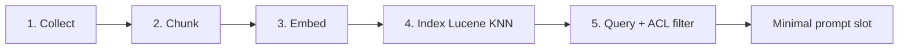
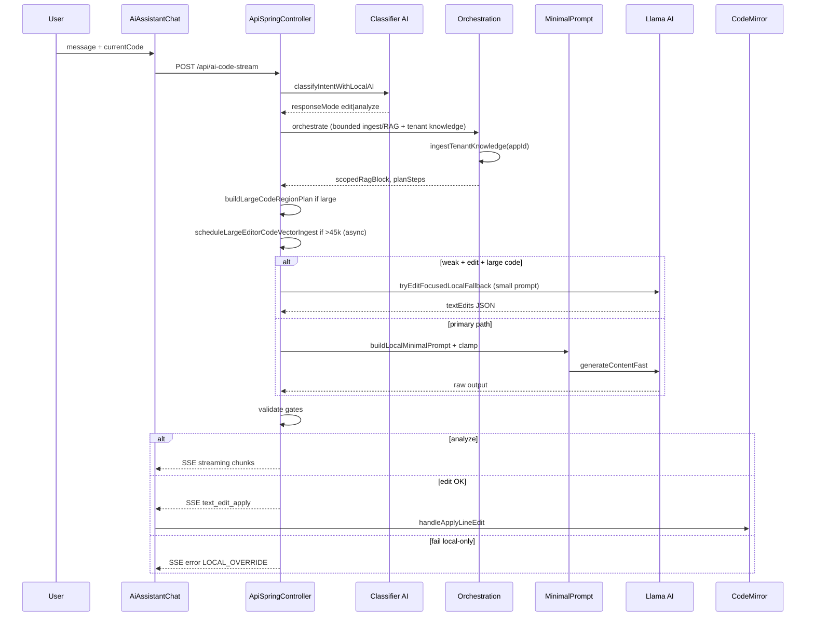

# CSM AI LOCAL — MASTER BRIEF CHO CURSOR AI
## Một file duy nhất để yêu cầu Cursor làm lại / hoàn thiện hệ thống

Version: **2.1** · 2026-05-23  
Repo: `csm_server`  
**Single source of truth** — dùng file này khi yêu cầu Cursor implement / làm lại CSM AI Local **và** domain System Management liên quan RAG.

### Changelog v2.1

| Mục | Trạng thái |
|-----|------------|
| **SEO creative-params lane** (`[CREATIVE_PARAMS_REQUEST]`) tách khỏi full SEO article | ✅ Lane riêng + seed fallback |

### Changelog v2.0

| Mục | Trạng thái |
|-----|------------|
| P0 routing edit/analyze, region plan, async large-code ingest | ✅ Đã triển khai (v1.1) |
| System admin UX: org tables, role_code, combo dedupe, data_app_ids | ✅ Commit `cba701ed` trên `main` |
| **Phase 2 RAG:** tenant snapshot + ACL-filtered retrieval | ✅ Commit `e45eae92` trên `origin/main` |
| Phase 3: embedding model riêng, BM25 hybrid, unified index, citations | ⏳ Roadmap |

---

## CÁCH DÙNG FILE NÀY VỚI CURSOR

Copy toàn bộ file (hoặc @-mention file này) vào Cursor Chat, kèm prompt mẫu:

```txt
Đọc @CSM_AI_LOCAL_CURSOR_MASTER_BRIEF.md và triển khai đầy đủ theo spec Cursor-aligned.
Ưu tiên: (1) routing edit/analyze đúng, (2) prompt nhỏ trên file lớn, (3) edit trả textEdits apply CodeMirror,
(4) tenant RAG + ACL filter khi hỏi domain org/permission/menu.
Không over-engineer. Sửa đúng các file đã liệt kê. Compile backend + không phá frontend SSE.
Máy target: local-5gb (5GB RAM, 2 CPU, qwen2.5-coder-1.5b Q4_K_M).
Sau khi xong: commit + push theo PHẦN P nếu user yêu cầu đồng bộ git.
```

---

# PHẦN A — BỐI CẢNH DỰ ÁN

## A.1 Hệ thống là gì

CSM là ERP legacy (Java Spring Boot + React admin). Trợ lý AI local chạy **llama.cpp JNI** (model ~1.5B), index context qua **Lucene KNN + RocksDB**, chat tại màn **Trò chuyện Trợ lý AI** (`AiAssistantChat.tsx`), edit code qua **CodeMirror** (DynamicCode runtime ~hàng trăm nghìn ký tự).

## A.2 Mô hình làm việc mục tiêu (giống Cursor)

| Hành vi Cursor | CSM phải làm |
|----------------|--------------|
| Index workspace, không đọc cả repo mỗi lần hỏi | Ingest/index đủ vào Lucene; model chỉ nhận slice + top-K RAG |
| Chat Ask → giải thích | `responseMode=analyze` → stream prose (tiếng user) |
| Agent Edit → apply patch | `responseMode=edit` → JSON `textEdits` → CodeMirror line edit |
| Context nhỏ, chính xác | Region plan + symbol-aware retrieval |
| Patch validate trước apply | Buffer LLM output → gate → mới emit SSE |

## A.3 Nguyên tắc vàng

```txt
NẠP ĐỦ VÀO HỆ THỐNG  (ingest + index)
KHÔNG NẠP HẾT VÀO MODEL  (minimal prompt + slot budget)
```

---

# PHẦN B — VẤN ĐỀ HIỆN TẠI CẦN SỬA DỨT ĐIỂM

Cursor AI **phải** đảm bảo các lỗi sau không còn:

| # | Triệu chứng | Nguyên nhân | Cách sửa bắt buộc |
|---|-------------|-------------|-------------------|
| 1 | `LOCAL_OVERRIDE_NO_CLOUD_FALLBACK` sau ~5 phút | Prompt 13k–15k tokens × nhiều lần; model 1.5B không ra JSON hợp lệ | Edit-focused-first trên weak; cap prompt ≤18k; bỏ RAG nặng khi weak+edit |
| 2 | Log `mode=analyze type=EDIT_CODE` | Classifier trả `responseMode=analyze` dù user nói "sửa" | `EDIT_CODE`/`EDIT_MENU` **luôn** `edit` trong `resolvedResponseMode()` và sau parse classifier |
| 3 | RAG neo `trackSelection` thay vì lifecycle | Symbol lấy từ digest file, không từ message | Prepend lifecycle symbols khi message có webview/process/proxy |
| 4 | Ingest 371k sync mỗi request edit | Orchestration ingest full code sync chặn request | **Async** chunk ingest vào Lucene KNN (`ingestLargeCodeAsync`); request hiện tại dùng region plan, request sau hit scoped RAG |
| 5 | UI báo "chỉ rõ node id/label" trên code editor | Failure message copy từ menu | `buildLocalOnlyFailureMessage` phân biệt code vs menu |
| 6 | Stream raw JSON/token rác lên chat | Emit trước validate | Edit/menu: buffer → validate → `text_edit_apply` |
| 7 | Agentic 26 bước xong mới fail | Generation phụ thuộc orchestration nặng | Fast path generation không chờ deep path xong mới gọi LLM chính |

---

# PHẦN C — KIẾN TRÚC MỤC TIÊU

## C.1 Hai AI (Router + Worker) + RAG layer

```
┌─────────────────────────────────────────────────────────────────┐
│ AI #1 — Intent Classifier (~64 tokens)                          │
│ ApiSpringController.classifyIntentWithLocalAI()                 │
│ Output: type, action, responseMode, nextStep, contextKind, conf │
└────────────────────────────┬────────────────────────────────────┘
                             │
┌────────────────────────────▼────────────────────────────────────┐
│ Context layer (không vào model hết)                             │
│ · AiTenantKnowledgeIngestionService — DB snapshot org/roles     │
│ · AiScopedContextIngestionService — async vector ingest (large) │
│ · AiLocalOrchestrationService — scoped RAG, plan (bounded)      │
│ · AiRetrievalAuthContextResolver — ACL trước async SSE thread   │
│ · AiBusinessMemoryVectorService — Lucene KNN + ACL tag filter   │
│ · buildLargeCodeRegionPlan — condensed editor (request hiện tại)│
│ · scopedRagBlock top-K (hit index từ ingest trước / cùng phiên) │
└────────────────────────────┬────────────────────────────────────┘
                             │
┌────────────────────────────▼────────────────────────────────────┐
│ AI #2 — Worker                                                  │
│ AiAssistantGatewayService.buildLocalMinimalPrompt()             │
│ LlamaCppNativeService.generateContentFast / stream              │
└────────────────────────────┬────────────────────────────────────┘
                             │
┌────────────────────────────▼────────────────────────────────────┐
│ Gates → SSE → Frontend                                          │
│ analyze: streaming chunks | edit: text_edit_apply                 │
└─────────────────────────────────────────────────────────────────┘
```

## C.4 RAG pipeline — 5 bước (Collect → Query)



| Bước | Nguồn dữ liệu | Service / hàm |
|------|---------------|---------------|
| **1 Collect** | Attachments, editor `currentCode`, menu JSON, multimodal scan, **tenant DB snapshot** (`csm_roles`, `csm_depts`, `csm_branches`), domain rules markdown | `AiScopedContextIngestionService`, `AiTenantKnowledgeIngestionService`, `AiMultimodalScannerService` |
| **2 Chunk** | Code theo declaration; markdown theo section; menu theo node | `chunkCodeByDeclaration`, `indexMarkdown`, `indexDynamicContext` |
| **3 Embed** | Vector per chunk (nomic / hash fallback) | `AiBusinessMemoryVectorService.embedText` |
| **4 Index** | Lucene KNN per `appId`, tags + scope mask | `indexDynamicContext`, `indexMarkdown`, `searchWithScopes` |
| **5 Query** | Symbol-aware queries + scope mask + **ACL tag filter** | `AiRetrievalPolicyEngine`, `buildRagBlockWithScopes`, `passesRetrievalAuthFilter` |

**Nguyên tắc:** Collect/Index đủ vào Lucene; model chỉ nhận top-K slice qua `[RETRIEVED_CONTEXT]` (≤2800 chars weak).

## C.2 Ba flow intent (chỉ một contract mỗi request)

```java
enum AiFlowIntent {
    MENU_JSON,       // menu patch / full menu JSON
    FRONTEND_CODE,   // textEdits JSON
    QUICK_QUESTION   // prose, RAG nhẹ
}
```

Chọn tại `AiAssistantGatewayService.classifyLocalIntent(contextType, responseMode, message)`.

## C.2.1 Bốn lane HTTP — không trộn contract

| Lane | Endpoint | Client | Output contract | RAG / master prompt |
|------|----------|--------|-----------------|---------------------|
| **Code editor** | `POST /api/ai-code-stream` (SSE) | `AiAssistantChat.tsx` | `textEdits` hoặc prose analyze | Region plan + scoped RAG + code master |
| **Menu JSON** | `POST /api/ai-code-stream` hoặc sync AI | Admin menu designer | `{ menu: [...] }` / patch JSON | Menu master + menu gate |
| **SEO article** | `POST /ai-generate-seo-content` | LMKT `generateSeoContentWithPrompt` | `{ title, description, html_content }` | **Không** inject code/menu master; system prompt SEO |
| **SEO creative params** | `POST /ai-generate-seo-content` | LMKT `requestCreativeParams()` | `{ personaKey, contentPattern, … }` hoặc `{ angle, persona }` | **Lane riêng** — detect `[CREATIVE_PARAMS_REQUEST]` |

**Quan trọng:** Creative params **không** dùng `SEO_SYSTEM_PROMPT` (title/html_content). Model 1.5B trên weak-5gb thường echo schema → backend **bắt buộc** có seed fallback deterministic.

### Creative-params flow (LMKT)

```
auto-lmkt.js: buildCreativeParamsPrompt(kind)
  → requestCreativeParams('anti_ai' | 'facebook_post' | 'category_landing')
  → generateSeoContentWithPrompt(prompt)  // taskType: seo_content
  → POST /ai-generate-seo-content
       │
       ▼
ApiSpringController.getObjectFromAI()
  → isSeoContentTask(taskType=seo_content) → fetchAiRawContent()
  → AiAssistantGatewayService.generateSeoContent()
       ├─ prompt contains [CREATIVE_PARAMS_REQUEST]?
       │     YES → generateCreativeParams()
       │            · CREATIVE_PARAMS_SYSTEM_PROMPT
       │            · max tokens ≈ 384, temp ≈ 0.05
       │            · parse JSON → validate allowlist từ prompt
       │            · fail → buildDeterministicCreativeParamsFallback(SEED, KIND)
       └─ NO  → full SEO article (title/description/html_content)
       │
       ▼
populateAiResponseFromRawContent()
  → isCreativeParamsPayload(data) || isSeoContentPayload(data)
  → { success: true, data: { personaKey, … } }
       │
       ▼
auto-lmkt.js: parseCreativeParamsResponse() → buildAntiAICreativeOverrides()
```

**Kinds & schema (client `buildCreativeParamsPrompt`):**

| KIND | Trường bắt buộc |
|------|-----------------|
| `anti_ai` | `personaKey`, `contentPattern`, `sellingIntent`, `hook`, `angle`, `tone` |
| `facebook_post` | `angle`, `persona.{label,tone,focus}` |
| `category_landing` | `angle`, `persona`, `role`, `style`, `avoid`, `focus` |

Config:

```properties
ai.seo.creative-params.max-tokens=384
ai.seo.creative-params.temperature=0.05
ai.seo.creative-params.fallback-enabled=true
```

Hàm backend:

- `AiAssistantGatewayService.isCreativeParamsRequest()`
- `AiAssistantGatewayService.generateCreativeParams()`
- `ApiSpringController.isCreativeParamsPayload()`

## C.3 Routing edit vs analyze (model-driven)

**Không** dùng toggle Ask/Edit trên UI (backend suy luận).

| User message (Ví dụ) | responseMode |
|----------------------|--------------|
| "Hãy xem tại sao…", "giải thích…", "phân tích…" | `analyze` |
| "Hãy sửa…", "fix…", "patch…", "thêm…", "xóa…" | `edit` |
| Classifier `type=EDIT_CODE` hoặc `EDIT_MENU` | **`edit` bắt buộc** |

Config:

```properties
ai.local.routing.model-driven.enabled=true
ai.local.routing.model-driven.min-confidence=55
ai.local.analyze.guardrail.heuristic-fallback.enabled=false
```

Hàm liên quan:

- `classifyIntentWithLocalAI()`
- `reconcileCodeResponseModeWithIntent()`
- `inferAiAssistantResponseModeFromText()`
- `LocalIntentClassification.resolvedResponseMode()` — **isEditTask() trước explicit analyze**

---

# PHẦN D — LUỒNG END-TO-END

## D.1 Request HTTP

```
POST /api/ai-code-stream
Content-Type: application/json
→ SseEmitter (async worker thread)
```

Body chính (frontend `AiAssistantChat.tsx`):

```json
{
  "appId": "csm",
  "jobId": "job_xxx",
  "message": "Hãy sửa lỗi webview...",
  "currentCode": "...",
  "contextType": "code",
  "responseMode": "",
  "language": "javascript",
  "flowType": "code_editor",
  "taskType": "code_assistant",
  "pName": "seo",
  "pType": 0,
  "editorMetadata": { "cursorLine": 120, "focusStart": 1, "focusEnd": 5973 },
  "uiLanguage": "vi",
  "attachments": []
}
```

**Quy tắc frontend:** Không gửi `responseMode` cố định trừ khi user dùng directive `/edit`, `/analyze`, `/local-plan`. Backend classifier quyết định.

## D.2 Pipeline backend (thứ tự)

1. **Route** — `decideRouteForCodeStream` → thường `LOCAL_ONLY` khi `ai.local.only.enabled=true`
2. **Classify** — AI#1 → `responseMode`, `preclassifiedIntent`
3. **Resolve ACL** — `AiRetrievalAuthContextResolver.resolve()` **trên request thread** (trước async SSE)
4. **Orchestration** (bounded) — `AiLocalOrchestrationService.orchestrateResilient(..., authContext)`
   - `ingestTenantKnowledge(appId)` — snapshot org + domain rules (debounce 60s/app)
   - `bindRetrievalAuthContext(authContext)` → RAG search
   - Scan attachments → scope mask
   - Ingest: menu sync / code async / skip large edit lightweight
   - RAG: `buildRagBlockWithScopes(topK=3, maxChars≈2800)` + ACL filter
   - Output: `scopedRagBlock`, `planSteps`, `compressedContextBlock`
   - `clearRetrievalAuthContext()` trong finally
5. **Condense editor** — `promptCodeContext`:
   - Nếu `currentCode` > 30k → `buildLargeCodeRegionPlan` (~13–22k chars)
   - Symbol lifecycle từ message (fnResetIP, closeAllTabsAndCleanup, …)
6. **Prompt** — `resolveLocalProviderPrompt` → `composeLayeredLocalProviderPrompt` → `buildLocalMinimalPrompt` → `clampPromptForLocalProvider`
7. **Generation fast path (weak + large + edit):**
   - Nếu `edit` + `code` + weak + code >30k → **`tryEditFocusedLocalFallback()` TRƯỚC** primary LLM
   - Thành công → skip prompt nặng
8. **Primary LLM** — `runLocalProviderWithProgress` (local_provider)
9. **Normalize / validate** — `normalizeLocalStructuredOutput`, `shouldAcceptLocalCodeStreamOutput`
10. **Adaptive retry** (edit, bounded) — prompt ngắn trên weak; không append full original 12k+
11. **Fallback cuối** — `tryEditFocusedLocalFallback` nếu primary fail
12. **Emit SSE** — analyze stream | edit text_edit_apply | error LOCAL_OVERRIDE

## D.3 Frontend SSE handling

File: `frontend-admin/src/pages/system/developer/AiAssistantChat.tsx`

| `stage` | Hành vi |
|---------|---------|
| `streaming` | Append text chunk (analyze only) |
| `text_edit_apply` | Gọi `onApplyLineEdit({ startLine, endLine, replacement, action })` |
| `text_edit_apply_done` | Kết thúc batch edits |
| `complete` | Done |
| `error` | Hiển thị lỗi (code-aware message) |
| `tool_trace`, `agentic_step_result` | Progress UI (optional) |

File apply: `CodeMirrorWithAiAssistant.tsx` → `handleApplyLineEdit` → `view.dispatch({ changes })`.

---

# PHẦN E — DANH SÁCH FILE PHẢI SỬA / GIỮ NHẤT QUÁN

## E.1 Backend — bắt buộc

| File | Trách nhiệm | Việc Cursor phải làm |
|------|-------------|----------------------|
| `backend/src/main/java/net/phanmemmottrieu/controller/ApiSpringController.java` | SSE, classify, prompt, gates, fallback | Routing, region plan, focused-first, failure messages, clamp; **`resolveRetrievalAuthContext()` → orchestrateResilient(..., authContext)** |
| `backend/src/main/java/net/phanmemmottrieu/service/AiScopedContextIngestionService.java` | Async ingest currentCode/menu → Lucene | `ingestLargeCodeAsync`, `buildEditorIngestKey` |
| `backend/src/main/java/net/phanmemmottrieu/service/AiLocalOrchestrationService.java` | RAG, agentic | Lifecycle symbol prepend; large code → async ingest; **`ingestTenantKnowledge` + auth bind** |
| `backend/src/main/java/net/phanmemmottrieu/service/AiAssistantGatewayService.java` | Minimal prompt, validate | Slot budget, contracts, language block |
| `backend/src/main/java/net/phanmemmottrieu/service/AiBusinessMemoryVectorService.java` | Lucene KNN RAG | topK/maxChars; `bindRetrievalAuthContext`; `passesRetrievalAuthFilter` |
| `backend/src/main/java/net/phanmemmottrieu/service/AiTenantKnowledgeIngestionService.java` | **Mới** — tenant org snapshot + domain rules | `ingestTenantKnowledge(appId)`; tags `acl:tenant`, `knowledge:org` |
| `backend/src/main/java/net/phanmemmottrieu/service/AiRetrievalAuthContext.java` | **Mới** — ACL context cho retrieval | principal, appId, dev, csmAdmin, roles, dataScope, branch/dept ids |
| `backend/src/main/java/net/phanmemmottrieu/service/AiRetrievalAuthContextResolver.java` | **Mới** — resolve từ Spring Security | Gọi trước async SSE trong controller |
| `backend/src/main/java/net/phanmemmottrieu/service/AiScopedContextIngestionService.java` | Ingest menu/code | async/sync policy |
| `backend/src/main/java/net/phanmemmottrieu/service/AiRetrievalPolicyEngine.java` | topK adaptive | Weak machine cap |
| `backend/src/main/java/net/phanmemmottrieu/service/LlamaCppNativeService.java` | JNI inference | context-window, max-tokens, prompt cap |
| `backend/src/main/resources/application-local-5gb.properties` | Profile 5GB | Config mục tiêu |
| `backend/src/main/resources/application.properties` | Defaults | Không revert model-driven flags |

## E.2 Backend — prompt assets (chỉ load MỘT theo intent)

| File | Khi nào |
|------|---------|
| `backend/csm_datas/ai_local/ai_code_master_prompt.md` | FRONTEND_CODE edit |
| `backend/csm_datas/ai_local/ai_menu_master_prompt.md` | MENU_JSON edit |
| `backend/csm_datas/ai_local/ai-assistant-instructions.md` | Policy — **không** nhét full vào mọi prompt |

## E.3 Frontend — bắt buộc

| File | Việc Cursor phải làm |
|------|----------------------|
| `frontend-admin/src/pages/system/developer/AiAssistantChat.tsx` | Không hardcode `responseMode=analyze`; SSE router; progress không misleading |
| `frontend-admin/src/.../CodeMirrorWithAiAssistant.tsx` | `handleApplyLineEdit` 1-based lines |

## E.4 Frontend — System Management (domain org/permission, không phải AI chat)

Các thay đổi này **ảnh hưởng UX admin** và **là nguồn truth** cho tenant RAG domain rules. Cursor phải giữ đồng bộ với `AiTenantKnowledgeIngestionService.buildDomainRulesMarkdown()`.

| File | Trách nhiệm | Quy tắc bắt buộc |
|------|-------------|------------------|
| `frontend-admin/src/pages/system/admin/index.tsx` | Grid dept/branch/roles/sub-user | `shouldHideDeptBranchField()` ẩn audit + permission internals; branch→dept cascade; merge role combo dedupe by `role_code` |
| `frontend-admin/src/pages/system/admin/system-user-menu-config.ts` | Form schema, beforeSave | `PERMISSION_GROUP_BEFORE_SAVE` auto `role_code` từ `role_name`; `role_level` → dataScope; field `data_app_ids` multi_tag |
| `frontend-admin/src/pages/system/admin/combo-utils.ts` | Role combo options | **Một option per role id**; dedupe by `role_code` (không thêm cả id lẫn role_code làm 2 option) |
| `frontend-admin/src/components/CsmEditModal.tsx` | Form modal | `group_id` dùng id-only options; clear `dept_id` khi đổi `branch_id` |
| `frontend-admin/src/components/CsmDynamicGrid.tsx` | Dynamic grid | Role combo id-only |
| `frontend-admin/src/locales/vi/system.json` (+ en/zh) | i18n | `system.role.code`, `role_level` labels, `data_app_ids` |

**Org model (AI + UI phải hiểu giống nhau):**

```
Branch (csm_branches)
  └── Department (csm_depts.branch_id required)
        └── Permission group (csm_roles) — optional branch_id/dept_id scope
              └── Sub-user (csm_group_members.group_id → csm_roles.id)
```

**Ẩn trên grid dept/branch:** `created_by`, `updated_by`, `create_time`, `update_time`, `dept_full_name`, `branch_full_name`, `is_global`, permission internals, `dept_id` trên branch grid.

**role_level → dataScope:** admin/director=ALL, manager=BRANCH, dept_head/team_lead=DEPARTMENT, staff=OWNER.

---

# PHẦN F — CHI TIẾT IMPLEMENTATION (CHECKLIST CHO CURSOR)

## F.1 Intent classifier (AI#1)

**File:** `ApiSpringController.classifyIntentWithLocalAI`

Prompt classifier output JSON:

```json
{
  "type": "EDIT_CODE",
  "action": "modify",
  "responseMode": "edit",
  "nextStep": "load_code_context",
  "contextKind": "code",
  "confidence": 85
}
```

**Sau parse, bắt buộc:**

```java
if ("EDIT_CODE".equals(type) || "EDIT_MENU".equals(type)) {
    classifiedResponseMode = "edit";
}
```

**resolvedResponseMode():**

```java
if (isEditTask()) return "edit";  // trước mọi explicit analyze
```

**reconcileCodeResponseModeWithIntent:** tin classifier khi `model-driven` + confidence ≥ min; `hasExplicitCodeEditIntent(message)` → edit.

## F.2 Region plan (file lớn)

**File:** `ApiSpringController.buildLargeCodeRegionPlan`

Kích hoạt khi `source.length() >= 30000`.

Thứ tự vùng:

1. Cursor/focus window (nếu có line)
2. Symbol excerpts — **message-driven lifecycle trước**
3. Lucene excerpts
4. File head + tail (edge window)

Cap: `ai.local.orchestration.large-code-region-plan.max-chars` (22000 trên local-5gb).

Gọi sớm trên `promptCodeContext` trước `buildCodingPrompt`.

## F.3 Lifecycle symbols (RAG + region plan)

Khi message chứa: `webview`, `process`, `proxy`, `tắt`, `treo`, `kill`, `resetip`, …

**Prepend symbols (ưu tiên search):**

```txt
closeAllTabsAndCleanup
fnResetIP
waitForAllTabsClose
clearInterval
CallMouseEvent
sophutLamtuoi
stopProcess / killProcess
webview
```

Implement tại:

- `prependLifecycleDebugSymbols()` + `extractCodeStreamSymbolCandidates()` — Controller
- `prependLifecycleSymbolsFromRequest()` — Orchestration (trước `buildSymbolAwareQueries`)

## F.4 Minimal prompt builder

**File:** `AiAssistantGatewayService.buildLocalMinimalPrompt(intent, editor, rag, memory, userRequest, uiLang)`

Cấu trúc:

```txt
BASE_SYSTEM_MIN
+ CONTRACT (menu | code | quick — một cái)
+ [ACTIVE_EDITOR_CODE] hoặc [ACTIVE_EDITOR_MENU_JSON]
+ [RETRIEVED_CONTEXT]  (có thể rỗng)
+ [SESSION_MEMORY]     (có thể rỗng)
+ [USER_REQUEST]
+ [NGON_NGU_TRA_LOI]   (vi/en/zh)
```

Slot cap (weak / 1.5B):

| Slot | Max chars (weak) |
|------|------------------|
| system + contract | ~1800 |
| active editor | ~6000–14000 (region plan) |
| RAG | 0 (weak edit) hoặc ≤2800 |
| memory/digest | 0 (weak edit) hoặc ≤900 |
| user request | không cắt nếu ngắn |
| **TOTAL sau clamp** | **≤18000** |

**composeLayeredLocalProviderPrompt** khi weak + edit + code:

```java
boolean weakCodeEditLight = editMode && isWeakLocalRuntime() && isCodeContext(contextType);
if (weakCodeEditLight) {
    rag = "";
    // skip memory + planning digest
}
```

## F.5 Edit-focused-first (fast path)

**File:** `ApiSpringController.tryEditFocusedLocalFallback`

Điều kiện gọi **trước** primary LLM:

```java
"edit".equals(responseMode)
&& isCodeContext(contextType)
&& isWeakLocalRuntime()
&& promptCodeContext.length() > 30000
```

Steps:

1. Region plan + lifecycle message hint
2. `buildLocalMinimalPrompt(FRONTEND_CODE, condensedCode, "", "", userRequest, uiLang)`
3. `generateContentFast` max tokens ~768–1536
4. `extractJsonObjectCandidate` + `salvageSearchReplaceAsTextEdits`
5. `shouldAcceptLocalCodeStreamOutput` → emit hoặc fall through primary

## F.6 Output gates

**shouldAcceptLocalCodeStreamOutput(text, responseMode, contextType):**

- Edit code: `extractLineTextEditsCount > 0` OR valid SEARCH/REPLACE
- Edit menu: valid JSON patches / menu schema
- Analyze: length ≥ 24, không low-signal

**Không accept:**

- CJK garbage (`containsCjkGarbage`)
- Prompt echo (`### currentCode`, `"startLine":N`)
- `need_more_context` status cho edit apply

**Pipeline:**

```txt
raw → extractAiResultText → extractJsonObjectCandidate
→ sanitizePromptEchoLeakage → validate schema
→ repair once (small prompt) → fallback JSON empty textEdits
```

## F.7 Adaptive edit retry (weak)

**buildEditAdaptiveRetryPrompt:** trên weak + code → dùng `buildTextEditsRetryPrompt` với original prompt truncated ≤5000 chars; **không** append full assembled prompt.

## F.8 Failure messages

**buildLocalOnlyFailureMessage** — nếu `looksLikeCodeEditorContext(baseCode)`:

- Gợi ý: hàm/vùng code (`fnResetIP`, `closeAllTabs`)
- **Không** nói "node id/label" (menu wording)

Error code giữ: `LOCAL_OVERRIDE_NO_CLOUD_FALLBACK` khi local-only và không có output usable.

## F.9 Orchestration trên weak

**AiLocalOrchestrationService:**

- Code ≤ 45k → `ingestCode(..., async=true)` (chuẩn, không block lâu)
- Code > 45k → **KHÔNG** sync ingest; gọi `AiScopedContextIngestionService.ingestLargeCodeAsync(...)`
- Status telemetry: `scopedCodeIngestionMode=async_large_code_vector`, `scopedCodeIngestionStatus=pending_async_large_code|completed_async_large_code|cached_unchanged`
- Request **hiện tại** vẫn dùng `buildLargeCodeRegionPlan` + symbol lifecycle (không chờ embed xong)
- Request **tiếp theo** (cùng `pName`/`pType`) → `scopedRagBlock` lấy chunk liên quan từ Lucene KNN
- `ai.local.runtime.weak-5gb.skip-orchestration-refine=true`
- `ai.orchestration.speculative.enabled=false`
- scope-rag topK=3, maxChars=2800

Agentic UI steps OK — nhưng **LLM worker không được block** chờ hết 26 bước mới chạy lần đầu (generation có thể chạy sau orchestration context ready, nhưng dùng fast path khi có thể).

## F.11 Large DynamicCode — async Lucene vector ingest (BẮT BUỘC)

> **Nguyên tắc:** NẠP ĐỦ VÀO HỆ THỐNG (index vector), KHÔNG NẠP HẾT VÀO MODEL (region plan ~13–22k).

### F.11.1 Ba lớp index (phân biệt rõ)

| Lớp | Khi nào | Persistent? | Dùng cho |
|-----|---------|-------------|----------|
| **Startup project index** | Server start (`LocalAiAssistantContextService`) | Có | README, prompts, docs dự án — **không** phải DynamicCode user |
| **Ephemeral in-memory Lucene** | Mỗi request trong `buildCodeStreamLuceneExcerpts` / region plan | Không | Hotspot keyword trong request hiện tại |
| **Async editor vector index** | Code > 45k, mỗi request chat (`ingestLargeCodeAsync`) | Có (Lucene KNN per appId) | Scoped RAG request sau + orchestration khi không skip |

### F.11.2 Luồng async ingest

```
currentCode > 45k
    → ApiSpringController.scheduleLargeEditorCodeVectorIngest()   [non-blocking]
    → AiScopedContextIngestionService.ingestLargeCodeAsync()
         editorKey = buildEditorIngestKey(pName, pType)   // vd. seo_t0
         sourceSuffix = dyn_ctx_editorCode_seo_t0
         → AiBusinessMemoryVectorService.indexDynamicContext()
              chunkCodeByDeclaration (DynamicCode JS)
              embed nomic + Lucene KNN per chunk
    → status pending_async_large_code (request hiện tại tiếp tục)
    → status completed_async_large_code (request sau RAG hit)
```

**Dedup:** content hash per `appId:editorKey` — không re-embed nếu code không đổi (`cached_unchanged`).

### F.11.3 File & hàm bắt buộc (Cursor phải giữ / mở rộng tại đây)

| File | Hàm / trách nhiệm |
|------|-------------------|
| `AiScopedContextIngestionService.java` | `ingestLargeCodeAsync`, `buildEditorIngestKey`, `buildLargeCodeIngestDocument` |
| `AiLocalOrchestrationService.java` | Thay `skipped_large_code_lightweight` bằng gọi `ingestLargeCodeAsync` |
| `ApiSpringController.java` | `scheduleLargeEditorCodeVectorIngest` — gọi khi `effectiveCodeContext.length()>45000` |
| `AiBusinessMemoryVectorService.java` | `indexDynamicContext`, `searchWithScopes`, `chunkCodeByDeclaration` (nhận diện DynamicCode) |

### F.11.4 Config

```properties
ai.context.ingestion.large-code.enabled=true
ai.context.ingestion.large-code.threshold-chars=45000
ai.context.ingestion.large-code.max-chars=600000
```

Env (local-5gb): `AI_CONTEXT_INGESTION_LARGE_CODE_*` trong `config.local-5gb.env`.

### F.11.5 Telemetry / UI agentic

Tool trace SSE: `large_code_vector_ingest` — input `editorKey`, `sourceChars`; output `status=pending_async_large_code|...`.

Orchestration stats: `scopedCodeIngestionMode=async_large_code_vector`.

### F.11.6 CẤM

```txt
✗ Sync ingest full 369k trước mỗi edit request (block 30s–5 phút)
✗ Bỏ qua ingest hoàn toàn khi code >45k (chỉ region plan — RAG session sau sẽ trống)
✗ Feed full 369k vào model vì "cho chắc"
✗ Tạo service ingest mới nếu đã sửa được AiScopedContextIngestionService
```

## F.12 Tenant knowledge ingest + ACL retrieval (Phase 2 — BẮT BUỘC GIỮ)

> **Mục tiêu:** AI local hiểu org/permission thực tế của tenant khi user hỏi/sửa menu, sub-user, nhóm quyền — không chỉ dựa prompt tĩnh.

### F.12.1 AiTenantKnowledgeIngestionService

Gọi đầu `orchestrate()` / `orchestrateResilient()`:

```java
aiTenantKnowledgeIngestionService.ingestTenantKnowledge(appId);
```

| Source | Nội dung | Tags |
|--------|----------|------|
| `tenant_knowledge_org_snapshot` | Markdown rows từ DB: `csm_roles`, `csm_depts`, `csm_branches` | `acl:tenant`, `knowledge:tenant`, `knowledge:org` |
| `tenant_knowledge_domain_rules` | Static rules (org hierarchy, combo cascade, role_code, hidden fields) | `acl:tenant`, `knowledge:domain_rules`, `knowledge:permissions` |

- Debounce: **60s/appId** (`recently_indexed` nếu gọi lại sớm)
- Non-csm app: `merge-csm-roles=true` → merge roles từ app `csm` dedupe by `role_code`
- Max rows/table: `ai.context.ingestion.tenant-snapshot.max-rows-per-table=120`

**Domain rules markdown** phải khớp frontend (PHẦN E.4). Khi sửa UX admin → cập nhật `buildDomainRulesMarkdown()` **và** file frontend tương ứng.

### F.12.2 AiRetrievalAuthContext + filter

**Resolve trên request thread** (SecurityContext mất sau async):

```java
// ApiSpringController — trước CompletableFuture / SseEmitter worker
AiRetrievalAuthContext authContext = retrievalAuthContextResolver.resolve();
orchestrationService.orchestrateResilient(..., authContext);
```

**Orchestration:**

```java
businessMemoryVectorService.bindRetrievalAuthContext(authContext);
try { /* RAG search */ }
finally { businessMemoryVectorService.clearRetrievalAuthContext(); }
```

**Tag filter** (`passesRetrievalAuthFilter`):

| Tag | Rule |
|-----|------|
| (no `acl:`) | Pass — public/project chunks |
| `acl:admin` | Block cho non-admin retrieval |
| `acl:tenant` | Require authenticated |
| `branch:{id}` | Pass nếu user scope ALL hoặc branch match |
| `dept:{id}` | Pass nếu user scope ALL/BRANCH hoặc dept match |

Config: `ai.retrieval.auth.filter-enabled=true` (tắt = pass all, chỉ dev debug).

### F.12.3 Config tenant snapshot

```properties
ai.context.ingestion.tenant-snapshot.enabled=true
ai.context.ingestion.tenant-snapshot.tables=csm_roles,csm_depts,csm_branches
ai.context.ingestion.tenant-snapshot.merge-csm-roles=true
ai.context.ingestion.tenant-snapshot.max-rows-per-table=120
ai.retrieval.auth.filter-enabled=true
```

### F.12.4 Telemetry

Orchestration stats có thể gồm: `tenantKnowledgeIngestStatus=indexed|skipped:recently_indexed|skipped:disabled`.

Log: `Tenant knowledge indexed appId=... orgChunks=... ruleChunks=...`

### F.12.5 CẤM

```txt
✗ Resolve SecurityContext bên trong async SSE thread (authContext null → filter sai)
✗ Index tenant snapshot mỗi chunk riêng lẻ không debounce (DB hammer)
✗ Domain rules markdown lệch frontend (AI trả lời sai combo/role_code)
✗ Thêm option combo group_id cả id lẫn role_code (duplicate UI)
```

## F.10 Frontend

**AiAssistantChat.tsx:**

- Default không gửi `responseMode: "analyze"` — để backend classify
- Chỉ gửi explicit mode với `/edit`, `/analyze`, `/local-plan`
- `text_edit_apply` → apply CodeMirror, không hiển thị raw JSON trong bubble (edit mode)
- Analyze → `streaming` chunks, prose tiếng Việt nếu `uiLanguage=vi`

---

# PHẦN G — CONTRACT OUTPUT (EMBED CHO CURSOR)

## G.1 FRONTEND_CODE — edit mode

Model **chỉ** trả JSON (không markdown):

```json
{
  "summary": "Sửa cleanup webview/process khi tab đóng",
  "changes": [],
  "textEdits": [
    {
      "startLine": 120,
      "endLine": 125,
      "replacement": "// fixed cleanup\n...",
      "action": "edit"
    }
  ]
}
```

Rules:

- `startLine` / `endLine`: **1-based**, số nguyên thật (không `"N"`)
- DynamicCode: browser only; **no** import/export/require/Node APIs
- Allowed globals: `window`, `document`, `window.React`, `window.antd`, `window.csmApi`, …
- Fallback:

```json
{
  "summary": "Không tạo được patch an toàn",
  "changes": [],
  "textEdits": []
}
```

## G.2 MENU_JSON — edit mode

Patch envelope:

```json
{
  "status": "success",
  "patches": [
    {
      "action": "edit",
      "nodeId": "existing-id",
      "parentId": "",
      "path": "Module / Feature",
      "before": null,
      "after": { }
    }
  ],
  "i18n": { "vi": {}, "en": {}, "zh": {} },
  "warnings": []
}
```

Fallback: `{ "status": "need_more_context", "patches": [], "warnings": [...] }`

Required menu fields: `id`, `parentId`, `label`, `label_en`, `label_zh`, `icon`, `path`, `type_form`, `table_name`, `trigger`, `children`.

## G.3 ANALYZE / QUICK_QUESTION

- Prose only, cùng ngôn ngữ user (`uiLanguage` / detect từ message)
- Không bắt buộc JSON
- Stream qua SSE `stage=streaming`

---

# PHẦN H — CONFIG ĐÍCH (local-5gb)

File: `backend/src/main/resources/application-local-5gb.properties`

```properties
ai.local.runtime.tier=weak-5gb
ai.local.only.enabled=true
ai.local.llama.prefer-local-first=true

ai.local.llama.context-window=8192
ai.local.llama.max-tokens=768
ai.local.llama.max-prompt-chars=32000
ai.local.llama.threads=1
ai.local.llama.batch-size=32

ai.local.routing.model-driven.enabled=true
ai.local.routing.model-driven.min-confidence=55
ai.local.analyze.guardrail.heuristic-fallback.enabled=false
ai.local.analyze.language-alignment.enabled=true

ai.local.prompt.composition.mode=auto
ai.local.prompt.composition.auto-orchestration-max-chars=16000
ai.local.prompt.composition.orchestration-memory-max-chars=900

ai.local.orchestration.large-code-region-plan.max-regions=5
ai.local.orchestration.large-code-region-plan.max-chars=22000
ai.local.chunking.threshold-chars=45000

ai.orchestration.multimodal.scope-rag.top-k=3
ai.orchestration.multimodal.scope-rag.max-chars=2800
ai.business.memory.chunk-max-chars=1600
ai.business.memory.search-default-k=3

ai.code-stream.auto-continue.enabled=false
ai.assistant.edit-structured.required=true
ai.code-stream.edit.patch-validator.enabled=true

ai.local.runtime.weak-profile.local-provider.max-prompt-chars=18000

# Phase 2 — tenant RAG
ai.context.ingestion.tenant-snapshot.enabled=true
ai.context.ingestion.tenant-snapshot.tables=csm_roles,csm_depts,csm_branches
ai.context.ingestion.tenant-snapshot.merge-csm-roles=true
ai.retrieval.auth.filter-enabled=true
```

Launch:

| Môi trường | Lệnh |
|------------|------|
| **Dev máy mạnh** | `cd backend && set -a && source ../config.local-strong.env && set +a && mvn spring-boot:run` |
| **Server yếu 5GB** | `./run-server.sh` (repo root) |

`config.local-strong.env` / `config.local-5gb.env` tự nạp `config.env` khi `source`.  
Chuẩn bị lần đầu: `cp config.env.example config.env`.

---

# PHẦN I — SSE EVENT SCHEMA (TÓM TẮT)

Backend emit JSON lines qua `SseEmitter`:

```json
{ "stage": "streaming", "requestId": "job_xxx", "chunk": "..." }
```

```json
{
  "stage": "text_edit_apply",
  "requestId": "job_xxx",
  "attempt": 1,
  "textEdit": {
    "startLine": 10,
    "endLine": 12,
    "replacement": "...",
    "action": "edit"
  }
}
```

```json
{ "stage": "text_edit_apply_done", "requestId": "job_xxx", "count": 3 }
```

```json
{
  "stage": "error",
  "requestId": "job_xxx",
  "reason_code": "LOCAL_OVERRIDE_NO_CLOUD_FALLBACK",
  "message": "Local AI không tạo được patch an toàn..."
}
```

```json
{ "stage": "complete", "requestId": "job_xxx", "model": "local_provider" }
```

---

# PHẦN J — TIÊU CHÍ NGHIỆM THU (ACCEPTANCE TESTS)

Cursor **phải** verify các case sau trên profile **local-5gb**, file DynamicCode **~371k chars** (p_name=seo):

## J.1 Analyze

**Input:** `Hãy xem tại sao khi webview tắt process vẫn không tắt và đôi lúc treo proxy?`

| Kiểm tra | Pass |
|----------|------|
| Log `responseMode=analyze` | ✓ |
| Không full ingest 371k sync | ✓ |
| `promptChars` effective ≤ ~20k | ✓ |
| Response prose tiếng Việt | ✓ |
| Không `text_edit_apply` | ✓ |
| Hoàn thành < ~3 phút trên 2 CPU | ✓ |

## J.2 Edit

**Input:** `Hãy sửa lỗi khi webview tắt process vẫn không tắt...`

| Kiểm tra | Pass |
|----------|------|
| Log `responseMode=edit`, `type=EDIT_CODE` | ✓ |
| Region plan ~13k chars (không 371k trong prompt) | ✓ |
| Symbol retrieval gồm fnResetIP/closeAllTabs (không chỉ trackSelection) | ✓ |
| Output JSON `textEdits` hợp lệ HOẶC focused-first success log | ✓ |
| CodeMirror apply được | ✓ |
| Không `LOCAL_OVERRIDE` nếu textEdits count > 0 | ✓ |
| Failure message code-aware nếu fail | ✓ |

## J.3 Menu edit

**Input:** Kiểm tra trigger + sửa label 3 ngôn ngữ

| Kiểm tra | Pass |
|----------|------|
| `AiFlowIntent.MENU_JSON` | ✓ |
| Buffered patch JSON, không stream raw | ✓ |
| Validate trigger keys + labels | ✓ |

## J.4 Compile

```bash
cd backend && mvn compile -DskipTests
```

Exit code 0.

## J.5 Tenant / permission domain (Phase 2)

**Input (analyze):** `Nhóm quyền sub-user đang hiện trùng option — nguyên nhân và cách sửa?`

| Kiểm tra | Pass |
|----------|------|
| Log `Tenant knowledge indexed` hoặc `skipped:recently_indexed` | ✓ |
| RAG block mention dedupe `role_code`, one option per id | ✓ |
| Không leak org data ngoài ACL user | ✓ |

**Input (analyze):** `Khi đổi chi nhánh thì phòng ban combo phải làm gì?`

| Kiểm tra | Pass |
|----------|------|
| Trả lời cascade branch→dept, clear stale dept_id | ✓ |
| Khớp `buildDomainRulesMarkdown()` + frontend cascade | ✓ |

---

# PHẦN K — CẤM TUYỆT ĐỐI (DO NOT)

```txt
✗ Ghép ai_menu_master_prompt + ai_code_master_prompt + ai-assistant-instructions + full code vào một prompt
✗ truncateMiddle(giantAssembledPrompt) là chiến lược chính thay vì slot budget
✗ Stream raw LLM token JSON vào chat bubble ở edit mode
✗ Auto-continue cho edit/menu JSON
✗ Classifier EDIT_CODE → responseMode analyze
✗ Cloud fallback khi user bật local-only (trừ khi config cho phép)
✗ Failure message "node id/label" cho code editor
✗ Full sync ingest 371k trước mỗi edit request
✗ Skip ingest hoàn toàn khi code >45k (phải async vector ingest)
✗ Adaptive retry append original prompt 12k+ trên weak machine
✗ Over-engineer thêm service/layer mới nếu sửa được trong file hiện có
✗ Domain rules RAG lệch code frontend system admin
✗ Combo group_id duplicate (id + role_code as separate options)
```

---

# PHẦN L — ƯU TIÊN THỰC HIỆN (THỨ TỰ CHO CURSOR)

```
P0 — Routing & mode [DONE]
  ☑ resolvedResponseMode: EDIT_* → edit
  ☑ Classifier post-parse force edit
  ☑ Frontend không hardcode analyze

P0 — Prompt budget [DONE]
  ☑ Region plan >30k
  ☑ composeLayered weak edit: rag="" memory skip
  ☑ clampPromptForLocalProvider ≤18k weak

P0 — Edit path [DONE]
  ☑ edit-focused-first trước primary LLM
  ☑ tryEditFocusedLocalFallback + salvage JSON
  ☑ shouldAcceptLocalCodeStreamOutput + code failure message

P1 — Retrieval & large-code index [DONE]
  ☑ Lifecycle symbol prepend (controller + orchestration)
  ☑ Async large-code vector ingest (>45k)
  ☑ Region plan cho request hiện tại
  ☑ scopedRag hit editorCode_* chunks

P1 — Tenant RAG Phase 2 [DONE — e45eae92]
  ☑ AiTenantKnowledgeIngestionService
  ☑ AiRetrievalAuthContext + Resolver + ACL filter
  ☑ orchestrateResilient(..., authContext) từ controller
  ☑ Config tenant-snapshot + auth filter

P1 — System admin UX [DONE — cba701ed]
  ☑ shouldHideDeptBranchField, branch→dept cascade
  ☑ role_code editable on add, auto-generate beforeSave
  ☑ buildRoleComboOptions dedupe by role_code
  ☑ data_app_ids multi_tag field + i18n

P2 — Phase 3 roadmap [TODO]
  □ Embedding model riêng (không dùng chat GGUF / hash fallback)
  □ Unified Lucene index (business memory + workspace)
  □ Hybrid BM25 + vector retrieval
  □ Citations / source refs trong analyze response
  □ UserAccessContext parity với TableHandler (full branch/dept tree)

P2 — Polish
  □ Agentic progress không block fast path
  □ Log telemetry: promptChars, textEditsCount, tenantKnowledge status
```

---

# PHẦN M — SƠ ĐỒ MERMAID (THAM CHIẾU)



---

# PHẦN N — GHI CHÚ CHO CURSOR KHI CODE

1. **Minimize diff** — sửa đúng chỗ trong file lớn (`ApiSpringController` ~34k lines); không refactor toàn file.
2. **Match conventions** — naming, logging style, `@Value` config keys như codebase hiện tại.
3. **Không thêm test** trừ khi user yêu cầu; compile là đủ cho pass cơ bản.
4. **Không commit** trừ khi user yêu cầu — khi user yêu cầu đồng bộ git, làm theo **PHẦN P**.
5. **Comments** — chỉ cho logic không hiển nhiên (lifecycle symbol boost, weak edit light path, ACL bind).
6. Document thay đổi ngắn trong PR description nếu user tạo PR sau.
7. **Domain rules sync:** sửa UX system admin → cập nhật cả frontend (E.4) và `buildDomainRulesMarkdown()` (F.12).

---

# PHẦN O — TÀI LIỆU LIÊN QUAN TRONG REPO

| File | Mục đích |
|------|----------|
| `CSM_AI_LOCAL_CURSOR_MASTER_BRIEF.md` | **File này** — spec + checklist triển khai (duy nhất ở root) |
| `backend/csm_datas/ai_local/ai_code_master_prompt.md` | Contract runtime code edit (load theo intent) |
| `backend/csm_datas/ai_local/ai_menu_master_prompt.md` | Contract runtime menu edit |
| `backend/csm_datas/ai_local/ai-assistant-instructions.md` | Policy runtime (không nhét full vào prompt) |
| `backend/src/main/resources/application-local-5gb.properties` | Profile máy 5 GB |
| `backend/src/main/resources/application.properties` | Defaults incl. tenant-snapshot + auth filter |

> Các file `CSM_AI_LOCAL_*.md` khác ở root (nếu còn) là **draft cũ** — không dùng làm spec; merge nội dung vào file này rồi xóa hoặc bỏ qua.

---

# PHẦN P — GIT ĐỒNG BỘ (CHO CURSOR / DEV)

## P.1 Trạng thái commit (2026-05-23)

| Nhóm thay đổi | Commit | Ghi chú |
|---------------|--------|---------|
| System admin UX, combo dedupe, data_app_ids, role_code | `cba701ed` | Đã trên `origin/main` |
| Phase 2 tenant RAG (3 class mới + 4 file sửa + brief v2.0) | `e45eae92` | Đã trên `origin/main` |

## P.2 Commit Phase 2 (khi user yêu cầu)

```bash
cd /Volumes/Datas/CSM/JavaProjects/csm_server

# Verify compile
cd backend && mvn compile -DskipTests && cd ..

git add \
  CSM_AI_LOCAL_CURSOR_MASTER_BRIEF.md \
  backend/src/main/java/net/phanmemmottrieu/service/AiRetrievalAuthContext.java \
  backend/src/main/java/net/phanmemmottrieu/service/AiRetrievalAuthContextResolver.java \
  backend/src/main/java/net/phanmemmottrieu/service/AiTenantKnowledgeIngestionService.java \
  backend/src/main/java/net/phanmemmottrieu/service/AiBusinessMemoryVectorService.java \
  backend/src/main/java/net/phanmemmottrieu/service/AiLocalOrchestrationService.java \
  backend/src/main/java/net/phanmemmottrieu/controller/ApiSpringController.java \
  backend/src/main/resources/application.properties

git commit -m "$(cat <<'EOF'
feat: tenant org RAG snapshot and ACL-filtered retrieval for local AI

Index csm_roles/depts/branches plus domain rules into Lucene; filter retrieval
by auth context so orchestration answers org/permission questions accurately.
EOF
)"

git push origin main   # chỉ khi user yêu cầu push
```

## P.3 Quy tắc cho AI agent

1. **Luôn đọc file này trước** khi sửa AI local hoặc system admin domain.
2. **Cập nhật changelog + PHẦN L** khi hoàn thành mục mới.
3. **Không commit** trừ khi user nói rõ "commit", "push", "đồng bộ git".
4. Sau commit Phase 2 → sửa bảng P.1 (đánh dấu đã commit, ghi hash).
5. Draft MD ở root (`CSM_AI_LOCAL_*.md` khác) — merge vào đây, không tạo spec song song.

## P.4 Verify sau deploy / restart

```bash
# Backend log khi chat AI lần đầu mỗi appId (trong 60s):
# Tenant knowledge indexed appId=csm orgChunks=N ruleChunks=M

# Frontend system admin:
# - Sub-user group_id: không duplicate options
# - Thêm nhóm quyền: role_code tự sinh từ role_name
# - Đổi branch: dept combo filter + clear dept_id
```

---

**Hết master brief v2.0.**  
Chỉ dùng file này khi yêu cầu Cursor AI implement / làm lại CSM AI Local hoặc domain System Management liên quan RAG.
