# CSM AI LOCAL — MASTER BRIEF CHO CURSOR AI
## Một file duy nhất để yêu cầu Cursor làm lại / hoàn thiện hệ thống

Version: **3.21** · 2026-05-26  
Repo: `csm_server`  
**Single source of truth** — dùng file này khi yêu cầu Cursor implement / làm lại CSM AI Local **và** domain System Management liên quan RAG.

### Changelog v3.21

| Mục | Trạng thái |
|-----|------------|
| **BM25 hybrid RAG (P1)** — `AiLocalLuceneHybridSearchHelper`: KNN fanout + BM25 multi-field → weighted fuse → existing rerank | ✅ Implement |
| Business memory `searchWithScopes()` hybrid path | ✅ `ai.business.memory.search.hybrid-bm25.*` |
| Workspace L1 `searchLocalSources()` hybrid path | ✅ `ai.local.assistant.search.hybrid-bm25.*` |
| Default weights vector 0.55 / BM25 0.45; fanout multiplier 4 | ✅ |
| **AF-R11** / AD.4 pipeline BM25 | ✅ (cross-encoder vẫn roadmap) |

### Changelog v3.20

| Mục | Trạng thái |
|-----|------------|
| **R.13 — Memory Maturity Scorecard** — đánh giá trung thực “AI có học tốt hơn mỗi ngày không?” | ✅ Spec |
| **L4 Code learning** — `AiCodeLearningMemoryService` → `ai_code_learning_{appId}.jsonl` | ✅ Implement |
| Ghi memory sau `text_edit_apply` / agentic step accepted (ai-code-stream edit) | ✅ Implement |
| Retrieve code learning trong `LocalAiAssistantContextService` + contract prepend | ✅ Implement |
| Knowledge pack export/import `ai_code_learning_*.jsonl` | ✅ |
| Ops API `codeLearningFiles` trong `/api/ai-local/knowledge/status` | ✅ |
| Config `ai.code.learning.*` | ✅ |
| **Session memory map** — 3 scope + TF-IDF compress + memory trust ≥55 | ✅ Spec (đã có code) |
| **Flow context policy** — `AiLocalFlowContextPolicy` per analyze/edit menu/code | ✅ Cross-ref |
| **Context window auto-fit** — KV không over-provision trên weak 5GB | ✅ Cross-ref |

### Changelog v3.19

| Mục | Trạng thái |
|-----|------------|
| **AD-R6** — SSE `rag_citations` + usage dock **Nguồn tham chiếu** (score, freshness, excerpt) | ✅ Implement |
| **AD-R1 partial** — `freshnessScore` + `contentExcerpt` per hit trong `scopedRagTopHits` / `tool_search` | ✅ Implement |
| **Live menu pattern index** — `indexLiveMenuLeafPatterns` từ `index.menu` → Lucene `LIVE_MENU_PATTERN` | ✅ Implement |
| **`applyLiveMenuPatternHints`** — merge trigger/combo từ tenant khi Java rules còn minimal | ✅ Implement |
| Config `ai.local.rag.citations.max-hits`, `live-menu-pattern-index.*` | ✅ |

### Changelog v3.18

| Mục | Trạng thái |
|-----|------------|
| **AD-R2** — Gate **trước** `text_edit_apply` greenfield (`gateGreenfieldMenuForApply`) | ✅ Implement |
| **AD-R3** — Reviewer fail → Planner replan per module (`menu-module-replan.*`) | ✅ Implement |
| SSE **`agent_handoff`** — Supervisor/Retriever/Planner/Executor/Reviewer explicit | ✅ Implement |
| **`applyGreenfieldCsmBusinessRules`** — trigger/combo/MD deterministic (1.5B-safe) | ✅ Implement |
| Skip agentic decompose khi `menuGreenfieldFullDraftApply` | ✅ Implement |
| **AF.17** — Agent Registry (1 trang cheat sheet) | ✅ Spec |

### Changelog v3.17

| Mục | Trạng thái |
|-----|------------|
| **PHẦN AF — bổ sung đầy đủ** AF.8 diagram AD-R4, AF.12 anti-rác, AF.13 config, AF.14 log grep, AF.15 SSE schema, AF.16 Cursor checklist AF-C* | ✅ Spec |
| `ai_greenfield_pipeline_contract.md` — inject Comprehend + greenfield worker (cấm one-shot / template ERP) | ✅ Implement |
| Test script `test-greenfield-menu-sse.sh` — thêm `menu_module_step` + `menu_module_enrich` | ✅ |
| PHẦN K — cross-ref AF.12 DO NOT greenfield | ✅ |

### Changelog v3.16

| Mục | Trạng thái |
|-----|------------|
| **AD-R4 — Per-module enrich loop** (scaffold → enrich từng leaf → gate) | ✅ Implement |
| `enrichGreenfieldMenuByModule()` — Java i18n + LLM 1.5B optional per module | ✅ |
| SSE `menu_module_step` + `menu_module_enrich` | ✅ |
| Scaffold fixes: report `parentId`, dedupe planned, root title XNT | ✅ |
| Config `menu-module-enrich.*` | ✅ |

### Changelog v3.15

| Mục | Trạng thái |
|-----|------------|
| **PHẦN AF — Đối chiếu 9 sơ đồ quy trình agent (user reference)** | ✅ Spec + ✅ Map CSM |
| AF.1 — Observation → Reasoning → Action | ✅ Map SSE + Comprehend |
| AF.2 — Agentic AI vs AI Agents | ✅ CSM = Agentic (Comprehend+Plan+Scaffold); cấm one-shot |
| AF.3 — Supervisor → Agents → Tools | ✅ Map AD.3 chi tiết |
| AF.4 — LangChain RAG pipeline | ✅ Map Lucene ingest + retrieve |
| AF.5 — LangGraph (Nodes/Edges/State/Conditional) | ✅ Partial — thiếu loop Reviewer→Planner |
| AF.6 — Multi-agent handoff (agent_main→tools→back) | ✅ Partial — monolithic thread |
| AF.7 — Taxonomy AI Agent (Goal/Utility/Learning) | ✅ Map BusinessSpec + harness |
| AF.8 — **Quy trình canonical đúng** trên hệ thống CSM | ✅ Synthesized pipeline |
| Cập nhật AD.3.2: **scaffold-first** + `business_reasoning` SSE | ✅ |

### Changelog v3.14

| Mục | Trạng thái |
|-----|------------|
| **PHẦN AE — Bản chất tư duy AI Local & 3 con đường “học” hệ thống** | ✅ Spec + ✅ Map CSM |
| AE.1 — 4 bước hộp đen (Embedding → Attention → Semantic Mapping → Token Gen) | ✅ Map pipeline CSM |
| AE.2 — RAG vs Fine-tuning vs In-Context Learning | ✅ CSM = RAG + In-Context (+ scaffold Java) |
| AE.3 — 3 tầng Guardrails (System Prompt / Context / Output Validation) | ✅ Map gates + contracts |
| Ghi chú model: **bundled 1.5B Q4** — không fine-tune; greenfield scaffold-first | ✅ |

### Changelog v3.13

| Mục | Trạng thái |
|-----|------------|
| **PHẦN AD — Distributed Agent Architecture** — map 3 sơ đồ kiến trúc (Trusted Knowledge pipeline / 6 engineering pillars / Supervisor multi-agent) | ✅ Spec + ✅ Audit code |
| **AD.1** Metadata Filter → Freshness → Re-rank → Validation → Trusted Knowledge | ✅ Partial — chi tiết gap |
| **AD.2** AI Agent = Distributed Systems Engineering (Orchestration / State / Security / Evaluation / Governance / Reliability) | ✅ Partial — map PHẦN Z |
| **AD.3** Supervisor + Retriever / Planner / Executor / Reviewer | ✅ Partial — monolithic supervisor |
| **AD.4** Greenfield menu Pass 3 **Scaffold Assemble** (Java) khi LLM mỏng | ✅ Implement |
| `enrichBusinessSpecForMenuGreenfield()` — expand `planned_structure[]` từ USER_REQUEST | ✅ Implement |
| `buildGreenfieldMenuScaffoldJson()` + `maybeApplyGreenfieldMenuScaffold()` | ✅ Implement |
| `MenuQualityGateService.accumulateTriggerRepairs()` — array → object | ✅ Implement |
| Config `ai.local.greenfield.menu-scaffold-enabled=true` (default) | ✅ |

### Changelog v3.12

| Mục | Trạng thái |
|-----|------------|
| **A.5 — Mô hình Lego CSM** — Học cấu trúc → Comprehend nghiệp vụ → Plan mảnh → Lắp ghép → Gate | ✅ Spec |
| **E.2 — LEGO MD registry** — chỉ allowlist inject; archive không nạp model | ✅ Spec + ✅ Implement |
| `backend/csm_datas/ai_local/README.md` — index file inject vs không inject | ✅ |
| `ai_menu_structure_runtime.md` — catalog mảnh Lego (type_form, f_*, trigger, save) | ✅ |
| Greenfield menu: `resolveMenuJsonContractForGreenfield()` structure-first — **không** patch-first | ✅ Implement |
| `MENU_KNOWLEDGE_ALLOWLIST` / `CODE_KNOWLEDGE_ALLOWLIST` — **cấm** glob `ai_menu_*.md` | ✅ Implement |
| Archive: `archive/ai_menu_runtime_contract.md`, `archive/ai_code_runtime_contract.md` — dev reference only | ✅ |
| `buildSystemMasterDigestCompact` — Comprehend menu gồm structure + compact + dev_workflow | ✅ Implement |

### Changelog v3.11

| Mục | Trạng thái |
|-----|------------|
| **PHẦN C.5 — Nguyên lý context Cursor-like** — AI không “nhớ” cả codebase; Index → Retrieve → Context Builder → LLM/Heuristic | ✅ Spec + ✅ Implement |
| Analyze nghiệp vụ file lớn: **retrieve** top-K (BM25 in-memory + symbol + head/tail) → `CodeBusinessScan` trên slice ≤32k — **không** scan/prompt 400k+ vào model | ✅ Implement |
| Lane 3b trên **1.5B**: prose heuristic + Comprehend scan trên retrieved context; **không** kỳ vọng LLM hiểu nghiệp vụ lớn | ✅ Spec |
| Khuyến nghị model: **1.5B Q4** bundled + Java scaffold/plan; không 7B/14B trong repo (superseded v3.17 — PHẦN AE.0) | ✅ Spec |
| `analyze_business_fast_path`: heuristic intent + Comprehend heuristic-only + early stream (không build prompt 97k) | ✅ Implement |

### Changelog v3.10

| Mục | Trạng thái |
|-----|------------|
| **Analyze nghiệp vụ trên editor có code** — `isAnalyzeBusinessQuestion()` → Comprehend nhẹ (`CodeBusinessScan` + `BusinessSpec` digest) | ✅ Implement |
| File lớn + analyze nghiệp vụ: retrieve condensed context 18–32k (không selection-only ~2k) | ✅ Implement |
| Analyze code: **luôn** `composeLayeredLocalProviderPrompt`; **không** gắn `[LOCAL_ORCHESTRATION_CONTEXT]` (tránh echo Tier-3 stats) | ✅ Implement |
| Guardrail `looksLikeOrchestrationRuntimeDigest` — bắt output `intentKeywords`/`codeSymbols` → heuristic prose | ✅ Implement |
| Tokenize orchestration: `TOKEN_PATTERN` Unicode `\p{L}` (fix artifact `ang`/`nghi` từ tiếng Việt) | ✅ Implement |

### Changelog v3.9

| Mục | Trạng thái |
|-----|------------|
| **AC.0b — Business Thinking Mandate** — AI **bắt buộc** hiểu nghiệp vụ hiện có (editor) + hệ thống CSM + yêu cầu khách | ✅ Spec + ✅ Implement |
| Kịch bản **C** (editor có menu/code) — Comprehend **bắt buộc** trên mọi request `edit` (không chỉ khi có mẫu) | ✅ Implement |
| Slot `[ACTIVE_EDITOR_DIGEST]` + `[SYSTEM_MASTER_DIGEST]` trong Pass 1 Comprehend | ✅ Implement |
| `BusinessSpec.existing_business_summary` + `triggers_from_current_editor` | ✅ Implement |
| Config `required-on-edit-with-editor`, digest caps | ✅ Spec + properties |

### Changelog v3.8

| Mục | Trạng thái |
|-----|------------|
| **AC.0** — ma trận 3 kịch bản: greenfield thuần / greenfield + mẫu / sửa trên editor có sẵn | ✅ Spec |
| Greenfield **không** có code/menu **và không** có mẫu — bắt buộc Comprehend từ yêu cầu + tenant RAG + master prompt | ✅ Spec |
| Có mẫu code **và** mẫu menu — **bắt buộc** merge nghiệp vụ trước Plan (không nhảy thẳng Worker) | ✅ Spec |
| Config `ai.local.business-comprehension.*` trong PHẦN H | ✅ Spec |

### Changelog v3.7

| Mục | Trạng thái |
|-----|------------|
| **PHẦN AC — Business Comprehension & Planning** — mẫu code + mẫu menu JSON → suy luận nghiệp vụ → kế hoạch → output chính xác | ✅ Spec + ✅ Implement |
| Greenfield **và** có mẫu tham chiếu — bắt buộc Pass Comprehend trước Worker | ✅ Spec |
| Slot budget + 2-pass infer trên **local-5gb** (5GB RAM / 2 CPU) — ổn định, không OOM | ✅ Spec |
| AB.1 / AB.2 / AB.8 bổ sung input mẫu + checklist nghiệm thu | ✅ |

### Changelog v3.6

| Mục | Trạng thái |
|-----|------------|
| **PHẦN AB — 5 luồng sản xuất canonical** — map yêu cầu nghiệp vụ → endpoint → file | ✅ |
| SEO + guest chat: **sync 1 response** — không async job poll client (`ai.seo.client-sync-only`) | ✅ |
| Token cap 1.5B realistic: article **1536** (prod) / **1024** (weak-local) | ✅ |
| `LlamaCppNativeService`: SEO lane honor explicit output cap (không kẹt global 96 tok) | ✅ |
| AppVersionMonitor + `version.json` theo `{rp_index}/` domain | ✅ |
| Nginx `/ai-generate-seo-content` timeout 900s | ✅ |

### Changelog v3.5

| Mục | Trạng thái |
|-----|------------|
| **PHẦN AA — Guest Web Chat lane** — Socket.IO + local fast AI, tách code/SEO | ✅ |
| **Bundled-only models** — chỉ `csm_datas/ai_local/model`, không tải 7B/0.5B | ✅ |
| Tune máy yếu: guest 192 tok / SEO article 1536 tok (sync) / embedding nomic | ✅ |
| `AiGuestWebChatService` — prompt, sanitize, semaphore, per-guest cooldown | ✅ |
| `AiSeoContentPipelineService` — SEO one-shot `anti_ai_one_shot` (Y.11) | ✅ |
| `generateSeoAntiAiOneShot()` — client 1 HTTP, backend 2 bước nội bộ | ✅ |
| Guest chat dùng **system prompt riêng** (không inject code master prompt) | ✅ |
| Config `ai.guest-chat.*` + `ai.seo.pipeline.*` | ✅ |

### Changelog v3.4

| Mục | Trạng thái |
|-----|------------|
| **PHẦN Z — Agent Harness (R/M/C/S/O/G)** — map kiến trúc 6 thành phần + 3 bottleneck | ✅ |
| `AiAgentHarnessTraceService` — telemetry M/C/S/G mỗi request | ✅ |
| SSE `agent_harness_trace` + completion `agentHarness` | ✅ |
| Composer hiển thị dòng 🧭 summary (context · memory trust · skill · governance) | ✅ |
| Lifecycle webview patch: add/insert đúng, SSE bottom-up, summary tiếng Việt | ✅ (v3.3 commit) |

### Changelog v3.3

| Mục | Trạng thái |
|-----|------------|
| **Composer unified card** — một khung: Trạng thái request + Đã khám phá + diff (edit mode) | ✅ |
| Ẩn **Tiến độ xử lý** / **N bước agentic** trùng khi `COMPOSER_PRIMARY_EDIT_TIMELINE` + edit | ✅ |
| `appendStageEvent` bỏ qua mốc Chuẩn bị/orchestration thường trong edit (chỉ giữ error/blocked) | ✅ |
| `COMPOSER_INTERNAL_AGENTIC_STAGES` — route/plan/schema không hiện dock Agentic | ✅ |
| Tự thu gọn **Đã khám phá** sau khi hoàn tất; mở rộng khi lỗi | ✅ |

### Changelog v3.2

| Mục | Trạng thái |
|-----|------------|
| **PHẦN Y — LMKT lane** — hợp đồng `auto-lmkt.js` + `index.ts`, backend tương thích | ✅ |
| Backend: `LMKT_SEO_SYSTEM_PROMPT` — follow schema user prompt (`content`, không ép `html_content`) | ✅ |
| Backend: alias `html_content` ↔ `content` trước khi trả `data` | ✅ |
| `isSeoContentPayload` nhận cả `content` lẫn `html_content` | ✅ |

### Changelog v3.1

| Mục | Trạng thái |
|-----|------------|
| **Composer timeline thống nhất** — một panel thay vì 3–4 block trùng (Explored + Trạng thái request + Agentic plan lặp) | ✅ |
| `COMPOSER_PRIMARY_EDIT_TIMELINE` — ẩn duplicate `edit_task_plan` / slice steps trong Agentic dock | ✅ |
| **Trạng thái request** gom vào Composer (header `Đang xử lý · …` / `Trạng thái request · …`, progress bar, req id) | ✅ |
| Plan gọn: **1 dòng** `Lập kế hoạch N vùng · symbols · Lx–Ly…` (không spam N dòng Read) | ✅ |
| Agentic dock edit mode → chỉ **「Chi tiết kỹ thuật」** (orch, verify, approval…) | ✅ |
| Backend: alias JSON `replacementText` → `replacement`; remap line relative → absolute trong multi-slice | ✅ |
| Panel **Ngữ cảnh editor** (slice click navigate) tắt khi Composer primary — navigate ⏳ roadmap U.9 | ⚠️ |
| Patch cards nhiều block (`+138`, `+12` từng bước) như Cursor Agent — vẫn **1 diff block** tích lũy | ⏳ |

### Changelog v3.0

| Mục | Trạng thái |
|-----|------------|
| **PHẦN X.0** — Luồng nội dung cũng do **AI Local tự tư duy nhanh** (classifier + workflow advisor) | ✅ |
| Ma trận route `GENERAL_ANALYSIS` / `FAST_DIRECT_ANSWER` / fast question path | ✅ |
| Nguyên tắc: **một** stack local quyết định — không tách “content = cloud” | ✅ |

### Changelog v2.9

| Mục | Trạng thái |
|-----|------------|
| **PHẦN X — Luồng nội dung** (ngoài code/menu): analyze, attachment, tenant, SEO, multimodal | ✅ |
| **Scope rule:** không bôi đen → xử lý **toàn bộ code/menu string**; bôi đen → thu hẹp vùng | ✅ code + backend |
| Planner `code_full` fallback (giống `menu_full`) khi không selection/symbol | ✅ |

### Changelog v2.8

| Mục | Trạng thái |
|-----|------------|
| **PHẦN W — Frontend integration** — ma trận mọi call site `AiAssistantChat` / `CodeMirrorWithAiAssistant` | ✅ |
| `resolveOutgoingEditorSnapshot` — gửi `liveCodeRef` + cursor/selection lên backend | ✅ |
| Backend planner: selection từ `editorMetadata` → `planFocusStart/End` | ✅ |
| `CodeEditor` + `AiMenuDesigner` wire `pName`/appId/currentCode đúng | ✅ |

### Changelog v2.7

| Mục | Trạng thái |
|-----|------------|
| **PHẦN V — Code String Editor** — mô hình không file, hợp đồng dòng, chuỗi đồng bộ CodeMirror | ✅ |
| Quy tắc patch chính xác trên `currentCode` (DynamicCode / menu JSON string) | ✅ |
| Sửa thuật ngữ UI: `seo.js` = nhãn hiển thị, không phải đọc file disk | ✅ |

### Changelog v2.6

| Mục | Trạng thái |
|-----|------------|
| **Composer UI** — activity log (Explored · reads/searches) + inline diff +/- trong chat | ✅ PHẦN U |
| Map SSE → Cursor-style lines: Read Lx–Ly, Searched Lucene, Editing region | ✅ |
| Diff preview realtime khi `text_edit_apply` | ✅ |

### Changelog v2.5

| Mục | Trạng thái |
|-----|------------|
| **Audit plan→execute** — ma trận đối chiếu Copilot/Cursor vs CSM | ✅ PHẦN T |
| **UI Trò chuyện** — panel ngữ cảnh editor + plan slices + multi-slice SSE | ✅ `AiAssistantChat.tsx` |
| Orchestration nhận `[PLANNER_SYMBOLS]` từ Edit Task Planner | ✅ |
| Agentic workflow hiển thị từ 1 bước (khi có plan) | ✅ |

### Changelog v2.4

| Mục | Trạng thái |
|-----|------------|
| **Edit Task Planner** — phân tích yêu cầu → xác định vùng code/menu → multi-slice edit (Cursor/Copilot style) | ✅ PHẦN S |
| `AiEditTaskPlannerService` + SSE `edit_task_plan` / `edit_multi_slice` | ✅ |
| Symbol search ưu tiên lifecycle + multi-occurrence trong `buildCodeStreamRelatedSymbolExcerpts` | ✅ |
| Config `ai.edit.task-planner.*` | ✅ |

### Changelog v2.3

| Mục | Trạng thái |
|-----|------------|
| **Knowledge Mastery** — AI học phong cách + nghiệp vụ qua Lucene, portable pack | ✅ PHẦN R |
| **Portable Knowledge Pack** `scripts/csm-knowledge-pack.sh` export/import | ✅ |
| **Author Style DNA** `author_style_dna.md` | ✅ Template |
| **Daily learning loop** spec (menu learning + tenant + workspace) | ✅ |
| API rebuild workspace full code scan | ✅ `/api/ai-local/knowledge/rebuild-workspace` |

### Changelog v2.2

| Mục | Trạng thái |
|-----|------------|
| **Model stack 3 vai trò** (reasoning + embedding + vision sidecar) | ✅ Spec + scripts |
| **SmolVLM2-256M-Video** cho máy 5GB / 2 CPU | ✅ Khuyến nghị chính |
| **Lucene vector + multimodal ingest** (ảnh → text → RAG → worker) | ✅ Luồng tích hợp |
| Script `download-ai-local-models.sh`, `start-ai-local-vision.sh` | ✅ Repo root `/scripts` |

### Changelog v2.1

| Mục | Trạng thái |
|-----|------------|
| **SEO creative-params lane** (`[CREATIVE_PARAMS_REQUEST]`) tách khỏi full SEO article | ✅ Lane riêng + seed fallback |

### Changelog v2.0

| Mục | Trạng thái |
|-----|------------|
| P0 routing edit/analyze, region plan, async large-code ingest | ✅ Đã triển khai (v1.1) |
| System admin UX: org tables, role_code, combo dedupe, data_app_ids | ✅ Commit `cba701ed` trên `main` |
| **Phase 2 RAG:** tenant snapshot + ACL-filtered retrieval | ✅ Commit `e45eae92` trên `origin/main` |
| Phase 3: embedding model riêng, BM25 hybrid, unified index, citations | ⏳ Roadmap |

---

## CÁCH DÙNG FILE NÀY VỚI CURSOR

Copy toàn bộ file (hoặc @-mention file này) vào Cursor Chat, kèm prompt mẫu:

```txt
Đọc @CSM_AI_LOCAL_CURSOR_MASTER_BRIEF.md và triển khai đầy đủ theo spec Cursor-aligned.
Bám **PHẦN A.5 — Mô hình Lego CSM** (học cấu trúc → phân tích nghiệp vụ → lắp ghép).
Bám **PHẦN AB — 5 luồng sản xuất** (menu / code / suy luận / SEO+guest / ảnh-video).
Bám **PHẦN AC — Business Comprehension & Planning** — **bắt buộc** trên mọi lane menu/code edit:
- Editor **trống** → hiểu hệ thống CSM + yêu cầu khách (kịch bản 1).
- Editor **có** menu/code → hiểu nghiệp vụ **hiện có** + delta khách hàng (kịch bản 2).
Khi có thêm mẫu attachment → merge vào Comprehend, không thay thế yêu cầu user.
Ưu tiên: (1) routing edit/analyze đúng, (2) prompt nhỏ trên file lớn, (3) edit trả textEdits apply CodeMirror,
(4) tenant RAG + ACL filter khi hỏi domain org/permission/menu.
(5) Mọi patch tính trên **full currentCode string** (1-based lines) — KHÔNG coi như file path (PHẦN V).
(6) Pass Comprehend → Plan trước Worker; giữ infer tuần tự max-concurrent=1 trên local-5gb (PHẦN AC).
(7) Bám **PHẦN AD** — Trusted Knowledge pipeline + Supervisor multi-agent; greenfield menu mỏng → scaffold assemble (AD.4).
(8) Đọc **PHẦN AE** — bản chất tư duy LLM (không phải nhận thức) + 3 con đường học hệ thống + 3 tầng guardrail.
(9) Đọc **PHẦN AF** — đối chiếu **9 sơ đồ quy trình agent** (O-R-A, Supervisor, LangChain RAG, LangGraph) → làm đúng trên CSM.
Không over-engineer. Sửa đúng các file đã liệt kê. Compile backend + không phá frontend SSE.
Máy target: local-5gb (5GB RAM, 2 CPU, qwen2.5-coder-1.5b Q4_K_M) — **bắt buộc ổn định**.
Sau khi xong: commit + push theo PHẦN P nếu user yêu cầu đồng bộ git.
```

---

# PHẦN A — BỐI CẢNH DỰ ÁN

## A.1 Hệ thống là gì

CSM là ERP legacy (Java Spring Boot + React admin). Trợ lý AI local chạy **llama.cpp JNI** (model ~1.5B), index context qua **Lucene KNN + RocksDB**, chat tại màn **Trò chuyện Trợ lý AI** (`AiAssistantChat.tsx`), edit code qua **CodeMirror** (DynamicCode runtime ~hàng trăm nghìn ký tự).

## A.4 Mô hình Code String — không phải file (đọc PHẦN V)

CSM **không** sửa file trên disk như Cursor/Copilot. Toàn bộ editor là **một chuỗi code** (`currentCode`) trong memory/React state, lưu DB qua DynamicCode (`p_name` + `p_type`).

| Cursor / Copilot | CSM |
|------------------|-----|
| Workspace = nhiều file path | **Một** buffer string / request |
| Patch theo path + offset file | Patch theo **`startLine`/`endLine` trên full string** |
| `read_file("src/foo.ts")` | `Read seo · L5810–5890` = đọc **vùng dòng trong string** |
| Diff `foo.ts +12 -8` | Diff `seo.js +12 -8` = **nhãn hiển thị** (`pName`), không phải path thật |

**Quy tắc vàng (bổ sung):**

```txt
NẠP ĐỦ VÀO HỆ THỐNG  (ingest + index theo editor key pName_pType)
KHÔNG NẠP HẾT VÀO MODEL  (minimal prompt + slice)
PATCH LUÔN TRÊN FULL currentCode  (số dòng 1-based, không relative trong slice)
```

Chi tiết hợp đồng dòng, chuỗi đồng bộ frontend↔backend↔CodeMirror, lỗi thường gặp → **PHẦN V**.  
Ma trận màn hình gọi `AiAssistantChat` / props bắt buộc → **PHẦN W**.

## A.2 Mô hình làm việc mục tiêu (giống Cursor)

| Hành vi Cursor | CSM phải làm |
|----------------|--------------|
| Index workspace, không đọc cả repo mỗi lần hỏi | Ingest/index đủ vào Lucene; model chỉ nhận slice + top-K RAG |
| Chat Ask → giải thích | `responseMode=analyze` → stream prose (tiếng user) |
| Agent Edit → apply patch | `responseMode=edit` → JSON `textEdits` (dòng trên **full code string**) → CodeMirror line edit |
| Hỏi đáp / domain / attachment (không sửa buffer) | AI Local **tự classify + route** → prose hoặc RAG — **PHẦN X.0** |
| Context nhỏ, chính xác | Region plan + symbol-aware retrieval |
| Patch validate trước apply | Buffer LLM output → gate → mới emit SSE |

## A.3 Nguyên tắc vàng

```txt
NẠP ĐỦ VÀO HỆ THỐNG  (ingest + index)
KHÔNG NẠP HẾT VÀO MODEL  (minimal prompt + slot budget)
HIỂU CSM NHƯ LEGO  (structure MD → business từ USER_REQUEST → ghép mảnh — không template ERP cố định)
```

## A.5 Mô hình Lego CSM (Structure → Business → Assembly)

> **Triết lý v3.12:** AI local **không** học “menu bán hàng mẫu” hay cây ERP cứng. AI học **mảnh Lego** (cấu trúc runtime CSM) một lần, rồi mỗi yêu cầu khách: **phân tích nghiệp vụ** → **chọn mảnh** → **lắp ghép** thành menu JSON hoặc DynamicCode.

### A.5.1 Bốn phase (Lego pipeline)

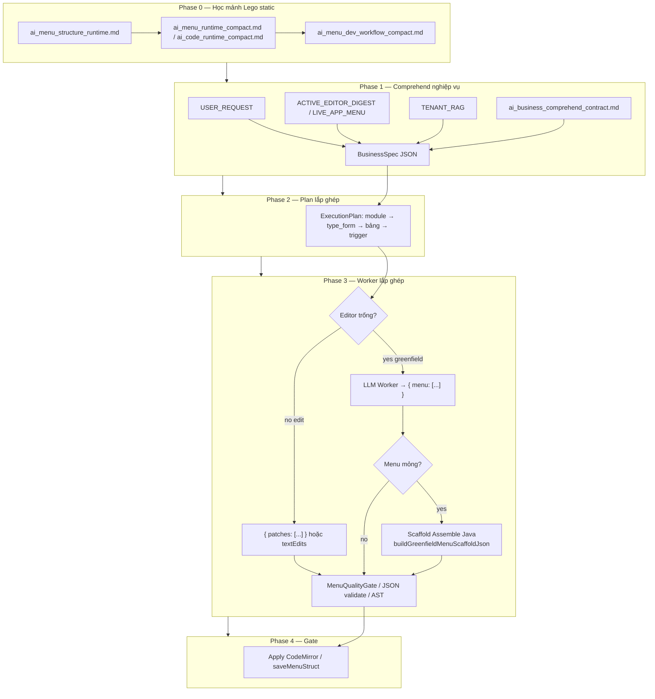

### A.5.2 Catalog mảnh Lego (Phase 0 — menu)

Nguồn canonical: `backend/csm_datas/ai_local/ai_menu_structure_runtime.md` (mirror `use-menu.ts`, `menu-type-resolver.ts`, `MenuRequirementForm`, `saveMenuStruct`).

| Mảnh Lego | type_form / signal | Output UI | Field bắt buộc |
|-----------|-------------------|-----------|----------------|
| Nhóm menu | `0` | Sidebar group | `id`, `label`, `children[]` |
| Grid CRUD | `1` | `CsmDynamicGrid` + modal | `table_name`, `table[]` (f_*), `trigger` |
| Master-Detail | `2` | `CsmMasterDetail` | master `table_name`; tab `nodes[].table_name` = **tên field JSON array** trong master |
| Link ngoài | `3` | redirect | `path` |
| DynamicCode menu | `4` | AdminPage → code runtime | `auto_code_name` |
| Báo cáo | `report_name` + `report_db` | `CsmReport` | `report_name`, `trigger.report_db`, filter `table[]` |
| Kanban | `6` / `kanban_config` | `CsmKanbanBoard` | `kanban_config`, `table_name`, `table[]` |

**Quy tắc lắp ghép:**

- Click sidebar → `/system/grid/:menuId` — mọi node leaf phải có `id` unique trong cây.
- Lưu tenant: encrypt → `index.menu` (`saveMenuStruct`) — AI **không** bịa path lưu khác.
- Master-Detail: tab detail **không** trỏ thẳng bảng DB con nếu master lưu JSON array — dùng đúng tên field.
- Nghiệp vụ (tên module, bảng, luồng) **chỉ** từ `USER_REQUEST` + `LIVE_APP_MENU` + RAG — **không** từ file template domain.

**Mảnh Lego code lane:** `ai_code_runtime_compact.md` — IIFE, `window.seft`, container guard, `new Function(...)`, pattern `auto-kqxs.js` / `auto-lmkt.js`.

### A.5.3 Phase 1–2 — Từ yêu cầu khách → kế hoạch

**Pass 1 Comprehend** (`ai_business_comprehend_contract.md`):

- Input: `USER_REQUEST` (cao nhất), `ACTIVE_EDITOR_DIGEST`, `LIVE_APP_MENU` / sample, `SYSTEM_MASTER_DIGEST`, `TENANT_RAG`.
- Output nội bộ `BusinessSpec`: `modules`, `tables`, `flows`, `user_delta`, `existing_business_summary`.
- **Cấm:** sinh cây “Danh mục / Bán hàng / XNT” nếu user không nói.

**Pass 2 Plan** → `ExecutionPlan`:

- Mỗi module → chọn mảnh: group (`0`), grid (`1`), MD (`2`), report, kanban, link (`3`), code menu (`4`).
- Ghi acceptance: id/label i18n, `table_name`, trigger cần có, thứ tự lắp (menu trước / code sau).

### A.5.4 Phase 3 — Worker lắp ghép

| Tình huống | Contract stack | JSON envelope |
|------------|----------------|---------------|
| Menu **trống** (greenfield) | `resolveMenuJsonContractForGreenfield()`: structure → dev_workflow → compact → greenfield_worker | `{ "menu": [ ... ] }` — **không** `patches` |
| Menu **có sẵn** (edit) | `ai_menu_master_prompt.md` + compact + dev_workflow | `{ "patches": [ add/edit/delete ] }` |
| Code greenfield | `ai_code_greenfield_worker_contract.md` + compact | `{ "code": "...", "summary": "..." }` |
| Code edit | `ai_code_master_prompt.md` + compact | `textEdits` 1-based trên full buffer |

Runtime bổ sung (không phải MD): `LIVE_APP_MENU` digest từ `index.menu` tenant, attachment sample, region plan trên file lớn.

### A.5.5 Registry MD inject (chỉ file cần thiết)

Chi tiết bảng đầy đủ: `backend/csm_datas/ai_local/README.md` và **E.2** dưới đây.

**INJECT:** allowlist trong `AiAssistantGatewayService` — `MENU_KNOWLEDGE_ALLOWLIST`, `CODE_KNOWLEDGE_ALLOWLIST`.

**KHÔNG INJECT vào minimal prompt:**

- `ai-assistant-instructions.md` — policy chat riêng
- `author_style_dna.md` — L0 RAG phong cách (optional)
- `archive/*_runtime_contract.md` — tham chiếu dev, đã thay bằng compact + structure

**Cấm triển khai:**

- Glob load mọi `ai_menu_*.md` / paste full instructions + master + code string một lần
- Java seed cây menu ERP (`buildRichSalesInventory...`) hoặc MD canonical domain
- Greenfield retry yêu cầu `patches` khi editor trống

---

# PHẦN B — VẤN ĐỀ HIỆN TẠI CẦN SỬA DỨT ĐIỂM

Cursor AI **phải** đảm bảo các lỗi sau không còn:

| # | Triệu chứng | Nguyên nhân | Cách sửa bắt buộc |
|---|-------------|-------------|-------------------|
| 1 | `LOCAL_OVERRIDE_NO_CLOUD_FALLBACK` sau ~5 phút | Prompt 13k–15k tokens × nhiều lần; model 1.5B không ra JSON hợp lệ | Edit-focused-first trên weak; cap prompt ≤18k; bỏ RAG nặng khi weak+edit |
| 2 | Log `mode=analyze type=EDIT_CODE` | Classifier trả `responseMode=analyze` dù user nói "sửa" | `EDIT_CODE`/`EDIT_MENU` **luôn** `edit` trong `resolvedResponseMode()` và sau parse classifier |
| 3 | RAG neo `trackSelection` thay vì lifecycle | Symbol lấy từ digest file, không từ message | Prepend lifecycle symbols khi message có webview/process/proxy |
| 4 | Ingest 371k sync mỗi request edit | Orchestration ingest full code sync chặn request | **Async** chunk ingest vào Lucene KNN (`ingestLargeCodeAsync`); request hiện tại dùng region plan, request sau hit scoped RAG |
| 5 | UI báo "chỉ rõ node id/label" trên code editor | Failure message copy từ menu | `buildLocalOnlyFailureMessage` phân biệt code vs menu |
| 6 | Stream raw JSON/token rác lên chat | Emit trước validate | Edit/menu: buffer → validate → `text_edit_apply` |
| 7 | Agentic 26 bước xong mới fail | Generation phụ thuộc orchestration nặng | Fast path generation không chờ deep path xong mới gọi LLM chính |

---

# PHẦN C — KIẾN TRÚC MỤC TIÊU

## C.1 Hai AI (Router + Worker) + RAG layer

> **Quan trọng (v3.0):** Router AI#1 + `AiLocalWorkflowAdvisorService` phục vụ **cả ba** workspace: `code`, `menu`, **`general`** (nội dung không sửa buffer). Luồng nội dung **không** chuyển sang cloud mặc định — local suy luận nhanh trước, rồi mới orchestration/RAG/worker.

```
┌─────────────────────────────────────────────────────────────────┐
│ AI #1 — Intent Classifier (~64 tokens)                          │
│ ApiSpringController.classifyIntentWithLocalAI()                 │
│ Output: type, action, responseMode, nextStep, contextKind, conf │
│ Áp dụng: EDIT_CODE / EDIT_MENU / QUESTION / GENERAL             │
└────────────────────────────┬────────────────────────────────────┘
                             │
┌────────────────────────────▼────────────────────────────────────┐
│ AI Local Workflow Advisor (heuristic + route plan)              │
│ AiLocalWorkflowAdvisorService.advise()                          │
│ workspaceKind: code | menu | general                            │
│ Route: CODE_CONTEXT | MENU_CONTEXT | GENERAL_ANALYSIS | FAST_*  │
└────────────────────────────┬────────────────────────────────────┘
                             │
┌────────────────────────────▼────────────────────────────────────┐
│ Context layer (không vào model hết)                             │
│ · AiTenantKnowledgeIngestionService — DB snapshot org/roles     │
│ · AiScopedContextIngestionService — async vector ingest (large) │
│ · AiLocalOrchestrationService — scoped RAG, plan (bounded)      │
│ · AiRetrievalAuthContextResolver — ACL trước async SSE thread   │
│ · AiBusinessMemoryVectorService — Lucene KNN + ACL tag filter   │
│ · buildLargeCodeRegionPlan — condensed editor (request hiện tại)│
│ · scopedRagBlock top-K (hit index từ ingest trước / cùng phiên) │
└────────────────────────────┬────────────────────────────────────┘
                             │
┌────────────────────────────▼────────────────────────────────────┐
│ AI #2 — Worker                                                  │
│ AiAssistantGatewayService.buildLocalMinimalPrompt()             │
│ LlamaCppNativeService.generateContentFast / stream              │
└────────────────────────────┬────────────────────────────────────┘
                             │
┌────────────────────────────▼────────────────────────────────────┐
│ Gates → SSE → Frontend                                          │
│ analyze: streaming chunks | edit: text_edit_apply                 │
│ agent_harness_trace: M/C/S/O/G summary (PHẦN Z)                 │
└─────────────────────────────────────────────────────────────────┘
```

## C.4 RAG pipeline — 5 bước (Collect → Query)

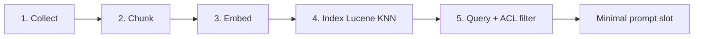

| Bước | Nguồn dữ liệu | Service / hàm |
|------|---------------|---------------|
| **1 Collect** | Attachments, editor `currentCode`, menu JSON, multimodal scan, **tenant DB snapshot** (`csm_roles`, `csm_depts`, `csm_branches`), domain rules markdown | `AiScopedContextIngestionService`, `AiTenantKnowledgeIngestionService`, `AiMultimodalScannerService` |
| **2 Chunk** | Code theo declaration; markdown theo section; menu theo node | `chunkCodeByDeclaration`, `indexMarkdown`, `indexDynamicContext` |
| **3 Embed** | Vector per chunk (nomic / hash fallback) | `AiBusinessMemoryVectorService.embedText` |
| **4 Index** | Lucene KNN per `appId`, tags + scope mask | `indexDynamicContext`, `indexMarkdown`, `searchWithScopes` |
| **5 Query** | Symbol-aware queries + scope mask + **ACL tag filter** | `AiRetrievalPolicyEngine`, `buildRagBlockWithScopes`, `passesRetrievalAuthFilter` |

**Nguyên tắc:** Collect/Index đủ vào Lucene; model chỉ nhận top-K slice qua `[RETRIEVED_CONTEXT]` (≤2800 chars weak).

## C.5 Kiến trúc Cursor-like — AI không “nhớ” cả codebase

> **Điểm then chốt:** Model **không** hiểu toàn project. Nó chỉ hiểu **phần code được retrieve đúng lúc**. Cursor, Copilot, Claude Code, Devin đều dùng cùng mô hình — CSM bắt buộc tuân theo.  
> **Lý thuyết sâu hơn:** PHẦN **AE** — bản chất Attention/Token Probability + 3 con đường học (RAG / In-Context / không fine-tune).

```txt
Codebase (currentCode string + workspace index)
        ↓
Indexing (chunk + embed + metadata)
        ↓
Search / RAG (BM25 + Lucene KNN + symbol graph)
        ↓
Context Builder (condensed slice + tenant RAG + digest)
        ↓
LLM hoặc Heuristic Planner (slot budget)
        ↓
Patch Generator / Prose (textEdits hoặc stream)
        ↓
CodeMirror apply (patch luôn trên FULL currentCode — số dòng tuyệt đối)
```

### C.5.1 Vì sao không nhét toàn bộ code vào model?

| Thực tế CSM | Hệ quả |
|-------------|--------|
| DynamicCode 400k+ chars, multi-stack (Java/RocksDB/Lucene/React/Node) | Hàng triệu token nếu paste nguyên file |
| Model local 1.5B–7B, context 32k–128k | **Không đủ** load full source + hiểu mọi nghiệp vụ cùng lúc |
| `currentCode` là **string HTTP** (không phải git workspace) | Backend **phải** index/chunk; không có magic “đọc cả repo” |

**Quy tắc vận hành:**

```txt
NẠP ĐỦ VÀO HỆ THỐNG (ingest + Lucene + metadata)
KHÔNG NẠP HẾT VÀO MODEL (top-K + condensed + slot budget)
PATCH LUÔN TRÊN FULL currentCode (textEdits absolute line — PHẦN V)
```

### C.5.2 Pipeline parse → chunk → embed → retrieve (đã có trong repo)

| Bước | Cursor làm | CSM tương đương |
|------|------------|-----------------|
| Parse source | class / method / imports / call graph | `chunkCodeByDeclaration`, `scanCodeBusinessStructure`, symbol regex |
| Chunk | function-level slices | `AiScopedContextIngestionService`, `buildAnalyzeCondensedPromptContext` |
| Embed | vector per chunk | `AiBusinessMemoryVectorService.embedText` → Lucene KNN |
| Vector store | Qdrant / … | **Lucene KNN** per `appId` (`dyn_ctx_*`) |
| Query | semantic + keyword | `buildCodeStreamLuceneExcerpts` (BM25 in-request), `searchWithScopes`, symbol-aware retrieval |
| Context builder | top-K ghép prompt | `buildAnalyzeCondensedPromptContext`, `composeLayeredLocalProviderPrompt`, `buildLocalMinimalPrompt` |

### C.5.3 Metadata graph (mục tiêu — bổ sung dần)

Không chỉ vector — cần **graph + metadata** để multi-step agent:

```json
{
  "file": "RecordManager.java",
  "class": "RecordManager",
  "method": "createRecord",
  "dependsOn": ["LuceneIndexer", "RocksDB"],
  "route": "API → Controller → Service → RocksDB → Lucene"
}
```

**Hiện có:** symbol lists, lifecycle anchors, `CodeBusinessScan`, menu node scan, tenant snapshot.  
**Roadmap:** package/class/method graph, API route map, RocksDB table, Lucene field, WebSocket event — index theo **package / class / method / route / table / field**.

### C.5.4 Model tier — khả năng thực tế

| Model | Vai trò trong CSM | Không dùng cho |
|-------|-------------------|----------------|
| **qwen2.5-coder-1.5b** (M1 dev / weak-5gb) | Autocomplete, patch ngắn, classify ~64 tok, **heuristic analyze prose** sau retrieve | Comprehend LLM nghiệp vụ lớn, full-file reasoning |
| **qwen2.5-coder:7b** (khuyến nghị server) | Comprehend, plan slices, analyze có LLM sau RAG | Nhét full 400k vào prompt |
| **14b+** | Plan phức tạp, multi-file | Thay thế RAG |

**Lane 3b (analyze nghiệp vụ) trên 1.5B:**

```txt
User: "phân tích nghiệp vụ code này"
  → retrieve condensed 18–32k (BM25 + symbol + head/tail)
  → CodeBusinessScan + BusinessSpec heuristic (NO Comprehend LLM)
  → buildAnalyzeBusinessPrimaryAnswer → stream prose 6 section
  → KHÔNG buildCodingPrompt 97k, KHÔNG orchestration Tier-3 stats
```

### C.5.5 Index theo gì (Java codebase lớn)

| Trục index | Ví dụ |
|------------|-------|
| package / class / method | `RecordManager.createRecord` |
| route / API | `ApiSpringController`, `@PostMapping` |
| RocksDB table | `csm_accounts`, `csm.index` |
| Lucene field | searchable fields per table |
| WebSocket event | `join_room`, chat events |
| DynamicCode editor | `dyn_ctx_editorCode_{pName}_t{pType}` async KNN |

**Công thức mạnh nhất cho CSM:**

```txt
Lucene BM25 (in-request + persisted)
+ Lucene Vector (KNN per appId)
+ Metadata / symbol graph
+ qwen2.5-coder-1.5b (worker nhỏ)
≠ cố nhét toàn bộ currentCode vào context model
```

## C.2 Ba flow intent (chỉ một contract mỗi request)

```java
enum AiFlowIntent {
    MENU_JSON,       // menu patch / full menu JSON
    FRONTEND_CODE,   // textEdits JSON
    QUICK_QUESTION   // prose, RAG nhẹ
}
```

Chọn tại `AiAssistantGatewayService.classifyLocalIntent(contextType, responseMode, message)`.

**Luồng nội dung không patch (analyze, attachment, tenant, SEO…):** **PHẦN X.0 + X**.

## C.2.1 Năm lane sản xuất — không trộn contract

> **Canonical:** Chi tiết nghiệp vụ từng lane → **PHẦN AB**. Bảng dưới là map kỹ thuật ngắn.

| # | Lane (nghiệp vụ) | Endpoint / transport | Client chính | Output cuối user nhận | Master prompt / RAG |
|---|------------------|----------------------|--------------|----------------------|---------------------|
| **1** | **Quản lý Menu** — phân tích nghiệp vụ → bước theo bảng, nhãn 3 ngôn ngữ, trigger | `POST /api/ai-code-stream` (SSE) | `AiMenuDesigner.tsx` | Menu JSON hợp lệ / patches | `ai_menu_master_prompt.md` + tenant RAG + orchestration steps |
| **2** | **Trình biên tập mã** — DynamicCode, sửa/nâng cấp trên code string | `POST /api/ai-code-stream` (SSE) | `CodeEditor.tsx` / `CodeMirrorWithAiAssistant` | `textEdits` apply lên buffer | `ai_code_master_prompt.md` + region plan + scoped RAG |
| **3** | **Suy luận nhanh** — mọi yêu cầu ngoài lane 1–2 | `POST /api/ai-code-stream` (SSE analyze) | `AiAssistantChat.tsx` | Prose streaming (không patch) | Classifier + `GENERAL_ANALYSIS` / `FAST_*` + RAG nhẹ |
| **4a** | **SEO bài viết** — LMKT anti-AI / ads / FB / category | `POST /ai-generate-seo-content` **sync** | `auto-lmkt.js` → `generateSeoAntiAiOneShot()` | JSON 12 field (LMKT) hoặc `{title,description,html_content}` | `LMKT_SEO_SYSTEM_PROMPT` — **không** code/menu master |
| **4b** | **Guest web chat** — trả lời khách tự động | Socket.IO `chat` | `ChatHistoryContext` / widget | 1 tin nhắn text hoàn chỉnh | `ai.guest-chat.system-prompt` — sync `generateContentFast` |
| **5** | **Ảnh / video từ kịch bản** — scan → mô tả → (roadmap) render | Vision sidecar + Java ingest | Attachment / ops API | Mô tả kỹ thuật → Lucene; **⏳** output media file | SmolVLM / Qwen-VL sidecar — **không** vào text worker prompt |

**Quy tắc UX (lane 1–4):** Client **chờ kết quả cuối hợp lệ** — không poll async job (`mode: status`) trên SEO/guest. Lane 1–3 dùng SSE nhưng user thấy **một** kết quả apply cuối (patch hoặc prose xong). Backend lane 4a có thể chạy 2 inference nội bộ (creative → article) trong **một** HTTP sync.

**Lane 1 vs 2:** Cùng endpoint SSE nhưng `contextType=menu_json` vs `code` → master prompt, gate output, planner scope **khác hẳn**.

**Quan trọng:** Creative params **không** dùng `SEO_SYSTEM_PROMPT` (title/html_content). Model 1.5B trên weak-5gb thường echo schema → backend **bắt buộc** có seed fallback deterministic.

### Creative-params flow (LMKT)

```
auto-lmkt.js: buildCreativeParamsPrompt(kind)
  → requestCreativeParams('anti_ai' | 'facebook_post' | 'category_landing')
  → generateSeoContentWithPrompt(prompt)  // taskType: seo_content
  → POST /ai-generate-seo-content
       │
       ▼
ApiSpringController.getObjectFromAI()
  → isSeoContentTask(taskType=seo_content) → fetchAiRawContent()
  → AiAssistantGatewayService.generateSeoContent()
       ├─ prompt contains [CREATIVE_PARAMS_REQUEST]?
       │     YES → generateCreativeParams()
       │            · CREATIVE_PARAMS_SYSTEM_PROMPT
       │            · max tokens ≈ 384, temp ≈ 0.05
       │            · parse JSON → validate allowlist từ prompt
       │            · fail → buildDeterministicCreativeParamsFallback(SEED, KIND)
       └─ NO  → full SEO / LMKT article (schema theo user prompt)
       │         · LMKT_SEO_SYSTEM_PROMPT (follow JSON schema in prompt)
       │         · alias html_content ↔ content trước khi trả data
       │
       ▼
populateAiResponseFromRawContent()
  → isCreativeParamsPayload(data) || isSeoContentPayload(data)
  → { success: true, data: { personaKey, … } }
       │
       ▼
auto-lmkt.js: parseCreativeParamsResponse() → buildAntiAICreativeOverrides()
```

**Kinds & schema (client `buildCreativeParamsPrompt`):**

| KIND | Trường bắt buộc |
|------|-----------------|
| `anti_ai` | `personaKey`, `contentPattern`, `sellingIntent`, `hook`, `angle`, `tone` |
| `facebook_post` | `angle`, `persona.{label,tone,focus}` |
| `category_landing` | `angle`, `persona`, `role`, `style`, `avoid`, `focus` |

Config:

```properties
ai.seo.creative-params.max-tokens=384
ai.seo.creative-params.temperature=0.05
ai.seo.creative-params.fallback-enabled=true
```

Hàm backend:

- `AiAssistantGatewayService.isCreativeParamsRequest()`
- `AiAssistantGatewayService.generateCreativeParams()`
- `ApiSpringController.isCreativeParamsPayload()`

## C.3 Routing edit vs analyze (model-driven)

**Không** dùng toggle Ask/Edit trên UI (backend suy luận).

| User message (Ví dụ) | responseMode |
|----------------------|--------------|
| "Hãy xem tại sao…", "giải thích…", "phân tích…" | `analyze` |
| "Hãy sửa…", "fix…", "patch…", "thêm…", "xóa…" | `edit` |
| Classifier `type=EDIT_CODE` hoặc `EDIT_MENU` | **`edit` bắt buộc** |

Config:

```properties
ai.local.routing.model-driven.enabled=true
ai.local.routing.model-driven.min-confidence=55
ai.local.analyze.guardrail.heuristic-fallback.enabled=false
```

**Analyze nghiệp vụ trên code có sẵn (v3.10):**

| Tín hiệu | Hành vi backend |
|----------|-----------------|
| `responseMode=analyze` + câu hỏi nghiệp vụ (`phân tích`, `nghiệp vụ`, `logic`, `làm gì`…) | `AiGreenfieldBusinessDesignService.isAnalyzeBusinessQuestion()` → Comprehend nhẹ + inject `promptInjectionBlock` |
| File editor >30k + analyze nghiệp vụ | `buildAnalyzeCondensedPromptContext` trên **full** `currentCode` (không chỉ selection/focus) |
| Analyze code lane | Luôn layered prompt; **cấm** append `[LOCAL_ORCHESTRATION_CONTEXT]` vào message worker |
| Model echo metadata (`intentKeywords`, `codeSymbols`, …) | `looksLikeOrchestrationRuntimeDigest` → heuristic fallback hoặc thông báo lỗi |

Hàm liên quan:

- `classifyIntentWithLocalAI()`
- `reconcileCodeResponseModeWithIntent()`
- `inferAiAssistantResponseModeFromText()`
- `LocalIntentClassification.resolvedResponseMode()` — **isEditTask() trước explicit analyze**
- `AiGreenfieldBusinessDesignService.isAnalyzeBusinessQuestion()` — Comprehend trên analyze nghiệp vụ
- `looksLikeOrchestrationRuntimeDigest()` — guardrail chống echo Tier-3 orchestration stats

---

# PHẦN D — LUỒNG END-TO-END

## D.1 Request HTTP

```
POST /api/ai-code-stream
Content-Type: application/json
→ SseEmitter (async worker thread)
```

Body chính (frontend `AiAssistantChat.tsx`):

```json
{
  "appId": "csm",
  "jobId": "job_xxx",
  "message": "Hãy sửa lỗi webview...",
  "currentCode": "...",
  "contextType": "code",
  "responseMode": "",
  "language": "javascript",
  "flowType": "code_editor",
  "taskType": "code_assistant",
  "pName": "seo",
  "pType": 0,
  "editorMetadata": { "cursorLine": 120, "focusStart": 1, "focusEnd": 5973 },
  "uiLanguage": "vi",
  "attachments": []
}
```

**Quy tắc frontend:** Không gửi `responseMode` cố định trừ khi user dùng directive `/edit`, `/analyze`, `/local-plan`. Backend classifier quyết định.

## D.2 Pipeline backend (thứ tự)

1. **Route** — `decideRouteForCodeStream` → thường `LOCAL_ONLY` khi `ai.local.only.enabled=true`
2. **Classify** — AI#1 → `responseMode`, `preclassifiedIntent`
3. **Resolve ACL** — `AiRetrievalAuthContextResolver.resolve()` **trên request thread** (trước async SSE)
4. **Orchestration** (bounded) — `AiLocalOrchestrationService.orchestrateResilient(..., authContext)`
   - `ingestTenantKnowledge(appId)` — snapshot org + domain rules (debounce 60s/app)
   - `bindRetrievalAuthContext(authContext)` → RAG search
   - Scan attachments → scope mask
   - Ingest: menu sync / code async / skip large edit lightweight
   - RAG: `buildRagBlockWithScopes(topK=3, maxChars≈2800)` + ACL filter
   - Output: `scopedRagBlock`, `planSteps`, `compressedContextBlock`
   - `clearRetrievalAuthContext()` trong finally
5. **Condense editor** — `promptCodeContext`:
   - Nếu `currentCode` > 30k → `buildLargeCodeRegionPlan` (~13–22k chars)
   - Symbol lifecycle từ message (fnResetIP, closeAllTabsAndCleanup, …)
6. **Prompt** — `resolveLocalProviderPrompt` → `composeLayeredLocalProviderPrompt` → `buildLocalMinimalPrompt` → `clampPromptForLocalProvider`
7. **Generation fast path (weak + large + edit):**
   - Nếu `edit` + `code` + weak + code >30k → **`tryEditFocusedLocalFallback()` TRƯỚC** primary LLM
   - Thành công → skip prompt nặng
8. **Primary LLM** — `runLocalProviderWithProgress` (local_provider)
9. **Normalize / validate** — `normalizeLocalStructuredOutput`, `shouldAcceptLocalCodeStreamOutput`
10. **Adaptive retry** (edit, bounded) — prompt ngắn trên weak; không append full original 12k+
11. **Fallback cuối** — `tryEditFocusedLocalFallback` nếu primary fail
12. **Emit SSE** — analyze stream | edit text_edit_apply | error LOCAL_OVERRIDE

## D.3 Frontend SSE handling

File: `frontend-admin/src/pages/system/developer/AiAssistantChat.tsx`

| `stage` | Hành vi |
|---------|---------|
| `streaming` | Append text chunk (analyze only) |
| `text_edit_apply` | Gọi `onApplyLineEdit({ startLine, endLine, replacement, action })` |
| `text_edit_apply_done` | Kết thúc batch edits |
| `complete` | Done |
| `error` | Hiển thị lỗi (code-aware message) |
| `tool_trace`, `agentic_step_result` | Progress UI (optional) |

File apply: `CodeMirrorWithAiAssistant.tsx` → `handleApplyLineEdit` → `view.dispatch({ changes })`.

**Lưu ý code string:** Backend validate/dry-run trên **cùng** `currentCode` gửi lên; frontend giữ `liveCodeRef` đồng bộ trong lúc stream; mỗi `text_edit_apply` map dòng → ký tự trong doc CodeMirror. Chi tiết → **PHẦN V**.

---

# PHẦN E — DANH SÁCH FILE PHẢI SỬA / GIỮ NHẤT QUÁN

## E.1 Backend — bắt buộc

| File | Trách nhiệm | Việc Cursor phải làm |
|------|-------------|----------------------|
| `backend/src/main/java/net/phanmemmottrieu/controller/ApiSpringController.java` | SSE, classify, prompt, gates, fallback | Routing, region plan, focused-first, failure messages, clamp; **`resolveRetrievalAuthContext()` → orchestrateResilient(..., authContext)** |
| `backend/src/main/java/net/phanmemmottrieu/service/AiScopedContextIngestionService.java` | Async ingest currentCode/menu → Lucene | `ingestLargeCodeAsync`, `buildEditorIngestKey` |
| `backend/src/main/java/net/phanmemmottrieu/service/AiLocalOrchestrationService.java` | RAG, agentic | Lifecycle symbol prepend; large code → async ingest; **`ingestTenantKnowledge` + auth bind** |
| `backend/src/main/java/net/phanmemmottrieu/service/AiAgentHarnessTraceService.java` | Agent harness telemetry | Map R/M/C/S/O/G + 3 bottlenecks → SSE `agent_harness_trace` — **PHẦN Z** |
| `backend/src/main/java/net/phanmemmottrieu/service/AiAssistantGatewayService.java` | Minimal prompt, validate | Slot budget, contracts, language block |
| `backend/src/main/java/net/phanmemmottrieu/service/AiBusinessMemoryVectorService.java` | Lucene KNN RAG | topK/maxChars; `bindRetrievalAuthContext`; `passesRetrievalAuthFilter` |
| `backend/src/main/java/net/phanmemmottrieu/service/AiTenantKnowledgeIngestionService.java` | **Mới** — tenant org snapshot + domain rules | `ingestTenantKnowledge(appId)`; tags `acl:tenant`, `knowledge:org` |
| `backend/src/main/java/net/phanmemmottrieu/service/AiRetrievalAuthContext.java` | **Mới** — ACL context cho retrieval | principal, appId, dev, csmAdmin, roles, dataScope, branch/dept ids |
| `backend/src/main/java/net/phanmemmottrieu/service/AiRetrievalAuthContextResolver.java` | **Mới** — resolve từ Spring Security | Gọi trước async SSE trong controller |
| `backend/src/main/java/net/phanmemmottrieu/service/AiScopedContextIngestionService.java` | Ingest menu/code | async/sync policy |
| `backend/src/main/java/net/phanmemmottrieu/service/AiRetrievalPolicyEngine.java` | topK adaptive | Weak machine cap |
| `backend/src/main/java/net/phanmemmottrieu/service/AiEditTaskPlannerService.java` | **v2.4** — request→region→multi-slice plan | `plan()`, `buildCondensedContextFromPlan` |
| `backend/src/main/java/net/phanmemmottrieu/service/LlamaCppNativeService.java` | JNI inference | context-window, max-tokens, prompt cap |
| `backend/src/main/resources/application-local-5gb.properties` | Profile 5GB | Config mục tiêu |
| `backend/src/main/resources/application.properties` | Defaults | Không revert model-driven flags |

## E.2 Backend — prompt assets (Lego MD registry · chỉ allowlist inject)

> Index đầy đủ: `backend/csm_datas/ai_local/README.md` · Java: `AiAssistantGatewayService.MENU_KNOWLEDGE_ALLOWLIST` / `CODE_KNOWLEDGE_ALLOWLIST`

### E.2.1 Menu lane (`contextType=menu_json`)

| File | Phase Lego | Khi nào load |
|------|------------|--------------|
| `ai_business_comprehend_contract.md` | 1 Comprehend | Pass 1 — mọi greenfield/edit có business pipeline |
| `ai_menu_structure_runtime.md` | 0 Structure | Greenfield (menu trống) — **catalog mảnh Lego** |
| `ai_menu_runtime_compact.md` | 0 Structure | Comprehend digest + worker edit |
| `ai_menu_dev_workflow_compact.md` | 0 Structure | Comprehend + edit menu có sẵn |
| `ai_menu_greenfield_worker_contract.md` | 3 Assembly | Greenfield worker — full `{ "menu": [...] }` |
| `ai_menu_master_prompt.md` | 3 Assembly | Edit menu có sẵn — schema `patches` |

**Greenfield stack** (`resolveMenuJsonContractForGreenfield`): structure → dev_workflow → runtime_compact → greenfield_worker — **không** master patch-first.

**Runtime data (không phải MD):** `LIVE_APP_MENU` (`index.menu`), `[SAMPLE_MENU_DIGEST]`, `[TENANT_RAG]`.

### E.2.2 Code lane (`contextType=code`)

| File | Phase Lego | Khi nào load |
|------|------------|--------------|
| `ai_business_comprehend_contract.md` | 1 Comprehend | Pass 1 |
| `ai_code_runtime_compact.md` | 0 Structure | Comprehend + worker |
| `ai_code_greenfield_worker_contract.md` | 3 Assembly | Greenfield code |
| `ai_code_master_prompt.md` | 3 Assembly | Edit DynamicCode — `textEdits` |

### E.2.3 Không inject vào minimal prompt

| File | Vai trò |
|------|---------|
| `ai-assistant-instructions.md` | Policy chat — route riêng |
| `author_style_dna.md` | L0 RAG phong cách code (optional pack) |
| `archive/ai_menu_runtime_contract.md` | Dev reference — thay bằng structure + compact |
| `archive/ai_code_runtime_contract.md` | Dev reference — thay bằng compact |

### E.2.4 Java load rules (bắt buộc)

```java
// AiAssistantGatewayService — KHÔNG glob ai_menu_*.md
MENU_KNOWLEDGE_ALLOWLIST = structure, runtime_compact, dev_workflow_compact, greenfield_worker
CODE_KNOWLEDGE_ALLOWLIST = runtime_compact, greenfield_worker
buildAiAssistantMenuKnowledgeBlock() → loadMenuKnowledgeFiles() theo allowlist
resolveMenuJsonContractForGreenfield() → structure-first (editor trống)
resolveMenuJsonContractForLocal() → master prompt + compact (edit)
buildSystemMasterDigestCompact(menuFlow=true) → structure + compact + dev_workflow
```

## E.3 Frontend — bắt buộc

| File | Việc Cursor phải làm |
|------|----------------------|
| `frontend-admin/src/pages/system/developer/AiAssistantChat.tsx` | Không hardcode `responseMode=analyze`; SSE router; progress không misleading |
| `frontend-admin/src/.../CodeMirrorWithAiAssistant.tsx` | Wrapper duy nhất → `AiAssistantChat`; `handleApplyLineEdit` 1-based lines — **PHẦN W** |
| `frontend-admin/src/pages/system/developer/CodeEditor.tsx` | DynamicCode primary — `pName`/`pType`/`currentCode` — **PHẦN W.7** |
| `frontend-admin/src/pages/system/menu/components/AiMenuDesigner.tsx` | Menu JSON string — **PHẦN W.8** |

## E.4 Frontend — System Management (domain org/permission, không phải AI chat)

Các thay đổi này **ảnh hưởng UX admin** và **là nguồn truth** cho tenant RAG domain rules. Cursor phải giữ đồng bộ với `AiTenantKnowledgeIngestionService.buildDomainRulesMarkdown()`.

| File | Trách nhiệm | Quy tắc bắt buộc |
|------|-------------|------------------|
| `frontend-admin/src/pages/system/admin/index.tsx` | Grid dept/branch/roles/sub-user | `shouldHideDeptBranchField()` ẩn audit + permission internals; branch→dept cascade; merge role combo dedupe by `role_code` |
| `frontend-admin/src/pages/system/admin/system-user-menu-config.ts` | Form schema, beforeSave | `PERMISSION_GROUP_BEFORE_SAVE` auto `role_code` từ `role_name`; `role_level` → dataScope; field `data_app_ids` multi_tag |
| `frontend-admin/src/pages/system/admin/combo-utils.ts` | Role combo options | **Một option per role id**; dedupe by `role_code` (không thêm cả id lẫn role_code làm 2 option) |
| `frontend-admin/src/components/CsmEditModal.tsx` | Form modal | `group_id` dùng id-only options; clear `dept_id` khi đổi `branch_id` |
| `frontend-admin/src/components/CsmDynamicGrid.tsx` | Dynamic grid | Role combo id-only |
| `frontend-admin/src/locales/vi/system.json` (+ en/zh) | i18n | `system.role.code`, `role_level` labels, `data_app_ids` |

**Org model (AI + UI phải hiểu giống nhau):**

```
Branch (csm_branches)
  └── Department (csm_depts.branch_id required)
        └── Permission group (csm_roles) — optional branch_id/dept_id scope
              └── Sub-user (csm_group_members.group_id → csm_roles.id)
```

**Ẩn trên grid dept/branch:** `created_by`, `updated_by`, `create_time`, `update_time`, `dept_full_name`, `branch_full_name`, `is_global`, permission internals, `dept_id` trên branch grid.

**role_level → dataScope:** admin/director=ALL, manager=BRANCH, dept_head/team_lead=DEPARTMENT, staff=OWNER.

---

# PHẦN F — CHI TIẾT IMPLEMENTATION (CHECKLIST CHO CURSOR)

## F.1 Intent classifier (AI#1)

**File:** `ApiSpringController.classifyIntentWithLocalAI`

Prompt classifier output JSON:

```json
{
  "type": "EDIT_CODE",
  "action": "modify",
  "responseMode": "edit",
  "nextStep": "load_code_context",
  "contextKind": "code",
  "confidence": 85
}
```

**Sau parse, bắt buộc:**

```java
if ("EDIT_CODE".equals(type) || "EDIT_MENU".equals(type)) {
    classifiedResponseMode = "edit";
}
```

**resolvedResponseMode():**

```java
if (isEditTask()) return "edit";  // trước mọi explicit analyze
```

**reconcileCodeResponseModeWithIntent:** tin classifier khi `model-driven` + confidence ≥ min; `hasExplicitCodeEditIntent(message)` → edit.

## F.2 Region plan (file lớn)

**File:** `ApiSpringController.buildLargeCodeRegionPlan`

Kích hoạt khi `source.length() >= 30000`.

Thứ tự vùng:

1. Cursor/focus window (nếu có line)
2. Symbol excerpts — **message-driven lifecycle trước**
3. Lucene excerpts
4. File head + tail (edge window)

Cap: `ai.local.orchestration.large-code-region-plan.max-chars` (22000 trên local-5gb).

Gọi sớm trên `promptCodeContext` trước `buildCodingPrompt`.

## F.3 Lifecycle symbols (RAG + region plan)

Khi message chứa: `webview`, `process`, `proxy`, `tắt`, `treo`, `kill`, `resetip`, …

**Prepend symbols (ưu tiên search):**

```txt
closeAllTabsAndCleanup
fnResetIP
waitForAllTabsClose
clearInterval
CallMouseEvent
sophutLamtuoi
stopProcess / killProcess
webview
```

Implement tại:

- `prependLifecycleDebugSymbols()` + `extractCodeStreamSymbolCandidates()` — Controller
- `prependLifecycleSymbolsFromRequest()` — Orchestration (trước `buildSymbolAwareQueries`)

## F.4 Minimal prompt builder

**File:** `AiAssistantGatewayService.buildLocalMinimalPrompt(intent, editor, rag, memory, userRequest, uiLang)`

Cấu trúc:

```txt
BASE_SYSTEM_MIN
+ CONTRACT (menu | code | quick — một cái)
+ [ACTIVE_EDITOR_CODE] hoặc [ACTIVE_EDITOR_MENU_JSON]
+ [RETRIEVED_CONTEXT]  (có thể rỗng)
+ [SESSION_MEMORY]     (có thể rỗng)
+ [USER_REQUEST]
+ [NGON_NGU_TRA_LOI]   (vi/en/zh)
```

Slot cap (weak / 1.5B):

| Slot | Max chars (weak) |
|------|------------------|
| system + contract | ~1800 |
| active editor | ~6000–14000 (region plan) |
| RAG | 0 (weak edit) hoặc ≤2800 |
| memory/digest | 0 (weak edit) hoặc ≤900 |
| user request | không cắt nếu ngắn |
| **TOTAL sau clamp** | **≤18000** |

**composeLayeredLocalProviderPrompt** khi weak + edit + code:

```java
boolean weakCodeEditLight = editMode && isWeakLocalRuntime() && isCodeContext(contextType);
if (weakCodeEditLight) {
    rag = "";
    // skip memory + planning digest
}
```

## F.5 Edit-focused-first (fast path)

**File:** `ApiSpringController.tryEditFocusedLocalFallback`

Điều kiện gọi **trước** primary LLM:

```java
"edit".equals(responseMode)
&& isCodeContext(contextType)
&& isWeakLocalRuntime()
&& promptCodeContext.length() > 30000
```

Steps:

1. Region plan + lifecycle message hint
2. `buildLocalMinimalPrompt(FRONTEND_CODE, condensedCode, "", "", userRequest, uiLang)`
3. `generateContentFast` max tokens ~768–1536
4. `extractJsonObjectCandidate` + `salvageSearchReplaceAsTextEdits`
5. `shouldAcceptLocalCodeStreamOutput` → emit hoặc fall through primary

## F.6 Output gates

**shouldAcceptLocalCodeStreamOutput(text, responseMode, contextType):**

- Edit code: `extractLineTextEditsCount > 0` OR valid SEARCH/REPLACE
- Edit menu: valid JSON patches / menu schema
- Analyze: length ≥ 24, không low-signal

**Không accept:**

- CJK garbage (`containsCjkGarbage`)
- Prompt echo (`### currentCode`, `"startLine":N`)
- `need_more_context` status cho edit apply

**Pipeline:**

```txt
raw → extractAiResultText → extractJsonObjectCandidate
→ sanitizePromptEchoLeakage → validate schema
→ repair once (small prompt) → fallback JSON empty textEdits
```

## F.7 Adaptive edit retry (weak)

**buildEditAdaptiveRetryPrompt:** trên weak + code → dùng `buildTextEditsRetryPrompt` với original prompt truncated ≤5000 chars; **không** append full assembled prompt.

## F.8 Failure messages

**buildLocalOnlyFailureMessage** — nếu `looksLikeCodeEditorContext(baseCode)`:

- Gợi ý: hàm/vùng code (`fnResetIP`, `closeAllTabs`)
- **Không** nói "node id/label" (menu wording)

Error code giữ: `LOCAL_OVERRIDE_NO_CLOUD_FALLBACK` khi local-only và không có output usable.

## F.9 Orchestration trên weak

**AiLocalOrchestrationService:**

- Code ≤ 45k → `ingestCode(..., async=true)` (chuẩn, không block lâu)
- Code > 45k → **KHÔNG** sync ingest; gọi `AiScopedContextIngestionService.ingestLargeCodeAsync(...)`
- Status telemetry: `scopedCodeIngestionMode=async_large_code_vector`, `scopedCodeIngestionStatus=pending_async_large_code|completed_async_large_code|cached_unchanged`
- Request **hiện tại** vẫn dùng `buildLargeCodeRegionPlan` + symbol lifecycle (không chờ embed xong)
- Request **tiếp theo** (cùng `pName`/`pType`) → `scopedRagBlock` lấy chunk liên quan từ Lucene KNN
- `ai.local.runtime.weak-5gb.skip-orchestration-refine=true`
- `ai.orchestration.speculative.enabled=false`
- scope-rag topK=3, maxChars=2800

Agentic UI steps OK — nhưng **LLM worker không được block** chờ hết 26 bước mới chạy lần đầu (generation có thể chạy sau orchestration context ready, nhưng dùng fast path khi có thể).

## F.11 Large DynamicCode — async Lucene vector ingest (BẮT BUỘC)

> **Nguyên tắc:** NẠP ĐỦ VÀO HỆ THỐNG (index vector), KHÔNG NẠP HẾT VÀO MODEL (region plan ~13–22k).

### F.11.1 Ba lớp index (phân biệt rõ)

| Lớp | Khi nào | Persistent? | Dùng cho |
|-----|---------|-------------|----------|
| **Startup project index** | Server start (`LocalAiAssistantContextService`) | Có | README, prompts, docs dự án — **không** phải DynamicCode user |
| **Ephemeral in-memory Lucene** | Mỗi request trong `buildCodeStreamLuceneExcerpts` / region plan | Không | Hotspot keyword trong request hiện tại |
| **Async editor vector index** | Code > 45k, mỗi request chat (`ingestLargeCodeAsync`) | Có (Lucene KNN per appId) | Scoped RAG request sau + orchestration khi không skip |

### F.11.2 Luồng async ingest

```
currentCode > 45k
    → ApiSpringController.scheduleLargeEditorCodeVectorIngest()   [non-blocking]
    → AiScopedContextIngestionService.ingestLargeCodeAsync()
         editorKey = buildEditorIngestKey(pName, pType)   // vd. seo_t0
         sourceSuffix = dyn_ctx_editorCode_seo_t0
         → AiBusinessMemoryVectorService.indexDynamicContext()
              chunkCodeByDeclaration (DynamicCode JS)
              embed nomic + Lucene KNN per chunk
    → status pending_async_large_code (request hiện tại tiếp tục)
    → status completed_async_large_code (request sau RAG hit)
```

**Dedup:** content hash per `appId:editorKey` — không re-embed nếu code không đổi (`cached_unchanged`).

### F.11.3 File & hàm bắt buộc (Cursor phải giữ / mở rộng tại đây)

| File | Hàm / trách nhiệm |
|------|-------------------|
| `AiScopedContextIngestionService.java` | `ingestLargeCodeAsync`, `buildEditorIngestKey`, `buildLargeCodeIngestDocument` |
| `AiLocalOrchestrationService.java` | Thay `skipped_large_code_lightweight` bằng gọi `ingestLargeCodeAsync` |
| `ApiSpringController.java` | `scheduleLargeEditorCodeVectorIngest` — gọi khi `effectiveCodeContext.length()>45000` |
| `AiBusinessMemoryVectorService.java` | `indexDynamicContext`, `searchWithScopes`, `chunkCodeByDeclaration` (nhận diện DynamicCode) |

### F.11.4 Config

```properties
ai.context.ingestion.large-code.enabled=true
ai.context.ingestion.large-code.threshold-chars=45000
ai.context.ingestion.large-code.max-chars=600000
```

Env (local-5gb): `AI_CONTEXT_INGESTION_LARGE_CODE_*` trong `config.local-5gb.env`.

### F.11.5 Telemetry / UI agentic

Tool trace SSE: `large_code_vector_ingest` — input `editorKey`, `sourceChars`; output `status=pending_async_large_code|...`.

Orchestration stats: `scopedCodeIngestionMode=async_large_code_vector`.

### F.11.6 CẤM

```txt
✗ Sync ingest full 369k trước mỗi edit request (block 30s–5 phút)
✗ Bỏ qua ingest hoàn toàn khi code >45k (chỉ region plan — RAG session sau sẽ trống)
✗ Feed full 369k vào model vì "cho chắc"
✗ Tạo service ingest mới nếu đã sửa được AiScopedContextIngestionService
```

## F.12 Tenant knowledge ingest + ACL retrieval (Phase 2 — BẮT BUỘC GIỮ)

> **Mục tiêu:** AI local hiểu org/permission thực tế của tenant khi user hỏi/sửa menu, sub-user, nhóm quyền — không chỉ dựa prompt tĩnh.

### F.12.1 AiTenantKnowledgeIngestionService

Gọi đầu `orchestrate()` / `orchestrateResilient()`:

```java
aiTenantKnowledgeIngestionService.ingestTenantKnowledge(appId);
```

| Source | Nội dung | Tags |
|--------|----------|------|
| `tenant_knowledge_org_snapshot` | Markdown rows từ DB: `csm_roles`, `csm_depts`, `csm_branches` | `acl:tenant`, `knowledge:tenant`, `knowledge:org` |
| `tenant_knowledge_domain_rules` | Static rules (org hierarchy, combo cascade, role_code, hidden fields) | `acl:tenant`, `knowledge:domain_rules`, `knowledge:permissions` |

- Debounce: **60s/appId** (`recently_indexed` nếu gọi lại sớm)
- Non-csm app: `merge-csm-roles=true` → merge roles từ app `csm` dedupe by `role_code`
- Max rows/table: `ai.context.ingestion.tenant-snapshot.max-rows-per-table=120`

**Domain rules markdown** phải khớp frontend (PHẦN E.4). Khi sửa UX admin → cập nhật `buildDomainRulesMarkdown()` **và** file frontend tương ứng.

### F.12.2 AiRetrievalAuthContext + filter

**Resolve trên request thread** (SecurityContext mất sau async):

```java
// ApiSpringController — trước CompletableFuture / SseEmitter worker
AiRetrievalAuthContext authContext = retrievalAuthContextResolver.resolve();
orchestrationService.orchestrateResilient(..., authContext);
```

**Orchestration:**

```java
businessMemoryVectorService.bindRetrievalAuthContext(authContext);
try { /* RAG search */ }
finally { businessMemoryVectorService.clearRetrievalAuthContext(); }
```

**Tag filter** (`passesRetrievalAuthFilter`):

| Tag | Rule |
|-----|------|
| (no `acl:`) | Pass — public/project chunks |
| `acl:admin` | Block cho non-admin retrieval |
| `acl:tenant` | Require authenticated |
| `branch:{id}` | Pass nếu user scope ALL hoặc branch match |
| `dept:{id}` | Pass nếu user scope ALL/BRANCH hoặc dept match |

Config: `ai.retrieval.auth.filter-enabled=true` (tắt = pass all, chỉ dev debug).

### F.12.3 Config tenant snapshot

```properties
ai.context.ingestion.tenant-snapshot.enabled=true
ai.context.ingestion.tenant-snapshot.tables=csm_roles,csm_depts,csm_branches
ai.context.ingestion.tenant-snapshot.merge-csm-roles=true
ai.context.ingestion.tenant-snapshot.max-rows-per-table=120
ai.retrieval.auth.filter-enabled=true
```

### F.12.4 Telemetry

Orchestration stats có thể gồm: `tenantKnowledgeIngestStatus=indexed|skipped:recently_indexed|skipped:disabled`.

Log: `Tenant knowledge indexed appId=... orgChunks=... ruleChunks=...`

### F.12.5 CẤM

```txt
✗ Resolve SecurityContext bên trong async SSE thread (authContext null → filter sai)
✗ Index tenant snapshot mỗi chunk riêng lẻ không debounce (DB hammer)
✗ Domain rules markdown lệch frontend (AI trả lời sai combo/role_code)
✗ Thêm option combo group_id cả id lẫn role_code (duplicate UI)
```

## F.10 Frontend

**AiAssistantChat.tsx:**

- Default không gửi `responseMode: "analyze"` — để backend classify
- Chỉ gửi explicit mode với `/edit`, `/analyze`, `/local-plan`
- `text_edit_apply` → apply CodeMirror, không hiển thị raw JSON trong bubble (edit mode)
- Analyze → `streaming` chunks, prose tiếng Việt nếu `uiLanguage=vi`

---

# PHẦN G — CONTRACT OUTPUT (EMBED CHO CURSOR)

## G.1 FRONTEND_CODE — edit mode (trên code string)

Model **chỉ** trả JSON (không markdown). Mọi `startLine`/`endLine` là **số dòng tuyệt đối 1-based** trên **toàn bộ** `currentCode` lúc request — không phải dòng trong slice condensed, không phải offset file.

```json
{
  "summary": "Sửa cleanup webview/process khi tab đóng",
  "changes": [],
  "textEdits": [
    {
      "startLine": 120,
      "endLine": 125,
      "replacement": "// fixed cleanup\n...",
      "action": "edit"
    }
  ]
}
```

Rules:

- `startLine` / `endLine`: **1-based**, inclusive, số nguyên thật (không `"N"`), tính trên **full string** (dòng 1 = ký tự đầu tiên trước `\n` đầu tiên)
- Backend **bắt buộc** dry-run `simulateApplyLineTextEdits(currentCode, textEdits)` trước emit SSE — không validate chỉ trên excerpt slice
- Multi-slice: mỗi slice LLM vẫn trả dòng **tuyệt đối**; backend merge rồi gate lại trên full string
- Frontend `applyTextEditsToDraft` + `handleApplyLineEdit` dùng cùng semantics (splice dòng, sort desc khi batch)
- DynamicCode: browser only; **no** import/export/require/Node APIs
- Allowed globals: `window`, `document`, `window.React`, `window.antd`, `window.csmApi`, `window.seft`, …
- Fallback:

```json
{
  "summary": "Không tạo được patch an toàn",
  "changes": [],
  "textEdits": []
}
```

### G.1.1 DynamicCode runtime (code lane — tách khỏi menu JSON)

**Luồng UI:** Quản lý hệ thống → **Trình biên tập mã** (`CodeEditor.tsx`) — `contextType=code`, `flowType=code_editor`, `taskType=code_assistant`.

**Lưu trữ:** `sys_autos` (`p_name`, `p_type=0`, `p_code` encrypted). Ví dụ: `seo`, `csang`, `broadcast_csang`.

**Ba điểm chạy** (`DynamicCodeMenu` → `dynamic-code/index.tsx`):

| Entry | File | autoCodeName | containerId |
|-------|------|--------------|-------------|
| Trang chủ | `homepage/index.tsx` | `broadcast_{appId}` | `broadcast-auto-root-homepage` |
| Auto setup | `AutoSetup.tsx` | `{app_id}` hoặc `inlineCode` | `context-auto` |
| Menu admin | AdminPage type_form=4 | `auto_code_name` | scoped `dynamic-code-root-*` |

**Execute:** `new Function("seft", containerId, scopedWindow, scopedDocument, code)` — browser only.

**Pattern mẫu:**

| File | Pattern |
|------|---------|
| `pages/auto/seo.js` | Legacy monolith, `#context-auto`, `CsmDynamicGrid`, `window.seft` |
| `lmkt/.../auto-kqxs.js` | IIFE + `ReactDOM.createRoot` + `__dynamicCodeDispose` |
| `lmkt/.../auto-lmkt.js` | `__AUTO_*_LOADED__` guard, `uiTranslations` vi/en/zh |

**Nạp kiến thức AI local (backend allowlist — lane code only):**

| File | Phase | Slot prompt |
|------|-------|-------------|
| `ai_code_runtime_compact.md` | 0 Structure | `[SYSTEM_MASTER_DIGEST]` Comprehend |
| `ai_code_greenfield_worker_contract.md` | 3 Assembly | Greenfield worker |
| `ai_code_master_prompt.md` | 3 Assembly | Edit — schema v7 + textEdits |

**Không inject:** `archive/ai_code_runtime_contract.md` (dev reference only).

**Tách lane:** Backend `flow_guard` — `code_editor`↔`code`, `menu_manager`↔`menu_json`. Không inject `AUTO_LOADED_MENU_*` khi `contextType=code`.

**Greenfield code:** `{ "code": "<full JS>", "summary": "..." }` — scaffold `window.seft` + container guard.


**Luồng UI thực tế:**

| Màn hình | contextType | flowType | Editor buffer |
|----------|-------------|----------|---------------|
| Quản lý hệ thống → **Quản lý menu** (tab AI) | `menu_json` | `menu_manager` | JSON menu string |
| Quản lý hệ thống → **Trình biên tập mã** | `code` | `code_editor` | JS DynamicCode |

Patch envelope:

```json
{
  "status": "success",
  "patches": [
    {
      "action": "edit",
      "nodeId": "existing-id",
      "parentId": "",
      "path": "Module / Feature",
      "before": null,
      "after": { }
    }
  ],
  "i18n": { "vi": {}, "en": {}, "zh": {} },
  "warnings": []
}
```

Fallback: `{ "status": "need_more_context", "patches": [], "warnings": [...] }`

Required menu fields: `id`, `parentId`, `label`, `label_en`, `label_zh`, `icon`, `path`, `type_form`, `table_name`, `table[]` (f_*), `trigger`, `children`.

### G.2.1 Runtime component contract (menu JSON → UI)

Click sidebar → `/system/grid/:menuId` → `AdminPage` dispatch (first match):

| type_form / signal | Component | Fields bắt buộc |
|--------------------|-----------|-----------------|
| 6 hoặc `kanban_config` | `CsmKanbanBoard` | `kanban_config`, `table_name`, `table[]` |
| 4 hoặc `auto_code_name` | DynamicCodeMenu | `auto_code_name` (lane code, không menu JSON) |
| `report_name` + `report_db` | `CsmReport` | `report_name`, `trigger.report_db`, `table[]` filter |
| 2 + `nodes[]` | `CsmMasterDetail` | master `table_name`; tab: `nodes[].table_name` = **field JSON array trong master** |
| 1 | `CsmDynamicGrid` + `CsmEditModal` | `table_name`, `table[]`, `trigger`; `row_type_edit` 0=popup |

**Nạp kiến thức cho AI local (backend allowlist — lane menu only):**

| File | Phase | Slot prompt |
|------|-------|-------------|
| `ai_menu_structure_runtime.md` | 0 Structure | Greenfield worker — **Lego catalog** |
| `ai_menu_runtime_compact.md` | 0 Structure | `[SYSTEM_MASTER_DIGEST]` Pass 1 Comprehend + edit worker |
| `ai_menu_dev_workflow_compact.md` | 0 Structure | Comprehend + edit (mirror dev workflow) |
| `ai_menu_greenfield_worker_contract.md` | 3 Assembly | Greenfield — `{ "menu": [...] }` |
| `ai_menu_master_prompt.md` | 3 Assembly | Edit — schema patch v7 |
| `ai_business_comprehend_contract.md` | 1 Comprehend | Pass 1 BusinessSpec |

**Không inject:** `archive/ai_menu_runtime_contract.md`, `ai-assistant-instructions.md` (full paste).

`AiAssistantGatewayService.loadMenuKnowledgeFiles()` — **chỉ** `MENU_KNOWLEDGE_ALLOWLIST` (4 file worker); comprehend contract load riêng.  
`ApiSpringController` greenfield: `resolveMenuJsonContractForGreenfield()` khi editor trống.  
`sample_menu_compact` từ `AiMenuDesigner` → `[SAMPLE_MENU_DIGEST]`; tenant live → `LIVE_APP_MENU` / `index.menu`.

**Master-Detail — sai lầm thường gặp:** tab `nodes[].table_name` là tên **field** master (vd `chi_tiet`), không phải bảng DB `bh_donhang_ct`. Nếu detail có bảng DB riêng → 2 menu `type_form=1` + FK combo.

## G.3 ANALYZE / QUICK_QUESTION

- Prose only, cùng ngôn ngữ user (`uiLanguage` / detect từ message)
- Không bắt buộc JSON
- Stream qua SSE `stage=streaming`

---

# PHẦN H — CONFIG ĐÍCH (local-5gb)

File: `backend/src/main/resources/application-local-5gb.properties`

```properties
ai.local.runtime.tier=weak-5gb
ai.local.only.enabled=true
ai.local.llama.prefer-local-first=true

ai.local.llama.context-window=8192
ai.local.llama.max-tokens=768
ai.local.llama.max-prompt-chars=32000
ai.local.llama.threads=1
ai.local.llama.batch-size=32

ai.local.routing.model-driven.enabled=true
ai.local.routing.model-driven.min-confidence=55
ai.local.analyze.guardrail.heuristic-fallback.enabled=false
ai.local.analyze.language-alignment.enabled=true

ai.local.prompt.composition.mode=auto
ai.local.prompt.composition.auto-orchestration-max-chars=16000
ai.local.prompt.composition.orchestration-memory-max-chars=900

ai.local.orchestration.large-code-region-plan.max-regions=5
ai.local.orchestration.large-code-region-plan.max-chars=22000
ai.local.chunking.threshold-chars=45000

ai.orchestration.multimodal.scope-rag.top-k=3
ai.orchestration.multimodal.scope-rag.max-chars=2800
ai.business.memory.chunk-max-chars=1600
ai.business.memory.search-default-k=3

ai.code-stream.auto-continue.enabled=false
ai.assistant.edit-structured.required=true
ai.code-stream.edit.patch-validator.enabled=true

ai.local.runtime.weak-profile.local-provider.max-prompt-chars=18000

# Phase 2 — tenant RAG
ai.context.ingestion.tenant-snapshot.enabled=true
ai.context.ingestion.tenant-snapshot.tables=csm_roles,csm_depts,csm_branches
ai.context.ingestion.tenant-snapshot.merge-csm-roles=true
ai.retrieval.auth.filter-enabled=true

# PHẦN AC — Business Comprehension (local-5gb safe)
ai.local.business-comprehension.enabled=true
ai.local.business-comprehension.required-on-greenfield=true
ai.local.business-comprehension.required-on-sample-attachment=true
ai.local.business-comprehension.required-on-edit-with-editor=true
ai.local.business-comprehension.active-editor-digest-max-chars=6000
ai.local.business-comprehension.system-master-digest-max-chars=2400
ai.local.business-comprehension.comprehend-max-tokens=768
ai.local.business-comprehension.worker-max-tokens=1536
ai.local.business-comprehension.sequential-infer=true
ai.local.business-comprehension.deterministic-seed-fallback=true
ai.local.business-comprehension.deterministic-seed-fallback.menu-greenfield.enabled=false
ai.local.business-comprehension.menu-greenfield-fast-path.enabled=false
ai.local.greenfield.enabled=true
ai.local.greenfield.menu-seed-module-count=1
ai.local.greenfield.code-scaffold-template=csm_dynamiccode_v1
```

Launch:

| Môi trường | Lệnh |
|------------|------|
| **Dev máy mạnh** | `cd backend && set -a && source ../config.local-strong.env && set +a && mvn spring-boot:run` |
| **Server yếu 5GB** | `./run-server.sh` (repo root) |

`config.local-strong.env` / `config.local-5gb.env` tự nạp `config.env` khi `source`.  
Chuẩn bị lần đầu: `cp config.env.example config.env`.

---

# PHẦN I — SSE EVENT SCHEMA (TÓM TẮT)

Backend emit JSON lines qua `SseEmitter`:

```json
{ "stage": "streaming", "requestId": "job_xxx", "chunk": "..." }
```

```json
{
  "stage": "text_edit_apply",
  "requestId": "job_xxx",
  "attempt": 1,
  "textEdit": {
    "startLine": 10,
    "endLine": 12,
    "replacement": "...",
    "action": "edit"
  }
}
```

```json
{ "stage": "text_edit_apply_done", "requestId": "job_xxx", "count": 3 }
```

```json
{
  "stage": "error",
  "requestId": "job_xxx",
  "reason_code": "LOCAL_OVERRIDE_NO_CLOUD_FALLBACK",
  "message": "Local AI không tạo được patch an toàn..."
}
```

```json
{ "stage": "complete", "requestId": "job_xxx", "model": "local_provider" }
```

---

# PHẦN J — TIÊU CHÍ NGHIỆM THU (ACCEPTANCE TESTS)

Cursor **phải** verify các case sau trên profile **local-5gb**, file DynamicCode **~371k chars** (p_name=seo):

## J.1 Analyze

**Input:** `Hãy xem tại sao khi webview tắt process vẫn không tắt và đôi lúc treo proxy?`

| Kiểm tra | Pass |
|----------|------|
| Log `responseMode=analyze` | ✓ |
| Không full ingest 371k sync | ✓ |
| `promptChars` effective ≤ ~20k | ✓ |
| Response prose tiếng Việt | ✓ |
| Không `text_edit_apply` | ✓ |
| Hoàn thành < ~3 phút trên 2 CPU | ✓ |

## J.1b Analyze nghiệp vụ — file lớn (KQXS / broadcast)

**Input:** `Hãy phân tích các logic có trên code này đang làm nghiệp vụ gì?` — editor `broadcast_kqxs` / `auto-kqxs.js` (~400k+ chars)

**Nguyên lý (v3.11):** Backend **đọc** full `currentCode` để index/chunk **một lần**; model/heuristic chỉ nhận **retrieved slice** (`resolveAnalyzeBusinessScanContext` ≤32k). **Không** scan regex 400k trong heuristic; **không** build prompt 97k.

| Kiểm tra | Pass |
|----------|------|
| Log `responseMode=analyze`, `analyze_business_fast_path` | ✓ |
| SSE `business_comprehend` completed (Comprehend **heuristic-only**, no LLM on 1.5B) | ✓ |
| Log `heuristic_analyze_business_question` — **không** 3× intent classify LLM | ✓ |
| `fullCodeChars` ≈ 400k+ nhưng `retrievedContextChars` / scan context ≤ 32k | ✓ |
| **Không** echo `intentKeywords` / `codeSymbols` / Tier-3 stats | ✓ |
| Response **prose 6 section tiếng Việt** (KQXS, lottery, broadcast, proxy, theme…) | ✓ |
| `model=local_heuristic_analyze`, `earlyExit=true`, elapsed **< 15s** M1 | ✓ |
| Async `ingestLargeCodeAsync` scheduled (request sau hit scoped KNN) | ✓ |

## J.2 Edit

**Input:** `Hãy sửa lỗi khi webview tắt process vẫn không tắt...`

| Kiểm tra | Pass |
|----------|------|
| Log `responseMode=edit`, `type=EDIT_CODE` | ✓ |
| Region plan ~13k chars (không 371k trong prompt) | ✓ |
| Symbol retrieval gồm fnResetIP/closeAllTabs (không chỉ trackSelection) | ✓ |
| Output JSON `textEdits` hợp lệ HOẶC focused-first success log | ✓ |
| `textEdits` dòng **tuyệt đối** trên full `currentCode` (không lệch vùng symbol thật) | ✓ PHẦN V |
| Dry-run gate pass trên full string trước SSE | ✓ |
| CodeMirror apply đúng dòng (so sánh trước/sau quanh patch) | ✓ |
| Không `LOCAL_OVERRIDE` nếu textEdits count > 0 | ✓ |
| Failure message code-aware nếu fail | ✓ |

## J.3 Menu edit

**Input:** Kiểm tra trigger + sửa label 3 ngôn ngữ

| Kiểm tra | Pass |
|----------|------|
| `AiFlowIntent.MENU_JSON` | ✓ |
| Buffered patch JSON, không stream raw | ✓ |
| Validate trigger keys + labels | ✓ |

## J.4 Compile

```bash
cd backend && mvn compile -DskipTests
```

Exit code 0.

## J.5 Tenant / permission domain (Phase 2)

**Input (analyze):** `Nhóm quyền sub-user đang hiện trùng option — nguyên nhân và cách sửa?`

| Kiểm tra | Pass |
|----------|------|
| Log `Tenant knowledge indexed` hoặc `skipped:recently_indexed` | ✓ |
| RAG block mention dedupe `role_code`, one option per id | ✓ |
| Không leak org data ngoài ACL user | ✓ |

**Input (analyze):** `Khi đổi chi nhánh thì phòng ban combo phải làm gì?`

| Kiểm tra | Pass |
|----------|------|
| Trả lời cascade branch→dept, clear stale dept_id | ✓ |
| Khớp `buildDomainRulesMarkdown()` + frontend cascade | ✓ |

---

# PHẦN K — CẤM TUYỆT ĐỐI (DO NOT)

```txt
✗ Ghép ai_menu_master_prompt + ai_code_master_prompt + ai-assistant-instructions + full code vào một prompt
✗ truncateMiddle(giantAssembledPrompt) là chiến lược chính thay vì slot budget
✗ Stream raw LLM token JSON vào chat bubble ở edit mode
✗ Auto-continue cho edit/menu JSON
✗ Classifier EDIT_CODE → responseMode analyze
✗ Cloud fallback khi user bật local-only (trừ khi config cho phép)
✗ Failure message "node id/label" cho code editor
✗ Full sync ingest 371k trước mỗi edit request
✗ Skip ingest hoàn toàn khi code >45k (phải async vector ingest)
✗ Adaptive retry append original prompt 12k+ trên weak machine
✗ Over-engineer thêm service/layer mới nếu sửa được trong file hiện có
✗ Domain rules RAG lệch code frontend system admin
✗ Combo group_id duplicate (id + role_code as separate options)
✗ Coi pName là file path hoặc đọc/ghi disk thay vì currentCode string (PHẦN V)
✗ textEdits với startLine/endLine relative trong slice excerpt — phải absolute trên full string
✗ Validate patch chỉ trên condensed excerpt mà không dry-run full currentCode
✗ Apply full doc replace khi đã có text_edit_apply line-range (trừ menu full-tree fallback)
✗ Dùng selection-only làm promptCodeContext cho analyze nghiệp vụ trên file >30k (phải **retrieve** condensed 18–32k — không scan/prompt full 400k)
✗ Coi model 1.5B “hiểu” nghiệp vụ lớn khi nhét nguyên currentCode vào prompt — phải RAG + Java scaffold/plan (PHẦN AE.0, AF.8)
✗ Feed toàn bộ repo / full DynamicCode 400k vào LLM context vì “cho AI hiểu hết”
✗ Gắn `[LOCAL_ORCHESTRATION_CONTEXT]` / Tier-3 runtime stats vào prompt analyze code (model echo metadata)
✗ Coi output `intentKeywords:` / `codeSymbols:` là câu trả lời hợp lệ — phải qua guardrail + heuristic fallback
✗ Greenfield menu comprehensive mà chỉ worker 1-shot — phải scaffold-first + module enrich (PHẦN **AF.8**, **AF.12**)
✗ Bật `menu-greenfield-fast-path` / `deterministic-seed-fallback.menu-greenfield` ngoài debug — gây menu mỏng 1 module
✗ Bỏ qua `ai_greenfield_pipeline_contract.md` khi sửa Comprehend/greenfield worker
✗ Duplicate module / báo cáo flat root / trigger array — xem AF.12.1
```

---

# PHẦN L — ƯU TIÊN THỰC HIỆN (THỨ TỰ CHO CURSOR)

```
P0 — Routing & mode [DONE]
  ☑ resolvedResponseMode: EDIT_* → edit
  ☑ Classifier post-parse force edit
  ☑ Frontend không hardcode analyze

P0 — Prompt budget [DONE]
  ☑ Region plan >30k
  ☑ composeLayered weak edit: rag="" memory skip
  ☑ clampPromptForLocalProvider ≤18k weak

P0 — Edit path [DONE]
  ☑ edit-focused-first trước primary LLM
  ☑ tryEditFocusedLocalFallback + salvage JSON
  ☑ shouldAcceptLocalCodeStreamOutput + code failure message

P1 — Retrieval & large-code index [DONE]
  ☑ Lifecycle symbol prepend (controller + orchestration)
  ☑ Async large-code vector ingest (>45k)
  ☑ Region plan cho request hiện tại
  ☑ scopedRag hit editorCode_* chunks

P1 — Tenant RAG Phase 2 [DONE — e45eae92]
  ☑ AiTenantKnowledgeIngestionService
  ☑ AiRetrievalAuthContext + Resolver + ACL filter
  ☑ orchestrateResilient(..., authContext) từ controller
  ☑ Config tenant-snapshot + auth filter

P1 — System admin UX [DONE — cba701ed]
  ☑ shouldHideDeptBranchField, branch→dept cascade
  ☑ role_code editable on add, auto-generate beforeSave
  ☑ buildRoleComboOptions dedupe by role_code
  ☑ data_app_ids multi_tag field + i18n

P2 — Knowledge Mastery [v2.3]
  ☑ PHẦN R spec + author_style_dna.md
  ☑ csm-knowledge-pack.sh export/import
  ☑ API rebuild-workspace + knowledge/status
  □ ai_code_learning jsonl sau edit thành công (v2.4)
  □ Hybrid BM25 + vector retrieval
  □ Citations trong analyze response

P1 — Business Comprehension & Planning [v3.9–v3.10 — PHẦN AC]
  ☑ AiGreenfieldBusinessDesignService (BusinessSpec + editor/sample/system digest)
  ☑ Pass Comprehend → Plan tuần tự trước Worker (local-5gb safe)
  ☑ SSE business_comprehend / business_plan (+ existingBusinessSummary)
  ☑ required-on-edit-with-editor (kịch bản 2 — editor có sẵn)
  ☑ Greenfield + mẫu attachment (kịch bản 1)
  ☑ Analyze nghiệp vụ: retrieve → CodeBusinessScan → heuristic prose (v3.11, PHẦN C.5)
  □ Code graph metadata (class/method/route/table) — roadmap C.5.3
  □ Khuyến nghị deploy qwen2.5-coder:7b trên server cho Comprehend LLM (1.5B = dev/M1 only)
  ☑ Guardrail orchestration stats echo + layered analyze prompt (v3.10)
  □ Checklist AC.7 trên ./run-server.sh

P2 — Polish
  □ Agentic progress không block fast path
  □ Log telemetry: promptChars, textEditsCount, tenantKnowledge status
```

---

# PHẦN M — SƠ ĐỒ MERMAID (THAM CHIẾU)

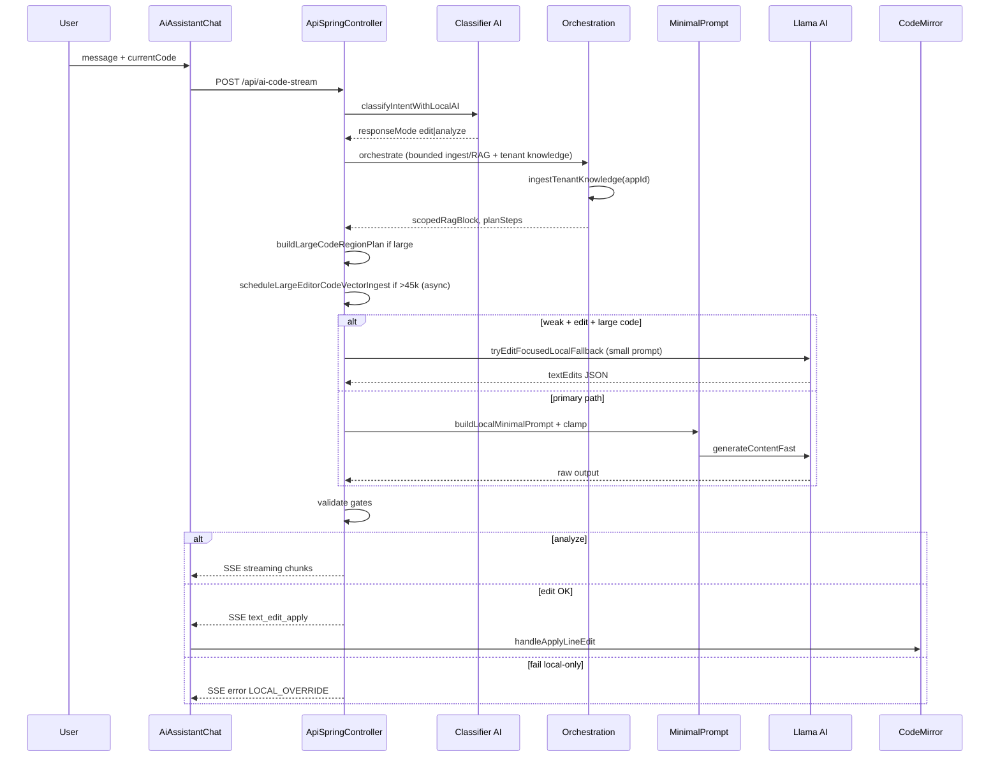

---

# PHẦN N — GHI CHÚ CHO CURSOR KHI CODE

1. **Minimize diff** — sửa đúng chỗ trong file lớn (`ApiSpringController` ~34k lines); không refactor toàn file.
2. **Match conventions** — naming, logging style, `@Value` config keys như codebase hiện tại.
3. **Không thêm test** trừ khi user yêu cầu; compile là đủ cho pass cơ bản.
4. **Không commit** trừ khi user yêu cầu — khi user yêu cầu đồng bộ git, làm theo **PHẦN P**.
5. **Comments** — chỉ cho logic không hiển nhiên (lifecycle symbol boost, weak edit light path, ACL bind).
6. Document thay đổi ngắn trong PR description nếu user tạo PR sau.
7. **Domain rules sync:** sửa UX system admin → cập nhật cả frontend (E.4) và `buildDomainRulesMarkdown()` (F.12).

---

# PHẦN Q — MODEL STACK: ẢNH / VIDEO / CODE / LUCENE VECTOR (5GB & 2 CPU)

> **Câu trả lời ngắn:** Không có **một** model nhỏ làm tốt mọi thứ cùng lúc trên 5GB RAM. CSM dùng **3 vai trò tách biệt** — chỉ load đúng lúc cần — và **nạp tri thức vào Lucene**, không nhét hết vào prompt worker.

## Q.1 Kiến trúc 3 model (Cursor-aligned)

```
┌─────────────────────────────────────────────────────────────────────────┐
│ VAI TRÒ 1 — REASONING / CODE WORKER (luôn trong JVM, llama.cpp JNI)     │
│ Model: Qwen2.5-Coder-1.5B-Instruct Q4_K_M                               │
│ File:  backend/csm_datas/ai_local/model/qwen2.5-coder-1.5b-...gguf      │
│ RAM:   ~1.0–1.6 GB khi infer | Threads: 1 trên weak-5gb                 │
│ Việc:  classify (64 tok), analyze prose, edit JSON textEdits            │
│ Ngôn ngữ: JS/TS, Java, Python, SQL, JSON menu, vi/en/zh prompt          │
└─────────────────────────────────────────────────────────────────────────┘
                                    ▲
                                    │ top-K [RETRIEVED_CONTEXT]
┌───────────────────────────────────┴─────────────────────────────────────┐
│ LUCENE KNN + RocksDB (AiBusinessMemoryVectorService)                    │
│ · Code/menu/tenant/org chunks (async ingest)                            │
│ · dyn_ctx_* từ multimodal scanner (ảnh/JSON → markdown technical)       │
│ · Embed weak-5gb: hash 128D | strong: nomic-embed Q4 (~84MB file)       │
└───────────────────────────────────▲─────────────────────────────────────┘
                                    │
┌───────────────────────────────────┴─────────────────────────────────────┐
│ VAI TRÒ 2 — EMBEDDING (optional, không load cùng vision trên 5GB)       │
│ weak-5gb: hash 128D (mặc định, 0 model file)                             │
│ strong:   nomic-embed-text-v1.5 Q4_K_M (~84MB, ~200–400MB RAM)          │
│ Việc:     vector hóa chunk trước khi index Lucene KNN                   │
└─────────────────────────────────────────────────────────────────────────┘

┌─────────────────────────────────────────────────────────────────────────┐
│ VAI TRÒ 3 — VISION / VIDEO (sidecar riêng, ON-DEMAND — không trong JVM) │
│ weak-5gb: SmolVLM2-256M-Video Q8_0 + mmproj (~280MB disk, ~400–700MB RAM)│
│ strong:   SmolVLM2-500M-Video hoặc Qwen2-VL-2B Q4_K_M                   │
│ Process:  llama-server :8090 (Java gọi /v1/chat/completions trực tiếp) │
│ Việc:     ảnh UI/diagram → mô tả kỹ thuật → ingest Lucene → worker RAG  │
│ Video:    extract frame (ffmpeg) → vision từng frame → merge → Lucene   │
└─────────────────────────────────────────────────────────────────────────┘
```

**Nguyên tắc RAM 5GB (tổng ~5GB máy, heap JVM 1.5GB):**

| Thành phần | Cùng lúc được phép? |
|------------|---------------------|
| Spring Boot + Qwen2.5-Coder-1.5B | ✅ Luôn (worker chính) |
| + hash embedding | ✅ (không load thêm GGUF) |
| + nomic embed | ⚠️ Chỉ khi **tắt** vision sidecar |
| + SmolVLM2-256M sidecar | ✅ Khi cần ảnh/video — **unload** sau scan |
| + Qwen2.5-VL-3B (đã có trên disk) | ❌ **Không** chạy cùng coder trên 5GB |

## Q.2 Bảng model khuyến nghị

| Vai trò | Model | Quant | Disk | RAM infer | 5GB | Strong | Ghi chú |
|---------|-------|-------|------|-----------|-----|--------|---------|
| **Code worker** | Qwen2.5-Coder-1.5B-Instruct | Q4_K_M | ~986MB | ~1.0–1.6GB | ✅ **default** | ✅ | Đa ngôn ngữ lập trình tốt ở size 1.5B |
| Code ultra-light | Qwen2.5-Coder-0.5B-Instruct | Q4_K_M | ~491MB | ~0.5–0.9GB | ✅ fallback | — | Khi 1.5B OOM hoặc classify-only |
| **Embedding** | hash fallback | — | 0 | ~0 | ✅ **default weak** | — | Lucene KNN 128D, không mismatch dim |
| Embedding quality | nomic-embed-text-v1.5 | Q4_K_M | ~84MB | ~0.2–0.4GB | ⚠️ tắt vision trước | ✅ **default strong** | Vi + code retrieval tốt hơn hash |
| **Vision ảnh+video** | SmolVLM2-256M-Video-Instruct | Q8_0 + mmproj | ~279MB | ~0.4–0.7GB | ✅ **khuyến nghị** | ✅ | llama.cpp mtmd, video frame native |
| Vision chất lượng hơn | SmolVLM2-500M-Video-Instruct | Q8_0 + mmproj | ~546MB | ~0.7–1.0GB | ⚠️ | ✅ | OCR/layout tốt hơn 256M |
| Vision OCR mạnh | Qwen2-VL-2B-Instruct | Q4_K_M | ~986MB | ~1.2–2.0GB | ❌ | ✅ | Sidecar only, không cùng 1.5B trên 5GB |
| Vision (có sẵn, nặng) | Qwen2.5-VL-3B-Instruct | Q4_K_M | ~1.9GB | ~2.5–3.5GB | ❌ | ⚠️ | Chỉ máy ≥16GB, **không** profile local-5gb |

**Không khuyến nghị trên 5GB:** moondream2-20250414 f16 (~3.7GB), Qwen2.5-VL-7B+, Gemma-3-4B vision.

## Q.3 Thư mục model (bắt buộc)

Tất cả GGUF đặt tại (đường dẫn tương đối từ `backend/`):

```txt
backend/csm_datas/ai_local/model/
├── qwen2.5-coder-1.5b-instruct-q4_k_m.gguf          # TEXT LLM worker (required) — code + SEO + guest chat
├── nomic-embed-text-v1.5.Q4_K_M.gguf                  # embedding RAG (required, tách khỏi chat)
├── Qwen2.5-VL-3B-Instruct-Q4_K_M.gguf                 # vision OCR — KHÔNG dùng SEO/chat text
├── SmolVLM2-256M-Video-Instruct-Q8_0.gguf             # vision weak
├── mmproj-SmolVLM2-256M-Video-Instruct-Q8_0.gguf
```

**Không có trong bundle (KHÔNG tải thêm):** qwen2.5-coder-0.5b, Qwen2.5-7B-Instruct, model cloud API.
```

`AiLocalOpsController` (`GET /api/ai-local/models`) quét thư mục này và gợi ý theo RAM budget.

## Q.4 Tải model

```bash
cd /path/to/csm_server
chmod +x scripts/download-ai-local-models.sh scripts/start-ai-local-vision.sh

# Server yếu 5GB — worker 1.5B + vision 256M video
./scripts/download-ai-local-models.sh 5gb

# Máy dev mạnh — thêm nomic + Qwen2-VL-2B
./scripts/download-ai-local-models.sh strong

# Chỉ vision weak
./scripts/download-ai-local-models.sh vision-weak

# Xem file đã có
./scripts/download-ai-local-models.sh list
```

Cần `curl` hoặc `pip install huggingface_hub` (`huggingface-cli`).

## Q.5 Chạy vision sidecar (ảnh / video frame)

**Bước 1 — Cài llama.cpp** (macOS): `brew install llama.cpp`

**Bước 2 — Start sidecar** (terminal riêng, **không** trong Spring Boot):

```bash
./scripts/start-ai-local-vision.sh          # SmolVLM2-256M (weak)
./scripts/start-ai-local-vision.sh 500m     # SmolVLM2-500M (strong)
```

**Bước 3 — Bật trong `config.env`:**

```bash
AI_ORCHESTRATION_MULTIMODAL_VISION_ENABLED=true
AI_ORCHESTRATION_MULTIMODAL_VISION_ENDPOINT=http://127.0.0.1:8090/v1/chat/completions
AI_ORCHESTRATION_MULTIMODAL_VISION_TIMEOUT_MS=12000
```

**Bước 4 — Restart backend**, verify:

```bash
curl -s http://127.0.0.1:8090/health
curl -s http://127.0.0.1:15300/api/ai-local/health | jq .vision
```

## Q.6 Luồng tích hợp ảnh/video → Lucene → worker local

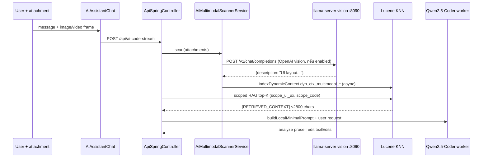

**Video (5GB):** chưa có native video attachment trong scanner — pipeline khuyến nghị:

1. Client hoặc script extract **≤8 keyframes** (`ffmpeg -i clip.mp4 -vf fps=1/5 frame_%03d.jpg`)
2. Gửi từng frame như `attachments[].kind=image` **hoặc** batch qua `/api/ai-local/scan-dry-run`
3. Vision sidecar mô tả từng frame → merge markdown → `AiScopedContextIngestionService` → Lucene
4. Worker chỉ nhận **tóm tắt đã index**, không nhận raw video

**SmolVLM2-*-Video** hỗ trợ clip ngắn qua `llama-mtmd-cli` trực tiếp (roadmap tích hợp Java).

## Q.7 Config theo profile

### weak-5gb (`config.local-5gb.env`)

```bash
# Worker — giữ nguyên
AI_LOCAL_LLAMA_MODEL_PATH=./csm_datas/ai_local/model/qwen2.5-coder-1.5b-instruct-q4_k_m.gguf
AI_LOCAL_LLAMA_THREADS=1

# Embedding — hash (không load thêm model)
AI_EMBEDDING_PROVIDER=hash
AI_EMBEDDING_LLAMA_ENABLED=false

# Vision — sidecar, tắt mặc định; bật khi chạy start-ai-local-vision.sh
AI_ORCHESTRATION_MULTIMODAL_VISION_ENABLED=false
AI_ORCHESTRATION_MULTIMODAL_VISION_ENDPOINT=http://127.0.0.1:8090/v1/chat/completions
AI_ORCHESTRATION_MULTIMODAL_LOCAL_ONLY_REQUIRE_VISION=false
```

### strong (`config.local-strong.env`)

```bash
AI_LOCAL_LLAMA_MODEL_PATH=./csm_datas/ai_local/model/qwen2.5-coder-1.5b-instruct-q4_k_m.gguf
AI_EMBEDDING_PROVIDER=llama_cpp_embedding
AI_EMBEDDING_LLAMA_ENABLED=true
AI_LOCAL_LLAMA_EMBEDDING_MODEL_PATH=./csm_datas/ai_local/model/nomic-embed-text-v1.5.Q4_K_M.gguf
AI_ORCHESTRATION_MULTIMODAL_VISION_ENABLED=true
AI_ORCHESTRATION_MULTIMODAL_VISION_ENDPOINT=http://127.0.0.1:8090/v1/chat/completions
```

## Q.8 Đa ngôn ngữ lập trình — kỳ vọng thực tế

| Model | JS/TS DynamicCode | Java/Spring | Python/SQL | Menu JSON vi/en/zh | Ảnh UI |
|-------|-------------------|-------------|------------|-------------------|--------|
| Qwen2.5-Coder-1.5B | ✅ tốt (contract textEdits) | ✅ khá | ✅ khá | ✅ (menu master) | ❌ không nhìn ảnh |
| SmolVLM2-256M | ❌ | ❌ | ❌ | ❌ | ✅ mô tả layout/OCR cơ bản |
| Lucene + hash/nomic | ✅ retrieval symbol | ✅ tenant/docs | ✅ | ✅ org rules | ✅ caption đã ingest |

**Phối hợp:** Vision mô tả ảnh → Lucene; Coder + RAG sửa code/menu theo mô tả — **không** ép một model làm cả hai.

## Q.9 API ops liên quan

| Endpoint | Mục đích |
|----------|----------|
| `GET /api/ai-local/models` | Liệt kê GGUF trên disk + gợi ý theo RAM |
| `GET /api/ai-local/models/recommendations?ramBudgetGb=2&includeVision=true` | Gợi ý weak machine |
| `GET /api/ai-local/health` | `vision.localVisionReady` |
| `POST /api/ai-local/scan-dry-run` | Test multimodal scanner không ghi Lucene |

## Q.10 Checklist nghiệm thu multimodal (5GB)

| # | Test | Pass |
|---|------|------|
| 1 | `./scripts/download-ai-local-models.sh 5gb` — đủ coder + SmolVLM256 | ✓ |
| 2 | `./scripts/start-ai-local-vision.sh` + curl health | ✓ |
| 3 | Chat kèm screenshot UI → log `Vision:` trong scanner | ✓ |
| 4 | Lucene ingest `dyn_ctx_*` scope_ui_ux | ✓ |
| 5 | Worker vẫn dùng Qwen2.5-Coder-1.5B, prompt ≤18k weak edit | ✓ |
| 6 | Không load Qwen2.5-VL-3B cùng lúc worker trên 5GB | ✓ |

## Q.11 CẤM trên máy 5GB

```txt
✗ Dùng Qwen2.5-VL-3B làm worker chat trong JVM (OOM / treo 5 phút)
✗ Bật nomic embed + vision sidecar + preload coder cùng lúc không giám sát RAM
✗ Feed ảnh base64 trực tiếp vào prompt Qwen2.5-Coder (model không multimodal)
✗ Kỳ vọng model 1.5B sửa file 371k không chọn vùng code
```

---

# PHẦN R — KNOWLEDGE MASTERY: HỌC PHONG CÁCH & CHÉP SANG MÁY KHÁC

> **Mục tiêu:** AI local **hiểu cách bạn làm hệ thống**, bám pattern/algorithm/code length theo thời gian, **thông minh dần mỗi ngày** — và khi chuyển máy **không học lại từ đầu** nhờ Knowledge Pack portable.

## R.1 Nguyên lý (model nhỏ ≠ não lớn)

Model 1.5B **không thể** “nhớ hết repo” trong weights. CSM dùng **bộ nhớ bên ngoài model**:

```txt
TRÍ NHỚ DÀI HẠN  = Lucene KNN + RocksDB + JSONL learning  (copy được)
TRÍ NHỚ PHIÊN    = conversation history + dyn_ctx_*         (session)
PROMPT MỖI LẦN   = top-K slice + region plan               (≤18k weak)
MODEL WEIGHTS    = Qwen2.5-Coder 1.5B                      (cố định, không “học”)
```

**“Học như bạn code”** = index đủ **patterns + quyết định + patch thành công** → RAG đưa vào worker → output giống phong cách bạn hơn theo ngày.

## R.2 Bốn lớp tri thức (4-Layer Memory)

| Lớp | Tên | Service / storage | Nội dung | Portable? |
|-----|-----|-------------------|----------|-----------|
| **L1** | Workspace DNA | `LocalAiAssistantContextService` → `ai_local_assistant_index/` | Toàn bộ source roots: Java, TS, DynamicCode patterns, structural summary per chunk | ✅ Pack |
| **L2** | Business memory | `AiBusinessMemoryVectorService` → `ai_business_memory/{appId}/` | Code editor async chunks, multimodal ingest, menu, tenant org | ✅ Pack |
| **L3** | Domain rules | `AiTenantKnowledgeIngestionService` | `csm_roles`, `csm_depts`, `csm_branches` + markdown rules | ✅ Pack (re-ingest 60s debounce) |
| **L4 menu** | Daily menu learning | `AiMenuLearningMemoryService` → `ai_menu_learning_{appId}.jsonl` | Menu patch/generation thành công, critical rules extracted | ✅ Pack |
| **L4 code** | Daily code learning | `AiCodeLearningMemoryService` → `ai_code_learning_{appId}.jsonl` | Code edit thành công (patch/agentic step), symbols + surgical rules | ✅ Pack |
| **L0** | Author Style DNA | `author_style_dna.md` | **Bạn viết tay** — triết lý, naming, anti-patterns, bảng quyết định theo ngày | ✅ Pack |

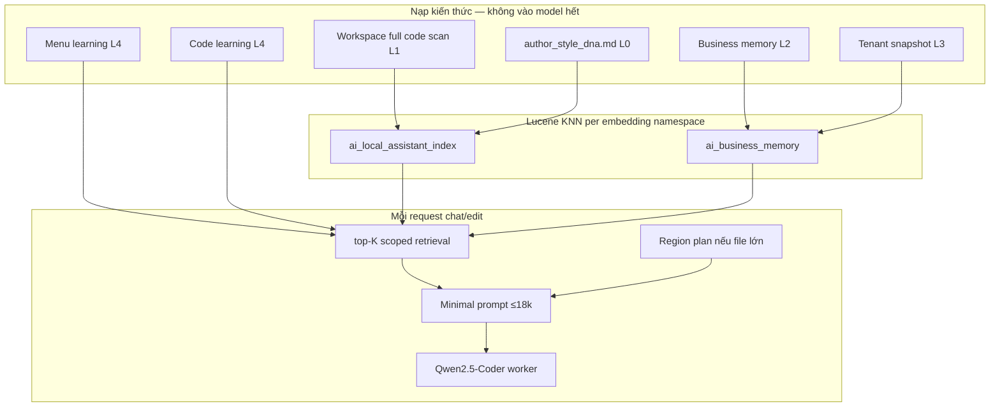

## R.3 Workspace scan — “quét hết hệ thống”

**Source roots** (config `ai.local.assistant.source-roots`):

```properties
frontend-admin/src,backend/src/main/java,backend/csm_datas/ai_local,lmkt/src
```

| Profile | Startup index | Full code scan |
|---------|---------------|----------------|
| **weak-5gb** | markdown only (`startup-index-only-markdown=true`) | Chạy **một lần trên máy mạnh** → export pack |
| **strong** | có thể full code | `POST .../knowledge/rebuild-workspace?fullCode=true` |

**Mỗi chunk index kèm structural summary** (symbols, imports, menu table_name, permission hints) — đây là “DNA kỹ thuật” AI dùng để bám pattern.

**Chunk strategy:**

| File type | Cách chunk |
|-----------|------------|
| Java | Theo member boundary (`AiBusinessMemoryVectorService`) |
| JS/TS/DynamicCode | Theo declaration |
| Markdown | Theo section / heading |
| Menu JSON | Theo node |

## R.4 Author Style DNA — bạn dạy AI “phong cách tôi”

File: `backend/csm_datas/ai_local/author_style_dna.md`

**Cursor / bạn cập nhật hàng tuần:**

- Triết lý thiết kế (surgical edit, không bulk delete)
- Bảng naming conventions
- Anti-patterns CẤM
- Bảng **Quyết định theo ngày** (algorithm tweak, rút gọn code)

Sau khi sửa → rebuild index hoặc export pack mới.

## R.5 Vòng học hằng ngày (Daily Learning Loop)

```txt
Sáng / deploy
  └─ ingestTenantKnowledge(appId)     [debounce 60s — org snapshot]

Mỗi chat request
  └─ orchestrateResilient
       ├─ scoped RAG (L1+L2+L3)
       ├─ menu learning block (L4 menu) nếu menu intent
       ├─ code learning block (L4 code) nếu code edit intent
       └─ region plan nếu code lớn

Sau menu edit THÀNH CÔNG
  └─ AiMenuLearningMemoryService.recordSuccessfulMenuGeneration(appId, request, resultJson)
       → ai_menu_learning_{appId}.jsonl

Sau code edit THÀNH CÔNG (ai-code-stream, responseMode=edit)
  └─ AiCodeLearningMemoryService.recordSuccessfulCodeEdit(...)
       → ai_code_learning_{appId}.jsonl — patch summary, symbols touched, surgical rules
       (menu_json chỉ ghi khi có patchOpCount > 0 — full menu regen dùng menu learning)

Cuối tuần (máy mạnh)
  └─ cập nhật author_style_dna.md
  └─ rebuild-workspace?fullCode=true
  └─ csm-knowledge-pack.sh export
  └─ copy .tar.gz sang server yếu
```

**Model không fine-tune** — “thông minh lên” = **retrieval tốt hơn + style DNA đầy đủ hơn + learning entries mới**.

## R.6 Portable Knowledge Pack — chép sang máy khác

Script: `scripts/csm-knowledge-pack.sh`

### Quy trình A — Tạo pack (máy MẠNH, một lần/tuần)

```bash
# 1. Backend đang chạy (strong profile, nomic embed OK)
cd backend && set -a && source ../config.local-strong.env && set +a && mvn spring-boot:run

# 2. Terminal khác — quét FULL codebase vào Lucene
chmod +x ../scripts/csm-knowledge-pack.sh
../scripts/csm-knowledge-pack.sh rebuild --full-code

# 3. Export
../scripts/csm-knowledge-pack.sh export ../csm-knowledge-pack-$(date +%Y%m%d).tar.gz

# 4. Verify
../scripts/csm-knowledge-pack.sh verify ../csm-knowledge-pack-*.tar.gz
```

### Quy trình B — Nhập pack (máy YẾU 5GB)

```bash
# 1. Dừng backend
# 2. Import (không re-embed — copy Lucene nguyên xi)
./scripts/csm-knowledge-pack.sh import ./csm-knowledge-pack-20260526.tar.gz

# 3. config.local-5gb.env — GIỮ hash embedding nếu manifest dim=128
AI_EMBEDDING_PROVIDER=hash
AI_EMBEDDING_HASH_DIMENSIONS=128

# 4. Restart
./run-server.sh

# 5. Verify
./scripts/csm-knowledge-pack.sh status
```

**Pack gồm:**

```txt
manifest.json                    # embeddingDimensions, provider, createdAt
csm_datas/ai_local/
  ai_business_memory/            # Lucene per appId
  ai_local_assistant_index/      # workspace DNA
  ai_menu_learning_*.jsonl       # daily menu learning
  ai_code_learning_*.jsonl       # daily code edit learning
  author_style_dna.md
  ai_*_master_prompt.md
  ai-assistant-instructions.md
```

**Quan trọng:** `embeddingDimensions` trong manifest phải khớp target:

| Pack dim | Target config |
|----------|---------------|
| 128 (hash) | `AI_EMBEDDING_PROVIDER=hash` — **mặc định weak-5gb** |
| 768 (nomic) | `AI_EMBEDDING_PROVIDER=llama_cpp_embedding` + nomic GGUF — strong only |

## R.7 API Knowledge Ops

| Method | Endpoint | Mục đích |
|--------|----------|----------|
| GET | `/api/ai-local/knowledge/status` | doc count, embedding dim, paths |
| POST | `/api/ai-local/knowledge/rebuild-workspace?fullCode=true` | Quét full code → Lucene L1 |
| POST | `/api/ai-local/knowledge/ingest-tenant?appId=csm` | Snapshot org L3 |

## R.8 Làm sao AI “bám sát phong cách” khi sửa code?

**Thứ tự ưu tiên retrieval khi user hỏi/sửa:**

1. `author_style_dna.md` chunks (L0) — triết lý + anti-patterns
2. Symbol excerpts từ message (lifecycle, fnResetIP, …)
3. Workspace L1 — file/class cùng pattern gần nhất
4. Business memory L2 — DynamicCode chunks đã ingest async
5. Menu learning L4 — nếu menu intent
6. Code learning L4 — nếu code edit intent (Java/TS/DynamicCode)

**Prompt worker chỉ nhận top-K** — không full repo. Model 1.5B **bám style** nhờ:

- Structural summary trong index (“vueLikeComponent”, “securitySensitiveLogic”)
- Learning entries (“Preserve nested children”, “m_icon Ant Design”)
- Style DNA (“surgical edit”, “no bulk delete”)

## R.9 Tối ưu algorithm / độ dài code theo ngày

| Hành động của bạn | AI học qua |
|-------------------|------------|
| Sửa `author_style_dna.md` mục “Quyết định theo ngày” | L0 RAG |
| Accept menu patch trong UI | L4 menu jsonl |
| Accept code patch / agentic step trong ai-code-stream | L4 code jsonl |
| Chat thành công + conversation history | Session context |
| Refactor lớn trong repo | L1 rebuild weekly → export pack |

**Code learning jsonl (v3.20 — đã implement):**

- Sau `text_edit_apply` / `agenticStepAcceptedCount > 0` trong ai-code-stream (`responseMode=edit`)
- Ghi `{request, contextType, targetFile, patchOpCount, summary, symbols}` vào `ai_code_learning_{appId}.jsonl`
- Pattern Lucene KNN giống `AiMenuLearningMemoryService`
- Retrieve qua `LocalAiAssistantContextService.buildCompressedContextBlocks()` + contract prepend FRONTEND_CODE

## R.10 Config khuyến nghị

### Máy mạnh (build pack)

```bash
AI_LOCAL_ASSISTANT_STARTUP_INDEX_ONLY_MARKDOWN=false
AI_LOCAL_ASSISTANT_REBUILD_ON_STARTUP=true
AI_EMBEDDING_PROVIDER=llama_cpp_embedding
AI_LOCAL_LLAMA_EMBEDDING_MODEL_PATH=./csm_datas/ai_local/model/nomic-embed-text-v1.5.Q4_K_M.gguf
```

### Máy yếu (consume pack)

```bash
AI_LOCAL_ASSISTANT_STARTUP_INDEX_ONLY_MARKDOWN=true   # không quét lại full — dùng pack
AI_EMBEDDING_PROVIDER=hash
AI_EMBEDDING_HASH_DIMENSIONS=128
# Pack built with hash dim=128 → import trực tiếp
```

**Nếu pack build bằng nomic (768D) mà target dùng hash (128D):** phải **rebuild pack trên strong với hash** hoặc re-index trên strong trước export — **không trộn dimension**.

## R.11 Checklist Knowledge Mastery

| # | Việc | Pass |
|---|------|------|
| 1 | `author_style_dna.md` có nội dung phong cách thật của bạn | ✓ |
| 2 | `rebuild-workspace?fullCode=true` → documentCount > 0 | ✓ |
| 3 | Chat “combo group_id duplicate” → RAG mention role_code dedupe | ✓ |
| 4 | Export pack → import máy khác → cùng câu trả lời RAG | ✓ |
| 5 | Menu edit success → `ai_menu_learning_csm.jsonl` tăng dòng | ✓ |
| 6 | Code edit success → `ai_code_learning_csm.jsonl` tăng dòng | ✓ |
| 7 | Weak 5GB không chạy full scan mỗi startup | ✓ |

## R.12 CẤM

```txt
✗ Kỳ vọng fine-tune Qwen 1.5B hàng ngày trên 5GB
✗ Copy pack nomic-768 sang máy hash-128 mà không rebuild
✗ Bỏ qua author_style_dna.md — đây là ADN phong cách duy nhất do bạn kiểm soát
✗ Full sync ingest 371k mỗi request thay vì async + pack
✗ Feed toàn bộ repo vào prompt vì “cho AI hiểu hết”
✗ Nhầm “học mỗi ngày” = weights thay đổi — CSM học qua RAG + JSONL + session
```

## R.13 Memory Maturity Scorecard — AI agent đã “đủ thông minh” chưa?

> **Câu trả lời ngắn (2026-05-26):** Kiến trúc memory **đạt mức production cho local 1.5B/5GB** (~**82/100** sau v3.20). AI **cải thiện theo ngày** qua retrieval + learning entries — **không** qua fine-tune weights. Chưa đạt cloud-grade reasoning hay self-eval loop tự động.

### R.13.1 Bảng chấm điểm

| Thành phần | Service / artifact | Điểm | Ghi chú |
|------------|-------------------|------|---------|
| **L0 Author DNA** | `author_style_dna.md` | 70/100 | Phụ thuộc bạn cập nhật tay — không tự sinh |
| **L1 Workspace RAG** | `LocalAiAssistantContextService` | 85/100 | Weak 5GB: markdown-only startup; full DNA qua pack |
| **L2 Business memory** | `AiBusinessMemoryVectorService` | 88/100 | Async ingest + scoped bitmask |
| **L3 Tenant org** | `AiTenantKnowledgeIngestionService` | 80/100 | Debounce 60s; cần re-ingest sau đổi org |
| **L4 Menu learning** | `AiMenuLearningMemoryService` | 90/100 | Lucene KNN per request; dedupe digest |
| **L4 Code learning** | `AiCodeLearningMemoryService` | 85/100 | **v3.20** — ghi sau edit thành công |
| **Session continuity** | `AiConversationContextService` | 75/100 | 3 scope; weak profile cap 0–900 chars/turn |
| **Memory trust gate** | `AiAgentHarnessTraceService` | 80/100 | `trustScore ≥ 55` → trusted; UI hiển thị |
| **Flow-aware context** | `AiLocalFlowContextPolicy` | 88/100 | Analyze ≠ Edit — RAG top-k/chars khác nhau |
| **O→R→A routing** | `classifyIntentWithLocalAI` + SSE `intent_reasoning` | 85/100 | Model-driven; không keyword cứng |
| **Daily auto-eval** | — | 40/100 | **Gap** — chưa có regression harness tự chạy |

**Tổng hợp:** ~**82/100** — đủ cho agent local surgical edit + menu greenfield có scaffold Java; chưa “tự học trong weights”.

### R.13.2 “Học mỗi ngày” nghĩa là gì trong CSM?

```txt
CÓ (tự động):
  • Mỗi menu edit OK     → +1 entry ai_menu_learning_*.jsonl
  • Mỗi code edit OK     → +1 entry ai_code_learning_*.jsonl
  • Mỗi chat turn        → session history (user/app_shared/code_target)
  • Tenant/org thay đổi  → L3 re-ingest (debounced)
  • Request tiếp theo    → top-K retrieval ưu tiên entry mới + score cao

KHÔNG (by design):
  • Fine-tune Qwen 1.5B nightly
  • Model “nhớ” repo trong weights
  • Tự sửa author_style_dna.md không qua bạn
```

**Thông minh lên theo thời gian** khi: (1) bạn accept nhiều patch đúng → JSONL dày hơn; (2) pack workspace đầy đủ; (3) `author_style_dna.md` phản ánh quyết định mới.

### R.13.3 Sơ đồ memory đầy đủ (4 layer + session)

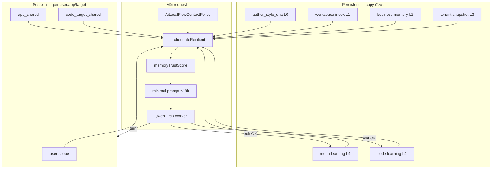

### R.13.4 Flow context + RAM (v3.19–3.20)

| Flow preset | RAG | Top-K | Max chars | Ghi chú |
|-------------|-----|-------|-----------|---------|
| `ANALYZE_MENU` | scoped, nhẹ | thấp | ~8k | `[MENU_BUSINESS_SCAN]` digest; không patch |
| `EDIT_MENU` | full scoped | cao | ~18k | menu learning L4 |
| `ANALYZE_CODE` | scoped | thấp | ~10k | sliding window analyze |
| `EDIT_CODE` | full + code L4 | cao | ~18k | import-follow + code learning |
| `QUICK` | tắt/giảm | 0–2 | ~4k | câu hỏi ngắn |

**Context window auto-fit** (`ai.local.llama.context-window-auto-fit=true`): KV cache sized từ prompt budget + max_tokens — tránh over-provision RAM trên 5GB.

### R.13.5 Config memory v3.20

```properties
ai.menu.learning.enabled=true
ai.code.learning.enabled=true
ai.code.learning.max-entries-per-app=240
ai.code.learning.retrieve-max-items=4
ai.code.learning.retrieve-max-chars=10000
ai.local.llama.context-window-auto-fit=true
ai.local.routing.model-driven.enabled=true
```

### R.13.6 Checklist “memory đủ thông minh”

| # | Kiểm tra | Pass |
|---|----------|------|
| 1 | `GET /api/ai-local/knowledge/status` → `menuLearningFiles` + `codeLearningFiles` | ✓ |
| 2 | Menu edit → dòng mới trong `ai_menu_learning_{appId}.jsonl` | ✓ |
| 3 | Code edit (agentic/patch) → dòng mới trong `ai_code_learning_{appId}.jsonl` | ✓ |
| 4 | Request edit code tương tự → prompt có `AUTO-LEARNED CODE FIXES` | ✓ |
| 5 | SSE `agent_harness_trace` → `memoryTrust.trustScore` ≥ 55 khi RAG đủ | ✓ |
| 6 | Analyze menu → không apply patch; có `intent_reasoning` | ✓ |
| 7 | Export pack → import máy khác → cùng learning files | ✓ |

### R.13.7 Roadmap memory (gap còn lại)

| Gap | Ưu tiên | Hướng |
|-----|---------|-------|
| Automated daily eval/regression | P1 | Harness chạy 10 câu golden → so score |
| Session budget weak profile quá thấp | P2 | Tăng cap có điều kiện khi trust cao |
| L0 auto-suggest từ accepted patches | P3 | Draft PR vào `author_style_dna.md` — human approve |
| Fine-tune local | — | **Cấm** trên 5GB — dùng pack |

---

# PHẦN O — TÀI LIỆU LIÊN QUAN TRONG REPO

| File | Mục đích |
|------|----------|
| `CSM_AI_LOCAL_CURSOR_MASTER_BRIEF.md` | **File này** — spec + checklist triển khai (duy nhất ở root) |
| `scripts/download-ai-local-models.sh` | Tải GGUF theo profile 5gb/strong |
| `scripts/start-ai-local-vision.sh` | Sidecar SmolVLM2 llama-server :8090 |
| `scripts/csm-knowledge-pack.sh` | Export/import Lucene + learning portable |
| `backend/csm_datas/ai_local/author_style_dna.md` | ADN phong cách — cập nhật hàng tuần |
| `backend/csm_datas/ai_local/ai_code_master_prompt.md` | Contract runtime code edit (load theo intent) |
| `backend/csm_datas/ai_local/ai_menu_master_prompt.md` | Contract runtime menu edit |
| `backend/csm_datas/ai_local/ai-assistant-instructions.md` | Policy runtime (không nhét full vào prompt) |
| `backend/src/main/resources/application-local-5gb.properties` | Profile máy 5 GB |
| `backend/src/main/resources/application.properties` | Defaults incl. tenant-snapshot + auth filter |

> Các file `CSM_AI_LOCAL_*.md` khác ở root (nếu còn) là **draft cũ** — không dùng làm spec; merge nội dung vào file này rồi xóa hoặc bỏ qua.

---

# PHẦN P — GIT ĐỒNG BỘ (CHO CURSOR / DEV)

## P.1 Trạng thái commit (2026-05-23)

| Nhóm thay đổi | Commit | Ghi chú |
|---------------|--------|---------|
| System admin UX, combo dedupe, data_app_ids, role_code | `cba701ed` | Đã trên `origin/main` |
| Phase 2 tenant RAG (3 class mới + 4 file sửa + brief v2.0) | `e45eae92` | Đã trên `origin/main` |

## P.2 Commit Phase 2 (khi user yêu cầu)

```bash
cd /Volumes/Datas/CSM/JavaProjects/csm_server

# Verify compile
cd backend && mvn compile -DskipTests && cd ..

git add \
  CSM_AI_LOCAL_CURSOR_MASTER_BRIEF.md \
  backend/src/main/java/net/phanmemmottrieu/service/AiRetrievalAuthContext.java \
  backend/src/main/java/net/phanmemmottrieu/service/AiRetrievalAuthContextResolver.java \
  backend/src/main/java/net/phanmemmottrieu/service/AiTenantKnowledgeIngestionService.java \
  backend/src/main/java/net/phanmemmottrieu/service/AiBusinessMemoryVectorService.java \
  backend/src/main/java/net/phanmemmottrieu/service/AiLocalOrchestrationService.java \
  backend/src/main/java/net/phanmemmottrieu/controller/ApiSpringController.java \
  backend/src/main/resources/application.properties

git commit -m "$(cat <<'EOF'
feat: tenant org RAG snapshot and ACL-filtered retrieval for local AI

Index csm_roles/depts/branches plus domain rules into Lucene; filter retrieval
by auth context so orchestration answers org/permission questions accurately.
EOF
)"

git push origin main   # chỉ khi user yêu cầu push
```

## P.3 Quy tắc cho AI agent

1. **Luôn đọc file này trước** khi sửa AI local hoặc system admin domain.
2. **Cập nhật changelog + PHẦN L** khi hoàn thành mục mới.
3. **Không commit** trừ khi user nói rõ "commit", "push", "đồng bộ git".
4. Sau commit Phase 2 → sửa bảng P.1 (đánh dấu đã commit, ghi hash).
5. Draft MD ở root (`CSM_AI_LOCAL_*.md` khác) — merge vào đây, không tạo spec song song.

## P.4 Verify sau deploy / restart

```bash
# Backend log khi chat AI lần đầu mỗi appId (trong 60s):
# Tenant knowledge indexed appId=csm orgChunks=N ruleChunks=M

# Frontend system admin:
# - Sub-user group_id: không duplicate options
# - Thêm nhóm quyền: role_code tự sinh từ role_name
# - Đổi branch: dept combo filter + clear dept_id
```

---

# PHẦN S — EDIT TASK PLANNER (CURSOR / COPILOT WORKFLOW)

> **Mục tiêu:** AI local vận hành giống GitHub Copilot / Cursor: **hiểu yêu cầu user → xác định chính xác vùng code (dòng/khối) → chia nhỏ → thực hiện từng phần → validate → apply CodeMirror**.

## S.1 Điểm chung Copilot / Cursor mà CSM phải có

| Bước Copilot/Cursor | CSM tương đương | Service / SSE |
|---------------------|-----------------|---------------|
| Hiểu intent (sửa / giải thích / thêm menu) | Classifier AI#1 + `responseMode` | `classifyIntentWithLocalAI` |
| Xác định file/vùng liên quan | **Edit Task Planner** — symbol + dòng | `AiEditTaskPlannerService.plan()` |
| Index/RAG không đọc hết repo | Lucene top-K + scoped `dyn_ctx_*` | `AiBusinessMemoryVectorService` |
| Prompt nhỏ, đúng vùng | Region plan / planner condensed | `buildCondensedContextFromPlan` |
| Edit từng phần | **Multi-slice execution** | `tryMultiSliceEditFromPlan` |
| Patch an toàn | AST gate + dry-run | `editsPassCodeAstGateFromEdits` |
| Apply editor | `textEdits` → CodeMirror | `text_edit_apply` SSE |

**Khác biệt quan trọng:** Cursor sửa **file trên disk**; CSM sửa **code string trong CodeMirror** (DynamicCode ~371k). Không có path file → mọi patch dùng **số dòng 1-based trên full `currentCode`**. Xem **PHẦN V** cho hợp đồng đầy đủ.

## S.2 Luồng 6 bước (bắt buộc hiểu)

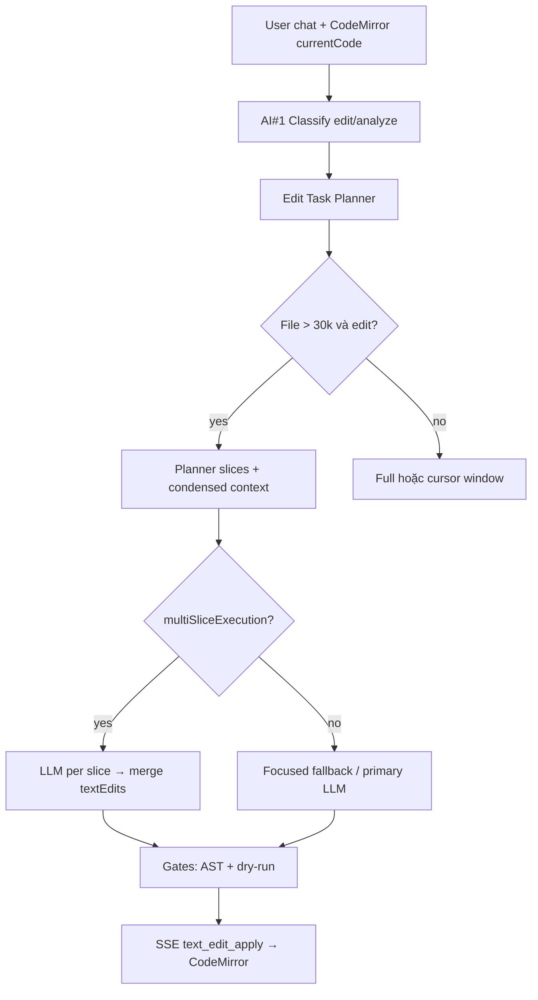

### Bước 1 — Thu thập ngữ cảnh (frontend)

`AiAssistantChat.tsx` gửi:

```json
{
  "message": "Hãy sửa lỗi webview...",
  "currentCode": "...",
  "contextType": "code",
  "language": "javascript",
  "cursorLine": 5820,
  "editorMetadata": { "cursorLine": 5820 },
  "pName": "seo",
  "pType": 0
}
```

| `contextType` | Editor | Contract output |
|---------------|--------|-----------------|
| `code` | JS/TS/Java/Python/SQL/HTML/CSS | `{ textEdits: [...] }` |
| `menu_json` | JSON menu tree | `{ patches / menu }` |

Dropdown ngôn ngữ CodeMirror → `language` (planner dùng pattern symbol theo ngôn ngữ).

### Bước 2 — Phân loại intent (AI#1)

- `EDIT_CODE` / `EDIT_MENU` → **`responseMode=edit` bắt buộc**
- Analyze → prose stream, không emit patch

### Bước 3 — Edit Task Planner (`AiEditTaskPlannerService`)

**Input:** message, contextType, language, responseMode, fullCode, cursorLine, focusStart/End

**Output:** `EditTaskPlan`

| Field | Ý nghĩa |
|-------|---------|
| `targetSymbols` | Hàm/biến/node từ message + lifecycle hints + backtick |
| `ragQueries` | Query cho Lucene scoped RAG |
| `slices[]` | Vùng thực thi: `lineStart`, `lineEnd`, `kind`, `symbols` |
| `multiSliceExecution` | `edit` + code > 30k + slices > 1 |

**Logic xác định vùng (code):**

1. **Selection (bôi đen)** — ưu tiên cao nhất: chỉ vùng `selectionFromLine`–`selectionToLine`
2. **Không bôi đen** — phạm vi = **toàn bộ string**: quét symbol từ message trên full code → merge slices; không tìm thấy → `code_full` L1–Ln (giống `menu_full`)
3. **Symbol hits** — `function X`, `window.X =`, lifecycle hints
4. **Merge anchors** gần nhau → tối đa `max-slices` (6)

> **Không** dùng `cursor_window` khi user chỉ đặt cursor mà không bôi đen (v2.9).

**Logic menu JSON:**

- Extract node id / label từ message
- Slice quanh vị trí node trong JSON string

**SSE:** `stage=edit_task_plan` — UI/agentic hiển thị danh sách vùng.

### Bước 4 — Condensed context (không feed full 371k vào model)

Thứ tự ưu tiên prompt editor:

1. `buildCondensedContextFromPlan(plan)` — **mới v2.4**
2. `buildLargeCodeRegionPlan` — cursor + symbol + Lucene ephemeral
3. `buildAnalyzeCondensedPromptContext` — fallback analyze

Mỗi slice trong prompt có header:

```txt
/* SLICE 2/4 kind=symbol___forceKillWebviewProcess lines 5810-5890 */
```

### Bước 5 — Thực thi edit

| Mode | Khi nào | Hành vi |
|------|---------|---------|
| **Multi-slice** | `multiSliceExecution=true` | 1 LLM call / slice, max ~2 textEdits/slice, merge + AST gate full file |
| **Focused fallback** | Large edit, 1 vùng | `tryEditFocusedLocalFallback` |
| **Primary LLM** | Còn lại | Full pipeline + adaptive retry |

**SSE:** `edit_multi_slice`, `edit_multi_slice_step`

### Bước 6 — Gates + apply

```txt
raw JSON → normalize → dry-run simulate trên full currentCode
→ AST gate (ngoặc {}, JS structure)
→ SSE text_edit_apply → CodeMirrorWithAiAssistant.handleApplyLineEdit
```

Reject → `LOCAL_OVERRIDE_NO_CLOUD_FALLBACK` (local-only).

## S.3 Ba lớp “biết code ở đâu” (không nhầm lẫn)

| Lớp | Storage | Dùng khi nào | Model thấy gì |
|-----|---------|--------------|---------------|
| **L1 Workspace** | `ai_local_assistant_index/` | Câu hỏi domain, README, Java repo | `LOCAL_SEMANTIC_SEARCH_CONTEXT` |
| **L2 Editor vector** | `ai_business_memory/` `dyn_ctx_editorCode_{pName}_{pType}` | Request sau async ingest **code string** lớn | `scopedRagBlock` |
| **L3 Planner slices** | In-memory per request | Edit request hiện tại | `[ACTIVE_EDITOR_CODE]` condensed |

**Quy tắc vàng (lặp lại):** Lucene **nạp đủ** string; model **chỉ nhận slice**; patch **luôn** tính trên full `currentCode` (PHẦN V).

## S.4 Hỗ trợ đa ngôn ngữ (CodeMirror dropdown)

Planner `normalizeLanguage()` + pattern extract:

| language | Symbol patterns |
|----------|-----------------|
| `javascript` | `function X`, `window.X =`, `const X =` |
| `typescript` | + `interface`, `type`, `export` |
| `java` | `class X`, method signatures |
| `python` | `def X`, `class X` |
| `sql` | `FROM/INTO/TABLE name` |
| `json` (menu) | node id, label, `"children"` |

**Khi đổi ngôn ngữ editor:** chỉ cần frontend gửi đúng `language` + `contextType`; planner + master prompt (`ai_code_master_prompt.md` / `ai_menu_master_prompt.md`) tự chọn contract.

## S.5 Code vs Menu JSON — cùng chat, khác contract

| | Code | Menu JSON |
|--|------|-----------|
| `contextType` | `code` | `menu_json` |
| Planner flow | `FRONTEND_CODE` | `MENU_JSON` |
| Output | `textEdits` (dòng) | `patches` / menu tree |
| Gate | AST JS + dry-run | `MenuQualityGateService` |
| File lớn | Region + multi-slice | `buildMenuChunkedPromptContext` |

**Suy luận vận hành:** Menu ổn hơn vì cấu trúc cây + node id; code DynamicCode cần **planner + selection** trên file >30k.

## S.6 Config

```properties
ai.edit.task-planner.enabled=true
ai.edit.task-planner.max-slices=6
ai.edit.task-planner.slice-context-lines=80
ai.edit.task-planner.slice-max-chars=4000
ai.edit.task-planner.multi-slice-threshold-chars=30000
ai.edit.task-planner.multi-slice-execution.enabled=true
```

Env override: `AI_EDIT_TASK_PLANNER_*` (Spring relaxed binding).

## S.7 File liên quan (v2.4)

| File | Trách nhiệm |
|------|-------------|
| `AiEditTaskPlannerService.java` | Plan slices, condensed context, RAG queries |
| `ApiSpringController.java` | Wire planner, multi-slice, SSE, gates |
| `AiAssistantChat.tsx` | Gửi currentCode, cursorLine, language |
| `CodeMirrorWithAiAssistant.tsx` | Apply textEdits |
| `AiBusinessMemoryVectorService.java` | Scoped RAG `dyn_ctx_*` |
| `LocalAiAssistantContextService.java` | Workspace Lucene L1 |

## S.8 Checklist vận hành chính xác (operator)

| # | Việc làm | Pass |
|---|----------|------|
| 1 | `./scripts/csm-knowledge-pack.sh status` → documentCount > 0 | ✓ |
| 2 | Chat analyze câu domain → trả lời cụ thể codebase | ✓ |
| 3 | Edit file lớn: **chọn vùng hàm** trong CodeMirror trước khi gửi | ✓ (tùy chọn — không bôi đen vẫn full string scope) |
| 4 | SSE log có `edit_task_plan` với slices > 0 | ✓ |
| 5 | Edit lifecycle: slices chứa `__forceKillWebviewProcess` / `closeAllTabsAndCleanup` | ✓ |
| 6 | SSE `text_edit_apply` (không `LOCAL_OVERRIDE`) | ✓ |
| 7 | Request 2 (cùng editor): scoped RAG hit `dyn_ctx_*` nhanh hơn request 1 | ✓ |

## S.9 Prompt mẫu user (best practice)

**Analyze (không patch):**

```txt
/analyze Khi webview tắt mà process không kill — kiểm tra __forceKillWebviewProcess, fnRemoveTab, stopApp
```

**Edit có selection (khuyến nghị):**

```txt
/edit Sửa kill process + clearInterval khi webview đóng — chỉ vùng code đang chọn
```

**Edit nhiều vùng (hệ thống tự multi-slice):**

```txt
Sửa lỗi webview tắt process không kill, proxy treo khi chạy lại tự động
```

→ Planner tạo 3–6 slices → LLM từng slice → merge textEdits.

## S.10 Roadmap nâng cấp (Phase 3+)

| Mục | Mô tả |
|-----|--------|
| Planner LLM micro-call | Model 64-token plan `{ slices: [{symbol, objective}] }` trước worker |
| Cross-file scope | `targetFileScopes` từ frontend → planner query workspace index |
| `ai_code_learning_*.jsonl` | Ghi patch thành công → RAG phong cách owner |
| BM25 + hybrid retrieval | Kết hợp vector + keyword cho symbol chính xác hơn |

## S.11 CẤM

```txt
✗ Kỳ vọng model 1.5B sửa full 371k không qua planner/selection
✗ Coi Lucene index = model “nhớ hết file”
✗ Bỏ AST gate để “apply cho nhanh”
✗ Dùng contract menu (patches) trên contextType=code
```

---

# PHẦN T — AUDIT PLAN → EXECUTE & UI TRÒ CHUYỆN (CURSOR/COPILOT)

> **Mục tiêu:** Xác nhận hệ thống **đã có** hay **còn thiếu** từng bước giống Copilot/Cursor; UI chat phải thể hiện rõ **file/ngữ cảnh → plan → từng bước thực thi**.

## T.1 Ma trận đối chiếu (2026-05-26, cập nhật v3.1)

| Bước Copilot/Cursor | CSM Backend | CSM Frontend (Trò chuyện) | Trạng thái |
|---------------------|-------------|---------------------------|------------|
| Hiểu intent user | `classifyIntentWithLocalAI` + `responseMode` | SSE `routing` → Composer `🧭 Edit mode` | ✅ |
| Xác định ngữ cảnh “file” | `pName`/`pType` + `currentCode` string | Tag trong plan / `{pName}.js` diff header | ✅ |
| Phân tích → vùng cần sửa | `AiEditTaskPlannerService.plan()` | SSE `edit_task_plan` → Composer **1 dòng plan** | ✅ v3.1 |
| RAG / index (không full file vào model) | Lucene L1+L2 + async `dyn_ctx_*` | Composer `📦 Indexed` / `🔎 Searched` | ✅ |
| Chia nhỏ thực thi | `tryMultiSliceEditFromPlan` | SSE `edit_multi_slice_step` → Composer `⚙️ Editing region` | ✅ |
| Patch validate | AST gate + dry-run + `replacementText` alias | Chi tiết kỹ thuật (validator tags) | ✅ v3.1 |
| Apply editor | `text_edit_apply` SSE | CodeMirror `onApplyLineEdit` + diff `+N -M` | ✅ |
| **Composer activity** (Explored · reads/searches/edits) | SSE → `appendComposerActivity` | Block collapsible **Đã khám phá · …** | ✅ v3.1 |
| **Inline diff preview** | `text_edit_apply` tích lũy | `buildComposerDiffBlock` — **1 block** `{pName}.js +N -M` | ✅ ⚠️ không nhiều card |
| **Trạng thái request** (progress, req id, lỗi) | completion metrics SSE | Composer **Trạng thái request · …** (không usage dock riêng) | ✅ v3.1 |
| Nhảy tới dòng (click slice) | — | `workspacePlanPanel` (chỉ khi `COMPOSER_PRIMARY=false`) | ⚠️ v3.1 |
| Grepped `pattern in file.tsx` | Lucene / symbol search (không ripgrep path) | `Searched workspace context` (không label Grepped) | ⏳ |
| Nhiều patch card trong chat (`+138`, `+12`…) | Một JSON textEdits merge | Một diff block tích lũy | ⏳ |
| LLM micro-plan riêng (64 token) | Heuristic planner | — | ⏳ S.10 |
| Multi-file workspace | `targetFileScopes` (hạn chế) | — | ⏳ Phase 3 |

**Kết luận audit v3.1:** Luồng **plan → multi-slice → apply** đã **đủ** so với ảnh Cursor user gửi về **logic backend + hiển thị tiến trình trong chat**. v3.1 **gom UI** giống Cursor Composer (Explored + request status, không trùng Agentic). Còn thiếu so với Cursor Agent UI: **Grepped** ripgrep-style, **nhiều diff card** từng bước, **click slice → jump line** khi Composer primary bật.

## T.1b So sánh nhanh với 3 ảnh màn hình Cursor (2026-05-26)

| Ảnh Cursor | CSM v3.1 | Đủ? |
|------------|----------|-----|
| Bảng audit plan→execute (backend ✅, frontend xử lý SSE) | Ma trận T.1 — khớp | ✅ |
| `Explored 2 files, 1 search` + Grepped + Read Lx–Ly | `Đã khám phá · N lần đọc vùng, M lần tìm, K bước plan` — **không** dòng Grepped riêng | ⚠️ ~90% |
| Patch blocks `AiAssistantChat.tsx +138` / `+12` / `+81 -1` | Một block `{pName}.js +N -M` tích lũy toàn request | ⚠️ logic apply ✅, UI card ⏳ |
| Activity gọn, không lặp Agentic plan | `COMPOSER_PRIMARY_EDIT_TIMELINE=true` | ✅ v3.1 |
| Trạng thái request / lints / completion | Block **Trạng thái request · HOÀN THÀNH · 45s** trong Composer | ✅ v3.1 |

## T.2 SSE stages — contract UI phải hiển thị (v3.1)

| `stage` | Khi nào | UI hiển thị (Composer primary) |
|---------|---------|----------------------------------|
| `routing` | Sau classify | Composer `🧭 Chế độ edit → patch JSON → CodeMirror` |
| `edit_task_plan` | Planner xong | Composer **1 dòng** `📋 Lập kế hoạch N vùng · symbols · Lx–Ly…` |
| `scope_reasoning` + `strategy=edit_task_planner_slices` | Condensed context | **Không** mirror Agentic (ẩn khi `COMPOSER_PRIMARY`) |
| `edit_multi_slice` | Bắt đầu/kết thúc multi-slice | Composer tổng kết; chi tiết trong **Chi tiết kỹ thuật** nếu cần |
| `edit_multi_slice_step` | Mỗi slice LLM | Composer `⚙️ Editing region i/n · Lx–Ly` |
| `text_edit_apply` / `_done` | Patch apply | Composer diff `+N -M` + `Applied Lx–Ly → CodeMirror` |
| `tool_search` / `tool_trace` | Lucene / ingest | Composer `🔎 Searched` / `📦 Indexed` |
| completion / error | Stream kết thúc | Composer **Trạng thái request · HOÀN THÀNH/LỖI · …** |

**Không hiển thị trùng:** Agentic dock **không** lặp `edit_task_plan`, `edit_task_slice_*`, `edit_multi_slice` khi `COMPOSER_PRIMARY_EDIT_TIMELINE=true`.

## T.3 UI Trò chuyện Trợ lý AI — layout mục tiêu (v3.1, giống Cursor)

```
┌─────────────────────────────────────────────────────────┐
│  Trò chuyện Trợ lý AI                                    │
├─────────────────────────────────────────────────────────┤
│  [Chat messages user / assistant]                        │
├─────────────────────────────────────────────────────────┤
│  ▼ Trạng thái request · 67% · ~30s · indexing…  [Hủy]   │  ← v3.1
│  ████████░░░░ progress bar (khi đang chạy)               │
│  (mở rộng: requestId, bước hiện tại, lỗi, local flow)    │
├─────────────────────────────────────────────────────────┤
│  ▼ Đã khám phá · 5 lần đọc vùng, 1 lần tìm, 2 bước plan │  ← Composer
│     🧭 Chế độ edit → patch JSON → CodeMirror            │
│     📋 Lập kế hoạch 5 vùng · fnRemoveTab · L1776–1919…  │
│     🔎 Searched workspace context · large_code_edit…     │
│     📦 Indexed editor context · chunks=288               │
│     ⚙️ Editing region 1/5 · L1776–1919                   │
├─────────────────────────────────────────────────────────┤
│  seo.js  +12 -8                         [Diff preview]    │
│     -  old line (red)                                    │
│     +  new line (green)                                  │
├─────────────────────────────────────────────────────────┤
│  ▼ Chi tiết kỹ thuật (orch / verify / approval only)     │  ← v3.1, không lặp plan
├─────────────────────────────────────────────────────────┤
│  [Input + gửi]                                           │
└─────────────────────────────────────────────────────────┘
```

**Đã bỏ / gom (v3.1):** progress dock riêng (mini bar, “Kết thúc xử lý”), usage dock **Trạng thái request** trùng, Agentic **Lập kế hoạch vùng sửa** lặp, panel **Ngữ cảnh editor** (khi `COMPOSER_PRIMARY_EDIT_TIMELINE=true`).

**File:** `frontend-admin/src/pages/system/developer/AiAssistantChat.tsx`  
**CSS:** `AiAssistantChat.module.css` → `.composerPanel`, `.composerRequestProgressTrack`, `.composerStatusDetail`  
**Flag:** `COMPOSER_PRIMARY_EDIT_TIMELINE = true` (dòng ~591)

**Slice navigate:** Click slice nhảy dòng chỉ còn khi `COMPOSER_PRIMARY_EDIT_TIMELINE=false` (panel cũ). Roadmap → **U.9**.

## T.4 Checklist nghiệm thu UI + plan (v3.1)

| # | Test | Pass |
|---|------|------|
| 1 | Gửi edit trên string >30k → SSE có `edit_task_plan` | ✓ |
| 2 | Composer **1 dòng plan** (không N dòng Read trùng Agentic) | ✓ v3.1 |
| 3 | Multi-slice: Composer `Editing region i/n` | ✓ v3.1 |
| 4 | Click slice → editor nhảy dòng | ⚠️ chỉ khi `COMPOSER_PRIMARY=false` |
| 5 | `text_edit_apply` → diff `+N -M` + CodeMirror apply | ✓ |
| 6 | Analyze mode: không multi-slice / không diff apply | ✓ |
| 7 | Composer **Đã khám phá · …** + **Trạng thái request · …** | ✓ v3.1 |
| 8 | Agentic **không** lặp plan/slice khi edit mode | ✓ v3.1 |
| 9 | Model trả `replacementText` → backend chấp nhận apply | ✓ v3.1 |
| 10 | Slice line relative (1..N) → remap absolute trước gate | ✓ v3.1 |

## T.5 Còn thiếu so với Cursor thật (roadmap)

| Thiếu | Ảnh hưởng | Hướng xử lý |
|-------|-----------|-------------|
| **Grepped `pattern in file`** | Không giống ảnh Cursor grep | Map `tool_trace` workspace search → label `Grepped … in {pName}` |
| **Nhiều patch card** (`+138`, `+12` từng bước) | Một diff tích lũy | `appendComposerDiffBlock` per `text_edit_apply` batch |
| **Click slice trong Composer** | Mất navigate khi primary UI | U.9: chip Lx–Ly clickable trong dòng plan |
| Micro LLM plan JSON | Planner heuristic sai vùng file cực lớn | S.10: 64-token plan call |
| File tree / multi-file | Chỉ 1 `currentCode` string | `targetFileScopes` + workspace index |
| `@file` mention | User không tag file bằng @ | Frontend autocomplete từ index |

## T.6 Config & restart

Sau pull v2.6:

```bash
cd backend && set -a && source ../config.local-strong.env && set +a && mvn spring-boot:run
# Frontend admin: rebuild/reload nếu dev server tách
```

Verify: DevTools → Network → SSE → filter `edit_task_plan`.

---

## T.6 Config & restart

Sau pull v3.1:

```bash
cd backend && set -a && source ../config.local-strong.env && set +a && mvn spring-boot:run
# Frontend admin: reload dev server
```

Verify: DevTools → Network → SSE → `edit_task_plan`, `edit_multi_slice_step`, `text_edit_apply`. UI: một cột Composer (Trạng thái request + Đã khám phá + diff).

---

# PHẦN U — COMPOSER UI (GIỐNG CURSOR / COPILOT TRONG CHAT)

> **Mục tiêu:** Màn **Trò chuyện Trợ lý AI** hiển thị quy trình làm việc **trong luồng chat** giống Cursor Composer / Copilot Chat — **một timeline gọn**, không lặp progress dock / Agentic / usage dock.

## U.1 Bốn khối UI (v3.1)

```
┌─ Chat messages ──────────────────────────────────────────┐
├─ ▼ Trạng thái request · …              [request status]  │
│     progress bar · req id · lỗi · local flow (expand)    │
├─ ▼ Đã khám phá · N reads, M searches, K plans, E edits │
│     🧭 route · 📋 plan (1 dòng) · 🔎 search · ⚙️ edit     │
├─ seo.js  +N -M                         [diff preview]    │
├─ ▼ Chi tiết kỹ thuật (optional)       [orch/verify]     │
└─ Input                                                   │
```

| Khối | CSS | Dữ liệu từ | v3.1 |
|------|-----|------------|------|
| **Trạng thái request** | `.composerRequestProgressTrack`, `.composerStatusDetail` | `isLoading`, `completionState`, `geminiProgress` | ✅ gom từ progress/usage dock |
| **Composer activity** | `.composerActivityList` | `appendComposerActivity` | ✅ |
| **Inline diff** | `.composerDiffBlock` | `buildComposerDiffBlock` | ✅ 1 block tích lũy |
| **Chi tiết kỹ thuật** | `.stageTimelineCard` | `visibleAgenticSteps` (filtered) | ✅ không lặp plan |
| ~~Ngữ cảnh editor~~ | `.workspacePlanPanel` | `edit_task_plan` | ⚠️ ẩn khi `COMPOSER_PRIMARY` |

**Constant:** `COMPOSER_PRIMARY_EDIT_TIMELINE = true` — `appendAgenticStep` bỏ qua stage `edit_task_plan`, `edit_task_slice_*`, `edit_multi_slice`, `scope_reasoning_planner`.

## U.2 Map SSE → dòng activity (Cursor vocabulary, v3.1)

| SSE / sự kiện | Dòng Composer hiển thị |
|---------------|------------------------|
| `routing` + `responseMode=edit` | `🧭 Chế độ edit → patch JSON → CodeMirror` |
| `edit_task_plan` | **Một dòng** `📋 Lập kế hoạch N vùng · symbols · Lx–Ly…` (không N× Read) |
| `tool_search` / retrieval | `🔎 Searched workspace context · …` |
| `tool_trace` *vector_ingest* | `📦 Indexed editor context · chunks=…` |
| `tool_trace` *edit_task_planner* | Gộp vào dòng plan (không duplicate) |
| `edit_multi_slice_step` | `⚙️ Editing region i/n · Lx–Ly` |
| `text_edit_apply` | Cập nhật diff `+N -M`; optional `Applied Lx–Ly → CodeMirror` |

Header collapsible:
- **「Đã khám phá · X lần đọc vùng, Y lần tìm, Z bước plan, W lần sửa vùng」**
- Tương đương Cursor "Explored 2 files, 1 search" — **reads = vùng trên code string**, không phải file disk.

Header **「Trạng thái request · …」** / **「Đang xử lý · …」** — tương đương progress + req id Cursor (v3.1).

## U.3 Inline diff (giống Cursor diff block)

- Header file: `{pName}.js` + badge `+N` `-M` (xanh/đỏ)
- Body: từng dòng `-` đỏ (old), `+` xanh (new)
- Build từ `currentCode` gốc (undo snapshot) + tích lũy `textEdits`
- **Realtime:** cập nhật mỗi `text_edit_apply`, không đợi complete

Hàm: `buildComposerDiffBlock()` trong `AiAssistantChat.tsx`.

## U.4 Quy trình logic đầy đủ (Backend + UI)

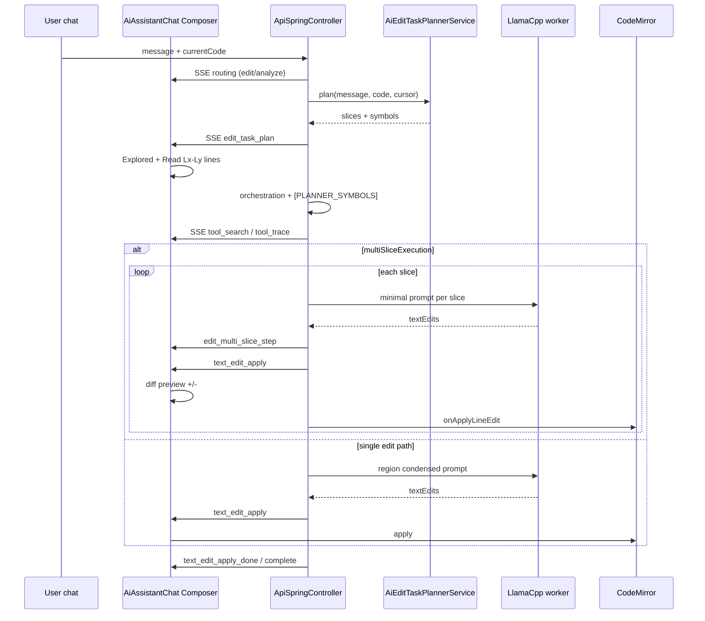

## U.5 Layout Composer (v3.3 — một card edit mode)

Khi `COMPOSER_PRIMARY_EDIT_TIMELINE=true` **và** `responseMode=edit`:

```txt
┌─ composerUnifiedCard (một viền) ─────────────────────┐
│ ▼ Trạng thái request · LỖI · 45s · req-id…    [Hủy] │  ← loading: Đang xử lý · %
│   [progress bar 3px]                                  │
│ ▼ Đã khám phá · 2 bước plan, 5 lần sửa vùng          │
│   🧭 Chế độ edit → …                                  │
│   📋 Lập kế hoạch N vùng · …                          │
│   ⚙️ Editing region …                                 │
│ ▼ seo.js  +138  -12                                   │
└───────────────────────────────────────────────────────┘
```

**Không hiển thị** (edit mode, luồng bình thường):

- Block **Tiến độ xử lý** + nhóm **Chuẩn bị** + “Đang ẩn N mốc cũ”
- Dock **「N bước agentic hoàn tất」** khi chỉ còn bước nội bộ (route/plan/schema)

**Vẫn hiện** progress dock khi: `review_required`, pending approval, low-confidence retry.

| Flag / hằng | Vai trò |
|-------------|---------|
| `useUnifiedComposerTimeline` | `COMPOSER_PRIMARY && responseMode=edit` |
| `COMPOSER_INTERNAL_AGENTIC_STAGES` | Stages không đưa vào Agentic dock |
| `showLegacyProgressDock` | false trong edit trừ review/retry |
| `appendStageEvent` early return | Edit stream: skip preparing/chunking; giữ error/blocked |

Sau **done**: tự collapse Trạng thái request + Đã khám phá (~4.5s). **error**: giữ mở để xem Lý do / requestId.

## U.6 Checklist nghiệm thu Composer UI (v3.3)

| # | Test | Pass |
|---|------|------|
| 1 | Edit mode: **một card** (status + Explored + diff), không 3 viền rời | ✓ v3.3 |
| 2 | Edit mode: **không** block Tiến độ xử lý / Chuẩn bị / “ẩn N mốc” | ✓ v3.3 |
| 3 | Edit mode: **không** “1 bước agentic hoàn tất” khi chỉ route nội bộ | ✓ v3.3 |
| 4 | Block **Đã khám phá · …** + **Trạng thái request · …** | ✓ v3.1 |
| 5 | Plan **1 dòng** (không N Read + Agentic trùng) | ✓ v3.1 |
| 6 | Diff **seo.js +N -M** sau apply | ✓ |
| 7 | Lỗi `LOCAL_OVERRIDE_*`: composer mở + Lý do; assistant message giữ Nguyên nhân / Việc cần làm tiếp | ✓ |
| 8 | Analyze mode: vẫn có Tiến độ xử lý nếu cần debug | ✓ |

## U.7 So sánh trực tiếp với ảnh Cursor user gửi (cập nhật v3.3)

| Cursor screenshot | CSM v3.3 | Đủ? |
|-------------------|----------|-----|
| "Explored 2 files, 1 search" | "Đã khám phá · … lần đọc vùng, … lần tìm" | ✅ |
| "Grepped X in file" | "Searched workspace context" (Lucene, không Grepped) | ⏳ |
| "Read file L7268-7307" | Plan line chứa `L7268–7307` (không dòng Read riêng) | ✅ gọn hơn Cursor |
| Diff `file.tsx +138` / `+12` / `+81-1` (nhiều card) | **Một** `{pName}.js +N -M` tích lũy | ⚠️ apply ✅, UI card ⏳ |
| Plan + execute visible in chat | Composer timeline + backend multi-slice | ✅ |
| Không lặp panel Agentic plan | `COMPOSER_PRIMARY_EDIT_TIMELINE` + internal stage filter | ✅ v3.3 |
| Request status gọn | Một card với Explored (v3.3) | ✅ v3.3 |
| Không dock “Chuẩn bị” riêng | `appendStageEvent` skip edit prep | ✅ v3.3 |

## U.8 Backend hardening edit path (v3.1)

| Fix | File | Mô tả |
|-----|------|-------|
| `replacementText` → `replacement` | `ApiSpringController` | Model local hay trả sai key JSON → `textEdits=0` |
| `remapRelativeSliceLineNumbers` | `tryMultiSliceEditFromPlan` | Model trả dòng 1..N trong slice → cộng offset absolute |
| `Set.of()` duplicate token crash | `AiEditTaskPlannerService.isUsefulSymbol` | Fix `IllegalArgumentException` trên edit lớn |
| `MAX_SURGICAL_EDIT_LINE_SPAN=40` | `acceptLocalCodeEditCandidate` + patch validator | Chặn salvage 200+ dòng (L1865–2095) trước AST gate — log `LOCAL_OVERRIDE … AST gate` |

## U.9 Roadmap UI (để khớp 100% ảnh Cursor)

1. **Grepped line** — `mapToolTraceToComposerActivity` thêm kind `grep` khi lane workspace symbol search.
2. **Per-step diff cards** — push `ComposerDiffBlock[]` thay vì merge một block.
3. **Clickable plan chips** — `L1776–1919` trong dòng plan → `onCitationNavigate` (thay `workspacePlanPanel`).
4. **Async ingest UX** — message "Indexing 371k chars in background (~N min)" khi `chunks=0 pending`.

## U.10 File liên quan

| File | Thay đổi |
|------|----------|
| `AiAssistantChat.tsx` | v3.3: `useUnifiedComposerTimeline`, `showLegacyProgressDock`, `COMPOSER_INTERNAL_AGENTIC_STAGES`, unified card |
| `AiAssistantChat.module.css` | v3.3: `.composerUnifiedCard`, `.composerUnifiedSection`, `.composerPanel_unified` |
| `AiEditTaskPlannerService.java` | Plan slices |
| `ApiSpringController.java` | SSE + multi-slice + `replacementText` + `remapRelativeSliceLineNumbers` |

---

# PHẦN V — CODE STRING EDITOR (KHÔNG PHẢI FILE)

> **Mục tiêu:** Mọi thành phần AI local (planner, RAG, LLM, gates, SSE, CodeMirror) phải hiểu rằng **đơn vị sửa là một chuỗi code** — không có filesystem path — để patch **chính xác** theo yêu cầu user trên editor.

## V.1 Bối cảnh DynamicCode

| Khái niệm | CSM thực tế |
|-----------|-------------|
| “File đang mở” | **Một string** `currentCode` trong React state + CodeMirror doc |
| Lưu trữ | DB DynamicCode: `(app_id, p_name, p_type)` → nội dung code |
| `pName` / `pType` | Khóa **logic** chọn bản code (vd. `seo` + `0`) — **không** map 1:1 path `seo.js` |
| Menu designer | Cùng mô hình: `contextType=menu_json` → `currentCode` = **chuỗi JSON menu** |
| Workspace repo (Java/TS) | L1 Lucene — **tách biệt**; không thay thế buffer editor |

Cursor đọc `src/foo.ts` từ disk. CSM nhận **toàn bộ string** qua HTTP body mỗi request chat.

## V.2 Ba lớp định danh (không nhầm)

```txt
① Editor instance key   pName + pType          → chọn DynamicCode record + ingest key
② Lucene source key     dyn_ctx_editorCode_{pName}_{pType}   → RAG scoped (L2)
③ UI display label      {pName}.js / menu.json → Composer diff header (cosmetic)
```

Hàm backend: `AiScopedContextIngestionService.buildEditorIngestKey(pName, pType)` → vd. `seo_t0`.

**Cấm:** Coi `pName` là đường dẫn file; gọi `Files.readString(path)`; yêu cầu model trả `filePath` trong textEdits.

## V.3 Hợp đồng dòng (line contract) — nguồn chính xác duy nhất

Mọi `textEdit` **phải** dùng số dòng **tuyệt đối 1-based** trên **full `currentCode` tại thời điểm bắt đầu request**.

| Field | Quy ước |
|-------|---------|
| `startLine` | Dòng đầu (inclusive), ≥ 1 |
| `endLine` | Dòng cuối (inclusive), ≥ startLine |
| `replacement` | Nội dung thay thế; `\n` tách thành nhiều dòng. Alias backend chấp nhận: `replacementText`, `newText`, `text` |
| `action` | `edit` (mặc định) hoặc `add` (chèn tại startLine) |

**Condensed slice trong prompt** (vd. `/* SLICE 2/4 lines 5810-5890 */`) chỉ để model **đọc ngữ cảnh**. Dòng trong `textEdits` **vẫn là 5810–5890 trên full string**, không reset về 1 trong slice.

Backend gate (`simulateApplyLineTextEdits`, `applyDeltaFirstAntiEchoLineTextEdits`, AST gate) **luôn** chạy trên full `currentCode` request — không trên excerpt.

Frontend mirror (`applyTextEditsToDraft`, `validateStructuredTextEdits`):
- Sort edits **desc** theo startLine khi apply batch
- Reject overlapping, out-of-range, noop

## V.4 Chuỗi đồng bộ — từ user tới CodeMirror

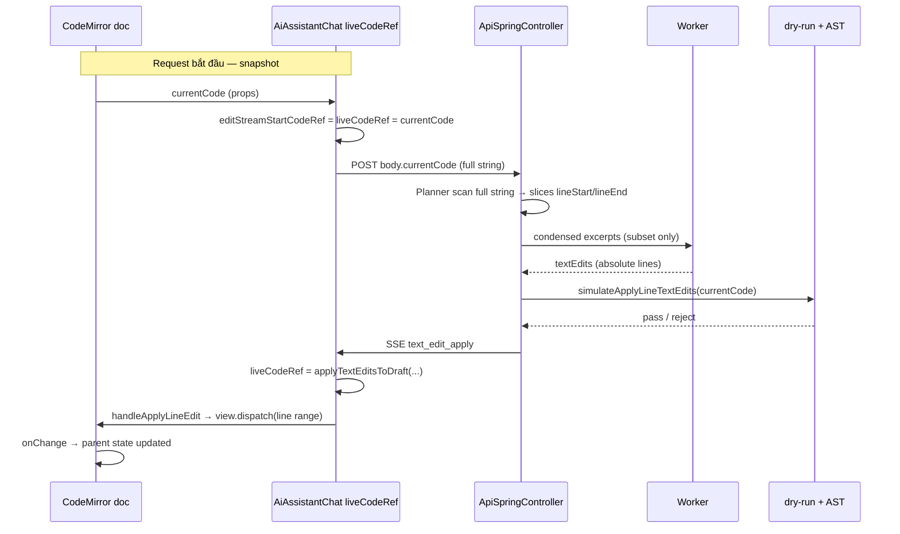

| Ref / biến | Vai trò |
|------------|---------|
| `currentCode` (props) | String gốc từ parent (`CodeEditor`) |
| `liveCodeRef` | Bản đang stream-apply; cập nhật mỗi `text_edit_apply` |
| `editStreamStartCodeRef` | Snapshot lúc gửi — so sánh undo / partial apply |
| `undoSnapshotRef` | Trước edit đầu tiên — diff Composer + undo user |
| Backend `currentCodeRaw` | Cùng nội dung body; base cho planner + gates |

**Quy tắc:** Mỗi request chat mới → frontend gửi **`currentCode` mới nhất** (đã include edit tay user). Planner tính lại slices; không reuse line cũ sau khi string đã đổi.

## V.5 Planner trên string (không file)

`AiEditTaskPlannerService.plan(fullCode, ...)`:

### Quy tắc phạm vi (scope) — bắt buộc

| Tình huống user | Phạm vi xử lý | Planner kind |
|-----------------|---------------|--------------|
| **Không bôi đen** | **Toàn bộ** `currentCode` string theo yêu cầu | Quét symbol trên full string → slice `code_full` / `menu_full` nếu không tìm thấy vùng cụ thể |
| **Có bôi đen (selection)** | **Chỉ vùng** `selectionFromLine`–`selectionToLine` (ưu tiên) + symbol liên quan | `cursor_selection` |
| Cursor đặt ở dòng X **không** bôi đen | **Không** thu hẹp theo cursor — vẫn coi như full string | (không dùng `cursor_window`) |

> **Lưu ý:** “Toàn bộ string” ≠ đổ hết 371k vào model. Lucene ingest đủ; model nhận slice/condensed; patch `textEdits` vẫn tính dòng **tuyệt đối** trên full string.

1. **Scan regex** trên toàn bộ string — `function X`, `window.X =`, lifecycle symbols
2. **Selection (nếu có)** — `editorMetadata.hasSelection` → neo `cursor_selection`
3. **Merge vùng** gần nhau → `slices[]` với `lineStart`, `lineEnd` **tuyệt đối**
4. **Fallback** — không slice nào → `code_full` L1–L{n}` / `menu_full` (menu JSON)

Output SSE `edit_task_plan` → UI hiển thị `Read {pName} · Lx–Ly` = **“đã xác định vùng trong buffer”**, không phải I/O file.

Multi-slice execution:
- Mỗi slice: prompt chứa excerpt + **header ghi rõ absolute lines**
- LLM trả ≤2 textEdits/slice
- Merge tất cả → **một** dry-run trên full string → emit tuần tự `text_edit_apply`

## V.6 Apply CodeMirror — map dòng → ký tự

`CodeMirrorWithAiAssistant.handleApplyLineEdit`:

```typescript
// 1-based line → character range trong doc hiện tại
const startLineObj = doc.line(safeStart);
const endLineObj = doc.line(safeEnd);
view.dispatch({
  changes: { from: startLineObj.from, to: endLineObj.to, insert: edit.replacement },
});
onChange(view.state.doc.toString()); // đồng bộ React parent
```

Fallback nếu chưa có view: splice mảng dòng từ `currentCode` string — cùng logic với backend `simulateApplyLineTextEdits`.

**Không** replace toàn doc trừ khi fallback hoặc menu full-tree.

## V.7 RAG / ingest trên string

| Hành vi | Giải thích |
|---------|------------|
| `currentCode` > 30k | Async chunk ingest vào Lucene (`ingestLargeCodeAsync`) — **không block** request |
| Editor key | `seo_t0` — hash nội dung; request sau hit `scopedRagBlock` |
| Request hiện tại | Dùng planner condensed + region plan — **không** cần ingest xong mới sửa |
| Model nhận | Slice + top-K RAG — **không** full 371k |

Index **đủ** string vào Lucene; model **không** nhận hết string.

## V.8 Menu JSON — cùng mô hình string

| | Code | Menu |
|--|------|------|
| Buffer | JS/TS/Java… string | JSON tree string |
| Planner | Symbol + line slices | Node id / label slices |
| Output contract | `textEdits` (lines) | `patches` (nodeId) |
| Apply | Line splice CodeMirror | Parse JSON → mutate tree → stringify |

Cả hai đều **không** dùng file path.

## V.9 Lỗi thường gặp → patch sai dòng

| Triệu chứng | Nguyên nhân | Cách sửa |
|-------------|-------------|----------|
| Patch vào dòng ~1749 thay vì ~5810 | Model dùng dòng **trong excerpt** (relative) | Master prompt: bắt buộc absolute line; header slice ghi `lines 5810-5890` |
| `line_out_of_range` / gate reject | Model hallucinate line | Dry-run reject; focused retry với excerpt + line anchor |
| CodeMirror lệch sau apply | User sửa tay **trong lúc** stream | Khóa editor khi streaming hoặc abort SSE |
| Request 2 vẫn plan dòng cũ | Frontend gửi `currentCode` cũ | Luôn lấy `liveCodeRef \|\| currentCode` trước POST |
| `LOCAL_OVERRIDE` trên file lớn | Patch không khớp string thật | Chọn vùng trong editor trước khi gửi; đợi async ingest xong request sau |
| UI hiểu nhầm “Read seo.js” | Tưởng đọc file disk | Doc + tooltip: **string region** |

## V.10 Checklist chính xác patch (Cursor / dev)

| # | Kiểm tra | Pass |
|---|----------|------|
| 1 | Request body `currentCode` === nội dung CodeMirror lúc gửi (`resolveOutgoingEditorSnapshot`) | ✓ v2.8 |
| 2 | `textEdits[].startLine` tính trên full string, không relative slice | ✓ |
| 3 | Backend dry-run trên `currentCodeRaw` trước SSE | ✓ |
| 4 | Frontend `liveCodeRef` cập nhật sau mỗi apply | ✓ |
| 5 | `handleApplyLineEdit` dispatch đúng line range | ✓ |
| 6 | Multi-slice merge + gate một lần trên full string | ✓ |
| 7 | Composer diff dùng `undoSnapshotRef` + accumulated edits | ✓ |
| 8 | `pName`/`pType` chỉ làm key + label — không path I/O | ✓ |
| 9 | Sau edit tay user, request mới gửi string đã cập nhật | ✓ |
| 10 | Menu: contract `patches`/`nodeId`, không lẫn `textEdits` code | ✓ |

## V.11 File tham chiếu

| File | Trách nhiệm string |
|------|---------------------|
| `CodeEditor.tsx` | Load/save DynamicCode → `currentCode` |
| `CodeMirrorWithAiAssistant.tsx` | Doc ↔ string; `handleApplyLineEdit`; metadata cursor line |
| `AiAssistantChat.tsx` | `liveCodeRef`, `resolveOutgoingEditorSnapshot`, SSE apply |
| `ApiSpringController.java` | Nhận `currentCode`; gates; SSE emit |
| `AiEditTaskPlannerService.java` | Scan/plan trên full string |
| `AiScopedContextIngestionService.java` | `buildEditorIngestKey`, async ingest string chunks |

---

# PHẦN W — FRONTEND: NƠI GỌI AI ASSISTANT & WIRE CODE STRING

> **Mục tiêu:** Mọi màn có CodeMirror + chat AI phải truyền **đúng code string**, **pName/pType**, **cursor/selection** để planner + patch chính xác (PHẦN V).

## W.1 Kiến trúc 3 tầng

```
Parent screen (CodeEditor, AiMenuDesigner, FieldConfigEditor, …)
    │  value / onChange = code string
    ▼
CodeMirrorWithAiAssistant.tsx
    │  currentCode = aiAssistantCurrentCode ?? value
    │  editorMetadata.cursorLine / selectionFromLine / selectionToLine
    │  onApplyLineEdit → view.dispatch (line-range)
    ▼
AiAssistantChat.tsx
    │  resolveOutgoingEditorSnapshot() → POST currentCode + cursor
    │  SSE text_edit_apply → onApplyLineEdit
    ▼
POST /api/ai-code-stream (SSE) hoặc /api/ai-local/execute-local-plan
```

**File trung tâm:** `frontend-admin/src/components/editor/CodeMirrorWithAiAssistant.tsx` — **mọi** editor AI đi qua wrapper này (trừ khi `aiAssistantEnabled={false}`).

## W.2 Ma trận call site (2026-05-26)

| Màn hình | File | contextType | pName / pType | currentCode nguồn | Apply patch | Ghi chú |
|----------|------|-------------|---------------|-------------------|-------------|---------|
| **DynamicCode chính** | `CodeEditor.tsx` | `code` | `selectedCode` / `resolvedPType` | `aiLastCode` via `value` + `aiAssistantCurrentCode` | ✅ line edit | Luồng **chuẩn** file lớn ~371k |
| **Menu AI Designer** | `AiMenuDesigner.tsx` | `menu_json` | `menu_designer_{appId}` / `0` | draft JSON string | ✅ auto apply | Contract `patches` / menu JSON |
| **Field config snippet** | `FieldConfigEditor.tsx` → `CodeArea` | `code` | từ `detail.tsx` (`p_name`, `p_type`) | `value` + explicit `aiAssistantCurrentCode` | ✅ line edit | Snippet trong menu detail |
| **Trigger editor** | `TriggerEditor.tsx` | `code` (default) | ❌ chưa set | `value` only | ✅ line edit | Snippet trigger — key Lucene generic |
| **Grid edit modal** | `CsmEditModal.tsx` | default | ❌ | form field `value` | ✅ line edit | Code field trong record edit |
| **Dynamic config** | `DynamicConfigBuilder.tsx` | default | ❌ | trigger snippets | ✅ line edit | Modal nhỏ — không pName |
| **Workspace diff viewers** | `CodeEditor.tsx` | — | — | — | ❌ | `aiAssistantEnabled={false}` |

## W.3 Props bắt buộc theo mức độ

### Mức A — Editor production (CodeEditor, AiMenuDesigner, FieldConfig trong menu detail)

| Prop | Bắt buộc | Mục đích |
|------|----------|----------|
| `value` / `onChange` | ✅ | Code string ↔ CodeMirror doc |
| `aiAssistantCurrentCode` | ✅ khuyến nghị | Đồng bộ string gửi AI (fallback: `value`) |
| `aiAssistantPName` | ✅ | Lucene `editorKey` + Composer label |
| `aiAssistantPType` | ✅ (code) | `buildEditorIngestKey(pName, pType)` |
| `aiAssistantAppId` | ✅ | Tenant RAG `appId` |
| `aiAssistantContextType` | ✅ | `code` vs `menu_json` → contract khác |
| `aiAssistantLanguage` | ✅ | Planner symbol patterns |
| `aiAssistantOnCitationNavigate` | khuyến nghị (CodeEditor) | Click slice → scroll/jump dòng |

### Mức B — Snippet embedded (TriggerEditor, CsmEditModal, DynamicConfigBuilder)

| Prop | Mức B |
|------|-------|
| `value` + `onChange` | ✅ |
| `aiAssistantPName` | tùy chọn — nên `snippet_{context}` nếu cần RAG scoped |
| `onApplyLineEdit` | ✅ tự động qua wrapper |

## W.4 CodeMirrorWithAiAssistant — hành vi nội bộ

```typescript
// currentCode gửi vào chat
const currentCode = aiAssistantCurrentCode ?? value ?? "";

// Metadata mỗi lần render chat (best-effort từ selection CodeMirror)
metadata.cursorLine = fromLine;
metadata.selectionFromLine / selectionToLine;
metadata.hasSelection = to > from;
metadata.bufferChars / bufferLines;
```

**Apply:** `handleApplyLineEdit` map **1-based line** → `doc.line(n).from/to` → `view.dispatch` → `onChange(doc.toString())`.

**Citation:** delegate `aiAssistantOnCitationNavigate` (CodeEditor mở đúng DynamicCode + dòng) hoặc scroll local.

## W.5 AiAssistantChat — payload gửi backend (v2.8)

Hàm `resolveOutgoingEditorSnapshot(currentCode, liveCodeRef, requestEditorMetadata)`:

| Field POST | Nguồn |
|------------|-------|
| `currentCode` | **`liveCodeRef.current \|\| currentCode`** — string mới nhất |
| `cursorLine` | `editorMetadata.cursorLine` |
| `selectionFromLine` / `selectionToLine` | khi `hasSelection` |
| `pName` / `pType` | props `targetPName` / `targetPType` |
| `editorMetadata` | diagnostics, bufferLines, source, scope |
| `contextType` / `language` | từ wrapper |

**Luồng SSE apply trong chat:**

1. Reset turn: `composerActivity`, `editTaskPlan`, `liveCodeRef` sync
2. Snapshot: `outgoingSnapshot` → gán `editStreamStartCodeRef`
3. SSE `text_edit_apply` → `onApplyLineEdit` + `liveCodeRef` += edit
4. Composer diff: `undoSnapshotRef` + accumulated edits

**Slash commands:** `/edit`, `/analyze`, `/local-plan` → route `ai-code-stream` hoặc `ai-local/execute-local-plan`.

## W.6 Backend nhận snapshot (v2.8+)

Sau parse body:

```java
// cursor từ body hoặc editorMetadata (hint UI / RAG, không thu hẹp planner khi không selection)
if (cursorLine <= 0) cursorLine = editorMetadata.cursorLine;

// Chỉ khi user BÔI ĐEN mới thu hẹp planner focus
if (hasEditorSelection) {
    planFocusStartLine = selectionFromLine;
    planFocusEndLine = selectionToLine;
} else {
    planFocusStartLine = -1;  // → full string scope
    planFocusEndLine = -1;
}
editTaskPlan = planner.plan(..., effectiveCodeContext, cursorLine, planFocusStart, planFocusEnd);
// planCodeSlices: symbol scan full string; empty → code_full L1-Ln
```

→ User **bôi đen** → planner neo slice vùng chọn. **Không bôi đen** → xử lý theo yêu cầu trên **cả buffer** (symbol + `code_full`).

## W.7 CodeEditor — luồng DynamicCode chuẩn

```
fetchCodeList → openCodeItem(p_name) → aiLastCode / codeContent
    → CodeMirror value={aiLastCode}
    → aiAssistantPName={selectedCode}
    → aiAssistantPType={resolvedPType}
    → handleAssistantCitationNavigate → openCodeItem + navigateEditorToLine
```

Lưu DB: `saveCode(appId, selectedCode, codeContent, codeType)` — string persist, không file path.

## W.8 AiMenuDesigner — menu JSON string

```
currentCode = editableAiDraftText || aiResultText || buildEditorMenuJson(menus)
contextType = menu_json
pName = menu_designer_{appId}   // Lucene key, không phải file
autoApply = true                  // patch JSON → editor
```

Contract output: `{ patches }` / menu tree — **không** `textEdits` dòng.

## W.9 Checklist tích hợp màn mới

| # | Khi thêm CodeMirror + AI |
|---|--------------------------|
| 1 | Dùng `CodeMirrorWithAiAssistant`, không import `AiAssistantChat` trực tiếp |
| 2 | Truyền `value` = code string thật user đang sửa |
| 3 | Set `aiAssistantPName` + `pType` nếu cần scoped RAG / ingest |
| 4 | Set `contextType` đúng (`code` vs `menu_json`) |
| 5 | Không giả định file path — mọi patch là dòng trên string |
| 6 | Parent `onChange` cập nhật state ngay khi AI apply |
| 7 | Reload frontend sau đổi wire |

## W.10 File liên quan v2.8

| File | Thay đổi v2.8 |
|------|----------------|
| `AiAssistantChat.tsx` | `resolveOutgoingEditorSnapshot`, POST snapshot |
| `CodeMirrorWithAiAssistant.tsx` | (giữ) metadata cursor + `handleApplyLineEdit` |
| `CodeEditor.tsx` | `aiAssistantAppId`, `aiAssistantCurrentCode` |
| `AiMenuDesigner.tsx` | `pName`, `editorMetadata` |
| `ApiSpringController.java` | selection → planner focus |

---

# PHẦN X — LUỒNG NỘI DUNG (NGOÀI CODE / MENU EDITOR)

> **Mục tiêu:** CSM AI Local không chỉ sửa DynamicCode/menu JSON — còn trả lời **nội dung chung**, domain hệ thống, tài liệu đính kèm, SEO (lane riêng), multimodal — mà **không trộn contract** với `textEdits` code.  
> **Nguyên tắc v3.0:** Các luồng này **cũng do AI Local tự tư duy nhanh** để route đúng — cùng stack llama.cpp JNI, không coi “content = bypass local brain”.

## X.0 AI Local tự quyết định — mọi luồng (kể cả nội dung)

### X.0.1 Một stack, ba workspace

| `workspaceKind` | Khi nào | Factory / route |
|-----------------|---------|-----------------|
| `code` | `contextType=code`, edit/analyze code, có `currentCode` | `CodeWorkflowPlanFactory` → `CODE_CONTEXT` |
| `menu` | `contextType=menu_json`, menu intent | `MenuWorkflowPlanFactory` → `MENU_CONTEXT` |
| **`general`** | Câu hỏi/domain/attachment **không** cần sửa buffer editor | `GeneralWorkflowPlanFactory` → xem bảng route dưới |

Phân loại workspace: `AiLocalWorkflowAdvisorService.resolveWorkspaceKind()`.

### X.0.2 Chuỗi tư duy nhanh (fast local reasoning)

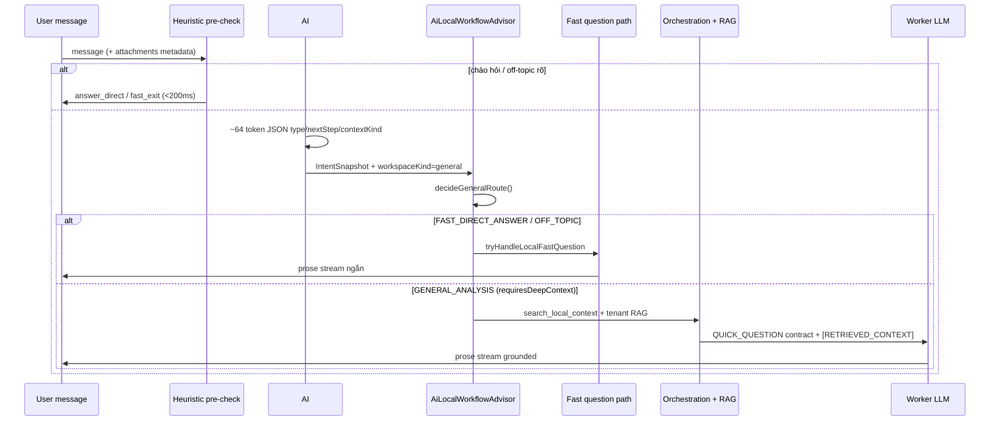

### X.0.3 Bảng route — luồng `general` (nội dung)

| Route | Điều kiện (tóm tắt) | `quickExit` | Orchestration nặng? | Output |
|-------|---------------------|-------------|---------------------|--------|
| `OFF_TOPIC_FAST_EXIT` | Off-topic, không code/menu signal | ✅ | ❌ | Từ chối nhẹ / redirect |
| `FAST_DIRECT_ANSWER` | Câu ngắn, `answer_direct`, không attachment/code | ✅ | ❌ | Prose nhanh local |
| **`GENERAL_ANALYSIS`** | Domain, spec, attachment, câu phức tạp | ❌ | ✅ | RAG + prose grounded |
| *(fast question path)* | `shouldUseLocalFastQuestionPath` | partial | ❌ | Prose trước pipeline đầy đủ |

Hàm: `decideGeneralRoute()`, `shouldUseLocalFastQuestionPath()`, `tryHandleLocalFastQuestion()`.

**Tool plan nội dung (general analyze):**

```txt
1. search_local_context   — Lucene tenant + workspace + attachment
2. synthesize_grounded_answer — source=general_context
(+ self_check_consistency khi message dài / nhiều attachment)
```

### X.0.4 AI#1 classifier — schema quyết định (local ~64 tokens)

Gọi: `classifyIntentWithLocalAI()` → JSON:

```json
{
  "type": "QUESTION|GENERAL|EDIT_CODE|EDIT_MENU",
  "action": "ask|search|other|…",
  "responseMode": "edit|analyze",
  "nextStep": "answer_direct|load_code_context|load_menu_context|clarify",
  "contextKind": "none|code|menu",
  "confidence": 0-100
}
```

**Quy tắc cho nội dung (không sửa buffer):**

| Signal classifier | Hành vi backend |
|-------------------|-----------------|
| `QUESTION` / `GENERAL` + `nextStep=answer_direct` + `contextKind=none` | Fast path hoặc `FAST_DIRECT_ANSWER` |
| Cần domain org/permission | `GENERAL_ANALYSIS` + tenant RAG (ACL) |
| Có attachment authoritative | Ingest → `search_local_context` trước worker |
| Câu phức tạp (ước tính thời gian + nghiệp vụ hệ thống) | **Bỏ** fast path → orchestration đầy đủ |
| User nói "sửa/fix/patch" | **Không** coi là content — chuyển `edit` + code/menu lane |

Sau classify: `reconcileCodeResponseModeWithIntent()` — **EDIT_*** luôn ép `responseMode=edit`.

### X.0.5 Phân biệt “tư duy nhanh” vs “pipeline sâu”

| | Fast local reasoning | Pipeline sâu (general) |
|--|---------------------|-------------------------|
| **Latency** | <200ms – vài giây | Orchestration + RAG + worker |
| **Model calls** | 1 classify (+ 1 fast answer) | classify + advisor + retrieval + worker |
| **Khi dùng** | Chào hỏi, FAQ ngắn, off-topic | Tenant domain, spec md, câu hỏi nghiệp vụ dài |
| **Độ chính xác** | Heuristic + confidence gate | Grounded trên Lucene + `[RETRIEVED_CONTEXT]` |

**Cấm:** Bỏ qua classifier/advisor cho luồng general và trả template cứng / cloud fallback khi `local-only` bật.

### X.0.6 Config liên quan

```properties
ai.local.routing.model-driven.enabled=true
ai.local.fast-question.enabled=true
ai.local.intent.classify.max-tokens=64
ai.local.workflow.fast-direct.max-message-chars=320
```

### X.0.7 Checklist — AI local tự quyết content

| # | Kiểm tra | Pass |
|---|----------|------|
| 1 | Câu domain admin → log route `GENERAL_ANALYSIS`, không `EDIT_CODE` | ✓ |
| 2 | "Xin chào" → `answer_direct` hoặc `assistant_fast_exit` | ✓ |
| 3 | Đính kèm spec.md + hỏi → `search_local_context` trong tool plan | ✓ |
| 4 | Câu "sửa lỗi X" → classify `EDIT_CODE`, không fast content path | ✓ |
| 5 | Local-only: không cloud fallback khi general analyze | ✓ |

---

## X.1 Sáu nhóm luồng (tổng quan)

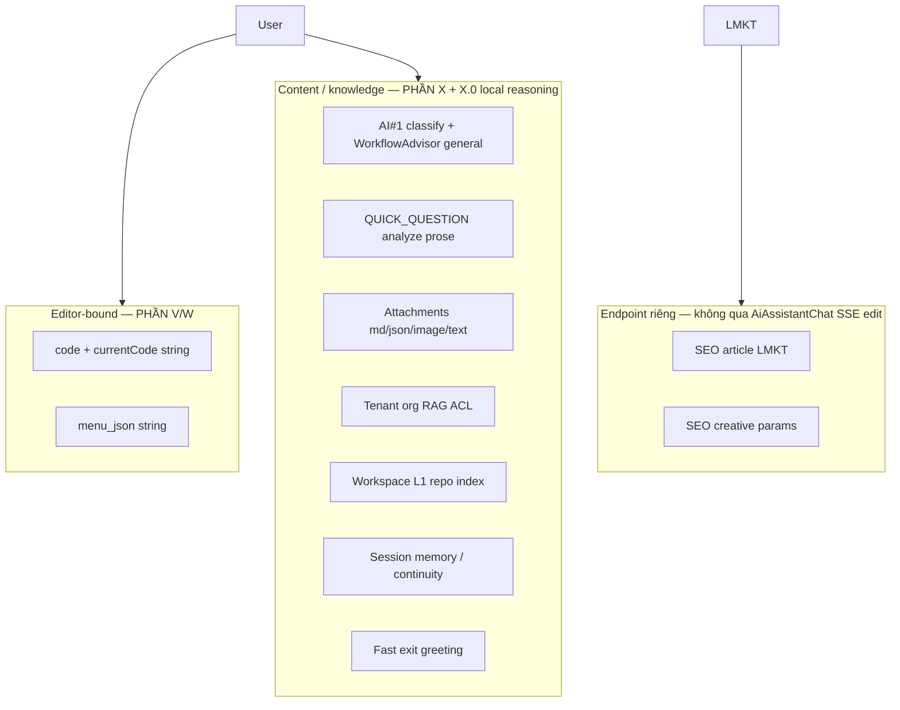

| Nhóm | Khi nào | `AiFlowIntent` | Output | Patch CodeMirror? |
|------|---------|----------------|--------|-------------------|
| **Code edit** | `contextType=code`, edit intent | `FRONTEND_CODE` | `textEdits` JSON | ✅ |
| **Menu edit** | `contextType=menu_json`, edit | `MENU_JSON` | `patches` / menu | ✅ JSON string |
| **Analyze / hỏi đáp** | "giải thích", "tại sao", `/analyze` | `QUICK_QUESTION` | Prose stream | ❌ |
| **Domain admin** | Hỏi role, branch, combo, permission | `QUICK_QUESTION` + tenant RAG | Prose + citations | ❌ |
| **Attachment-led** | User đính kèm md/json/ảnh không sửa editor | Orchestration ingest | Prose hoặc edit theo intent | Tùy intent |
| **SEO / LMKT** | `generateSeoContentWithPrompt` | *(tách)* | HTML / creative JSON | ❌ |

Chọn intent: `AiAssistantGatewayService.classifyLocalIntent(contextType, responseMode, message)`.

**Route nội dung:** AI#1 + `AiLocalWorkflowAdvisorService` (`workspaceKind=general`) — **PHẦN X.0**.

## X.2 QUICK_QUESTION — analyze / nội dung không patch

**Kích hoạt (sau khi local đã quyết định route):**
- User message phân tích: "xem tại sao", "giải thích", "phân tích" → `responseMode=analyze`
- `contextType=code` + analyze → `QUICK_QUESTION` (không load code edit contract)
- Classifier `QUESTION` / `GENERAL`

**Contract:** `QUICK_QUESTION_CONTRACT_MIN` — prose, ≥4 bullet, cùng ngôn ngữ user, **không** JSON patch.

**SSE:** `stage=streaming` chunks → hiển thị bubble chat. **Không** `text_edit_apply`.

**Context vào model (bounded):**
- `[RETRIEVED_CONTEXT]` — Lucene top-K (workspace + tenant + attachment snippets)
- `[SESSION_MEMORY]` — continuity turns
- `[ACTIVE_EDITOR_CODE]` — **cap** (~slot budget), không full 371k
- `[USER_REQUEST]`

## X.3 Attachment — nội dung bổ sung (không phải file editor)

User đính kèm trong `AiAssistantChat` (tối đa 8 file). Frontend `classifyAttachmentContext()`:

| Loại file | `contextRole` | `authoritative` | Dùng khi |
|-----------|---------------|-----------------|----------|
| Markdown `.md` | `system_requirement` | ✅ | Spec, yêu cầu nghiệp vụ |
| JSON (menu flow) | `legacy_json` | ✅ | Menu mẫu / schema |
| JSON (code flow) | `reference_code` | — | Tham chiếu, không thay `currentCode` |
| Code-like `.js/.java/...` | `reference_code` / `business_logic` | menu: ✅ | Snippet tham chiếu |
| Ảnh | `image` | — | Vision sidecar → text → RAG |
| Text khác | `general_text` | — | Ghi chú, mô tả |

**Backend:** SSE `attachment_intake` → orchestration normalize → Lucene ingest (async) → `tool_search` hits.

**Quy tắc:** Attachment **bổ sung** knowledge; **không** thay thế `currentCode` editor trừ khi user edit intent rõ và contract cho phép.

## X.4 Tenant / System Management RAG (Phase 2)

**Nguồn:** `AiTenantKnowledgeIngestionService` — snapshot `csm_roles`, `csm_depts`, `csm_branches` + domain rules markdown.

**Khi nào:** Câu hỏi analyze về org, permission, combo, cascade branch→dept.

**ACL:** `AiRetrievalAuthContextResolver` → `passesRetrievalAuthFilter` — không leak org ngoài quyền user.

**Không liên quan** DynamicCode string — pure content Q&A.

## X.5 Workspace index (L1) vs Editor vector (L2)

| Lớp | Index | Câu hỏi ví dụ |
|-----|-------|---------------|
| **L1** `ai_local_assistant_index/` | Java/TS repo, README | "Luồng API này viết ở đâu?" |
| **L2** `dyn_ctx_editorCode_{pName}_{pType}` | Code string editor lớn | Request sau async ingest editor |
| **L3** Planner slice | Request hiện tại | Edit/analyze vùng cụ thể |

L1 trả lời **nội dung codebase**; L2/L3 phục vụ **buffer đang mở**.

## X.6 Multimodal & vision (local-5gb)

```
Ảnh đính kèm → AiMultimodalScannerService / vision sidecar (SmolVLM)
  → text mô tả → chunk → Lucene
  → worker nhận snippet trong [RETRIEVED_CONTEXT]
```

Config: `ai.orchestration.multimodal.local-only=true`

## X.7 Fast exit & routing nhẹ

| Pattern | SSE | Hành vi |
|---------|-----|---------|
| "xin chào", "cảm ơn" | `assistant_fast_exit` | Trả lời <200ms, không orchestration nặng |
| `GENERAL_ANALYSIS` route | RAG nhẹ + prose | Không edit contract |

## X.8 SEO & creative params (lane tách — LMKT)

**Không** đi qua `AiAssistantChat` / `ai-code-stream` edit path.

| Endpoint | Client | Output |
|----------|--------|--------|
| `POST /ai-generate-seo-content` | `auto-lmkt.js` | `{ title, description, html_content }` |
| Cùng endpoint + `[CREATIVE_PARAMS_REQUEST]` | `requestCreativeParams()` | `{ personaKey, contentPattern, … }` |

**Không** inject `ai_code_master_prompt` / menu master. Fallback deterministic khi model 1.5B fail.

Chi tiết đầy đủ: **PHẦN Y** (LMKT zero-JS-change contract).

## X.9 Orchestration preview (dev)

`POST /api/ai-orchestration-preview` — từ `AiAssistantChat` (nút preview / debug): xem plan steps, RAG scope **không** gọi LLM worker chính.

## X.10 Ma trận: message user → luồng thực tế (→ PHẦN AB)

| User gửi (ví dụ) | AB Lane | contextType | responseMode | Luồng |
|------------------|---------|-------------|--------------|-------|
| "Thêm menu đơn hàng…" | **1** | menu_json | edit | Menu master → orchestration → patches |
| "Sửa lỗi webview…" (không bôi đen) | **2** | code | edit | Full string → planner → textEdits |
| "Sửa đoạn này" (có bôi đen) | **2** | code | edit | Selection scope → patch vùng chọn |
| "Tại sao webview treo?" | **3** | code | analyze | QUICK_QUESTION prose + RAG |
| "Sub-user duplicate combo?" | **3** | code* | analyze | Tenant RAG prose (J.5) |
| Đính kèm `spec.md` + hỏi | **3** | any | analyze | Attachment + prose |
| SEO bài viết LMKT | **4a** | — | — | Sync `/ai-generate-seo-content` |
| Khách chat website | **4b** | — | — | Socket.IO guest lane |
| Ảnh UI + hỏi layout | **5** | any | analyze | Multimodal scan → RAG (render ⏳) |

\*Chat có thể mở từ Code Editor nhưng câu hỏi **không** yêu cầu sửa buffer.

## X.11 Cấm trộn lane (bổ sung PHẦN K)

```txt
✗ Trả textEdits khi responseMode=analyze / QUICK_QUESTION
✗ Inject code master prompt vào SEO lane
✗ Coi attachment reference_code là currentCode thay thế editor buffer
✗ Thu hẹp planner theo cursor khi user không bôi đen (v2.9)
✗ Bỏ qua classifyIntentWithLocalAI / WorkflowAdvisor cho luồng general — content vẫn phải local reasoning (v3.0)
✗ Cloud fallback cho câu hỏi nội dung khi local-only bật
```

## X.12 Checklist nội dung không-code

| # | Test | Pass |
|---|------|------|
| 1 | Analyze câu hỏi prose → streaming, không text_edit_apply | ✓ |
| 2 | Edit không selection → plan có `code_full` hoặc symbol trên full string | ✓ v2.9 |
| 3 | Edit có selection → slice `cursor_selection` | ✓ |
| 4 | Đính kèm md → attachment_intake + RAG mention | ✓ |
| 5 | Hỏi org/permission → tenant RAG, ACL | ✓ |
| 6 | SEO LMKT → không qua code-stream edit | ✓ |
| 7 | Content route qua `GENERAL_ANALYSIS` + local classify (X.0) | ✓ v3.0 |

---

# PHẦN AB — 5 LUỒNG AI LOCAL (CANONICAL · v3.7)

> **Bổ sung v3.7–v3.8:** Mọi lane menu/code edit **bắt buộc PHẦN AC** khi greenfield hoặc có mẫu tham chiếu. Target ổn định: **`./run-server.sh` / local-5gb** (5GB RAM, 2 CPU).

> **Mục tiêu vận hành:** Hệ thống đã tương đối ổn định — mỗi loại yêu cầu khách **một lane riêng**, client **chờ kết quả cuối hợp lệ**, backend có thể nhiều bước nội bộ nhưng **không** để user poll job/pipeline.

```mermaid
flowchart TB
  subgraph L1 [Lane 1 — Quản lý Menu]
    M1[User + md hệ thống + menu JSON optional]
    M2[AiMenuDesigner / menu_json SSE]
    M3[Menu master + orchestration + steps]
    M4[Menu JSON / patches hợp lệ]
    M1 --> M2 --> M3 --> M4
  end

  subgraph L2 [Lane 2 — Biên tập mã]
    C1[User + DynamicCode patterns + code optional]
    C2[CodeEditor / code SSE]
    C3[Code master + region plan + textEdits]
    C4[Patch apply CodeMirror]
    C1 --> C2 --> C3 --> C4
  end

  subgraph L3 [Lane 3 — Suy luận nhanh]
    G1[Câu hỏi ngoài menu/code edit]
    G2[classify + WorkflowAdvisor]
    G3[Prose stream / RAG nhẹ]
    G1 --> G2 --> G3
  end

  subgraph L4 [Lane 4 — SEO + Guest]
    S1[SEO: auto-lmkt sync HTTP]
    S2[Guest: Socket.IO sync reply]
  end

  subgraph L5 [Lane 5 — Ảnh Video]
    V1[Kịch bản + ảnh đính kèm]
    V2[Vision scan → Lucene]
    V3["⏳ Java render pipeline"]
    V1 --> V2 --> V3
  end
```

## AB.1 Luồng 1 — Quản lý Menu (`Quản Lý menu`)

**Màn hình:** `frontend-admin` → Menu → **AI Menu Designer** (`AiMenuDesigner.tsx`)

**Input khách gửi:**

| Thành phần | Bắt buộc | Ghi chú |
|------------|----------|---------|
| Nội dung yêu cầu nghiệp vụ | ✅ | "Thêm module X", "Sửa trigger đơn hàng", … |
| Chuẩn md hệ thống | ✅ (backend) | `ai_menu_master_prompt.md` — khung sườn bảng, `f_types`, trigger, flowType |
| JSON menu hiện tại | Optional | Thiếu → thiết kế mới; có → nâng cấp / patch theo yêu cầu |
| **Mẫu menu JSON** (reference / sample) | Khuyến nghị mạnh | Attachment `legacy_json` hoặc `sample_menu_compact` — **PHẦN AC** |
| **Mẫu code DynamicCode** | Khuyến nghị mạnh | Attachment `reference_code` / `business_logic` — AI học pattern trước khi sửa/tạo |

**Backend phải làm (thứ tự):**

1. **Classify** `EDIT_MENU` → `responseMode=edit` bắt buộc
2. **Comprehend (PHẦN AC)** — đọc mẫu menu + mẫu code (nếu có) → `BusinessSpec` nghiệp vụ đầy đủ
3. **Plan** — lập kế hoạch module/bảng/trigger/label 3 ngôn ngữ khớp yêu cầu user + mẫu
4. **Nhãn cột 3 ngôn ngữ** (`f_header`, `f_header_vi/en/zh`) — đúng contract menu master
5. **Trigger / type_form / tbl_services** — khớp nghiệp vụ, không generic
6. **Worker** sinh menu JSON hoặc `patches` → gate validate → SSE apply

**File then chốt:**

| Layer | File |
|-------|------|
| Client | `AiMenuDesigner.tsx`, `CodeMirrorWithAiAssistant.tsx` |
| SSE | `ApiSpringController` → `/api/ai-code-stream` |
| Master | `backend/csm_datas/ai_local/ai_menu_master_prompt.md` |
| Gate | `MenuQualityGateService.java` |
| Planner | `AiEditTaskPlannerService` (khi patch trên JSON lớn) |

**Weak server:** Orchestration bounded; ingest menu async; không nhồi full JSON + master + code vào một prompt.

## AB.2 Luồng 2 — Trình biên tập mã (`Trình biên tập mã` / DynamicCode)

**Màn hình:** `CodeEditor.tsx` (DynamicCode `p_name` + `p_type`)

**Input khách gửi:**

| Thành phần | Bắt buộc | Ghi chú |
|------------|----------|---------|
| Yêu cầu (sửa lỗi, nâng cấp, thêm tính năng) | ✅ | "sửa webview", "fix timerRegistry", … |
| `currentCode` (code string) | Optional | Thiếu → greenfield scaffold; có → patch chính xác dòng |
| **Mẫu code tham chiếu** | Khuyến nghị mạnh | Module tương tự trong attachment — AI **bắt buộc** Comprehend trước (PHẦN AC) |
| **Mẫu menu JSON** | Khuyến nghị (cross-lane) | Giúp đồng bộ trigger/table naming khi code gọi menu API |
| Cursor / selection | Khuyến nghị | Không bôi đen → scope **full string** (v2.9); có selection → slice vùng chọn |

**Backend phải hiểu DynamicCode CSM:**

- Một buffer string, không file path — **PHẦN V**
- Pattern: `ctx.helperApi`, `timerRegistry`, `thongbao`, `processContent`, webview lifecycle, …
- Master: `ai_code_master_prompt.md` + RAG scoped theo `pName_pType`

**Output:** `textEdits` (1-based lines) → CodeMirror apply → user thấy code đã sửa.

## AB.3 Luồng 3 — Suy luận nhanh (ngoài lane 1–2)

**Khi nào:** Câu hỏi **không** yêu cầu sửa menu JSON hay code string — giải thích, phân tích, domain, attachment, tenant org.

**Route:**

```
classifyIntentWithLocalAI()
  → AiLocalWorkflowAdvisorService (workspaceKind: general | code | menu)
  → GENERAL_ANALYSIS | FAST_DIRECT_ANSWER | QUICK_QUESTION
  → prose SSE (responseMode=analyze)
```

**Cấm:** Trả `textEdits` / menu patch trên lane này. Fast exit cho chào hỏi (<200ms).

**File:** `AiIntentClassifierService`, `AiLocalWorkflowAdvisorService`, `ApiSpringController.classifyUserIntent`

## AB.4 Luồng 4 — SEO bài viết + Guest chat

### 4a — SEO (LMKT / automation)

| | |
|--|--|
| **Client** | `auto-lmkt.js` → `window.csmAI.generateSeoAntiAiOneShot()` |
| **HTTP** | **1 POST sync** `/ai-generate-seo-content` — **không** `mode: submit` / poll job |
| **Backend nội bộ** | `AiSeoContentPipelineService`: creative params → article (2× inference) |
| **Output** | `{ success, data: { title, content, content_en, attributes_*, … } }` |
| **Config** | `ai.seo.client-sync-only=true`, `ai.seo.article.max-tokens=1536` |

Legacy 2 HTTP (creative + article riêng): `window.VITE_AI_SEO_ONE_SHOT='false'`.

### 4b — Guest web chat

| | |
|--|--|
| **Transport** | Socket.IO — **không** REST AI job |
| **Service** | `AiGuestWebChatService.generateReply()` — **blocking** đến khi có text |
| **Output** | 1 message hoàn chỉnh hoặc fallback đa ngôn ngữ |
| **Overload** | Semaphore + cooldown + circuit → fallback, không treo widget |

Chi tiết: **PHẦN AA**, **PHẦN Y.11**.

## AB.5 Luồng 5 — Ảnh / video từ kịch bản (⏳ một phần)

**Yêu cầu nghiệp vụ:** Kịch bản + hình ảnh đầu vào → kết hợp backend Java → file ảnh/video đầu ra.

**Hiện có (✅):**

| Bước | Thành phần |
|------|------------|
| Scan ảnh UI/diagram | `AiMultimodalScannerService` |
| Vision sidecar | SmolVLM2-256M (+ mmproj) — **PHẦN Q** |
| Index mô tả | Lucene `dyn_ctx_multimodal_*` → RAG lane 1–3 |
| Ops / dry-run | `POST /api/ai-local/scan-dry-run` |
| Video | Extract frame (ffmpeg) → từng frame như image — **chưa** native video gen |

**Roadmap (⏳):**

```txt
Kịch bản text + assets
  → (optional) vision mô tả layout/frame
  → Java pipeline render (template + FFmpeg / image compositor)
  → lưu csm_datas/public/… → trả URL cho client
```

**Cấm trên 5GB:** Load Qwen2.5-VL-3B cùng lúc text worker; feed raw base64 vào Qwen2.5-Coder prompt.

## AB.6 Ma trận tổng hợp — không trộn

| Cấm | Lý do |
|-----|-------|
| SEO qua `/ai-code-stream` | Master prompt code/menu làm hỏng JSON 12 field |
| Guest chat qua `/ai-generate-seo-content` | Contract và latency khác |
| Menu master vào SEO lane | Token waste + sai schema |
| Async job poll cho SEO/guest | User cần 1 kết quả cuối, không jobId |
| Vision model trong text worker | RAM 5GB không đủ |

## AB.7 Máy chủ yếu — ưu tiên lane

| Tình huống | Hành vi | 
|------------|---------|
| Guest chat saturated | Fallback text ngay — chat không chết |
| SEO sync đang chạy | 1 HTTP giữ connection; cap 1024–1536 tok output |
| Menu/code SSE dài | Region plan + async ingest; không sync 371k vào Lucene mỗi request |
| Vision scan | Sidecar on-demand → unload sau scan |

## AB.8 Checklist nghiệm thu 5 luồng

| # | Test | Pass |
|---|------|------|
| 1 | Menu: yêu cầu nghiệp vụ → JSON có bảng/trigger/3 ngôn ngữ | ☐ |
| 2 | Code: sửa DynamicCode → textEdits apply đúng dòng | ☐ |
| 3 | Hỏi giải thích (không sửa) → prose, không patch | ☐ |
| 4a | SEO one-shot → 1 HTTP sync, JSON 12 field | ☐ |
| 4b | Guest chat → 1 tin sync, fallback khi overload | ☐ |
| 5 | Ảnh attach → scan → mô tả trong RAG (render file ⏳) | ☐ |
| 6 | **AC:** Có mẫu menu + yêu cầu → BusinessSpec + plan trước JSON/patches | ☐ |
| 7 | **AC:** Có mẫu code + yêu cầu → BusinessSpec + plan trước textEdits/full code | ☐ |
| 8 | **AC:** Greenfield thuần (không editor, không mẫu) → menu/code apply được trên 5GB | ☐ |
| 9 | **AC:** Greenfield + mẫu code **và** mẫu menu → BusinessSpec merge → output chính xác | ☐ |
| 10 | **AC:** 2 request liên tiếp trên server 5GB — không OOM, max-concurrent=1 | ☐ |

---

# PHẦN AC — BUSINESS COMPREHENSION & PLANNING (TƯ DUY NGHIỆP VỤ BẮT BUỘC)

> **Yêu cầu sản phẩm (bắt buộc — v3.9):**
>
> AI local **phải tư duy nghiệp vụ** trước khi sinh menu JSON / DynamicCode — **không** nhảy thẳng từ câu hỏi khách → Worker.
>
> ### Kịch bản 1 — Chưa có code/menu trong editor (greenfield)
>
> - Input: **chỉ** yêu cầu khách (+ attachment spec nếu có).
> - AI phải: nắm **hệ thống CSM hiện tại** (`SYSTEM_MASTER_DIGEST`, tenant RAG, `menu_type_catalog`) → phân tích **đầy đủ** nghiệp vụ khách → Plan → Worker → Gate.
> - Output: menu tree / code scaffold **đúng chuẩn CSM**, không rỗng.
>
> ### Kịch bản 2 — Đã có code/menu trong editor
>
> - Input: **currentCode** (menu JSON hoặc DynamicCode) + yêu cầu khách (+ mẫu optional).
> - AI phải: **đọc hiểu nghiệp vụ đang chạy** trong editor (`ACTIVE_EDITOR_DIGEST`) → cái nhìn **tổng thể** module/bảng/trigger/luồng → phân tích **delta** khách muốn → **ExecutionPlan** từng bước chính xác → Worker (patches/textEdits) → Gate.
> - Output: patch **không phá** nghiệp vụ hiện có trừ khi khách yêu cầu thay đổi.
>
> **Vận hành:** Luôn ổn định trên **máy chủ yếu 5GB RAM / 2 CPU** (`local-5gb`, `./run-server.sh`).
>
> **Cấm:** Worker không có `BusinessSpec` + `ExecutionPlan` (trừ Lane 3 analyze thuần / debug hẹp, không sửa).
> **Lane 3b (v3.11):** Analyze **nghiệp vụ** trên editor có code → **Retrieve** slice → `CodeBusinessScan` + BusinessSpec **heuristic** → prose 6 section; **không** nhét full file vào model; **không** bắt buộc ExecutionPlan Worker patch. Chi tiết **PHẦN C.5**.

## AC.0b Business Thinking Mandate (v3.9)

```txt
                    ┌─────────────────────────────────────┐
                    │         USER_REQUEST (delta)         │
                    └──────────────────┬──────────────────┘
                                       │
     ┌─────────────────────────────────┼─────────────────────────────────┐
     │ Kịch bản 1 (editor trống)       │ Kịch bản 2 (editor có sẵn)       │
     │ SYSTEM_MASTER + TENANT_RAG      │ ACTIVE_EDITOR_DIGEST (hiện trạng)│
     │ + master prompt catalog         │ + SYSTEM_MASTER + TENANT_RAG     │
     │ + sample digest (nếu có)        │ + sample digest (nếu có)         │
     └─────────────────────────────────┴─────────────────────────────────┘
                                       ↓
                         BusinessSpec (merge — user delta thắng)
                                       ↓
                         ExecutionPlan (bước cụ thể, có acceptance)
                                       ↓
                         Worker (chỉ nhận digest ≤2k + plan + region)
                                       ↓
                         Gate → apply editor
```

**Nguyên tắc merge (bắt buộc):**

| Nguồn | Vai trò | Ưu tiên khi mâu thuẫn |
|-------|---------|------------------------|
| `USER_REQUEST` | Delta khách muốn | **Cao nhất** |
| `ACTIVE_EDITOR_DIGEST` | Nghiệp vụ đang chạy | Giữ nguyên trừ khi user sửa |
| `SAMPLE_*_DIGEST` | Pattern tham chiếu | Bám pattern, không override user |
| `SYSTEM_MASTER` + `TENANT_RAG` | Quy tắc CSM + org | Constraint cứng |

## AC.0 Ba kịch bản đầu vào (ma trận bắt buộc)

| # | Editor | Mẫu menu | Mẫu code | AI phải làm | Output |
|---|--------|----------|----------|-------------|--------|
| **A** | Trống | ❌ | ❌ | Comprehend từ **USER_REQUEST** + tenant RAG + **Lego structure digest** (A.5) → Plan chọn mảnh → Worker greenfield | Full menu tree hoặc full code CSM — **không** template ERP |
| **B** | Trống hoặc có | ✅ (attachment / sampleMenus) | ❌ hoặc ✅ | Comprehend **digest mẫu** (không full paste) + merge user delta → Plan → Worker | Menu JSON / code khớp pattern mẫu |
| **C** | Có code/menu | Optional | Optional | **Bắt buộc** Comprehend editor hiện tại + delta user → Plan slices → patches/textEdits | Patch apply CodeMirror |

**Kịch bản B — cả mẫu menu và mẫu code cùng lúc:**

```txt
USER_REQUEST
  + SAMPLE_MENU_DIGEST  → triggers, type_form, tbl, i18n labels
  + SAMPLE_CODE_DIGEST  → ctx.helperApi, lifecycle, form/list pattern
  + TENANT_RAG          → role/dept/branch
        ↓
  BusinessSpec (merge — không ưu tiên mẫu hơn user)
        ↓
  ExecutionPlan (bước menu trước hay code trước — theo yêu cầu)
        ↓
  Worker (tuần tự từng deliverable nếu cần 2 output)
```

**Kịch bản A — greenfield thuần (không mẫu):**

- Nguồn nghiệp vụ: message user + attachment spec `.md` (nếu có) + Lucene tenant + **menu_type_catalog** / **code master** (backend load, không từ user).
- Plan **bắt buộc** liệt kê `assumptions` + `risks` trong `BusinessSpec`.
- Worker: `operation_scenario=new_build` (menu) hoặc contract `{ "code": "..." }` (code).
- Fail model → **deterministic seed** (1 module menu CSM chuẩn / header DynamicCode `window.seft` + `ctx.helperApi`) — tương tự SEO `buildDeterministicCreativeParamsFallback`.

## AC.1 Khi nào kích hoạt

| Tín hiệu | Kích hoạt Comprehend → Plan |
|----------|----------------------------|
| Attachment `legacy_json` / `reference_code` / `business_logic` / `system_requirement` | ✅ Luôn |
| `sample_menu_compact` / `sampleMenus` trong payload menu (`request_schema` v2) | ✅ Luôn |
| Editor **trống** + yêu cầu tạo mới (**greenfield**, kể cả **không** mẫu — kịch bản A) | ✅ Luôn |
| Editor **trống** + có mẫu code và/hoặc mẫu menu (kịch bản B) | ✅ Luôn — **merge** cả hai digest |
| Editor **có** code/menu + `responseMode=edit` (kịch bản C — **bắt buộc v3.9**) | ✅ Luôn — `required-on-edit-with-editor=true` |
| Editor **có** code/menu lớn + yêu cầu sửa phức tạp (kịch bản C) | ✅ Luôn (đã gộp vào dòng trên) |
| Editor **có** code + `responseMode=analyze` + câu **phân tích nghiệp vụ** (`isAnalyzeBusinessQuestion`) | ✅ Comprehend nhẹ — scan code + BusinessSpec digest (Lane 3b) |
| Câu analyze debug hẹp (symbol/bug/hàm cụ thể) hoặc chat nhanh không hỏi nghiệp vụ | ❌ Lane 3 — không Comprehend patch |

**Nguyên tắc:**

- Mẫu **không** thay thế yêu cầu user — merge `learned_from_sample` + `user_delta`.
- Greenfield **không** mẫu vẫn phải Comprehend — nguồn là master prompt + tenant RAG + menu đã index Lucene, **không** skip vì “thiếu input”.
- Greenfield menu **không** dùng template ERP cứng trong Java (`buildRichSalesInventoryFinanceMenuSeed` đã bỏ). Thiết kế từ: **USER_REQUEST → Comprehend LLM → ExecutionPlan → Worker LLM** + `[LEARNED tenant RAG]` + `ai_menu_runtime_*.md`.
- `menu-greenfield-fast-path` và `deterministic-seed-fallback.menu-greenfield` **mặc định tắt** — chỉ bật khi debug model yếu; fallback tối thiểu 1 module, không phải cây ERP cố định.

## AC.2 Nguồn mẫu (input)

| Nguồn | Vai trò | Frontend | Backend ingest |
|-------|---------|----------|----------------|
| **Mẫu menu JSON** | Cấu trúc module, `type_form`, trigger, i18n | `AiMenuDesigner` → `sampleMenus`, context file `legacy_json` | `AiScopedContextIngestionService.ingestMenu` (sync khi cần RAG) |
| **Mẫu code DynamicCode** | Pattern `ctx.helperApi`, lifecycle, form/list | Attachment `reference_code` / `business_logic` | Chunk → Lucene `dyn_ctx_*` (async nếu >45k) |
| **Spec markdown** | Yêu cầu nghiệp vụ authoritative | Attachment `system_requirement` | `indexMarkdown` |
| **Tenant snapshot** | Role/dept/branch, quyền menu | Tự động backend | `AiTenantKnowledgeIngestionService` |
| **Editor hiện tại** | Nghiệp vụ đang chạy — **ACTIVE_EDITOR_DIGEST** | `currentCode` string | `extractActiveMenuDigest` / `compactCodeDigest` |
| **Runtime contract** | type_form → CsmDynamicGrid/Report/Kanban/MD | `ai_menu_runtime_*.md` | Auto-load menu lane only |
| **Dev workflow thực tế** | Lưu index.menu, quy trình dev detail.tsx | `ai_menu_dev_workflow_compact.md` | Auto-load + LIVE_APP_MENU từ DB |
| **DynamicCode contract** | seft/csmApi/React mount, 3 entry points | `ai_code_runtime_*.md` | Auto-load **code lane only** |

## AC.2.1 Menu JSON phải khớp runtime (acceptance)

AI local **PASS** khi menu sinh ra:

1. Leaf `type_form=1/2/6` có `table_name` + `table[]` ≥1 field `f_pkid=1`
2. Combo (`f_types` co/coro/cbo/cp) có `f_cbo_query` string hợp lệ
3. `type_form=2` tab detail dùng field master, không bảng DB ảo
4. Report có `report_name` + `trigger.report_db`
5. Kanban có `kanban_config.stages[]` object `{id,label,color}`
6. `MenuQualityGateService` không có error severity

Deterministic seed (`buildDeterministicMenuSeed`) chỉ dùng **fallback tối thiểu** (1 module + `table[]` + `load_db`) khi LLM trả rỗng **và** `deterministic-seed-fallback.menu-greenfield.enabled=true`. Không dùng scaffold ERP domain cố định.

## AC.2.2 DynamicCode JS phải khớp runtime (acceptance)

AI local **PASS** lane code khi:

1. Request có `contextType=code` + `flowType=code_editor` (không lẫn menu_json)
2. Output edit = `textEdits` với dòng **tuyệt đối** trên full `currentCode`
3. Code mới không dùng import/require; mount qua `seft.containerId` / `#context-auto`
4. IIFE/guard `__AUTO_*_LOADED__` nếu module có side-effect init
5. React app có `__dynamicCodeDispose` khi dùng createRoot
6. Greenfield scaffold có `window.seft` + container null-check

Deterministic seed code: `window.seft` + `initModule()` + container resolve — không trả menu JSON.

## AC.3 Pipeline 4 pass (bắt buộc trên local-5gb)

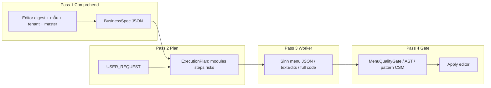

### Pass 1 — Comprehend (suy luận nghiệp vụ)

**Input slot (weak-5gb cap):**

| Slot | Max chars (5GB) | Nội dung |
|------|-----------------|----------|
| `[SYSTEM_MASTER_DIGEST]` | 2400 | Menu: `ai_menu_structure_runtime` (excerpt) + compact + dev_workflow; Code: `ai_code_runtime_compact` |
| `[ACTIVE_EDITOR_DIGEST]` | 6000 | Menu: id, label, type_form, table, trigger, i18n gap; Code: symbols + anchors |
| `[SAMPLE_MENU_DIGEST]` | 4000 | Compact tree từ attachment / sample_menu_compact |
| `[SAMPLE_CODE_DIGEST]` | 6000 | Symbol list + lifecycle/API excerpts — **không** full file |
| `[TENANT_RAG]` | 2800 | Roles, branches, domain rules (Lucene top-K) |
| `[USER_REQUEST]` | 3200 | Yêu cầu user nguyên văn (delta) |

**Output `BusinessSpec` (JSON nội bộ, không stream user):**

```json
{
  "domain_summary": "Quản lý đơn hàng B2B — sau merge hiện trạng + yêu cầu khách",
  "existing_business_summary": "Menu TVP: module Kinh tế, Nghiệm thu — trigger filter status, thiếu label_en/zh một số node",
  "modules": ["Đơn hàng", "Khách hàng"],
  "tables": ["m_configs", "sys_orders"],
  "flows": ["list → form → save → approve"],
  "triggers_learned_from_sample": ["filter status=1"],
  "triggers_from_current_editor": ["trigger.filter", "trigger.load_db"],
  "code_patterns_from_sample": ["ctx.helperApi.post"],
  "code_patterns_from_current_editor": ["ctx.helperApi", "timerRegistry"],
  "user_delta": "Bổ sung trigger đầy đủ + nhãn 3 ngôn ngữ cho menu và cột bảng",
  "assumptions": ["Giữ cấu trúc module hiện có"],
  "risks": ["Menu lớn — worker dùng region plan"]
}
```

**Triển khai:** `AiGreenfieldBusinessDesignService.runComprehensionPipeline(...)` — gọi `generateContentFast` **một lần**, max-tokens ≈ **512**, temp thấp.

**SSE (Composer):** `stage=business_comprehend` (`existingBusinessSummary`, `modules=N`) → `stage=business_plan` (`stepCount`, `targetSymbols`).

### Pass 2 — Plan (lập kế hoạch đầy đủ)

**Input:** `BusinessSpec` + contract lane (menu vs code) + `operation_scenario` (`new_build` | `incremental_update`).

**Output `ExecutionPlan` (JSON nội bộ):**

```json
{
  "scenario": "incremental_update",
  "steps": [
    { "id": "s1", "action": "patch_menu_trigger", "target": "node order_list", "fields": ["trigger.filter"] },
    { "id": "s2", "action": "textEdits", "symbols": ["loadOrderGrid", "onSaveOrder"], "lines_hint": "5810-5920" }
  ],
  "output_contract": "patches | textEdits | full_code",
  "acceptance": ["Trigger khớp mẫu order module", "Label vi/en/zh đủ 3 ngôn ngữ"]
}
```

**Triển khai đích:** tái sử dụng `AiEditTaskPlannerService.plan(...)` + enrich từ `BusinessSpec`; menu dùng `detected_modules` / `detected_tables` từ `AiMenuDesigner` payload.

**SSE:** `stage=business_plan`, `sliceCount`, `targetSymbols` — **1 dòng** Composer (PHẦN U).

### Pass 3 — Worker (sinh output)

| Lane | Greenfield (editor trống) | Có editor + mẫu |
|------|---------------------------|-----------------|
| Menu | `{ "menu": [FULL_TREE] }` từ Plan + master prompt | `patches` hoặc full tree incremental |
| Code | `{ "code": "..." }` scaffold CSM | `textEdits` 1-based trên **full** `currentCode` |

**Prompt worker chỉ nhận:** `BusinessSpec` (rút gọn ≤2k chars) + `ExecutionPlan` + excerpt editor (region plan) — **không** nhét lại full mẫu.

#### Pass 3b — Scaffold Assemble (greenfield menu, v3.13 · PHẦN AD.3.2)

Khi Worker LLM trả menu **mỏng** (`isThinGreenfieldMenuForRequest`: request “đầy đủ” + `<12` node hoặc `<8000` chars):

1. `enrichBusinessSpecForMenuGreenfield()` — bổ sung `planned_structure[]` từ từ khóa USER_REQUEST (XNT, công nợ, báo cáo).
2. `buildGreenfieldMenuScaffoldJson()` — Java ráp **1 node / module** với `table[]`, `trigger` object, nhóm báo cáo.
3. `maybeApplyGreenfieldMenuScaffold()` — thay menu LLM nếu scaffold có nhiều node hơn.

**Ưu tiên fallback:** Scaffold (12+ node) **trước** deterministic seed 1-module (`deterministic-seed-fallback.menu-greenfield`).

```properties
ai.local.greenfield.menu-scaffold-enabled=true
```

### Pass 4 — Gate + retry có kiểm soát

| Gate | Fail → |
|------|--------|
| `MenuQualityGateService` | Retry worker **1 lần** với lỗi gate trong prompt; vẫn fail → `need_more_context` |
| Code AST / pattern CSM | `tryEditFocusedLocalFallback` → deterministic lifecycle (PHẦN F) |
| Model echo schema | `validateOrFallbackLocal` + seed scaffold (menu 1-module / code header CSM) |

## AC.4 Slot budget — đảm bảo ổn định 5GB / 2 CPU

| Quy tắc | Giá trị local-5gb |
|---------|-------------------|
| Infer LLM song song | **max-concurrent-requests=1** |
| Comprehend + Plan + Worker | **Tuần tự** — không 3 infer cùng lúc |
| Tổng prompt 1 infer | ≤ **32000** chars (`ai.local.llama.max-prompt-chars`) |
| Worker effective prompt weak | ≤ **18000** (`weak-profile.local-provider.max-prompt-chars`) |
| Comprehend max-tokens | **512** |
| Plan (planner) | Heuristic + 0–1 infer ngắn |
| Worker max-tokens | **768** (edit) |
| Mẫu menu/code raw | Index Lucene → top-K vào `[RETRIEVED_CONTEXT]` — **không** paste full vào prompt |
| Mẫu >45k chars | Async vector ingest; request hiện tại dùng digest + region plan |
| Vision sidecar | On-demand; **unload** sau scan — không cùng lúc Comprehend |
| JVM heap | **1536m** — `./run-server.sh`, profile `local-5gb` |

**Load shedding:** `ai.local.llama.load-shed.enabled=true` — từ chối infer mới khi free heap <384MB; trả message rõ ràng, không treo SSE.

## AC.5 Hợp đồng với Lane 1 & 2

| Tình huống | Kịch bản | `operation_scenario` | Output contract |
|------------|----------|---------------------|-----------------|
| Không menu editor, **không** mẫu | **A** | `new_build` | Full `{ "menu": [...] }` + seed fallback |
| Không menu editor + có mẫu menu | **B** | `new_build` | Full tree bám pattern mẫu |
| Có menu editor + mẫu + sửa | **B/C** | `incremental_update` | Full tree hoặc `patches` |
| Không code editor, **không** mẫu | **A** | greenfield code | `{ "code": "..." }` scaffold CSM |
| Không code editor + có mẫu code | **B** | greenfield code | `{ "code": "..." }` clone pattern |
| Có code editor + mẫu + sửa | **C** | incremental | `textEdits` (ưu tiên) |
| Có **cả** mẫu menu + mẫu code | **B** | theo lane | Plan nêu thứ tự deliverable; Worker tuần tự |

**Frontend bắt buộc gửi:**

- Menu: `buildAiMenuGeneratePayload` / `buildAiMenuRefinePayload` — đã có `sample_menu_compact`, `detected_modules`
- Code: attachment `contextRole` đúng + `authoritative=true` cho spec/mẫu chính

## AC.6 File triển khai (Cursor checklist)

| # | File | Việc |
|---|------|------|
| 1 | `AiGreenfieldBusinessDesignService.java` | Detect scenario, digest editor/mẫu/system/tenant, Pass 1–2 | ✅ v3.9 |
| 2 | `AiAssistantGatewayService.java` | Contract COMPREHEND + GREENFIELD + `buildSystemMasterDigestCompact` | ✅ v3.9 |
| 3 | `ApiSpringController.java` | Hook trước orchestration; SSE `business_comprehend` / `business_plan` | ✅ v3.9 |
| 4 | `AiEditTaskPlannerService.java` | Enrich plan từ `BusinessSpec` |
| 5 | `AiLocalOrchestrationService.java` | Ingest mẫu attachment trước RAG search |
| 6 | `application-local-5gb.properties` | `ai.local.greenfield.*`, token caps |
| 7 | `AiMenuDesigner.tsx` | Đảm bảo sample + scenario luôn gửi khi có mẫu |
| 8 | `CodeEditor.tsx` | Gợi ý attach mẫu module khi editor trống |

## AC.7 Checklist nghiệm thu (local-5gb server)

| # | Test | Pass |
|---|------|------|
| AC.1 | Đính kèm mẫu menu JSON + yêu cầu "thêm module X giống mẫu" → JSON có trigger/table/3 ngôn ngữ | ☐ |
| AC.2 | Đính kèm mẫu code + yêu cầu "clone pattern list/form" → full code hoặc textEdits apply | ☐ |
| AC.3 | Editor trống + mẫu code + yêu cầu tạo module mới → output không rỗng, gate pass | ☐ |
| AC.3b | Editor trống + **không mẫu** + mô tả nghiệp vụ → menu/code scaffold apply (kịch bản A) | ☐ |
| AC.3c | Mẫu menu **+** mẫu code + yêu cầu → BusinessSpec merge đủ cả hai | ☐ |
| AC.4 | Editor **có** menu 80k+ + yêu cầu sửa trigger/i18n → SSE `business_comprehend` + plan steps | ☐ |
| AC.4b | Editor **có** code 400k+ (KQXS) + analyze nghiệp vụ → `business_comprehend` + prose (không stats echo) | ☐ |
| AC.5 | `existingBusinessSummary` trong SSE phản ánh nghiệp vụ editor (không rỗng) | ☐ |
| AC.6 | 2 request edit liên tiếp — không OOM, thời gian <3 phút/request typ. | ☐ |
| AC.7 | Không load vision + worker + comprehend cùng lúc (RAM 5GB) | ☐ |

## AC.8 Cấm (DO NOT) — 5GB

| Cấm | Lý do |
|-----|-------|
| Paste full mẫu menu 200+ node vào prompt worker | OOM + model truncate |
| Bỏ qua Comprehend khi có attachment authoritative | Patch sai nghiệp vụ |
| Song song 2+ `generateContentFast` trên 1 JVM 5GB | RAM spike |
| Trả `success` + `patches:[]` khi user yêu cầu sửa cụ thể | Gate phải reject |
| Dùng cloud fallback khi `ai.local.only.enabled=true` | Policy local-only |
| Echo Tier-3 orchestration stats (`intentKeywords`, `codeSymbols`) làm câu trả lời analyze | Model 1.5B hay echo metadata — guardrail bắt buộc |
| Selection-only prompt trên analyze nghiệp vụ file lớn | Chỉ thấy ~50 dòng đầu — phải condensed full file |

---

# PHẦN Y — LMKT LANE (`auto-lmkt.js` · contract ổn định)

> **Nguyên tắc:** Client LMKT giữ contract HTTP/JSON ổn định; ưu tiên sửa backend (`ApiSpringController`, `AiSeoContentPipelineService`, `AiAssistantGatewayService`). Thay đổi JS chỉ khi bắt buộc (ví dụ sync one-shot, `window` flags DynamicCode).

## Y.1 Kiến trúc tổng quan


## Y.2 HTTP contract (bắt buộc khớp `index.ts`)

### Endpoint

`POST /ai-generate-seo-content` → `ApiSpringController.getObjectFromAI()`

### Sync request (prompt &lt; 8000 ký tự)

```json
{
  "prompt": "<full prompt string>",
  "taskType": "seo_content"
}
```

### Async request (prompt ≥ 8000 ký tự hoặc `preferAsync`)

**Submit:**

```json
{
  "prompt": "...",
  "mode": "submit",
  "async": true,
  "taskType": "seo_content"
}
```

**Poll:**

```json
{ "mode": "status", "jobId": "ai-job-<uuid>" }
```

**Cancel (optional):**

```json
{ "mode": "cancel", "jobId": "ai-job-<uuid>" }
```

### Response envelope (client đọc cả `data` lẫn `result`)

Backend `StandardResponse` trả flat JSON:

```json
{
  "code": 200,
  "success": true,
  "message": "Thành công",
  "data": { /* parsed AI JSON */ }
}
```

Client unwrap (không đổi):

```javascript
// auto-lmkt.js — mọi luồng AI
let payload = result.data?.result || result.result || result.data;

// parseCreativeParamsResponse
normalized = normalized.result || normalized.data || normalized;
```

**Async completed:** `status` response `data.result` = toàn bộ envelope sync `{ success, code, data, message }`. `index.ts` trả thẳng object đó cho caller.

### Lỗi + rawContent fallback

Khi model trả text không parse được JSON:

```json
{
  "code": 200,
  "success": false,
  "message": "AI trả về dữ liệu không phải JSON hợp lệ",
  "rawContent": "<assistant text gốc>"
}
```

`auto-lmkt.js` `processContent()` tự `parseSeoJsonString(rawContent)` — backend **phải** giữ field `rawContent`.

## Y.3 Ba sub-lane trong cùng endpoint

| Sub-lane | Trigger | System prompt | Output JSON |
|----------|---------|---------------|-------------|
| **Creative params** | Prompt chứa `[CREATIVE_PARAMS_REQUEST]` | `CREATIVE_PARAMS_SYSTEM_PROMPT` | Xem Y.4 |
| **LMKT custom article** | Prompt có `"content"`, `content_en`, anti-AI schema, … | `LMKT_SEO_SYSTEM_PROMPT` | Xem Y.5 |
| **Simple SEO** | `PROMPT_GENERATE_POST` / html_content-only | `SEO_SYSTEM_PROMPT` (3 field) | `{ title, description, html_content }` |

Routing:

1. `isSeoContentTask(params, prompt)` — `taskType` chứa `seo` **hoặc** heuristic SEO trong prompt
2. `fetchAiRawContent()` → `generateSeoContent()` — **không** menu recovery / code master
3. `isCreativeParamsRequest(prompt)` → lane creative (token cap ≈ 384, temp ≈ 0.05)

## Y.4 Creative params (`requestCreativeParams`)

### Call sites trong `auto-lmkt.js` (không đổi)

| Hàm | KIND | Mục đích |
|-----|------|----------|
| `processContent()` | `anti_ai` | Chọn persona/pattern trước anti-AI article |
| `createServiceCategoryContent()` | `category_landing` | Content trang danh mục dịch vụ |
| (prompt builder) | `facebook_post` | FB post creative angle |

### Prompt marker

```
[CREATIVE_PARAMS_REQUEST]
SEED: <unique>
KIND: anti_ai | facebook_post | category_landing
...
Output JSON: { ... }
Allowed personaKey: ...
```

### Schema bắt buộc (backend validate + fallback)

| KIND | Trường bắt buộc |
|------|-----------------|
| `anti_ai` | `personaKey`, `contentPattern`, `sellingIntent`, `hook`, `angle`, `tone` |
| `facebook_post` | `angle`, `persona.{label,tone,focus}` |
| `category_landing` | `angle`, `persona`, `role`, `style`, `avoid`, `focus` |

### Fallback deterministic

Khi model 1.5B echo schema / JSON invalid:

- `buildDeterministicCreativeParamsFallback(SEED, KIND)` — hash seed → chọn allowlist từ prompt
- Config: `ai.seo.creative-params.fallback-enabled=true`
- Cache stale creative entry bị bypass nếu shape invalid

### Client parse

```javascript
parseCreativeParamsResponse(response)
  → null nếu success===false
  → unwrap result/data → JSON.parse nếu string
```

Backend **phải** trả `{ success: true, data: { personaKey, ... } }` — không bọc thêm `data.result`.

## Y.5 Full content generation (các luồng chính)

### Call sites `generateSeoContentWithPrompt` trong `auto-lmkt.js`

| Hàm | Schema output chính |
|-----|---------------------|
| `processContent()` | Anti-AI: `title`, `content`, `content_en`, `content_zh`, `description*`, `keywords*`, `excerpt*`, BĐS attrs |
| `createServiceDetailPost()` | `parseAIResponse()` — bắt buộc có `content` hoặc `content_en/zh` |
| `createServiceCategoryContent()` | Category multi-lang content object |
| `generateFacebookPostContent()` | `{ facebook_post, hashtags[] }` |
| `generateAdsCreativeWithAI()` | `{ headline, description, message, cta, keywords[] }` |
| Bulk / manual flows (~L18809, L19899) | Custom prompt → JSON theo prompt |

### Anti-AI schema (quan trọng — **không** phải html_content-only)

Prompt yêu cầu field `content` (HTML), không `html_content`. Backend:

- `resolveSeoSystemPrompt()` → `LMKT_SEO_SYSTEM_PROMPT` khi prompt có `"content"`
- `normalizeLmktContentFieldAliases()` — nếu model trả `html_content`, copy sang `content` (và ngược lại cho simple SEO)

### Client extract pattern (giữ nguyên)

```javascript
let seo = result.data?.result || result.result || result.data;
if (typeof seo === 'string') seo = parseSeoJsonString(seo);
if (!result.success) {
  const raw = result?.rawContent || result?.data?.rawContent;
  if (raw) seo = parseSeoJsonString(raw);
}
buildDetail(ctx, seo, images, videos, opts);
```

### Trường tối thiểu để lưu DB

| Luồng | Bắt buộc |
|-------|----------|
| Anti-AI / service detail | `title` + (`content` hoặc `content_en/zh`) |
| Simple SEO (`index.ts`) | `title`, `description`, `html_content` |
| Facebook post | `facebook_post` + 4–6 hashtags |
| Ads creative | `headline`, `description`, `message`, `cta`, `keywords` |

## Y.6 Async job contract

| Giai đoạn | Backend `data` payload |
|-----------|------------------------|
| Submit OK | `{ jobId, status: "queued", pollAfterMs, progress }` |
| Running | `{ jobId, status: "running", progress, elapsedMs }` |
| Completed | `{ jobId, status: "completed", result: { success, code, data, message } }` |
| Failed | `{ jobId, status: "failed", result: { success: false, message, errorCode? } }` |

Giới hạn:

- `ai.prompt.max-chars` (mặc định 3_000_000) — endpoint guard
- Client async khi prompt ≥ `VITE_AI_ASYNC_THRESHOLD_CHARS` (8000)
- Client poll tối đa `VITE_AI_ASYNC_MAX_WAIT_MS` (45 phút)

## Y.7 Config backend LMKT

```properties
# Creative params lane
ai.seo.creative-params.max-tokens=384
ai.seo.creative-params.temperature=0.05
ai.seo.creative-params.fallback-enabled=true

# SEO one-shot pipeline + article token cap
ai.seo.pipeline.enabled=true
ai.seo.article.max-tokens=8192

# Prompt size (sync + async submit)
ai.prompt.max-chars=3000000

# Local inference
ai.local.llama.max-prompt-chars=500000
ai.local.llama.max-prompt-chars-hard-cap=1000000
```

## Y.8 Hàm backend — checklist implement

| Hàm | File | Vai trò |
|-----|------|---------|
| `getObjectFromAI()` | ApiSpringController | Entry sync/async/status/cancel |
| `isSeoContentRequest()` | ApiSpringController | Delegate `isSeoContentTask` |
| `fetchAiRawContent()` | ApiSpringController | SEO → `generateSeoContent`, không menu recovery |
| `populateAiResponseFromRawContent()` | ApiSpringController | Unwrap chat.completion → parse JSON → `{ success, data }` |
| `isSeoContentPayload()` | ApiSpringController | `title` + (`content` **or** `html_content`) |
| `isCreativeParamsPayload()` | ApiSpringController | personaKey/pattern hoặc angle+persona |
| `normalizeLmktContentFieldAliases()` | ApiSpringController | Alias cross-field trước response |
| `generateSeoContent()` | AiAssistantGatewayService | Route creative vs article |
| `resolveSeoSystemPrompt()` | AiAssistantGatewayService | LMKT flexible vs simple SEO |
| `generateCreativeParams()` | AiAssistantGatewayService | Small JSON + validate + fallback |
| `isValidCreativeParams()` | AiAssistantGatewayService | Allowlist từ prompt |
| `runAntiAiOneShot()` | AiSeoContentPipelineService | Creative + article nội bộ, 1 response |
| `extractSeoContext()` | AiSeoContentPipelineService | Parse `seoContext` từ params |

## Y.9 Cấm (LMKT lane)

```txt
✗ Sửa auto-lmkt.js hoặc index.ts để “fix” backend
✗ Inject ai_code_master_prompt / menu master vào SEO endpoint
✗ Trả textEdits / SSE code-stream cho LMKT
✗ Ép html_content-only system prompt khi user prompt định nghĩa "content"
✗ Bỏ rawContent khi JSON parse fail (client cần fallback)
✗ Ghi menu learning memory sau SEO request (chỉ menu lane)
```

## Y.10 Test checklist (LMKT contract)

| # | Test | Pass |
|---|------|------|
| 1 | `requestCreativeParams('anti_ai')` → JSON hợp lệ hoặc seed fallback | ☐ |
| 2 | `processContent()` anti-AI → `data.content` có HTML, lưu DB OK | ☐ |
| 3 | Prompt ≥ 8k → async submit/poll → cùng envelope sync | ☐ |
| 4 | Model trả markdown JSON → parse OK hoặc rawContent fallback | ☐ |
| 5 | `PROMPT_GENERATE_POST` simple SEO → `html_content` (+ alias `content`) | ☐ |
| 6 | Facebook post → `facebook_post` + hashtags | ☐ |
| 7 | Creative cache stale → bypass + regenerate/fallback | ☐ |
| 8 | Local-only bật, llama down → `LOCAL_PROVIDER_UNAVAILABLE` | ☐ |
| 9 | `seoPipeline=anti_ai_one_shot` → 1 HTTP, progress 2 bước, JSON 12 field | ☐ |
| 10 | `VITE_AI_SEO_ONE_SHOT=false` → fallback 2-call cũ (creative + article) | ☐ |

## Y.11 SEO one-shot pipeline (`anti_ai_one_shot`) — v3.5

> **Mục tiêu UX:** Người dùng LMKT **gửi 1 lần, chờ đến xong, nhận 1 lần** bài viết anti-AI chuẩn SEO. Backend chạy 2 bước inference **nội bộ** (creative params → article). **Tách biệt hoàn toàn** `/ai-code-stream` (menu/code JSON).

### Lane matrix (không trộn · **chỉ model bundled**)

> **Quy tắc cứng:** Mọi lane text dùng **một file duy nhất**  
> `backend/csm_datas/ai_local/model/qwen2.5-coder-1.5b-instruct-q4_k_m.gguf`  
> **Không** tải 7B/0.5B/model ngoài repo. Vision (`Qwen2.5-VL-3B`, SmolVLM2) **không** route SEO/chat.

| Lane | Endpoint | Client | Model (bundled) |
|------|----------|--------|-----------------|
| Code / menu edit | `POST /ai-code-stream` (SSE) | `AiAssistantChat.tsx` | `qwen2.5-coder-1.5b` Q4_K_M |
| SEO creative params | `POST /ai-generate-seo-content` + `[CREATIVE_PARAMS_REQUEST]` | pipeline / legacy | Cùng 1.5B · max 384 tok |
| SEO bài viết LMKT | Cùng endpoint, `LMKT_SEO_SYSTEM_PROMPT` | `generateSeoAntiAiOneShot()` sync | Cùng 1.5B · max **1536** tok |
| SEO one-shot | `seoPipeline: anti_ai_one_shot` | `generateSeoAntiAiOneShot()` | Cùng 1.5B · 2 bước nội bộ · VI **900–1200 từ** |
| **Guest web chat** | Socket.IO `chat` | `ChatHistoryContext` | Cùng 1.5B · **192 tok** · `generateContentFast` |

**Máy chủ yếu (2 CPU, ~5GB RAM):** Guest chat `max-concurrent=1`; SEO **sync 1 HTTP** (không async job poll); embedding tách `nomic-embed-text-v1.5.Q4_K_M.gguf`.

### Lane UX matrix (client vs backend)

| Lane | Client UX | Backend nội bộ | Async job poll |
|------|-----------|----------------|----------------|
| Code / menu | SSE `/ai-code-stream` | planner + edits | Không (SSE) |
| SEO one-shot / SEO prompt | **1 POST, chờ JSON cuối** | creative → article (2 inference) | **Không** (`ai.seo.client-sync-only=true`) |
| Guest web chat | Socket `message` event | `generateContentFast` sync | **Không** |

### HTTP contract one-shot

**Sync (mặc định — khuyến nghị):**

```json
{
  "seoPipeline": "anti_ai_one_shot",
  "taskType": "seo_content",
  "seoContext": {
    "industry": "bat-dong-san",
    "topic": "<nội dung gốc Zalo/FB>",
    "domainKey": "lmkt",
    "property": "<project>",
    "location": "<optional>",
    "business": "<optional>"
  }
}
```

Client: `generateSeoAntiAiOneShot()` — **không** gửi `mode/submit/async` trừ khi debug với `preferAsync: true` (server vẫn có thể ép sync khi `ai.seo.client-sync-only=true`).

**Legacy async (chỉ debug / menu lane):** `mode: submit`, `async: true` — **không dùng** cho SEO production.

**Không cần `prompt`** khi `seoPipeline` set — backend tự build creative + article prompt.

### Backend flow

```txt
Client 1× POST /ai-generate-seo-content
  → AiSeoContentPipelineService.runAntiAiOneShot()
      Step 1: generateSeoContent([CREATIVE_PARAMS_REQUEST])  ~384 tokens
      Step 2: generateSeoContent(compact anti-AI article)    ~8192 tokens
  → populateAiResponseFromRawContent → { success, data: { title, content, ... } }
```

**Service:** `AiSeoContentPipelineService.java`  
**Config:**

```properties
ai.seo.pipeline.enabled=true
ai.seo.client-sync-only=true
ai.seo.article.max-tokens=1536
ai.seo.article.target-words-vi=600-900
```

### Client (`processContent` anti-AI)

- Mặc định: `generateSeoAntiAiOneShot()` qua `window.csmAI` (DynamicCode page expose).
- Tắt one-shot (legacy 2 HTTP): `VITE_AI_SEO_ONE_SHOT=false`.
- Các luồng khác (`facebook_post`, `category_landing`, ads) **giữ nguyên** `generateSeoContentWithPrompt`.

### Cấm bổ sung

```txt
✗ Route SEO one-shot qua /ai-code-stream hoặc code master prompt
✗ Tải model ngoài backend/csm_datas/ai_local/model (7B, 0.5B, API cloud…)
✗ Dùng Qwen2.5-VL-3B / SmolVLM2 cho SEO text hoặc guest chat (vision-only)
✗ Ép bài 1500–2000 từ trên 1.5B — dùng target 900–1200 từ + JSON đủ 12 field
```

---

# PHẦN AA — GUEST WEB CHAT LANE (Socket.IO · fast local AI)

> **Mục tiêu:** Khách truy cập website chat qua widget → hệ thống **tự trả lời nhanh** bằng local AI khi admin chưa online, **không quá tải** llama instance dùng chung với code-stream/SEO long-form.

## AA.1 Kiến trúc tổng quan (tách lane)

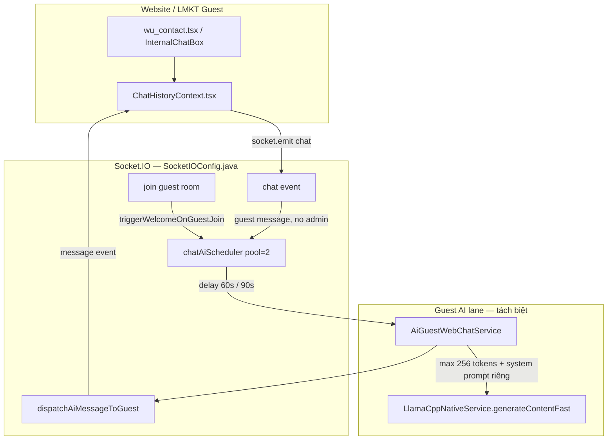

**Không trộn với:**

| Lane | Vì sao tách |
|------|-------------|
| `/ai-code-stream` | SSE textEdits, code master prompt, orchestration nặng |
| `/ai-generate-seo-content` | JSON 12 field, 8192 tokens, async job dài |
| Guest chat | Plain text ≤280 chars, fast path, scheduled debounce |

## AA.2 Hai sub-flow tự động

| Flow | Trigger | Delay | Event type | Mục đích |
|------|---------|-------|------------|----------|
| **Auto welcome** | Guest join room (chưa có phone, chưa có history) | `ai.guest-chat.welcome-delay-ms` (60s) | `ai_auto_welcome` | Chào + hỏi nhu cầu + mời liên hệ |
| **No-admin reply** | Guest gửi tin, admin human chưa trả lời | `ai.guest-chat.no-admin-reply-delay-ms` (90s) | `ai_auto_no_admin_reply` | Giữ khách, bám ngữ cảnh hội thoại |

**Cancel rules:**

- Admin (human) reply → `cancelGuestNoReplyTask`
- Guest disconnect → cleanup transient + notify admin
- Welcome cooldown 24h / app+phone / guestKey — tránh spam

## AA.3 AiGuestWebChatService — overload protection

| Guard | Config / hành vi |
|-------|------------------|
| Bật/tắt lane | `ai.guest-chat.enabled=true` |
| Max inference đồng thời | `ai.guest-chat.max-concurrent=1` (Semaphore) |
| Output cap | `ai.guest-chat.max-output-tokens=192` → `generateContentFast` |
| Per-guest cooldown | `ai.guest-chat.per-guest-cooldown-ms=45000` |
| Circuit breaker | `llama.isCircuitOpen()` → fallback text ngay |
| System prompt riêng | `ai.guest-chat.system-prompt` — **không** dùng `ai.local.llama.system-prompt` (code assistant) |
| Saturated / down | Trả fallback VI/EN/ZH/… — chat vẫn hoạt động |

## AA.4 Prompt & sanitize

| Hàm | Vai trò |
|-----|---------|
| `buildWelcomePrompt()` | Chào guest mới, max ~180 ký tự, đúng locale |
| `buildNoAdminReplyPrompt()` | Bám tin khách + 8 message context gần nhất |
| `sanitizeAutoReplyText()` | Chặn prompt leakage, `[placeholder]`, appId leak |
| `fallbackWelcome()` / `fallbackNoAdminReply()` | Template đa ngôn ngữ khi AI fail |

**Persist:** Auto messages queue in-memory (`pendingAutoMessagesByGuest`) → flush DB khi guest reply lần đầu.

## AA.5 Frontend contract (không đổi)

| File | Vai trò |
|------|---------|
| `frontend-web/src/contexts/ChatHistoryContext.tsx` | Guest/admin send `socket.emit("chat", msg)` |
| `lmkt/src/contexts/ChatHistoryContext.tsx` | LMKT guest-only variant |
| `frontend-web/src/pages/website/wu_contact.tsx` | Widget liên hệ |
| `InternalChatBox.tsx` | Admin xem + trả lời |

Guest room: `guest:{appId};{guestSessionId}` · Admin room: `app:{appId}`

## AA.6 Config (`application.properties`)

```properties
ai.guest-chat.enabled=true
ai.guest-chat.max-concurrent=1
ai.guest-chat.max-output-tokens=192
ai.guest-chat.per-guest-cooldown-ms=45000
ai.guest-chat.welcome-delay-ms=60000
ai.guest-chat.no-admin-reply-delay-ms=90000
ai.guest-chat.welcome-cooldown-ms=86400000
ai.guest-chat.system-prompt=Bạn là tư vấn viên website...
```

## AA.7 File backend

| File | Vai trò |
|------|---------|
| `SocketIOConfig.java` | Socket events, scheduling, dispatch, room join |
| `AiGuestWebChatService.java` | Local fast inference + prompts + guards |
| `LlamaCppNativeService.java` | `generateContentFast(prompt, cap, systemPromptOverride)` |
| `ChatPersistenceService.java` | History for context + persist after guest reply |

## AA.8 Model — chỉ bundled (`csm_datas/ai_local/model`)

| File GGUF | Vai trò | Dùng cho lane |
|-----------|---------|---------------|
| `qwen2.5-coder-1.5b-instruct-q4_k_m.gguf` | **Text LLM duy nhất** | Code, SEO, guest chat |
| `nomic-embed-text-v1.5.Q4_K_M.gguf` | Embedding RAG | Memory — **tách** khỏi chat weights |
| `Qwen2.5-VL-3B-Instruct-Q4_K_M.gguf` | Vision/OCR | Multimodal — **không** SEO/chat |
| SmolVLM2 + mmproj | Vision nhẹ | Multimodal — **không** SEO/chat |

**Guest chat trên 1.5B:** `generateContentFast` + `ai.guest-chat.system-prompt` + max **192** output tokens + `max-concurrent=1`.

**Priority khi tải cao:** Guest saturated → fallback text ngay; SEO sync giữ 1 HTTP (semaphore llama); code/menu vẫn SSE — không trộn lane.

## AA.9 Cấm

```txt
✗ Route guest chat qua /ai-code-stream hoặc /ai-generate-seo-content
✗ Inject ai_code_master_prompt / menu master vào guest welcome
✗ Gọi generateContent (full tokens) thay vì generateContentFast
✗ Bỏ fallback text khi circuit open / saturated
✗ Persist auto message trước khi guest reply (trừ flush sau reply)
```

## AA.10 Test checklist

| # | Test | Pass |
|---|------|------|
| 1 | Guest join → sau 60s nhận welcome (hoặc fallback nếu AI down) | ☐ |
| 2 | Guest gửi tin, admin không trả lời → sau 90s AI reply bám context | ☐ |
| 3 | Admin trả lời trước 90s → skip AI no-reply | ☐ |
| 4 | Circuit open → fallback, không hang socket | ☐ |
| 5 | 3 guest cùng lúc, max-concurrent=1 → 2 guest fallback text, không crash | ☐ |
| 6 | Prompt leak / `[Ten]` → sanitize → fallback | ☐ |
| 7 | Guest reply → auto messages flush DB | ☐ |

---

# PHẦN Z — AGENT HARNESS (6 THÀNH PHẦN + 3 BOTTLENECK)

> **Mục tiêu:** CSM AI Local không chỉ “chạy được” mà phải **truy vết được** theo mô hình agent harness chuyên nghiệp: Memory → Context → Reasoning → Skills → Orchestration → Governance → Environment.

## Z.1 Sáu thành phần (R/M/C/S/O/G) — map sang CSM

| Thành phần | Vai trò harness | Implementation CSM | File chính |
|------------|-----------------|-------------------|------------|
| **R — Reasoning** | Foundation model | `LlamaCppNativeService` + `AiAssistantGatewayService.buildLocalMinimalPrompt` | Gateway, JNI |
| **M — Memory** | Lưu tri thức bền, truy hồi có tin cậy | Lucene KNN `AiBusinessMemoryVectorService`, menu learning, knowledge pack | PHẦN R |
| **C — Context** | Dựng input mỗi turn (chọn lọc, không nhồi hết) | Region plan, Edit Task Planner slice, focused context, prompt budget | `ApiSpringController`, `AiEditTaskPlannerService` |
| **S — Skills** | Router tool/subagent, dispatch + verify | Deterministic lifecycle, multi-slice, symbol micro, analyze fast path | `tryLocalLargeCodeEditPipeline` |
| **O — Orchestration** | Vòng điều khiển | `AiLocalOrchestrationService.orchestrateResilient`, intent classifier, workflow advisor | Orchestration service |
| **G — Governance** | Verify + permission + audit + rollback | AST gate, final output gate, semantic sandbox, header zone protect, undo snapshot UI | `ApiSpringController` gates |

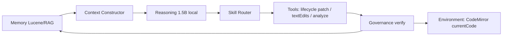

## Z.2 Ba bottleneck hệ thống — trạng thái CSM

| Bottleneck | Không phải… | Mà là… | CSM đã có | Còn thiếu / roadmap |
|------------|-------------|--------|-----------|---------------------|
| **Context Governance** | Dung lượng | Chọn lọc + truy vết | Region plan, planner slice, `promptOriginal→Final`, `RequestContextTracer` | UI drill-down từng vùng đã chọn (Composer ⏳) |
| **Trustworthy Memory** | Lưu trữ | Tin cậy khi truy hồi | ACL filter, `AiRetrievalPolicyEngine`, trust score trong harness | BM25 hybrid + citation line (Phase 3) |
| **Skill Routing** | Có tool | Dispatch đúng + verify | Pipeline lifecycle → micro → multi-slice; harness `dispatchedSkill` | Auto-retry skill khác khi verify fail (⏳) |

## Z.3 Agent Harness Trace (telemetry)

Mỗi request `ai-code-stream` khi hoàn tất emit:

**SSE:** `stage=agent_harness_trace`  
**Completion:** `agentHarness` object

```json
{
  "version": "1",
  "requestId": "job_…",
  "bottlenecks": {
    "contextGovernance": {
      "selectedPromptChars": 12000,
      "editorChars": 371408,
      "compressionRatio": 0.032,
      "regionPlanApplied": true,
      "traceRequestId": "job_…"
    },
    "trustworthyMemory": {
      "scopedRagChars": 2400,
      "trustScore": 78,
      "trusted": true,
      "retrievalPolicyId": "symbol_focused"
    },
    "skillRouting": {
      "dispatchedSkill": "deterministic_lifecycle_webview",
      "verified": true,
      "appliedTextEdits": 3
    }
  },
  "harness": {
    "memory": { "status": "trusted", "detail": "…" },
    "context": { "status": "compacted", "detail": "371408 → 12000 prompt chars" },
    "reasoning": { "status": "local", "model": "local_provider" },
    "skills": { "status": "verified", "skill": "deterministic_lifecycle_webview" },
    "orchestration": { "status": "active", "planSteps": 2 },
    "governance": { "status": "passed", "reasonCode": "code_validated_meta" }
  },
  "summaryVi": "Ngữ cảnh: 12000/371408 ký tự · Memory trust 78% · Skill: deterministic_lifecycle_webview · Governance: đạt"
}
```

**Service:** `AiAgentHarnessTraceService.java`  
**Frontend:** Composer activity 🧭 hiển thị `summaryVi` trong panel **Đã khám phá**.

## Z.4 Skill dispatch matrix (edit code lớn)

| Thứ tự | Skill | Khi nào | Verify |
|--------|-------|---------|--------|
| 1 | `deterministic_lifecycle_webview` | Yêu cầu lifecycle + có `fnRemoveTab` | AST gate + SSE apply + governance |
| 2 | `symbol_micro_edit` | Lifecycle nhưng deterministic skip | Per-symbol LLM ≤3 edits |
| 3 | `multi_slice_edit` | Edit Task Planner có plan | Merge + incremental AST |
| 4 | `focused_large_code_edit` | Fallback 1.5B | Relaxed verifier large file |
| 5 | `code_text_edits` | Edit thường | Standard gate |

**Quy tắc:** Weak 1.5B **không** được sửa header DynamicCode (L&lt;100) — governance `filterHeaderZoneDestructiveEdits`.

## Z.5 Governance loop (bắt buộc trước Environment)

```txt
Model output
  → parse textEdits / prose
  → validateDeterministicLineTextEdits (dry-run)
  → AST gate (paren/brace balanced)
  → runtime rules (DynamicCode: no bare require in user zone)
  → semantic sandbox (risk score)
  → final output gate
  → SSE text_edit_apply (bottom-up line order for add/insert)
  → CodeMirror Environment
  → completion agentHarness + assistantChatSummary (tiếng Việt)
```

Rollback: frontend `undoSnapshotRef` + không rollback khi gate fail **không** phá syntax (chỉ AST/unbalanced).

## Z.6 Checklist đánh giá “tạm ổn” vs harness

| # | Câu hỏi | Pass nếu |
|---|---------|----------|
| 1 | Context có được **chọn lọc** không nhồi 371k vào model? | `compressionRatio` &lt; 0.2 trên file lớn |
| 2 | Memory recall có **trust score** ≥ 55 hoặc không dùng RAG? | `trustworthyMemory.trusted=true` |
| 3 | Skill có **dispatch đúng** lifecycle khi user hỏi webview/proxy? | `dispatchedSkill=deterministic_lifecycle_*` |
| 4 | Governance **chặn** patch header/syntax hỏng? | Gate reject + không apply |
| 5 | User hiểu AI đã làm gì? | `assistantChatSummary` / harness `summaryVi` |
| 6 | CodeMirror nhận patch **đúng vùng**? | add=insert-before, navigate L fnRemoveTab |

## Z.7 Roadmap harness (không block hiện tại)

| Phase | Mục tiêu |
|-------|----------|
| Z.7.1 | Composer panel mở rộng 6 harness cards (M/C/R/S/O/G) |
| Z.7.2 | Memory trust dưới ngưỡng → tự thu RAG, chỉ dùng planner slice |
| Z.7.3 | Skill auto-fallback chain khi `skillRouting.verified=false` |
| Z.7.4 | Ghi harness trace vào `ai_telemetry` dashboard |

> **Mở rộng kiến trúc agent (3 sơ đồ user):** xem **PHẦN AD** — Trusted Knowledge pipeline, Distributed Systems Engineering, Supervisor multi-agent.

## Z.8 File liên quan

| File | Vai trò |
|------|---------|
| `AiAgentHarnessTraceService.java` | Build harness JSON |
| `ApiSpringController.java` | Emit `agent_harness_trace`, lifecycle pipeline |
| `RequestContextTracer.java` | Phase timing (orchestration, ingest, intent) |
| `AiAssistantChat.tsx` | Composer 🧭 summary |
| `AiLocalOrchestrationService.java` | O-loop + RAG tool stats |

---

# PHẦN AD — DISTRIBUTED AGENT ARCHITECTURE (3 SƠ ĐỒ KIẾN TRÚC)

> **Mục tiêu v3.13:** Đối chiếu **3 sơ đồ kiến trúc agent chuyên nghiệp** (user reference) với code CSM hiện tại — trả lời rõ **làm được gì**, **còn thiếu gì**, **bổ sung gì** để greenfield menu/code đủ nghiệp vụ (không còn 1 folder + 4 form mỏng).
>
> **Kết luận ngắn:** CSM **đã có ~70% khung** (orchestration, RAG filter, plan, gate, harness telemetry) nhưng chạy dạng **Supervisor monolithic** trong `ApiSpringController` + services — **chưa** tách process/agent riêng. Greenfield menu **đã bổ sung Pass 3 Scaffold Assemble (Java)** để bù khi LLM 7B/1.5B collapse.

## AD.0 Ba sơ đồ — tóm tắt đối chiếu

| Sơ đồ | Ý nghĩa | CSM hiện tại | Mức độ |
|-------|---------|--------------|--------|
| **1 — Trusted Knowledge pipeline** | Metadata filter → Freshness → Re-rank → Validation → Trusted output | RAG + gate + harness trust score | ✅ ~75% |
| **2 — AI Agent = Distributed Systems Engineering** | 6 trụ: Orchestration, State, Security, Evaluation, Governance, Reliability | Map PHẦN Z R/M/C/S/O/G + bottlenecks | ✅ ~65% |
| **3 — Supervisor multi-agent** | Retriever / Planner / Executor / Reviewer dưới Supervisor | Cùng request thread, role tách **logic** không tách **process** | ✅ ~70% |

---

## AD.1 Sơ đồ 1 — Trusted Knowledge Pipeline

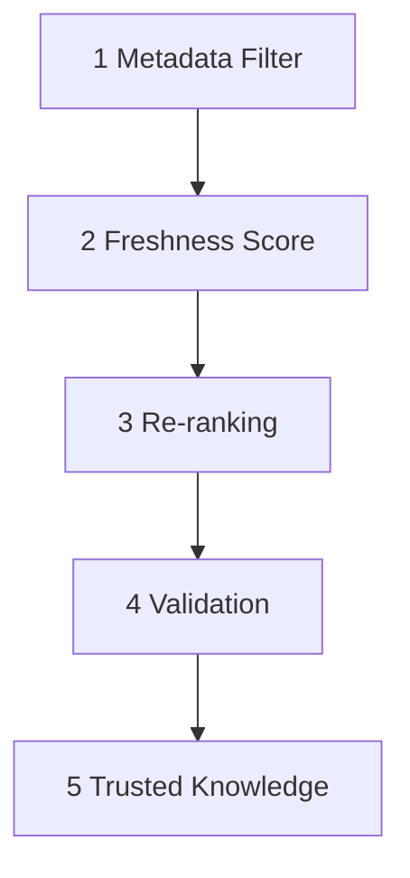

### AD.1.1 Map từng bước → CSM

| Bước sơ đồ | Ý nghĩa chuẩn | Implementation CSM | File / service | Trạng thái |
|------------|---------------|-------------------|----------------|------------|
| **1 Metadata Filter** | Lọc chunk theo scope, ACL, loại tri thức | `scopeMask` + `scopeTag` Lucene filter; `passesRetrievalAuthFilter` (acl:tenant/admin/branch/dept); exclude orchestration digest noise | `AiBusinessMemoryVectorService.buildScopeFilterQuery`, `matchesScope`, `passesRetrievalAuthFilter` | ✅ Implement |
| **2 Freshness Score** | Ưu tiên tri thức mới / editor snapshot hiện tại | `createdAtMs` boost trong `scoreHit` (+0.12 ≤15 phút, +0.05 ≤1 giờ); dynamic context ingest trước retrieve (`dyn_ctx_currentMenu`); **`freshnessScore` 0..1** trong `scopedRagTopHits` | `AiBusinessMemoryVectorService.scoreHit`, `computeFreshnessScore`, `AiLocalOrchestrationService.summarizeSearchHits` | ✅ Partial — score expose UI; rerank vẫn implicit trong KNN |
| **3 Re-ranking** | Vector top-K → lexical + domain rerank | `rerankHits` (token overlap + source boost menu/seo); `LocalAiAssistantContextService.rerankSearchHits`; `AiRetrievalPolicyEngine` adaptive topK | `AiBusinessMemoryVectorService`, `AiRetrievalPolicyEngine` | ✅ Implement |
| **4 Validation** | Schema / business rules trước khi tin output | `MenuQualityGateService.validateMenuJson` + `repairMenuTreeInPlace`; `FINAL_OUTPUT_GATE`; AST gate code; step/plan verifier | `ApiSpringController`, `MenuQualityGateService` | ✅ Implement |
| **5 Trusted Knowledge** | Chỉ đưa vào prompt / apply editor khi đạt ngưỡng tin cậy | `AiAgentHarnessTraceService` → `trustScore` ≥55 → `memoryTrusted`; gate `passesHardGate` trước completion meta | `AiAgentHarnessTraceService`, SSE `agent_harness_trace` | ✅ Partial — apply editor có thể xảy ra trước gate reject (greenfield) |

### AD.1.2 Luồng thực tế trên request menu greenfield

```txt
USER_REQUEST
  → ingest tenant org + domain rules (AiTenantKnowledgeIngestionService)
  → ingest currentMenu dyn_ctx (AiScopedContextIngestionService)
  → [1] scope filter + ACL trên vector search
  → [2] createdAt boost (implicit trong rerank)
  → [3] rerankHits + AiRetrievalPolicyEngine topK
  → Comprehend LLM → BusinessSpec + planned_structure
  → enrichBusinessSpecForMenuGreenfield (Java expand modules)
  → Worker LLM (Pass 3a)
  → maybeApplyGreenfieldMenuScaffold nếu menu mỏng (Pass 3b)
  → [4] repairMenuTreeInPlace + FINAL_OUTPUT_GATE
  → [5] harness trustScore + SSE apply CodeMirror
```

### AD.1.3 Gap & roadmap (sơ đồ 1)

| Gap | Hậu quả | Roadmap |
|-----|----------|---------|
| Freshness không expose score riêng | Khó debug “vì sao chunk cũ thắng chunk mới” | ✅ **AD-R1 partial** — `freshnessScore` + `contentExcerpt` trong `tool_search` / `rag_citations` |
| Citation line | User không thấy nguồn chunk | ✅ **AD-R6** — SSE `rag_citations` + usage dock Composer |
| Trusted Knowledge vs apply order | Menu mỏng vẫn apply rồi gate reject | ✅ **AD-R2** `gateGreenfieldMenuForApply` trước apply |
| BM25 hybrid chưa có | Vector-only trên index lạnh yếu | ✅ **AF-R11** — Lucene BM25 + KNN fuse (`AiLocalLuceneHybridSearchHelper`); cross-encoder vẫn roadmap |

---

## AD.2 Sơ đồ 2 — AI Agent = Distributed Systems Engineering

```txt
System Orchestration · State Management · Security
Evaluation · Governance · Reliability Engineering
        ↓
   AI Agent = Distributed Systems Engineering
```

### AD.2.1 Map 6 trụ → CSM (mở rộng PHẦN Z)

| Trụ engineering | Vai trò | CSM map | Trạng thái | Ghi chú |
|-----------------|---------|---------|------------|---------|
| **System Orchestration** | Điều phối pipeline, DAG, retry | `AiLocalOrchestrationService.orchestrateResilient`, tool DAG `n1..n6`, `FlowDirector`, `ApiSpringController` ai-code-stream | ✅ | Monolithic thread pool |
| **State Management** | Context session, plan state, editor snapshot | `ai_conversation_history`, `BusinessSpec`, orchestration route cache, `undoSnapshotRef` frontend | ⚠️ Partial | Không có state machine versioned per job |
| **Security** | ACL RAG, auth filter, sandbox | `passesRetrievalAuthFilter`, semantic sandbox risk, header zone protect | ⚠️ Partial | Không isolate tenant index vật lý |
| **Evaluation** | Đo chất lượng output / retrieval | Harness trace, quality score, step verifier, telemetry `AI_TELEMETRY` | ✅ Partial | Không auto A/B model |
| **Governance** | Gate, audit, policy | FINAL_OUTPUT_GATE, AST gate, `AiAgentHarnessTraceService.governance` | ✅ | |
| **Reliability Engineering** | Timeout, fallback, degrade graceful | `orchestrateResilient`, adaptive retry, deterministic lifecycle fallback, **scaffold assemble** greenfield | ✅ Partial | 7B greenfield ~8–12 phút — cần prompt budget |

### AD.2.2 Ba bottleneck (PHẦN Z.2) = “distributed systems” thực tế

| Bottleneck | Liên hệ sơ đồ 2 | CSM |
|------------|-----------------|-----|
| Context Governance | State + Orchestration | Region plan, compression ratio trong harness |
| Trustworthy Memory | Security + Evaluation | ACL + trustScore |
| Skill Routing | Orchestration + Reliability | Lifecycle → multi-slice → focused fallback |

---

## AD.3 Sơ đồ 3 — Supervisor Multi-Agent Orchestration

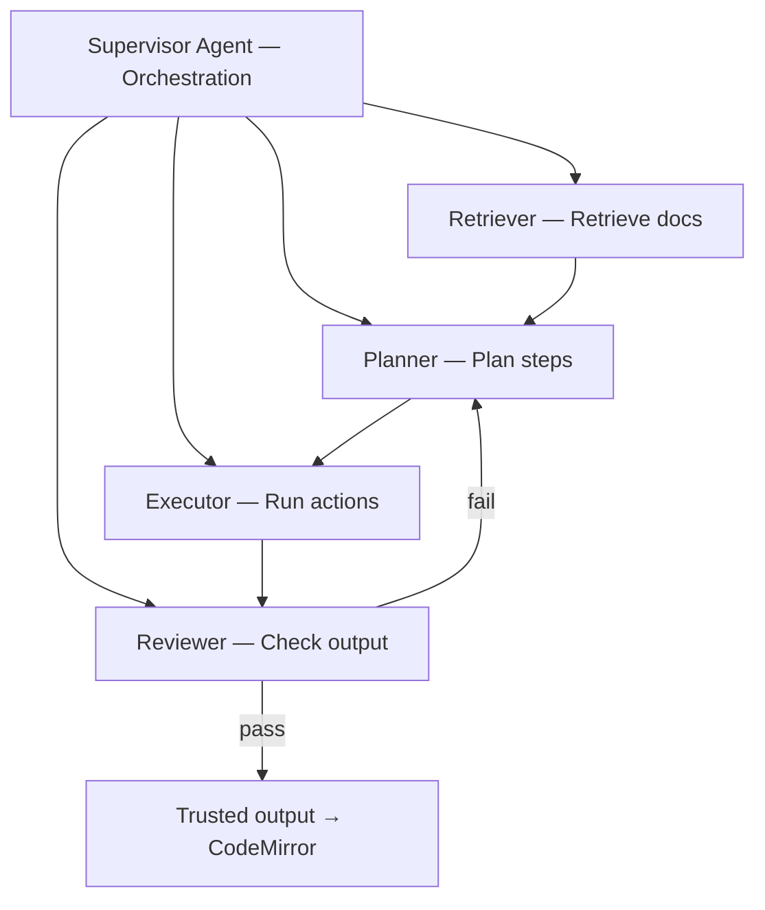

### AD.3.1 Map 4 sub-agent → service CSM

| Sub-agent sơ đồ | Hành động | Role CSM tương đương | File chính | Trạng thái |
|-----------------|-----------|---------------------|------------|------------|
| **Supervisor** | Route, delegate, merge, SSE lifecycle | `ApiSpringController` ai-code-stream + `AiLocalOrchestrationService` + intent classifier 2-pass | `ApiSpringController`, `AiLocalOrchestrationService` | ✅ Monolithic |
| **Retriever** | Retrieve docs / RAG / symbol | `AiBusinessMemoryVectorService.search`, tenant ingest, symbol excerpts, `AiGreenfieldBusinessDesignService` tenant RAG snippet | Vector + orchestration | ✅ |
| **Planner** | Plan steps, module breakdown | Pass 1 Comprehend (`AiGreenfieldBusinessDesignService`); `AiExecutionPlannerService`; `AiEditTaskPlannerService` (edit slices); `enrichBusinessSpecForMenuGreenfield` | Greenfield + edit planner | ✅ Partial — greenfield plan module **Java enrich** khi LLM thiếu |
| **Executor** | Run actions / generate | `LlamaCppNativeService` worker; deterministic lifecycle; **`buildGreenfieldMenuScaffoldJson`** (Java executor) | Gateway + Greenfield service | ✅ Partial |
| **Reviewer** | Check output | `MenuQualityGateService`; FINAL_OUTPUT_GATE; step verifier; `isThinGreenfieldMenuForRequest` trigger re-expand | Gate services | ✅ Partial — chưa loop Reviewer→Planner tự động khi menu mỏng |

### AD.3.2 Greenfield menu — pipeline đúng ý user (Comprehend → Plan từng node → Assemble)

**Vấn đề thực tế (job `job_1780035993863_rbf2hf`):** Comprehend `modules=3` nhưng Worker 7B trả **5 node** mỏng; auto-continue dừng sớm; gate reject `trigger must be an object`.

**Pipeline mục tiêu (v3.13–v3.15 implement):**

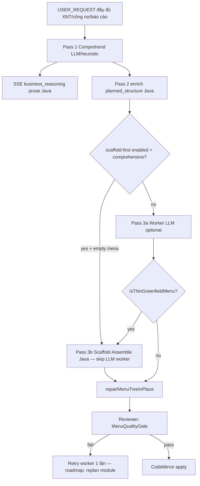

| Pass | Mô tả | Implement |
|------|-------|-----------|
| **Pass 1** | LLM Comprehend → `BusinessSpec` (domain, modules, flows) | `AiGreenfieldBusinessDesignService.runComprehensionPipeline` |
| **Pass 1b UX** | Prose “tư duy nghiệp vụ” hiển thị chat (không thêm LLM) | SSE `business_reasoning` + `buildBusinessReasoningProseVi()` |
| **Pass 2** | Plan: `planned_structure[]` — mỗi row = 1 module Lego (type_form, table_hint, lego_piece) | `enrichBusinessSpecForMenuGreenfield` + `expandPlannedStructureFromUserWording` |
| **Pass 3a** | Worker LLM sinh `{ menu: [...] }` — **bỏ qua** nếu scaffold-first | `runLocalMenuGreenfieldProviderWithAutoContinue` |
| **Pass 3b** | **Assemble deterministic** từ plan — 12–18+ node, trigger object, table[] theo module | `buildGreenfieldMenuScaffoldJson` + scaffold-first hook trong `ApiSpringController` |
| **Reviewer** | Repair trigger array→object, i18n, hard gate | `MenuQualityGateService.repairMenuTreeInPlace` + FINAL_OUTPUT_GATE |

**Module mở rộng từ USER_REQUEST (keyword):**

| Từ khóa user | Module planned_structure |
|--------------|-------------------------|
| xuất nhập / tồn | Danh mục SP, KH, NCC, Phiếu bán/nhập, Tồn kho |
| công nợ khách | Công nợ khách hàng |
| công nợ NCC | Công nợ nhà cung cấp |
| báo cáo | Báo cáo doanh thu, tồn kho, công nợ (type_form=5, nhóm `reports_group`) |

**Config:**

```properties
ai.local.greenfield.menu-scaffold-enabled=true
ai.local.greenfield.menu-scaffold-first.enabled=true
```

**Log kỳ vọng khi scaffold-first (1.5B, request “đầy đủ”):**

```txt
MENU_GREENFIELD scaffold-first requestId=… scaffoldNodes=15+ chars=… skippedLlmWorker=true
```

**Log kỳ vọng khi scaffold thay LLM mỏng (fallback sau worker):**

```txt
MENU_GREENFIELD scaffold assemble requestId=… llmNodes=5 scaffoldNodes=15+ chars=…
```

### AD.3.3 Gap Supervisor loop (sơ đồ 3)

| Gap | Hiện tại | Roadmap |
|-----|----------|---------|
| Reviewer fail → replan tự động | Gate reject, không gọi lại Planner | ✅ **AD-R3** `menu-module-replan` per leaf |
| Executor per-module | Một worker prompt 4k+ token | ✅ Module enrich tuần tự sau scaffold (AD-R4) |
| Supervisor tách process | Cùng `pool-6-thread-1` | AD-R5: job queue + stage SSE (optional) |
| Retriever citation UI | Chỉ log embedding | ✅ **AD-R6** — `rag_citations` SSE + usage dock; `tool_search.retrievalHits` enriched |

---

## AD.4 Ma trận “làm được / chưa làm được” — trả lời trực tiếp user

| Yêu cầu user | Làm được? | Chi tiết |
|--------------|-----------|----------|
| Phân tích **đầy đủ** nghiệp vụ trước khi sinh menu | ⚠️ Một phần | Comprehend LLM + Java enrich modules; LLM 7B vẫn có thể under-spec |
| Lập kế hoạch **từng node** đầy đủ tính năng | ✅ Sau v3.13 | `planned_structure[]` + scaffold 1 node/module |
| Ráp **menu hoàn chỉnh** trả user | ✅ Sau v3.13 | Scaffold thay menu mỏng; LLM có thể enrich label sau |
| Pipeline Metadata→Freshness→Rerank→Validate→Trusted | ✅ ~90% | Freshness score UI ✅; gate-before-apply ✅; BM25 hybrid ✅ (cross-encoder ❌) |
| Supervisor + 4 agent riêng | ⚠️ Logic only | Cùng codebase, không microservice agent |
| 6 trụ Distributed Systems Engineering | ✅ ~65% | State/Security/Reliability còn roadmap |

---

## AD.5 Checklist nghiệm thu (greenfield menu đầy đủ)

| # | Test | Pass nếu |
|---|------|----------|
| AD-T1 | Prompt: “Viết đầy đủ json menu … XNT, công nợ KH/NCC, báo cáo KD” | Log `scaffold assemble` **hoặc** `menuNodes ≥ 12` |
| AD-T2 | Mỗi leaf type_form=1 có `table[]` ≥3 field + `trigger.load_db` object | Gate không lỗi `trigger must be an object` |
| AD-T3 | Nhóm báo cáo type_form=5 under `reports_group` | ≥3 report nodes |
| AD-T4 | Harness `trustScore` + `governance.passed` trong completion | Composer 🧭 summary |
| AD-T5 | CodeMirror apply + diff hiển thị +N lớn (không chỉ +5) | Frontend merge stats |

---

## AD.6 File liên quan (v3.13)

| File | Vai trò AD |
|------|------------|
| `AiGreenfieldBusinessDesignService.java` | Comprehend, enrich plan, scaffold assemble |
| `ApiSpringController.java` | Supervisor flow, scaffold hook, auto-continue, gate |
| `MenuQualityGateService.java` | Reviewer — validate + trigger repair |
| `AiBusinessMemoryVectorService.java` | Retriever — filter, rerank, freshness boost |
| `AiAgentHarnessTraceService.java` | Trusted Knowledge telemetry |
| `AiLocalOrchestrationService.java` | Orchestration DAG + RAG policy |
| `AiRetrievalPolicyEngine.java` | Adaptive topK / scope |
| `application-local-5gb.properties` | Token caps, scaffold flag |

---

## AD.7 Quan hệ với các PHẦN khác

| PHẦN | Liên kết AD |
|------|-------------|
| **A.5** Lego pipeline | AD.3.2 = Phase 3 bổ sung scaffold |
| **AC** Business Comprehension | AD.3 Pass 1–2 |
| **Z** Agent Harness | AD.2 = 6 trú engineering |
| **R** Knowledge / RAG | AD.1 bước 1–3 |
| **C.5** Cursor-like context | Retriever slice, không nhồi full editor |
| **AE** Bản chất tư duy LLM | Nền tảng lý thuyết cho AD + AC |
| **AF** 9 sơ đồ quy trình agent | AD + AC + LangChain/LangGraph map |

---

# PHẦN AF — ĐỐI CHIẾU 9 SƠ ĐỒ QUY TRÌNH AGENT → LÀM ĐÚNG TRÊN CSM

> **Mục đích:** User cung cấp **9 sơ đồ tham chiếu** (O-R-A, Agentic vs Agent, Supervisor, LangChain RAG, LangGraph, handoff, taxonomy). PHẦN này trả lời: **quy trình CSM hiện tại khớp sơ đồ nào**, **lệch ở đâu**, **phải chạy thế nào** trên hệ thống thật (`ApiSpringController` → services → SSE → CodeMirror). **AF.8–AF.16** = pipeline canonical + anti-rác + config + checklist Cursor.

## AF.0 Bảng tóm tắt 9 sơ đồ

| # | Sơ đồ (user reference) | Ý nghĩa cốt lõi | CSM map | Khớp |
|---|------------------------|-----------------|---------|------|
| **1** | Observation → Reasoning → Action | RAG ingest + Comprehend → Plan/Scaffold → Gate/Apply | ✅ ~95% |
| **2** | Agentic AI **vs** AI Agents | CSM **phải** Agentic; cấm coi worker 1-shot là đủ | ✅ Spec |
| **3** | Supervisor → Agent 1/2/3 → Tools | Retriever/Planner/Executor/Reviewer monolithic | ✅ ~90% |
| **4** | LangChain components + RAG loop | Ingest chunk→embed→store; query→retrieve→LLM | ✅ ~95% |
| **5** | LangGraph — cyclic graph | Linear + scaffold + **AD-R3 replan** + **AD-R2 gate** | ✅ ~90% |
| **6** | LangChain (linear) vs LangGraph (graph) | Sequential + Java conditional + revisit loop | ✅ ~90% |
| **7** | Handoff agent_main → agent_loan → tools | Comprehend → scaffold → enrich + **`agent_handoff` SSE** | ✅ ~95% |
| **8** | LangGraph: Nodes / Edges / State / Conditional | `codeStreamMeta`, `BusinessSpec`, conditional gate/replan | ✅ ~90% |
| **9** | What is AI Agent (taxonomy) | Goal-Based (`BusinessSpec`) + Utility (gate score) | ✅ ~90% |

---

## AF.1 Sơ đồ 1 — Observation → Reasoning → Action

```txt
OBSERVATION          REASONING                    ACTION
"It's raining"  →  "I shouldn't get wet"   →  "I'll take an umbrella"
```

### AF.1.1 Map CSM (menu greenfield)

| Phase sơ đồ | CSM — quan sát / suy luận / hành động | SSE / service |
|-------------|----------------------------------------|---------------|
| **Observation** | User message + editor trống + tenant RAG + sample attachment + Lucene top-K | Ingest `dyn_ctx_currentMenu`; `AiBusinessMemoryVectorService.search` |
| **Reasoning** | Comprehend → `BusinessSpec`; enrich `planned_structure[]`; prose nghiệp vụ | `business_comprehend`, `business_plan`, **`business_reasoning`** |
| **Action** | Scaffold → **module enrich** → repair → gate → apply CodeMirror | `menu_scaffold_assemble`, **`menu_module_step`**, **`menu_module_enrich`**, `text_edit_apply` |

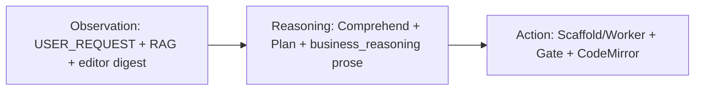

**Làm đúng:** User **phải thấy** bước Reasoning trong chat (`business_reasoning`) trước khi menu xuất hiện — không im lặng rồi diff.

**Làm sai (cấm):** Nhảy thẳng worker 1-shot không Comprehend (fast-path tắt mặc định).

---

## AF.2 Sơ đồ 2 — Agentic AI vs AI Agents

| | **Agentic AI** (mục tiêu CSM) | **AI Agents** (cấm làm mặc định) |
|---|------------------------------|----------------------------------|
| Hành vi | Multi-step, học qua RAG, suy luận nghiệp vụ | Chờ instruction, 1 task, rule cố định |
| CSM | Comprehend → Plan → Scaffold/Worker → Reviewer loop | Chỉ `runLocalProvider` 1 prompt → JSON |
| Model 1.5B | Java Plan/Scaffold **bù** reasoning yếu | Worker alone → menu 4–5 node mỏng |

> **Quy tắc Cursor:** Greenfield ERP “đầy đủ” = **Agentic pipeline** (PHẦN AC + AD.3.2), **không** phải “AI Agent” one-shot.

---

## AF.3 Sơ đồ 3 — Supervisor Multi-Agent

```txt
User ──question──► Supervisor ──delegate──► Agent 1/2/3 ──tools──► [Tools]
         ▲              │                        │
         └──final response◄──report──────────────┘
```

### AF.3.1 Map role → CSM (monolithic supervisor)

| Role sơ đồ | Agent CSM | Service / hook |
|------------|-----------|----------------|
| **Supervisor** | Route lane, SSE lifecycle, merge meta | `ApiSpringController.streamCodeAssistant` |
| **Agent Retriever** | Vector search, ACL, symbol slice | `AiBusinessMemoryVectorService`, `AiLocalOrchestrationService` |
| **Agent Planner** | Comprehend + `planned_structure[]` | `AiGreenfieldBusinessDesignService`, `AiEditTaskPlannerService` |
| **Agent Executor** | LLM worker **hoặc** Java scaffold | `LlamaCppNativeService`, `buildGreenfieldMenuScaffoldJson` |
| **Agent Reviewer** | MenuQualityGate, AST gate, harness | `MenuQualityGateService`, `AiAgentHarnessTraceService` |
| **Tools** | Lucene, ingest, repair, saveMenuStruct contract | Vector index, `repairMenuTreeInPlace`, MD contracts |

**Gap so với sơ đồ:** Agents **không** tách process/JVM — cùng thread `pool-6-thread-1`. Logic đúng, hình thức chưa micro-agent.

---

## AF.4 Sơ đồ 4 — LangChain = RAG Pipeline

### AF.4.1 Ingestion (offline / per-request)

```txt
Documents → Chunk → Embedding → Vector Store
```

| LangChain | CSM |
|-----------|-----|
| Document Loaders | Attachment digest, tenant org MD, `ai_local/*.md` contracts |
| Chunking | `AI_BUSINESS_MEMORY_CHUNK_MAX_CHARS=2200`, overlap 220 |
| Embedding | `nomic-embed-text` / hash fallback |
| Vector Store | **Lucene KNN** per `appId` (`AiBusinessMemoryVectorService`) |

### AF.4.2 Query loop (runtime)

```txt
User Question → Question Embedding → Semantic Search → Ranked Results → LLM → Answer
```

| LangChain | CSM |
|-----------|-----|
| Question | `[USER_REQUEST]` + intent classify |
| Semantic Search | `search()` + `scopeMask` + ACL |
| Ranked Results | `rerankHits` + freshness boost → `[RETRIEVED_CONTEXT]`; **UI:** `rag_citations` / `retrievalHits` với `contentExcerpt` |
| LLM | Comprehend (Pass 1) + Worker (Pass 3a) — **Plan/Scaffold có thể không cần LLM** |
| Answer | `{ menu }` / `textEdits` sau Gate |

**Làm đúng:** RAG = “sách giáo khoa” (PHẦN AE.2.1); LLM không bịa tên bảng — lấy từ chunk + `BusinessSpec`.

---

## AF.5 Sơ đồ 5–6–8 — LangGraph (graph vs linear)

### AF.5.1 LangChain (linear) — CSM **đang giống**

```txt
A → B → C   (Pass 1 → Pass 2 → Pass 3 → Pass 4)
```

Phù hợp: SEO one-shot, patch ngắn, guest chat.

### AF.5.2 LangGraph (cyclic) — CSM **cần thêm**

```txt
Node 1 → Conditional Edge → Node 2/3/4 → … → END
         ↑______________________________|
              (revisit on fail)
```

| LangGraph component | CSM hiện tại | Target |
|---------------------|--------------|--------|
| **State** | `codeStreamMeta`, `BusinessSpec`, `agent_state`-like trong job | ✅ Partial |
| **Nodes** | Comprehend, Plan, Worker, Scaffold, Gate | ✅ |
| **Edges** | Tuần tự cố định | ✅ |
| **Conditional Edges** | `scaffold-first?`, `isThinGreenfieldMenu?`, gate pass/fail | ✅ Partial |
| **Revisit loop** | Worker retry 1 lần; **AD-R4** enrich per leaf ✅; **AD-R3** Reviewer→Planner replan ✅ | ✅ ~90% |

**Kết luận:** CSM = **LangChain pipeline + Java conditional branches + AD-R3/R4 revisit + AD-R2 gate**. Micro-agent JVM = roadmap **AD-R5** (AF-R10).

---

## AF.6 Sơ đồ 7 — Multi-agent Handoff (agent_main → specialist → tools)

```txt
AGENT_MAIN: HANDOFF agent_loan
AGENT_LOAN: CALL calculate_dti → tool result → ANSWER → END
```

### AF.6.1 Map greenfield menu

| Step handoff | CSM tương đương |
|--------------|-----------------|
| `AGENT_MAIN` route | Supervisor classify `menu_json` + greenfield |
| `HANDOFF agent_loan` | Delegate Comprehend lane → `AiGreenfieldBusinessDesignService` |
| `CALLING TOOL` | Retriever search; Java `enrichBusinessSpecForMenuGreenfield`; scaffold assemble |
| Tool observation | `BusinessSpec`, `planned_structure[]`, Lucene hits; **`rag_citations`** (phase `comprehend` / `tool_search` / `module_enrich`) |
| `ANSWER → END` | Gate pass → `text_edit_apply` → SSE complete |

**Telemetry:** `menu_module_step` (plan) + `menu_module_enrich` (execute per leaf) + SSE **`agent_handoff`** + **`rag_citations`** (Retriever evidence).

---

## AF.7 Sơ đồ 9 — Taxonomy AI Agent

| Loại agent (sơ đồ) | CSM map |
|---------------------|---------|
| Simple Reflex | ❌ Không dùng — cấm if-then template ERP |
| Model-Based Reflex | Editor digest + `existing_business_summary` |
| **Goal-Based** | `BusinessSpec.modules` + `user_delta` + acceptance trong plan |
| **Utility-Based** | `MenuQualityGateService` score; harness `trustScore` ≥55 |
| Learning | RAG ingest + Knowledge Pack export — **không** fine-tune |

CSM target = **Goal-Based + Utility-Based** agent: có mục tiêu nghiệp vụ rõ + gate chọn output “tốt nhất”.

---

## AF.8 Quy trình canonical — làm đúng trên hệ thống CSM

> **Một diagram tổng hợp** — gộp 9 sơ đồ + PHẦN A.5 + AC.3 + AD.3 + **AD-R4 module enrich**.

```mermaid
flowchart TB
  subgraph OBS [AF.1 Observation]
    UR[USER_REQUEST]
    ED[ACTIVE_EDITOR_DIGEST]
    RAG[Lucene RAG top-K + ACL]
    ATT[Sample attachment digest]
  end

  subgraph REASON [AF.1 Reasoning — Agentic]
    C1[Pass 1 Comprehend LLM/heuristic]
    PC[ai_greenfield_pipeline_contract inject]
    BR[SSE business_reasoning]
    C2[Pass 2 Plan planned_structure Java enrich]
    MS[SSE menu_module_step per planned row]
  end

  subgraph ACT [AF.1 Action]
    SF{scaffold-first comprehensive?}
    SC[Pass 3b Scaffold Java ≥12 nodes]
    ME[Pass 3c AD-R4 enrichGreenfieldMenuByModule]
    WK[Pass 3a Worker LLM 1.5B fallback]
    RP[repairMenuTreeInPlace]
    GV[Pass 4 Gate + Harness]
    CM[CodeMirror text_edit_apply]
  end

  UR --> C1
  ED --> C1
  RAG --> C1
  ATT --> C1
  PC -.-> C1
  C1 --> BR
  C1 --> C2
  C2 --> MS
  MS --> SF
  SF -->|empty editor + đầy đủ| SC
  SF -->|else| WK
  SC --> ME
  ME -->|SSE menu_module_enrich| RP
  WK -->|thin menu| SC
  WK -->|ok| RP
  RP --> GV
  GV -->|pass| CM
  GV -->|fail retry once| WK
  GV -->|AD-R3 roadmap| C2
```

### AF.8.1 Thứ tự bắt buộc (local-5gb · 1.5B)

| # | Bước | Bắt buộc | Không được skip | Service / log |
|---|------|----------|-----------------|---------------|
| 0 | Inject `ai_greenfield_pipeline_contract.md` | ✅ greenfield menu | | `AiAssistantGatewayService` |
| 1 | Ingest dyn_ctx + tenant rules | ✅ | | orchestration |
| 2 | RAG retrieve (scope+ACL) | ✅ | | `AiBusinessMemoryVectorService` |
| 3 | Pass 1 Comprehend | ✅ greenfield | fast-path OFF | `runComprehensionPipeline` |
| 4 | SSE `business_reasoning` | ✅ UX | | controller SSE |
| 5 | Pass 2 `planned_structure[]` + normalize + dedupe | ✅ request “đầy đủ” | | `enrichBusinessSpecForMenuGreenfield` |
| 6 | SSE `menu_module_step` (plan visibility) | ✅ comprehensive | | `ApiSpringController` |
| 7 | Pass 3b scaffold-first **hoặc** 3a worker | ✅ | worker alone on 1.5B comprehensive | `buildGreenfieldMenuScaffoldJson` |
| 8 | Pass 3c module enrich (Java i18n + LLM optional) | ✅ default ON | | `enrichGreenfieldMenuByModule` |
| 9 | Pass 4 Gate **trước** tin output | ⚠️ partial | AD-R2 hard block | `MenuQualityGateService` |
| 10 | Apply CodeMirror + harness meta | ✅ | | `text_edit_apply` |

### AF.8.2 SSE stages Composer phải handle

| `stage` | Payload chính | Ý nghĩa (sơ đồ) | File frontend |
|---------|---------------|-----------------|---------------|
| `business_comprehend` | `modules`, `source` | Observation → parse nghiệp vụ | `AiAssistantChat.tsx` |
| `business_plan` | `plannedStructure`, `moduleTotal` | Reasoning → module list | same |
| `business_reasoning` | `reasoning`, `modules[]` prose | Reasoning prose (cloud-like UX) | same |
| `menu_module_step` | `moduleIndex`, `moduleTotal`, `module`, `typeForm`, `legoPiece` | Plan → Executor handoff (AF.6) | same |
| `menu_scaffold_assemble` | `menuNodes`, `message` | Action deterministic scaffold | same |
| `menu_module_enrich` | `moduleIndex`, `nodeId`, `usedLlm`, `status` | AD-R4 per-leaf Executor | same |
| **`rag_citations`** | `phase`, `query`, `count`, `citations[]` (`source`, `score`, `freshnessScore`, `contentExcerpt`, `sourceCategory`) | **AD-R6** Retriever evidence UI | same |
| `agent_handoff` | `fromAgent`, `toAgent`, `action`, `detail` | AF.6 multi-agent handoff | same |
| `text_edit_apply` | `textEdits` / full menu | Action → editor | same |
| `agent_harness_trace` | `trustScore`, traces | Utility / governance (AF.7) | same |

### AF.8.3 Meta keys job (debug / harness)

| Key | Ý nghĩa |
|-----|---------|
| `menuGreenfieldScaffoldFirst` | scaffold-first path đã chạy |
| `menuGreenfieldScaffoldNodes` | số node sau scaffold |
| `menuGreenfieldModuleEnrich` | AD-R4 enrich đã chạy |
| `menuGreenfieldModuleEnrichMs` | thời gian enrich |
| `businessComprehensionGreenfield` | editor trống |
| `businessComprehensionDeterministicSeed` | ⚠️ fast-path seed — phải **false** mặc định |

---

## AF.9 Gap — làm **đúng chính xác** còn thiếu gì

| Gap | Sơ đồ yêu cầu | CSM hiện tại | Roadmap / ghi chú |
|-----|---------------|--------------|-------------------|
| **AF-R1** | Reasoning visible | ✅ `business_reasoning` + `menu_module_step` | Giữ |
| **AF-R2** | LangGraph revisit full loop | ✅ **AD-R3** Reviewer→Planner per module replan | Giữ |
| **AF-R3** | Gate before apply | ✅ **AD-R2** `gateGreenfieldMenuForApply` block apply | Giữ |
| **AF-R4** | Handoff telemetry | ✅ SSE **`agent_handoff`** + module enrich | Giữ |
| **AF-R5** | Agentic not one-shot | ✅ scaffold-first + pipeline contract | Cấm bật fast-path greenfield |
| **AF-R6** | RAG citation UI | ✅ **`rag_citations` SSE** + usage dock + `tool_search` hits (max 5) | Giữ |
| **AF-R7** | Per-module Executor | ✅ **AD-R4** + CSM business rules Java | Giữ |
| **AF-R8** | Anti-noise contract in prompt | ✅ `ai_greenfield_pipeline_contract.md` | Comprehend + greenfield worker |
| **AF-R9** | Report nesting + dedupe | ✅ Java normalize + scaffold | Regression test AF-T9/T10 |
| **AF-R10** | Micro-agent separate JVM | Monolithic thread (by design) | **AD-R5** optional job queue |
| **AF-R11** | BM25 hybrid RAG | ✅ KNN + BM25 fuse + rerank | Cross-encoder rerank roadmap |

---

## AF.10 Checklist nghiệm thu — khớp 9 sơ đồ

| # | Test | Pass = khớp sơ đồ |
|---|------|-------------------|
| AF-T1 | Greenfield “đầy đủ XNT+công nợ+báo cáo” | O-R-A: reasoning SSE + scaffold ≥12 node |
| AF-T2 | Không có `business_reasoning` trong chat | ❌ Fail AF.1 |
| AF-T3 | Worker 1-shot 5 node, không scaffold | ❌ Fail AF.2 (AI Agent mode) |
| AF-T4 | Log `scaffold-first skippedLlmWorker=true` | ✅ Agentic + conditional |
| AF-T5 | Gate `trigger must be an object` | ❌ Fail AF.1 Action |
| AF-T6 | Harness trustScore trong completion | ✅ Utility-Based (AF.7) |
| AF-T7 | Thời gian ≪ 800s (1.5B scaffold-first) | ✅ Reliability |
| AF-T8 | SSE `menu_module_step` ≥1 và `menu_module_enrich` ≥1 | ✅ AD-R4 LangGraph-like loop |
| AF-T9 | Báo cáo nằm dưới `reports_group`, không flat `biz_root` | ✅ Scaffold structure |
| AF-T10 | Không duplicate module cùng nghiệp vụ | ✅ normalizePlannedStructure |
| AF-T11 | `table_name` readable snake_case, không `m_c_ng_n_*` | ✅ i18n slug repair |
| AF-T12 | SSE `agent_handoff` ≥3 (Supervisor→…→Reviewer) | ✅ AF.6 handoff |
| AF-T13 | Gate fail → **không** apply editor (`gate-before-apply`) | ✅ AD-R2 |
| AF-T14 | Module có `beforeSave`/`update`/`f_cbo_query` trên phiếu MD | ✅ CSM business rules Java |
| AF-T15 | SSE `rag_citations` ≥1 (phase `comprehend` hoặc `tool_search`) | ✅ AD-R6 Retriever UI |
| AF-T16 | Log `LIVE_MENU_PATTERN indexed` khi tenant có `index.menu` | ✅ Live menu pattern index |

**Script:** `./scripts/test-greenfield-menu-sse.sh` (AF-T1, T2, T4, T8, T12, T15 partial).

---

## AF.11 Quan hệ với các PHẦN khác

| PHẦN | Liên kết AF |
|------|-------------|
| **A.5** Lego | Action = lắp mảnh từ `planned_structure` |
| **AC** | Reasoning = Pass 1–2 |
| **AD** | Supervisor + Trusted Knowledge + AD-R4 |
| **AE** | LLM hộp đen + RAG + Guardrails |
| **C.5** | Observation = retrieve slice |
| **K** | DO NOT — **AF.12** bổ sung greenfield |
| **U** Composer | SSE Reasoning + module enrich visibility |
| **Z** Harness | Utility-Based agent |

---

## AF.12 Mandate chống rác — Cursor **không được làm sai**

> File inject: `backend/csm_datas/ai_local/ai_greenfield_pipeline_contract.md` — **bắt buộc** nạp Comprehend greenfield + greenfield worker.

### AF.12.1 Cấm hành vi (map PHẦN K)

```txt
✗ Greenfield comprehensive → chỉ gọi worker LLM 1-shot (bỏ scaffold-first)
✗ Bật menu-greenfield-fast-path hoặc deterministic-seed-fallback.menu-greenfield (trừ debug)
✗ Comprehend bỏ qua USER_REQUEST → bịa cây ERP mẫu cố định
✗ planned_structure[] trùng module / báo cáo flat dưới root
✗ trigger dạng array thay vì object
✗ table_name slug vô nghĩa từ label tiếng Việt
✗ Skip SSE business_reasoning / menu_module_* (user không thấy suy luận)
✗ Tải model 7B/14B — bundled chỉ 1.5B Q4 (PHẦN AE.0)
✗ Cursor sửa pipeline → thêm service mới thay vì mở rộng AiGreenfieldBusinessDesignService
```

### AF.12.2 Config mặc định an toàn (`application-local-5gb.properties`)

| Property | Giá trị **đúng** | Nếu sai → hậu quả |
|----------|------------------|-------------------|
| `ai.local.business-comprehension.menu-greenfield-fast-path.enabled` | `false` | Nhảy Comprehend, menu mỏng |
| `ai.local.business-comprehension.deterministic-seed-fallback.menu-greenfield.enabled` | `false` | Seed 1 module thay ERP đầy đủ |
| `ai.local.business-comprehension.required-on-greenfield` | `true` | Bỏ Pass 1 |
| `ai.local.greenfield.menu-scaffold-first.enabled` | `true` | Worker 1.5B one-shot |
| `ai.local.greenfield.menu-module-enrich.enabled` | `true` | Thiếu AD-R4 per leaf |
| `ai.local.greenfield.menu-scaffold-enabled` | `true` | Không có Java assemble |
| `ai.local.rag.citations.max-hits` | `5` | Usage dock / SSE thiếu nguồn |
| `ai.local.greenfield.live-menu-pattern-index.enabled` | `true` | Không học trigger/combo từ menu dev |

---

## AF.13 Config reference — greenfield menu (copy-paste)

```properties
# Comprehend — greenfield
ai.local.business-comprehension.required-on-greenfield=true
ai.local.business-comprehension.menu-greenfield-fast-path.enabled=false
ai.local.business-comprehension.deterministic-seed-fallback.menu-greenfield.enabled=false

# Scaffold + AD-R4
ai.local.greenfield.enabled=true
ai.local.greenfield.menu-scaffold-enabled=true
ai.local.greenfield.menu-scaffold-first.enabled=true
ai.local.greenfield.menu-module-enrich.enabled=true
ai.local.greenfield.menu-module-enrich.max-modules=16
ai.local.greenfield.menu-module-enrich.max-tokens=384
ai.local.greenfield.menu-auto-continue-max-attempts=3

# AD-R2 / AD-R3 — gate + replan
ai.local.greenfield.gate-before-apply.enabled=true
ai.local.greenfield.menu-module-replan.enabled=true
ai.local.greenfield.menu-module-replan.max-attempts=1

# AD-R6 — RAG citation UI + live menu pattern index
ai.local.rag.citations.max-hits=5
ai.local.greenfield.live-menu-pattern-index.enabled=true
ai.local.greenfield.live-menu-pattern-index.max-leaves=120
```

Model: `qwen2.5-coder-1.5b-instruct-q4_k_m.gguf` only.

---

## AF.14 Log grep — xác nhận pipeline đúng

```bash
# Sau request greenfield (jobId / requestId):
grep 'MENU_GREENFIELD scaffold-first' backend/logs/console.log
grep 'module-enrich modules=' backend/logs/console.log
grep 'LIVE_MENU_PATTERN indexed' backend/logs/console.log
grep 'rag_citations' backend/logs/console.log   # SSE stage (nếu log SSE)
grep 'BusinessSpec comprehend source=' backend/logs/console.log
grep 'skippedLlmWorker=true' backend/logs/console.log

# Fail patterns:
grep 'MENU_GREENFIELD_FAST_PATH' backend/logs/console.log          # fast-path — không mong muốn
grep 'trigger must be an object' backend/logs/console.log
grep 'buildGreenfieldMenuScaffoldJson failed' backend/logs/console.log
```

**Pass mẫu:** `scaffold-first … skippedLlmWorker=true moduleEnrich=true` + `module-enrich modules=12 llmCalls=…`.

---

## AF.15 File map — đụng greenfield đúng chỗ

| File | Vai trò AF |
|------|------------|
| `AiGreenfieldBusinessDesignService.java` | Comprehend, plan enrich, scaffold, **AD-R4 enrich**, **AD-R6** `searchRagCitations`, **live menu pattern index** |
| `ApiSpringController.java` | SSE stages, scaffold-first branch, **`emitRagCitations`** |
| `AiLocalOrchestrationService.java` | `summarizeSearchHits` + `freshnessScore` / `contentExcerpt` |
| `AiBusinessMemoryVectorService.java` | KNN + **`computeFreshnessScore`** |
| `MenuQualityGateService.java` | Gate + trigger repair |
| `AiAssistantGatewayService.java` | Contracts inject, comprehend prompt |
| `AiAssistantChat.tsx` | SSE UI all stages AF.8.2 + **`rag_citations`** handler + usage dock |
| `ai_greenfield_pipeline_contract.md` | Anti-rác prompt |
| `ai_business_comprehend_contract.md` | Pass 1 schema |
| `ai_menu_greenfield_worker_contract.md` | Worker fallback only |

---

## AF.16 Checklist Cursor (AF-C*) — trước khi merge

| ID | Câu hỏi | Pass |
|----|---------|------|
| AF-C1 | Comprehensive greenfield vẫn chạy scaffold-first? | ✅ |
| AF-C2 | `ai_greenfield_pipeline_contract.md` trong allowlist + inject? | ✅ |
| AF-C3 | SSE handler có `menu_module_step` + `menu_module_enrich`? | ✅ |
| AF-C4 | Không bật fast-path/seed mặc định? | ✅ |
| AF-C5 | Báo cáo under `reports_group` trong scaffold? | ✅ |
| AF-C6 | AF.8 Mermaid + AF.10 checklist cập nhật trong brief? | ✅ |
| AF-C7 | AD-R5/R10 (micro-JVM) vẫn ghi **roadmap**, không claim done? | ✅ |
| AF-C8 | SSE `rag_citations` + usage dock hiển thị hit (AD-R6)? | ✅ |

---

# PHẦN AE — BẢN CHẤT TƯ DUY AI LOCAL & “HỌC” HỆ THỐNG NGHIỆP VỤ

> **Mục đích:** Giải thích **kỹ thuật hệ thống** — AI Local không có “nhận thức” như con người; “tư duy” là **ánh xạ từ không gian ngữ cảnh (Context Space) sang không gian xác suất token (Token Probability)**. PHẦN này map lý thuyết chung → **CSM đã implement gì**, **còn thiếu gì**, để Cursor/dev không kỳ vọng sai (ví dụ: 1.5B “hiểu ERP” khi nhét 400k chars).

## AE.0 Nguyên lý cốt lõi

```txt
AI Local KHÔNG “biết” hệ thống của bạn sẵn từ pre-training.
AI Local CHỈ làm đúng khi:
  (1) Context sạch, có cấu trúc, có constraints
  (2) Retrieval đúng chunk (RAG + metadata filter)
  (3) Output bị validate trước khi chạm production (Gate)
  (4) Phần suy luận nghiệp vụ nặng → Java deterministic (scaffold/plan) khi model yếu (1.5B)
```

**Model bundled CSM (2026):** `qwen2.5-coder-1.5b-instruct-q4_k_m.gguf` — server 5GB và dev strong. **Không** fine-tune trong repo; **không** tải 7B/14B vào bundle.

---

## AE.1 Luồng tư duy bên trong hộp đen LLM (4 bước)

```txt
[Input Request + Context] → [Embedding & Tokenization] → [Attention] → [Semantic Mapping] → [Token Generation]
```

| Bước lý thuyết | Bản chất | CSM — xảy ra ở đâu | Giới hạn thực tế |
|----------------|----------|---------------------|------------------|
| **1. Embedding & Tokenization** | Text → token → vector nhiều chiều | `LlamaCppNativeService` + embedding nomic cho RAG index | Prompt >32k chars bị cap (`ai.local.llama.max-prompt-chars`) |
| **2. Attention (Self-Attention)** | Liên kết khái niệm trong **cùng** context window | Chỉ trong slice prompt worker (~8k ctx 1.5B) | **Không** “nhớ” phiên trước trừ conversation digest + Lucene |
| **3. Semantic Mapping** | Tính luồng logic nhất theo constraints prompt | System/master contracts MD + `BusinessSpec` injection + RAG block | 1.5B mapping yếu → **Java enrich** `planned_structure[]`, scaffold assemble |
| **4. Token Generation** | Dự đoán token tiếp theo xác suất cao | Worker stream JSON / prose; temperature thấp edit | Menu greenfield: **scaffold-first** bỏ worker nếu request “đầy đủ” |

```mermaid
flowchart LR
  subgraph CSMSystem [CSM — ngoài LLM]
    IN[USER_REQUEST + attachments]
    IDX[Index Lucene KNN]
    RET[Retrieve + ACL + rerank]
    COMP[Comprehend + Plan Java/LLM]
    CTX[Context Builder slot budget]
  end
  subgraph LLMBox [Hộp đen LLM 1.5B]
    EMB[1 Tokenize + Embed]
    ATT[2 Attention]
    MAP[3 Semantic map]
    GEN[4 Generate tokens]
  end
  subgraph After [Sau LLM]
    GATE[Output Validation]
    ENV[CodeMirror / saveMenuStruct]
  end
  IN --> IDX --> RET --> COMP --> CTX
  CTX --> EMB --> ATT --> MAP --> GEN
  GEN --> GATE --> ENV
  COMP -.->|scaffold-first| GATE
```

> **Quan trọng:** CSM **tách** phần “hiểu nghiệp vụ đủ module” (Comprehend + Plan + scaffold Java) khỏi phần “sinh token” (LLM). Cloud chat trông “thông minh” vì model lớn + prose dài; CSM 1.5B **bù bằng kiến trúc**, không bù bằng kích thước model.

---

## AE.2 Ba con đường để AI “học và hiểu” hệ thống của bạn

Pre-trained model chỉ có kiến thức nền tổng quát. Ba con đường nạp tri thức domain:

### AE.2.1 RAG — “Sách giáo khoa” theo thời gian thực ✅ **CSM chính**

| Khía cạnh | Mô tả chung | CSM implementation |
|-----------|-------------|-------------------|
| Ý tưởng | Số hóa tài liệu/schema/API → vector DB; query → top-K chunk → dán prompt | **Lucene KNN** per `appId` (không Chroma/Milvus riêng) |
| Ingest | Chunk + embed + metadata | `AiBusinessMemoryVectorService`, `AiScopedContextIngestionService`, `AiTenantKnowledgeIngestionService` |
| Retrieve | Similarity + filter | `scopeMask`, ACL tags, `AiRetrievalPolicyEngine`, `rerankHits`, freshness boost `createdAtMs` |
| Ưu điểm | Giảm hallucination — “nói có sách mách có chứng” | Tenant org snapshot, domain rules MD, dyn_ctx editor |
| Roadmap | BM25 hybrid, citation line | Phase 3 RAG (PHẦN changelog v3.6) |

**Pipeline tin cậy (map sơ đồ Metadata → Trusted Knowledge — PHẦN AD.1):**

```txt
Metadata Filter (scope + ACL)
  → Freshness boost (implicit rerank)
  → Re-ranking (lexical + domain tags)
  → Validation (gate trước/sau apply)
  → Trusted Knowledge (harness trustScore ≥55)
```

### AE.2.2 Fine-tuning — Thay đổi weights não bộ ❌ **CSM không dùng**

| Khía cạnh | Mô tả chung | CSM |
|-----------|-------------|-----|
| Ý tưởng | Huấn luyện lại LoRA trên cặp [bài toán → output chuẩn] | **Không** trong repo |
| Lý do skip | Tốn GPU, drift, khó portable giữa máy 5GB và dev | Thay bằng **Knowledge Pack** export/import (PHẦN R) + contracts MD |
| Thay thế CSM | — | `author_style_dna.md`, menu learning Lucene, portable pack script |

> Cursor rule: **Không** thêm fine-tune pipeline trừ khi product owner yêu cầu explicit — ưu tiên RAG + In-Context + Java scaffold.

### AE.2.3 In-Context Learning (Few-shot trong prompt) ✅ **CSM bổ trợ**

| Khía cạnh | Mô tả chung | CSM implementation |
|-----------|-------------|-------------------|
| Ý tưởng | Quy tắc + 2–3 ví dụ trong prompt | `ai_menu_structure_runtime.md`, `ai_*_compact.md`, sample digest |
| Menu greenfield | Structure-first Lego catalog | `MENU_KNOWLEDGE_ALLOWLIST`, `resolveMenuJsonContractForGreenfield()` |
| Có mẫu attachment | Pattern từ sample menu/code | `SAMPLE_MENU_DIGEST`, `SAMPLE_CODE_DIGEST` trong Comprehend (PHẦN AC) |
| Business reasoning | Prose plan trước worker | SSE `business_reasoning` + `buildBusinessReasoningProseVi()` (Java, không thêm LLM) |

**Kết hợp CSM (khuyến nghị vận hành):**

```txt
RAG (sự thật runtime) + In-Context (Lego contracts MD) + Java Plan/Scaffold (logic nghiệp vụ)
  → LLM 1.5B chỉ enrich label/patch nhỏ
  → Gate validate trước CodeMirror
```

---

## AE.3 Ba tầng Guardrails — làm đúng yêu cầu nghiệp vụ

| Tầng | Nhiệm vụ đối với AI | CSM — file / service | Kết quả |
|------|---------------------|----------------------|---------|
| **1. System Prompt (định hình tư duy)** | Vai trò Solution Architect; ép output contract (JSON only, không prose thừa) | `AiAssistantGatewayService.buildLocalMinimalPrompt`, `ai_*_worker_contract.md`, `resolveMenuJsonContractForGreenfield()` | Worker không lan man; edit = `textEdits` / `{menu}` |
| **2. Context Injection (cung cấp sự thật)** | RAG đúng schema/API/table; không bịa tên bảng | Lucene scoped RAG, tenant snapshot, `[ACTIVE_EDITOR_DIGEST]`, `BusinessSpec` block | Model biết “nguyên liệu” thật |
| **3. Output Validation (lọc đầu ra)** | Regex/schema/AST trước khi thực thi | `MenuQualityGateService`, FINAL_OUTPUT_GATE, AST gate code, semantic sandbox, `repairMenuTreeInPlace` | An toàn; trigger object; không apply patch hỏng |

```txt
Model output
  → parse JSON / textEdits
  → repairMenuTreeInPlace (deterministic)
  → MenuQualityGate / AST gate
  → FINAL_OUTPUT_GATE
  → SSE text_edit_apply → CodeMirror
  → agentHarness governance meta
```

**Lưu ý greenfield menu (1.5B):** Tầng 2 + **Java scaffold** quan trọng hơn tầng 1 — LLM 1.5B không đủ tin cậy để generate cả cây ERP một shot. `menu-scaffold-first.enabled=true` (PHẦN AD.4).

---

## AE.4 Chìa khóa cốt lõi — map sang CSM

> **Luồng tư duy AI Local mạnh hay yếu phụ thuộc độ sạch của Context** — không phải kích thước model.

| Điều kiện “context sạch” | CSM làm gì |
|--------------------------|------------|
| Cấu trúc DB/menu tường minh | `ai_menu_structure_runtime.md` — Lego catalog (type_form, f_*, trigger) |
| Quy tắc logic rõ | `ai_business_comprehend_contract.md`, tenant domain rules |
| Yêu cầu user là delta | `USER_REQUEST` thắng mâu thuẫn (PHẦN AC.0b) |
| Không nhồi 400k vào model | Region plan + RAG top-K (PHẦN C.5) |
| Nghiệp vụ phức tạp + model 1.5B | `planned_structure[]` + `buildGreenfieldMenuScaffoldJson()` |

**Kỳ vọng thực tế với 1.5B:**

| Tác vụ | Kỳ vọng |
|--------|---------|
| Patch ngắn / symbol micro / lifecycle deterministic | ✅ Tốt |
| Analyze prose (slice + heuristic) | ✅ Chấp nhận được |
| Comprehend LLM full ERP một shot | ⚠️ Yếu — fallback heuristic + Java enrich |
| Menu greenfield “đầy đủ XNT/công nợ/báo cáo” | ✅ **Scaffold Java 15+ node** + gate; LLM optional enrich |
| Tương đương Developer Middle-Senior **chỉ bằng LLM** | ❌ Không — cần **pipeline** (AC + AD + AE) |

---

## AE.5 Checklist cho Cursor — không hiểu sai bản chất AI

| # | Câu hỏi | Pass nếu |
|---|---------|----------|
| AE-C1 | Có nhét full `currentCode` 400k vào prompt? | ❌ Cấm — index + slice |
| AE-C2 | Có fine-tune model trong repo? | ❌ Cấm — RAG + contracts |
| AE-C3 | Greenfield menu phức tạp có scaffold/plan trước LLM? | ✅ `scaffold-first` hoặc `planned_structure` |
| AE-C4 | Output có qua gate trước editor? | ✅ MenuQualityGate + FINAL_OUTPUT_GATE |
| AE-C5 | User thấy “tư duy nghiệp vụ” trong chat? | ✅ SSE `business_reasoning` + module list |
| AE-C6 | RAG chunk có ACL + scope filter? | ✅ `passesRetrievalAuthFilter` |

---

## AE.6 Quan hệ với các PHẦN khác

| PHẦN | Liên kết AE |
|------|-------------|
| **A.5** Lego | In-Context Learning — catalog mảnh |
| **C.1–C.5** Architecture | AE.1 hộp đen + AE.2.1 RAG |
| **AC** Comprehend | AE.2.3 + semantic mapping nghiệp vụ |
| **AD** Distributed agent | AE orchestration ngoài LLM |
| **AF** 9 sơ đồ quy trình | AE = lý thuyết LLM; AF = O-R-A + LangGraph map |
| **Z** Harness | AE.3 tầng 3 + trustScore |
| **K** Cấm tuyệt đối | Không fine-tune; không full-file prompt |

---

## AF.17 Agent Registry — cheat sheet (Types of AI Agents trên CSM)

> **Một trang** — map sơ đồ LangChain/LangGraph user reference → code thật. Agents chạy **logic** tách role, **cùng thread** `pool-6-thread-1` (không micro-JVM — xem AF-R10).

| Agent (sơ đồ) | Vai trò | Service / method | SSE `stage` |
|---------------|---------|----------------|-------------|
| **Supervisor** | Route lane, lifecycle, merge meta | `ApiSpringController.streamCodeAssistant` | `started`, `complete` |
| **Retriever** | Ingest + vector search + ACL + **live menu pattern index** | `AiBusinessMemoryVectorService`, `AiLocalOrchestrationService`, `indexLiveMenuLeafPatterns` | `tool_search`, **`rag_citations`** |
| **Planner** | Comprehend + `planned_structure[]` | `AiGreenfieldBusinessDesignService.runComprehensionPipeline`, `enrichBusinessSpecForMenuGreenfield` | `business_comprehend`, `business_plan`, `business_reasoning`, `menu_module_step` |
| **Executor** | Scaffold / LLM worker + **pattern hints merge** | `buildGreenfieldMenuScaffoldJson`, `enrichGreenfieldMenuByModule`, `applyLiveMenuPatternHints`, `applyGreenfieldCsmBusinessRules` | `menu_scaffold_assemble`, `menu_module_enrich` |
| **Reviewer** | Quality gate + trusted apply | `MenuQualityGateService`, `gateGreenfieldMenuForApply` | `final_output_gate`, `agent_handoff` Reviewer→* |
| **Tools** | Lucene, repair, contracts | `repairMenuTreeInPlace`, `ai_*_contract.md`, `applyGreenfieldCsmBusinessRules` | `tool_apply` |

### Handoff chain (greenfield menu — khớp hình LangChain RAG + LangGraph)

```txt
Supervisor ──► Retriever (RAG ingest/search + **LIVE_MENU_PATTERN** index)
     ──► Planner (Comprehend + planned_structure)
     ──► Executor (scaffold + module enrich + CSM rules + **pattern hints**)
     ──► Reviewer (gateGreenfieldMenuForApply)
     ──► Executor (full-file text_edit_apply) ──► Supervisor (complete)
          ▲_________________________|
          Reviewer fail → Planner (AD-R3 replan module)
```

SSE: `agent_handoff` + **`rag_citations`** (`phase`: `comprehend` | `tool_search` | `module_enrich`).

Payload `citations[]` mỗi row: `source`, `summary`, `score`, `freshnessScore`, `contentExcerpt`, `sourceCategory` (`live_menu_pattern`, `current_menu`, …).

Config (`application-local-5gb.properties`):

```properties
ai.local.greenfield.gate-before-apply.enabled=true
ai.local.greenfield.menu-module-replan.enabled=true
ai.local.greenfield.menu-module-replan.max-attempts=1
ai.local.rag.citations.max-hits=5
ai.local.greenfield.live-menu-pattern-index.enabled=true
ai.local.greenfield.live-menu-pattern-index.max-leaves=120
```

---

**Hết master brief v3.20.**  
Chỉ dùng file này khi yêu cầu Cursor AI implement / làm lại CSM AI Local hoặc domain System Management liên quan RAG.
