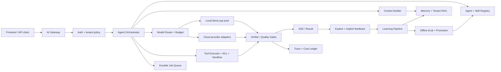
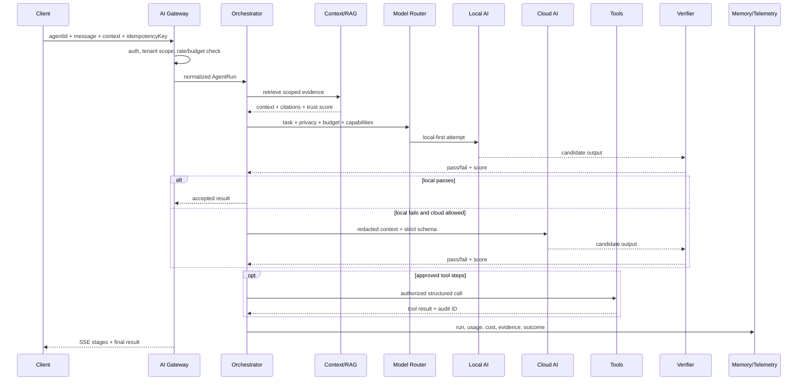
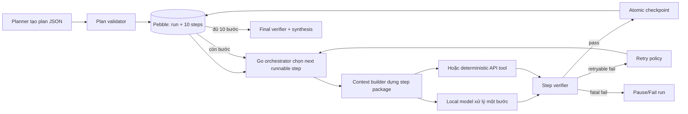
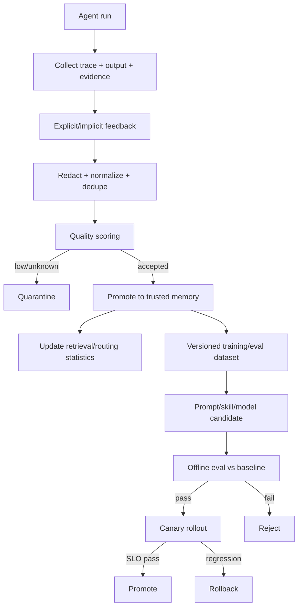

# Blueprint nền tảng AI multi-agent cho backend-go

> Trạng thái tài liệu: kiến trúc đề xuất, đối chiếu code ngày 2026-08-15.  
> Phạm vi: xây dựng một nền tảng có thể tạo nhiều agent theo yêu cầu, chạy AI local hoặc AI cloud, tự cải thiện có kiểm soát, tối ưu kỹ thuật và chi phí.

## 1. Kết luận điều hành

`backend-go` đã có nền móng AI local đáng kể: llama.cpp native/isolated worker, SSE, intent routing, plan-then-execute, tenant RAG, conversation memory, learning memory, prompt budget, hardware auto-tune và một số quality gate. Tuy nhiên hệ thống hiện chưa phải là một nền tảng tạo agent động hoàn chỉnh.

Các khoảng trống chính:

1. Chưa có `AgentDefinition`/agent registry bền vững để tạo, version, bật/tắt và phân quyền agent theo tenant.
2. Lớp inference của Go hiện là local-only; chưa có provider abstraction thống nhất cho local và cloud.
3. Chưa có durable job queue cho workflow dài, retry, resume, cancel và recovery sau restart.
4. “Tự học” hiện là lưu và truy hồi kết quả trước, chưa phải huấn luyện model. Chưa có feedback chuẩn, eval dataset, promotion, canary và rollback.
5. Hash embedding hiện chỉ phù hợp làm placeholder; chất lượng semantic production cần embedding model thật.
6. Chưa có sổ cái token/chi phí/độ trễ/chất lượng thống nhất theo request, agent, tenant, model và provider.

Định hướng đúng là **hybrid local-first, cloud-when-justified**:

- Local xử lý phân loại, RAG, dữ liệu nhạy cảm, tác vụ lặp lại, tác vụ có contract rõ và tải nền.
- Cloud chỉ nhận tác vụ khó hoặc khi local không đạt quality gate, với dữ liệu đã lọc và ngân sách rõ ràng.
- Mỗi agent chỉ là cấu hình + policy + workflow + tool permissions; không tạo một process hay một model riêng cho từng agent.
- Hệ thống “thông minh lên” trước hết bằng memory, retrieval, routing và skill improvement. Fine-tune chỉ thực hiện offline sau khi dữ liệu vượt eval gate.

## 2. Hiện trạng backend-go đã kiểm chứng

### 2.1 Thành phần đang có

| Năng lực | Hiện trạng | Code sở hữu hành vi |
|---|---|---|
| Local inference | llama.cpp native, có isolated child worker | `internal/services/llama.go`, `llama_isolated.go`, `llama_worker.go` |
| Hardware auto-tune | Tự chọn context, batch, output, threads theo RAM/CPU | `internal/config/ai_runtime_tune.go` |
| Streaming | SSE cho code/chat/plan | `internal/handlers/ai_stream.go` |
| Orchestration | Intent, business comprehend, RAG, planner, incremental execution | `internal/services/ai_orchestration.go`, `ai_execution_planner.go` |
| Tenant RAG | Scope + ACL + keyword/vector rerank | `internal/services/ai_rag.go` |
| Vector store | chromem-go; hash embedding đang là placeholder ở một số luồng | `internal/data` và `internal/services/ai_rag.go` |
| Conversation memory | User/app/code-target scopes, lưu Pebble | `internal/services/ai_conversation_memory.go` |
| Learning memory | Lưu code/menu edit, dedupe, retrieve theo keyword/recency | `internal/services/ai_learning_memory.go`, `ai_menu_learning_memory.go` |
| Learning persistence | Pebble mặc định, JSONL fallback/journal | `internal/services/ai_learning_persistence.go`, `internal/data/ai_learning_store.go` |
| Internet ingestion | Allowlist, tải nền, đưa vào tenant RAG | `internal/services/ai_web_learning.go` |
| Prompt budget | Clamp theo context/batch/RAM, bỏ base64 | `internal/services/ai_prompt_budget.go` |
| Health/model API | Health, model inventory, workspace rebuild | `internal/handlers/ai.go`, `internal/services/ai_local_ops.go` |

### 2.2 Điều chưa được hiểu sai

- `ListAIServices()` hiện trả về danh sách tên dịch vụ, không phải registry các implementation độc lập và không chứng minh mọi dịch vụ đã hoạt động đầy đủ.
- `PreferredModelHint: local_provider` là hint, chưa phải model router hybrid.
- `RecordSuccessfulCodeEdit` ghi nhận output có patch/result phù hợp về hình thức; nó chưa chứng minh người dùng chấp nhận, test pass hoặc kết quả kinh doanh tốt.
- Web learning là nạp tài liệu vào RAG, không làm thay đổi trọng số model.
- GitHub Copilot phù hợp để triển khai code cho hệ thống này; không nên coi Copilot là runtime inference API của sản phẩm trừ khi có API/quyền sử dụng chính thức phù hợp.

## 3. “Tự học” thực sự gồm những mức nào

| Mức | Cơ chế | Thời gian thấy hiệu quả | Rủi ro | Khuyến nghị |
|---|---|---:|---:|---|
| L0 | Prompt/policy versioning | Ngay lập tức | Thấp | Làm ngay |
| L1 | Session + long-term memory | Request kế tiếp | Thấp-vừa | Đã có một phần, cần quality metadata |
| L2 | RAG/index cập nhật | Phút/giờ | Vừa | Làm production với ACL, freshness, citation |
| L3 | Học routing/tool strategy từ outcome | Ngày | Vừa | Làm sau telemetry/eval |
| L4 | Skill/prompt tự đề xuất rồi qua eval | Ngày/tuần | Vừa-cao | Canary + human approval |
| L5 | LoRA/SFT/DPO offline | Tuần/tháng | Cao | Chỉ khi có dataset sạch và GPU phù hợp |
| L6 | Online weight update sau mỗi request | Gần realtime | Rất cao | Không dùng trong production |

Mục tiêu thực tế cho CSM trong giai đoạn đầu là L0-L3. Đây thường là nơi tạo phần lớn cải thiện với chi phí thấp hơn fine-tune.

## 4. Kiến trúc đích



### 4.1 Nguyên tắc module

Tạo package mới, không tiếp tục dồn mọi hành vi vào `handlers` hoặc các file `ai_*` lớn:

```text
backend-go/internal/ai/
  domain/          # types thuần: Agent, Run, Step, Tool, Provider, Feedback
  registry/        # agent/skill/prompt/model version registry
  gateway/         # request validation, auth context, SSE contract
  orchestrator/    # state machine/DAG, retry, resume, cancellation
  provider/        # local + cloud adapters
  router/          # quality/cost/privacy/capability routing
  context/         # prompt assembly, budgets, redaction
  memory/          # conversation, episodic, semantic, procedural
  tools/           # tool registry, policy, executor, sandbox
  jobs/            # durable queue and leases
  eval/            # offline/online evaluators and promotion gates
  telemetry/       # traces, usage, costs, SLO
```

Giữ adapter tương thích để `internal/handlers/ai_stream.go` gọi gateway mới; không rewrite toàn bộ pipeline trong một lần.

## 5. Agent động được mô hình hóa như thế nào

Một agent không phải là một model. Agent là một manifest có version:

```json
{
  "id": "invoice-reviewer",
  "version": 3,
  "tenantId": "csm",
  "name": "Invoice Reviewer",
  "status": "active",
  "instructionsRef": "prompt://invoice-reviewer/v3",
  "skills": ["document_extract", "invoice_validate", "business_lookup"],
  "allowedTools": ["pdf.extract", "records.read", "invoice.validate"],
  "deniedDataTags": ["secret", "cross_tenant"],
  "modelPolicy": {
    "preferred": "local",
    "minimumQuality": 0.78,
    "cloudAllowed": true,
    "cloudDataPolicy": "redacted_only",
    "maxInputTokens": 12000,
    "maxOutputTokens": 1500,
    "maxCostUsd": 0.03
  },
  "executionPolicy": {
    "maxSteps": 8,
    "maxRetries": 2,
    "timeoutMs": 180000,
    "humanApprovalFor": ["records.write", "external.publish"]
  },
  "memoryPolicy": {
    "scopes": ["user", "tenant", "task"],
    "retentionDays": 90,
    "learnFromAcceptedOnly": true
  }
}
```

### 5.1 Các bảng/collection tối thiểu

Ưu tiên Pebble qua `RecordManager` để phù hợp codebase hiện tại:

| Bảng | Mục đích |
|---|---|
| `ai_agent_definitions` | Agent manifest, tenant, version, status |
| `ai_skill_definitions` | Skill contract, input/output schema, verifier |
| `ai_prompt_versions` | Prompt immutable, checksum, trạng thái candidate/active/retired |
| `ai_model_catalog` | Provider, model, capability, context, giá cấu hình |
| `ai_runs` | Run state, agent/model/provider, budget, timestamps |
| `ai_run_steps` | Step state, dependency, retry, tool/model result reference |
| `ai_tool_audit` | Tool call, actor, scope, arguments đã redact, outcome |
| `ai_feedback` | Rating, accept/reject/edit, reason, test outcome |
| `ai_learning_examples` | Ví dụ đã chuẩn hóa, quality score, provenance |
| `ai_eval_suites` | Dataset/version/metric/threshold |
| `ai_eval_results` | Candidate so với baseline |
| `ai_usage_ledger` | Tokens, duration, local compute, cloud cost |

Mọi khóa phải chứa hoặc ánh xạ bắt buộc tới `tenantId/appId`. Không cho phép query memory không có tenant scope.

## 6. Hợp đồng lõi nên triển khai trong Go

```go
type Provider interface {
	Name() string
	Capabilities(ctx context.Context) CapabilitySet
	Health(ctx context.Context) HealthStatus
	Complete(ctx context.Context, req CompletionRequest) (CompletionResponse, error)
	Stream(ctx context.Context, req CompletionRequest, sink TokenSink) (Usage, error)
}

type Tool interface {
	Definition() ToolDefinition
	Authorize(ctx context.Context, actor Actor, input json.RawMessage) error
	Execute(ctx context.Context, input json.RawMessage) (ToolResult, error)
}

type Evaluator interface {
	Evaluate(ctx context.Context, sample EvalSample, output AgentOutput) EvalResult
}
```

Yêu cầu bắt buộc:

- Request/response có schema và version.
- Provider trả usage chuẩn hóa, finish reason và provider request ID.
- Tool phải authorize trước execute; model không được gọi shell/network/database trực tiếp.
- Idempotency key cho run và tool write.
- Error taxonomy ổn định: timeout, rate limit, unavailable, invalid output, budget exceeded, policy denied, verifier rejected.
- Không retry mù với lỗi validation hoặc policy; chỉ retry lỗi tạm thời và có backoff + jitter.

## 7. Luồng một request hoàn chỉnh



### 7.1 AI local thực hiện đủ 10 bước mà không mất trí nhớ như thế nào

#### Câu trả lời ngắn

Không yêu cầu model “nhớ” cả quy trình. Model chỉ làm hai việc:

1. Planner đề xuất một kế hoạch có cấu trúc.
2. Executor xử lý đúng **một bước** với context do Go orchestrator cung cấp.

Go orchestrator mới là bộ điều khiển giữ logic A-Z. Toàn bộ kế hoạch, trạng thái, kết quả API, bằng chứng và lỗi được lưu ngoài model trong Pebble. Vì vậy context window bị giới hạn, worker restart hoặc mỗi bước dùng một model khác vẫn không làm mất workflow.



#### Ba lớp “trí nhớ” không được trộn lẫn

| Lớp | Chứa gì | Nguồn sự thật | Có sống qua restart? |
|---|---|---|---|
| Run state | Mục tiêu, plan 10 bước, step hiện tại, budget, status | `ai_runs`, `ai_run_steps` | Có |
| Step working context | Input của bước, kết quả API, artifact, facts đã xác minh | `ai_step_artifacts`, `ai_tool_audit` | Có |
| Model context | Prompt tạm thời gửi cho model ở một lần inference | Dựng lại từ hai lớp trên | Không cần |

Conversation memory và RAG chỉ là dữ liệu hỗ trợ. Chúng không được dùng thay cho run state. SSE cũng chỉ hiển thị tiến độ, không phải nơi lưu tiến độ.

#### Ví dụ một plan 10 bước gọi API

Giả sử người dùng yêu cầu: “Phân tích doanh thu tháng này, tìm sản phẩm giảm mạnh, kiểm tra tồn kho và đề xuất nhập hàng”. Planner phải trả plan có schema, không trả văn xuôi tự do:

```json
{
  "schemaVersion": "1",
  "goal": "Phân tích doanh thu và đề xuất nhập hàng",
  "successCriteria": [
    "Dữ liệu cùng tenant và đúng kỳ",
    "Mọi kết luận có evidenceRef",
    "Không đề xuất số lượng âm",
    "Tổng hợp đủ doanh thu, xu hướng, tồn kho và đề xuất"
  ],
  "steps": [
    {"id":"s01","type":"tool","tool":"sales.period.resolve","dependsOn":[],"outputSchema":"Period"},
    {"id":"s02","type":"tool","tool":"sales.summary.read","dependsOn":["s01"],"outputSchema":"SalesSummary"},
    {"id":"s03","type":"tool","tool":"sales.by_product.read","dependsOn":["s01"],"outputSchema":"ProductSales[]"},
    {"id":"s04","type":"compute","skill":"trend.compare","dependsOn":["s02","s03"],"outputSchema":"TrendReport"},
    {"id":"s05","type":"gate","skill":"sales.evidence.verify","dependsOn":["s04"],"outputSchema":"GateResult"},
    {"id":"s06","type":"tool","tool":"inventory.for_products.read","dependsOn":["s03","s05"],"runIf":"s05.passed","outputSchema":"Inventory[]"},
    {"id":"s07","type":"compute","skill":"reorder.calculate","dependsOn":["s03","s06"],"outputSchema":"ReorderProposal[]"},
    {"id":"s08","type":"gate","skill":"reorder.business_rules.verify","dependsOn":["s07"],"outputSchema":"GateResult"},
    {"id":"s09","type":"llm","skill":"business.explain","dependsOn":["s02","s04","s07","s08"],"outputSchema":"DraftReport"},
    {"id":"s10","type":"gate","skill":"final.report.verify","dependsOn":["s09"],"outputSchema":"FinalReport"}
  ]
}
```

Điểm quan trọng:

- Chỉ `s09` thực sự cần LLM để diễn đạt. Các bước đọc API, tính toán và kiểm tra nên deterministic.
- `dependsOn` khóa thứ tự logic; orchestrator không chạy `s06` trước khi `s03` và `s05` pass.
- `outputSchema` buộc mỗi bước tạo dữ liệu mà bước sau hiểu được.
- `runIf` là biểu thức policy do backend đánh giá, không dùng model tự quyết bằng văn xuôi.
- `successCriteria` được lưu immutable cùng plan để final verifier đối chiếu.

#### Dữ liệu phải lưu cho một run

`ai_runs` chứa bản ghi cấp workflow:

```json
{
  "runId": "run_01J...",
  "tenantId": "csm",
  "agentId": "sales-advisor",
  "agentVersion": 4,
  "planVersion": 1,
  "goal": "Phân tích doanh thu và đề xuất nhập hàng",
  "status": "RUNNING",
  "nextStepId": "s03",
  "completedStepCount": 2,
  "totalStepCount": 10,
  "contextRevision": 5,
  "budgetRemaining": {"tokens": 11800, "costUsd": 0.04},
  "createdAt": 1786761000000,
  "updatedAt": 1786761012000
}
```

Mỗi bản ghi `ai_run_steps` chứa tối thiểu:

```json
{
  "runId": "run_01J...",
  "stepId": "s03",
  "sequence": 3,
  "status": "SUCCEEDED",
  "dependsOn": ["s01"],
  "attempt": 1,
  "inputRefs": ["artifact://run_01J/s01/output"],
  "outputRef": "artifact://run_01J/s03/output",
  "evidenceRefs": ["tool-audit://audit_123"],
  "outputDigest": "sha256:...",
  "verifier": {"passed": true, "score": 0.94},
  "startedAt": 1786761010000,
  "completedAt": 1786761012000
}
```

Output API lớn không nhét toàn bộ vào prompt hoặc row step. Lưu artifact riêng, có checksum, content type, size, tenant scope và retention; step chỉ giữ reference.

#### Vòng lặp thực thi chính xác

Pseudo-code Go mà Copilot phải hiện thực theo tinh thần sau:

```go
func (o *Orchestrator) Run(ctx context.Context, runID string) error {
	for {
		run, steps, err := o.store.LoadRunGraph(ctx, runID)
		if err != nil {
			return err
		}
		if run.IsTerminal() {
			return nil
		}

		step, err := NextRunnableStep(run, steps)
		if err != nil {
			return o.store.FailRun(ctx, runID, "INVALID_DAG", err.Error())
		}
		if step == nil {
			return o.finalize(ctx, run, steps)
		}

		lease, err := o.store.AcquireStepLease(ctx, runID, step.ID)
		if err != nil {
			return err
		}

		stepContext, err := o.context.BuildForStep(ctx, run, step, steps)
		if err != nil {
			return o.failOrRetry(ctx, lease, err)
		}
		result, err := o.executor.Execute(ctx, step, stepContext)
		if err != nil {
			return o.failOrRetry(ctx, lease, err)
		}
		verification := o.verifier.Verify(ctx, step, result, stepContext)
		if !verification.Passed {
			return o.rejectOrRetry(ctx, lease, result, verification)
		}

		if err := o.store.CommitStepSuccess(ctx, lease, result, verification); err != nil {
			return err
		}
	}
}
```

`CommitStepSuccess` phải là atomic checkpoint: ghi artifact/audit, chuyển step sang `SUCCEEDED`, tăng `contextRevision`, cập nhật `nextStepId` và trừ budget trong cùng transaction/batch. Chỉ sau commit mới emit SSE `step_done`.

#### Context package của từng bước

Không gửi lại toàn bộ lịch sử 10 bước. `ContextBuilder` dựng một gói tối thiểu và có kiểm chứng:

```text
[RUN_CONTRACT]
runId, tenantId, agentVersion, goal, successCriteria, planDigest

[CURRENT_STEP]
stepId=s07, type=compute, skill=reorder.calculate, outputSchema=ReorderProposal[]

[DEPENDENCY_OUTPUTS]
s03 -> artifact ref + compact verified facts
s06 -> artifact ref + compact verified facts

[GLOBAL_FACTS]
period=2026-08, currency=VND, tenant=csm

[CONSTRAINTS]
no negative quantity; cite evidenceRef; do not call undeclared tools

[REMAINING_BUDGET]
tokens=4200; timeoutMs=30000
```

Chỉ đưa dependency trực tiếp và global facts cần thiết. Kết quả cũ được nén thành structured facts, không tóm tắt tự do làm thay đổi số liệu. Khi cần chi tiết, executor đọc artifact bằng reference qua tool được cấp quyền.

Mỗi context package lưu `contextDigest`. Khi retry, dùng cùng input revision để bảo đảm tái lập; nếu dependency thay đổi thì tăng revision và invalidates các descendant đã chạy trên dữ liệu cũ.

#### Bảo đảm đúng logic từ A đến Z

Orchestrator phải áp các invariant sau trước và sau mỗi bước:

1. Plan là DAG hợp lệ, ID duy nhất, không cycle, tối đa số bước policy cho phép.
2. Mọi dependency bắt buộc đã `SUCCEEDED` và verifier pass.
3. Tool/skill nằm trong allowlist của agent và actor có quyền trên tenant.
4. Input khớp schema và tham chiếu artifact có checksum đúng.
5. Output khớp schema; các số liệu quan trọng có evidence reference.
6. Step write có idempotency key `{runId}:{stepId}:{attemptGroup}`.
7. Budget, timeout và retry quota còn đủ trước khi chạy.
8. Chỉ commit step sau verifier; không dùng output fail làm context bước tiếp.
9. Final output phải phủ toàn bộ `successCriteria`, không chỉ dựa vào step cuối.
10. Run chỉ `SUCCEEDED` khi tất cả required step pass và final gate pass.

#### Khi API hoặc model lỗi

| Lỗi | Xử lý |
|---|---|
| Timeout/429/provider unavailable | Retry cùng step với exponential backoff + jitter |
| API 4xx/input schema sai | Không retry mù; fail step hoặc replan có kiểm soát |
| Output model sai JSON/schema | Một lần repair có contract; vẫn sai thì reject |
| Verifier thiếu evidence | Retry retrieval/tool step, không cho bước sau chạy |
| Worker/server restart | Lease hết hạn; load run/steps/artifacts từ Pebble và chạy tiếp |
| User cancel | Đánh dấu `CANCEL_REQUESTED`, dừng tại checkpoint an toàn |
| Plan cần đổi | Tạo `planVersion + 1`, audit lý do, invalidates step bị ảnh hưởng |
| Tool write không rõ đã thành công | Query bằng idempotency key trước khi retry |

Không được `continue` sang bước sau khi một dependency bắt buộc lỗi. Có ba lựa chọn hợp lệ: retry, replan có version hoặc fail/pause run.

#### Hiện trạng code và khoảng cách cần sửa

Luồng `RunIncrementalPlanExecute` hiện đã có một phần ý tưởng đúng:

- `GenerateExecutionPlan` tạo plan.
- Vòng lặp gọi model theo từng step.
- `buildIncrementalStepPrompt` truyền `PRIOR_STEP_FINDINGS`.
- Có SSE planned/running/done và final quality gate.

Nhưng chưa đáp ứng workflow bền vững 10 bước:

- `AI_LOCAL_INCREMENTAL_PLAN_MAX_STEPS` mặc định hiện là 6, chưa phải 10.
- `stepOutputs` và `workingMenu` chỉ nằm trong RAM.
- Plan/step/artifact chưa được ghi vào `ai_runs`/`ai_run_steps`.
- Inference error hiện có thể `continue`, làm bước sau chạy dù thiếu dependency.
- `CacheCodeStreamParts` là map trong RAM, mất khi process restart.
- `/ai-local/execute-local-plan` hiện chủ yếu là một lần inference, tên endpoint chưa đồng nghĩa durable plan executor.
- Quality score step có phần hard-code, chưa phải verifier theo output schema/evidence.

Vì vậy không chỉ tăng `MAX_STEPS` từ 6 lên 10. Làm vậy chỉ kéo dài một vòng lặp in-memory và không giải quyết trí nhớ hoặc tính đúng đắn.

#### Vị trí Copilot phải triển khai

| Việc | File mới/điểm tích hợp |
|---|---|
| Domain `AgentRun`, `RunStep`, `Plan`, `ArtifactRef` | `backend-go/internal/ai/domain/types.go` |
| Validate DAG/schema/success criteria | `backend-go/internal/ai/orchestrator/plan_validator.go` |
| Chọn next runnable step | `backend-go/internal/ai/orchestrator/scheduler.go` |
| Durable state + atomic checkpoint | `backend-go/internal/ai/jobs/pebble_store.go` |
| Lease/recovery/idempotency | `backend-go/internal/ai/jobs/lease.go` |
| Dựng context theo dependency | `backend-go/internal/ai/context/step_context.go` |
| Dispatch deterministic tool hoặc LLM | `backend-go/internal/ai/orchestrator/executor.go` |
| Per-step/final verifier | `backend-go/internal/ai/eval/step_verifier.go` |
| SSE từ durable event log | `backend-go/internal/handlers/ai_platform.go` |
| Adapter từ API cũ | `backend-go/internal/handlers/ai_stream.go` |
| Tham khảo/chuyển logic hiện có | `backend-go/internal/services/ai_incremental_plan_execute.go` |

Không xóa ngay `RunIncrementalPlanExecute`. Bọc nó sau feature flag hoặc dùng làm legacy adapter trong khi durable orchestrator được kiểm thử.

#### Test bắt buộc cho quy trình 10 bước

1. 10 bước chạy đúng thứ tự và mỗi bước chỉ chạy một lần.
2. Step 4 fail thì step 5 phụ thuộc nó không được chạy.
3. Kill process sau step 6; restart và tiếp tục từ step 7.
4. Retry tool write không tạo bản ghi trùng.
5. Context của step 8 chỉ chứa dependency cho phép, không vượt token budget.
6. Artifact sai checksum làm step bị chặn.
7. Plan có cycle hoặc tool ngoài allowlist bị reject trước execution.
8. Thay plan version invalidates đúng descendant, không chạy lại step độc lập.
9. Tenant A không đọc được run/artifact của tenant B.
10. Run không `SUCCEEDED` khi final gate thiếu một success criterion.

Khi 10 test này pass, AI local mới có cơ sở thực hiện quy trình dài mà không phụ thuộc vào “trí nhớ” không ổn định của model.

### 7.2 Giao thức khoa học bảo đảm agent làm đủ, đúng và không tràn context

#### Nguyên lý trung tâm

Không có prompt nào tự bảo đảm model làm đủ yêu cầu. Độ tin cậy phải đến từ một hệ thống kiểm soát độc lập với model:

```text
Yêu cầu người dùng
  -> Requirement Compiler
  -> Requirement Graph + Acceptance Criteria
  -> Plan có coverage mapping
  -> Context Budgeter
  -> Step Executor
  -> Step Verifier
  -> Durable Checkpoint
  -> Final Coverage Gate
  -> Kết quả hoặc trạng thái INCOMPLETE có lý do
```

Model có quyền đề xuất cách làm, nhưng không có quyền tự tuyên bố đã hoàn thành. Backend chỉ trả `success=true` sau khi verifier chứng minh mọi requirement bắt buộc đã đạt acceptance criteria.

#### 1. Biên dịch yêu cầu thành requirement có ID

Trước khi lập plan, mọi yêu cầu phải được chuyển thành danh sách atomic requirement:

```json
{
  "goal": "Tạo bài SEO ba ngôn ngữ và lưu bài",
  "requirements": [
    {
      "id": "REQ-001",
      "description": "Tạo nội dung tiếng Việt có cấu trúc HTML",
      "required": true,
      "acceptanceCriteria": [
        "content không rỗng",
        "content chứa thẻ p hoặc h3",
        "content không chứa placeholder ..."
      ]
    },
    {
      "id": "REQ-002",
      "description": "Tạo bản tiếng Anh không sao chép tiếng Việt",
      "required": true,
      "acceptanceCriteria": [
        "content_en không rỗng",
        "content_en khác content",
        "content_en không chứa nhiều dấu tiếng Việt"
      ]
    },
    {
      "id": "REQ-003",
      "description": "Tạo bản tiếng Trung không sao chép tiếng Việt",
      "required": true,
      "acceptanceCriteria": [
        "content_zh không rỗng",
        "content_zh khác content"
      ]
    },
    {
      "id": "REQ-004",
      "description": "Trả đủ metadata SEO bắt buộc",
      "required": true,
      "acceptanceCriteria": [
        "đủ title/description/keywords/excerpt cho vi/en/zh"
      ]
    },
    {
      "id": "REQ-005",
      "description": "Lưu đúng tenant và trả định danh kết quả",
      "required": true,
      "acceptanceCriteria": [
        "tenant lấy từ auth",
        "lưu thành công",
        "trả runId và recordId"
      ]
    }
  ]
}
```

Quy tắc requirement compiler:

1. Không gộp nhiều kết quả độc lập vào một requirement mơ hồ.
2. Mỗi requirement phải kiểm tra được bằng code, schema, test hoặc human approval.
3. Tách `required` và `optional`; optional không được làm block kết quả chính.
4. Ghi lại assumption dưới dạng riêng; model không được biến assumption thành fact.
5. Nếu yêu cầu mâu thuẫn hoặc thiếu dữ liệu bắt buộc, chuyển run sang `WAITING_INPUT`, không tự đoán.
6. Requirement list được lưu immutable theo `planVersion`; replan tạo version mới và audit delta.

#### 2. Coverage matrix ngăn bỏ sót yêu cầu

Mỗi step phải khai báo `covers: [REQ-...]`. Trước execution, plan validator lập ma trận:

| Requirement | Step tạo kết quả | Step kiểm chứng | Trạng thái |
|---|---|---|---|
| REQ-001 | s02 article_vi | s03 vi_schema_gate | planned |
| REQ-002 | s04 translate_en | s06 locale_gate | planned |
| REQ-003 | s05 translate_zh | s06 locale_gate | planned |
| REQ-004 | s07 metadata_fill | s08 seo_contract_gate | planned |
| REQ-005 | s09 persist | s10 final_gate | planned |

Plan bị reject trước khi gọi model nếu:

- Có required requirement không được step nào cover.
- Có requirement chỉ có producer nhưng không có verifier.
- Có step không khai báo input/output schema.
- DAG có cycle, dependency không tồn tại hoặc step vượt quyền agent.
- Tổng budget dự kiến vượt hard budget của run.

Độ phủ kế hoạch:

$$
Coverage_{plan} = \frac{\sum w_i \cdot covered_i}{\sum w_i}
$$

Với required requirement, $w_i$ lớn hơn optional. Điều kiện bắt buộc trước execution là mọi required requirement có `covered_i = 1`, không chỉ đạt một tỷ lệ trung bình.

#### 3. Không bó buộc agent bằng plan quá cứng

Plan phải kiểm soát **contract và dependency**, không khóa cách suy luận nội bộ:

- Khóa: mục tiêu, requirement, quyền tool, schema, budget, dependency, acceptance criteria.
- Cho phép linh hoạt: query retrieval, cách phân tích, số sub-step nội bộ trong giới hạn, model/provider phù hợp.
- Cho phép `versioned replan` khi evidence mới chứng minh plan cũ không đủ.
- Replan phải nêu `reasonCode`, requirement bị ảnh hưởng và step descendant cần invalidate.
- Không cho model tự thêm tool/write action ngoài allowlist.

Như vậy agent không bị buộc theo một kịch bản sai, nhưng cũng không thể bỏ yêu cầu hoặc mở rộng phạm vi tùy ý.

#### 4. Context window là ngân sách, không phải bộ nhớ

Cho context window $W$, phải dành chỗ trước khi dựng prompt:

$$
B_{input} = W - B_{output} - B_{system} - B_{safety}
$$

Ví dụ model context 8192 token:

| Khoản | Token |
|---|---:|
| Output reserve | 1536 |
| System/tool schema | 900 |
| Safety margin | 512 |
| Input khả dụng tối đa | 5244 |

Không dùng 100% context window. `B_safety` hấp thụ sai số tokenizer, tool envelope và output dài hơn ước tính.

Phân bổ input theo slot thay vì nối chuỗi tự do:

$$
B_{input} = B_{contract} + B_{current} + B_{deps} + B_{evidence} + B_{memory}
$$

Thứ tự ưu tiên:

1. `RUN_CONTRACT`: goal, current requirement, acceptance criteria.
2. `CURRENT_STEP`: schema, constraints, expected output.
3. Dependency outputs đã verified.
4. Evidence/RAG có citation và relevance cao.
5. Learning memory liên quan.
6. Conversation cũ.

Khi thiếu chỗ, cắt từ dưới lên. Không bao giờ cắt contract/current step/dependency bắt buộc.

#### 5. Context packer phải deterministic

Mỗi context section có metadata:

```json
{
  "id": "evidence-sales-2026-08",
  "kind": "evidence",
  "priority": 80,
  "required": false,
  "estimatedTokens": 620,
  "sourceRef": "artifact://run/s03/output",
  "digest": "sha256:...",
  "content": "..."
}
```

Thuật toán pack:

1. Validate mọi required section có mặt.
2. Tính token bằng tokenizer đúng model; chỉ dùng `chars/4` làm fallback telemetry, không dùng làm hard guarantee.
3. Reserve output/system/safety trước.
4. Pack required section trước.
5. Pack optional theo `priority`, relevance, freshness và source diversity.
6. Nếu required section vượt budget, không truncate mù; chuyển sang map-reduce hoặc chia step.
7. Lưu danh sách section đã chọn, section bị bỏ và `contextDigest` để replay/debug.

Invariant:

```text
actualInputTokens + maxOutputTokens + safetyMargin <= modelContextWindow
```

Nếu invariant không đạt, provider call phải bị chặn trước inference với `CONTEXT_BUDGET_EXCEEDED`.

#### 6. Artifact handoff thay cho truyền toàn bộ lịch sử

Mỗi step tạo hai loại output:

- `artifact`: dữ liệu đầy đủ, lưu ngoài prompt.
- `verifiedFacts`: bản tóm tắt có cấu trúc, chỉ chứa fact đã kiểm chứng để truyền bước sau.

Ví dụ:

```json
{
  "artifactRef": "artifact://run_01/s03/product-sales.json",
  "digest": "sha256:...",
  "verifiedFacts": {
    "period": "2026-08",
    "currency": "VND",
    "decliningProductIds": ["P12", "P18"],
    "evidenceRefs": ["row://sales/P12", "row://sales/P18"]
  }
}
```

Không truyền prose summary chứa số liệu nếu có thể truyền JSON typed facts. Khi step cần chi tiết, tool đọc artifact theo range/filter, không nhét toàn bộ artifact vào prompt.

#### 7. Xử lý input lớn bằng hierarchical map-reduce

Nếu một required input lớn hơn slot:

```text
Large input
  -> semantic split theo document/symbol/table/time range
  -> map: extract typed facts + evidence refs
  -> local verify từng shard
  -> reduce: merge/dedupe/conflict detection
  -> final step nhận verified aggregate
```

Quy tắc:

- Chunk theo ranh giới ngữ nghĩa, không cắt giữa JSON object/function/table row.
- Mỗi shard có checksum và source range.
- Reduce phải phát hiện conflict, không chọn ngẫu nhiên một kết quả.
- Coverage map theo dõi shard nào đã xử lý; thiếu shard required thì không finalize.
- Với dữ liệu thay đổi trong lúc chạy, khóa snapshot/version hoặc phát hiện revision mismatch.

#### 8. Output dài không được phép bị cắt âm thầm

Provider phải trả ít nhất:

```json
{
  "finishReason": "stop|max_tokens|context_limit|error",
  "inputTokens": 4200,
  "outputTokens": 1500,
  "providerRequestId": "..."
}
```

Nếu `finishReason` là `max_tokens` hoặc JSON chưa đóng:

1. Không đánh dấu step `SUCCEEDED`.
2. Với structured output: yêu cầu repair/continue từ checkpoint schema, không nối text tùy tiện.
3. Với report dài: sinh theo section có ID rồi assemble deterministic.
4. Validate không thiếu section trước final gate.
5. Giới hạn continuation count để tránh loop vô hạn.

Không tăng output token vô hạn. Output lớn nên được chia thành artifact sections; response API trả manifest + phần cần hiển thị.

#### 9. Verifier độc lập với executor

Không dùng cùng một câu trả lời model để tự chấm chính nó. Ưu tiên verifier theo thứ tự:

1. JSON Schema/type validation.
2. Deterministic business rules.
3. Database/API reconciliation.
4. Tests/build/lint.
5. Citation/evidence validation.
6. Model judge chỉ cho tiêu chí ngôn ngữ/chất lượng khó mã hóa, và phải có rubric.
7. Human approval cho write/destructive/high-risk action.

Mỗi requirement có trạng thái:

```text
PENDING -> EVIDENCE_COLLECTED -> VERIFIED | REJECTED | WAITING_INPUT
```

Final completeness:

$$
Complete = \bigwedge_{r \in Required} Verified(r)
$$

Không dùng điểm trung bình để che một required requirement bị thiếu.

#### 10. Final coverage gate chống trả kết quả thiếu

Trước `success=true`, backend phải tạo report:

```json
{
  "complete": true,
  "requirements": [
    {"id":"REQ-001","passed":true,"evidenceRefs":["artifact://..."]},
    {"id":"REQ-002","passed":true,"evidenceRefs":["artifact://..."]}
  ],
  "missing": [],
  "warnings": [],
  "finishReason": "stop"
}
```

Nếu chưa đủ, API phải trả trạng thái thật:

```json
{
  "success": false,
  "status": "INCOMPLETE",
  "errorCode": "REQUIREMENT_COVERAGE_FAILED",
  "missingRequirements": ["REQ-003"],
  "retryable": true,
  "runId": "run_01..."
}
```

Không dùng fallback copy tiếng Việt sang EN/ZH rồi coi là hoàn thành. Không tự điền fact nghiệp vụ không có evidence chỉ để đủ schema.

#### 11. Chỉ số khoa học cần đo

| Metric | Ý nghĩa |
|---|---|
| Required requirement pass rate | Tỷ lệ requirement bắt buộc được verify |
| Complete-run rate | Tỷ lệ run qua toàn bộ final coverage gate |
| First-pass completeness | Đủ ngay lần đầu, chưa repair/retry |
| Context utilization | Input tokens / input budget |
| Required context retention | Required section được giữ 100% |
| Evidence precision | Kết luận có evidence đúng |
| Truncation rate | `finishReason=max_tokens/context_limit` |
| Repair success rate | Output lỗi được repair hợp lệ |
| Cost per verified requirement | Chi phí trên requirement đã pass |
| Unsupported claim rate | Kết luận không có nguồn |

Mục tiêu production ban đầu:

- Required context retention: 100%.
- Cross-tenant evidence leak: 0.
- Silent truncation: 0.
- `success=true` khi còn required requirement missing: 0.
- Structured-output validity sau repair: >= 99%.

#### 12. Vị trí triển khai trong backend-go

| Thành phần | Vị trí |
|---|---|
| Requirement/plan/result types | `internal/ai/domain/types.go` |
| Requirement compiler | `internal/ai/orchestrator/requirement_compiler.go` |
| DAG + coverage validator | `internal/ai/orchestrator/plan_validator.go` |
| Tokenizer/model budgets | `internal/ai/context/token_budget.go` |
| Deterministic context packer | `internal/ai/context/packer.go` |
| Artifact + verified facts | `internal/ai/artifact/store.go` |
| Step scheduler/checkpoint | `internal/ai/orchestrator/executor.go` |
| Schema/business/evidence verifier | `internal/ai/eval/verifier.go` |
| Final coverage gate | `internal/ai/eval/final_gate.go` |
| Provider usage/finish reason | `internal/ai/provider/provider.go` |
| Durable requirement results | `internal/ai/store/store.go` |
| SEO contract adapter | `internal/services/ai_seo_pipeline.go` |

#### 13. Test bắt buộc trước khi gọi là production-ready

1. Plan thiếu một required requirement bị reject trước inference.
2. Plan có cycle/dependency lạ/tool ngoài quyền bị reject.
3. Required context section không bao giờ bị drop khi pack.
4. Context vượt hard cap bị chặn hoặc map-reduce, không gửi provider.
5. Token count dùng tokenizer model và vẫn giữ safety margin.
6. Output `max_tokens` không được commit success.
7. JSON bị cắt được repair hoặc trả `INCOMPLETE`, không trả partial success.
8. Một locale SEO thiếu thì final gate fail; không copy locale khác để lấp.
9. Requirement có output nhưng thiếu evidence vẫn fail.
10. Restart giữa run giữ nguyên coverage state và context revision.
11. Replan invalidates đúng descendant và cập nhật coverage matrix.
12. Final output đủ mọi required section, đúng thứ tự và không duplicate.
13. Tenant A không đọc requirement/artifact/evidence của tenant B.
14. Property-based test sinh plan ngẫu nhiên để kiểm cycle, missing dependency và budget invariant.
15. Eval dataset thực tế chứng minh complete-run rate và unsupported-claim rate đạt threshold.

#### 14. Prompt giao Copilot triển khai giao thức completeness

```text
Hãy đọc mục 7.1 và 7.2 trong docs/AI_AGENT_PLATFORM_BLUEPRINT.md rồi triển khai theo từng lát nhỏ có test cho backend-go.

Mục tiêu tối cao:
- Không phụ thuộc trí nhớ/context window của model để giữ workflow.
- Không trả success=true nếu còn bất kỳ required requirement nào chưa verify.
- Không gửi provider khi prompt có thể vượt context window.
- Không cắt required context hoặc output âm thầm.

Thứ tự bắt buộc:
1. Mở và giữ các thay đổi hiện có trong internal/ai/domain, provider, store; không ghi đè code người dùng.
2. Hoàn thiện Requirement, ExecutionPlan, PlanStep, VerificationResult với JSON tags và validation.
3. Viết plan_validator.go: unique IDs, DAG acyclic, dependency tồn tại, tool permission, schema, required coverage producer+verifier.
4. Viết token_budget.go + packer.go: reserve output/system/safety, required-first packing, tokenizer interface, context digest.
5. Viết artifact store: tenant scope, checksum, typed verifiedFacts, range/filter retrieval.
6. Viết step/final verifier: JSON Schema, business rules, evidence refs, final AND gate cho mọi required requirement.
7. Mở rộng Provider response: inputTokens, outputTokens, finishReason, context window, providerRequestId.
8. Nếu finishReason=max_tokens/context_limit hoặc JSON incomplete: không commit success; repair/section continuation có giới hạn.
9. Tích hợp trước vào SEO agent: đủ vi/en/zh + metadata; bỏ đường minimal-success nếu contract chưa đủ.
10. Sau khi SEO pass mới dùng framework này cho agent khác.

Không được:
- Chỉ tăng context window/max tokens.
- Nối toàn bộ history vào prompt.
- Dùng chars/4 làm hard token guard khi tokenizer thật có sẵn.
- Dùng điểm trung bình để bỏ qua required requirement fail.
- Copy nội dung locale khác để lấp field rồi trả success.
- Cho step fail nhưng vẫn continue descendant.

Mỗi lát phải làm theo TDD:
- Viết test fail đúng invariant.
- Thực hiện thay đổi nhỏ nhất.
- Chạy focused test.
- Chỉ chuyển lát tiếp theo khi test pass.

Cuối cùng báo bảng:
Requirement -> implementation file -> verifier -> test -> kết quả.
Chạy đủ 15 test bắt buộc ở cuối mục 7.2 và go build ./cmd/server.
```

## 8. Model router local/cloud

Router không nên chỉ dựa vào độ dài message. Điểm quyết định nên gồm:

$$
S = w_q Q + w_p P + w_c C + w_l L + w_b B
$$

Trong đó:

- $Q$: độ khó/quality yêu cầu.
- $P$: độ nhạy dữ liệu; càng nhạy càng ưu tiên local.
- $C$: năng lực model cho task/schema/tool calling.
- $L$: latency/load hiện tại.
- $B$: ngân sách còn lại của tenant/run.

Policy đề xuất:

1. Deterministic tool hoặc cache hit: không gọi model.
2. Classify, summarize ngắn, RAG query rewrite: local model nhỏ.
3. Contract task quen thuộc, expert memory coverage cao: local model chính.
4. Local output qua verifier: trả kết quả.
5. Local fail và cloud không được phép: retry strategy hoặc yêu cầu người dùng thu hẹp scope.
6. Local fail và cloud được phép: redact, chọn model cloud nhỏ nhất đáp ứng capability.
7. Cloud model mạnh chỉ dùng khi model rẻ hơn fail quality gate hoặc task được đánh dấu high-value.

Không hard-code giá. Lưu price card có version và thời gian hiệu lực trong `ai_model_catalog`; giá provider thay đổi theo thời gian.

Ước tính chi phí mỗi call:

$$
Cost = \frac{T_{in}}{10^6}P_{in} + \frac{T_{out}}{10^6}P_{out} + P_{tool}
$$

Router phải kiểm tra `estimatedCost <= remainingBudget` trước call và ghi actual usage sau call.

## 9. Xây dựng AI local từ A đến Z

### 9.1 Chọn runtime

Giữ llama.cpp/GGUF vì đã tích hợp. Dùng isolated worker mặc định để crash native không làm chết HTTP server. Về sau có thể thêm provider adapter cho một inference server tương thích OpenAI nếu cần scale nhiều worker/GPU.

### 9.2 Chọn model theo vai trò

Không dùng một model cho mọi việc:

| Vai trò | Model class | Gợi ý tài nguyên |
|---|---|---|
| Router/classifier/query rewrite | 0.5B-3B quantized | CPU/8GB RAM |
| General/code agent | 3B-8B instruct/coder quantized | 16GB RAM hoặc GPU |
| Embedding | model embedding chuyên dụng, đa ngôn ngữ nếu cần | CPU/GPU nhẹ |
| Reranker | cross-encoder nhỏ, chỉ chạy top-N | CPU |
| Vision | VLM riêng | chỉ bật khi có nhu cầu |

Tên model cụ thể phải được benchmark trên bộ dữ liệu CSM, không chọn chỉ theo leaderboard chung.

### 9.3 Chuẩn bị model

1. Kiểm tra license cho mục đích thương mại và redistribution.
2. Tải từ nguồn tin cậy, lưu checksum SHA-256.
3. Đặt model trong `APP_DATA_DIR/ai_local/model/`.
4. Ghi model card nội bộ: source, revision, license, quantization, context, checksum.
5. Không tự động tải model trong HTTP request.
6. Benchmark Q4_K_M/Q5_K_M/Q8_0 theo chất lượng, RAM và token/s trước khi chọn.

### 9.4 Build và runtime

Build native theo script hiện có với `CGO_ENABLED=1` và tag `llamacpp`. Bật:

```dotenv
AI_LOCAL_LLAMA_NATIVE_ENABLED=true
AI_LOCAL_LLAMA_ISOLATED=true
AI_LOCAL_LLAMA_PRELOAD_ON_STARTUP=true
AI_LOCAL_RUNTIME_AUTO_TUNE=true
AI_LOCAL_LLAMA_MODEL_PATH=/absolute/path/to/model.gguf
AI_CONTEXT_DIR=/absolute/path/to/ai_local
```

Giữ env cụ thể theo máy override auto-tune. Không copy thông số batch/context của máy mạnh sang VPS 8GB.

### 9.5 Capacity và concurrency

`llamaIsolatedBackend` hiện khóa mutex nên thực tế serialize inference trên một worker. Đây là lựa chọn an toàn cho một model nhưng cần làm rõ SLO.

Giai đoạn scale:

- Một model worker có queue giới hạn, không tạo goroutine vô hạn.
- Admission control trả `429/503 + Retry-After` khi queue đầy.
- Worker pool chỉ tăng khi RAM đủ chứa số model instance tương ứng.
- Tách HTTP process và inference worker để restart độc lập.
- Preload, health probe, warmup prompt và graceful drain khi deploy.

Các metric bắt buộc: queue depth, queue wait, time-to-first-token, tokens/s, prompt tokens, output tokens, active workers, load failure, OOM/crash/restart count.

### 9.6 Embedding và RAG production

Thay hash embedding bằng embedding provider thật nhưng giữ interface để có local/cloud adapter. Pipeline:

1. Parse tài liệu có cấu trúc.
2. Loại secret/PII không cần thiết.
3. Chunk theo heading/symbol/record boundary, không chỉ theo số ký tự.
4. Gắn tenant, ACL, source, checksum, version, timestamps.
5. Embed theo batch và lưu `embeddingModelVersion`.
6. Hybrid retrieval: lexical + vector.
7. Rerank top 20 xuống top 4-8.
8. Context packing theo token budget và diversity.
9. Trả citation và retrieval score.
10. Re-index khi đổi embedding model; không trộn vector khác dimension/version.

### 9.7 Benchmark trước production

Tạo eval suite ít nhất 100-300 case đại diện:

- Intent/routing accuracy.
- Retrieval recall@K và precision@K.
- Code/menu structured-output validity.
- Test pass hoặc business rule pass.
- Hallucination/citation correctness.
- Vietnamese quality.
- TTFT, tokens/s, p50/p95 latency, RAM peak.
- Cost per accepted task.

Không promote model chỉ vì câu trả lời nhìn có vẻ hay.

## 10. Vòng tự học an toàn



### 10.1 Outcome nào được coi là thành công

Không dùng “model trả về không rỗng” làm success. Xếp hạng bằng chứng:

1. User accept/apply và không undo trong khoảng thời gian định nghĩa.
2. Test/build/validator pass.
3. Human rating tích cực có lý do.
4. Business outcome đo được.
5. Structured output hợp lệ nhưng chưa được xác nhận: chỉ là candidate, không phải trusted example.

Ví dụ quality score:

$$
Q = 0.30V + 0.25T + 0.20U + 0.15E + 0.10C
$$

- $V$: schema/validator.
- $T$: tests hoặc deterministic checks.
- $U$: user acceptance.
- $E$: evidence/citation grounding.
- $C$: consistency/safety checks.

Chỉ promote vào trusted memory khi $Q$ vượt threshold và không có policy violation.

### 10.2 Bốn loại memory

| Loại | Nội dung | Retention |
|---|---|---|
| Working | Context của run hiện tại | Phút/giờ |
| Episodic | Request, action, outcome từng lần | Theo policy tenant |
| Semantic | Tài liệu/rules/facts đã version | Dài hạn, có freshness |
| Procedural | Skill/prompt/tool strategy đã eval | Versioned, rollback được |

Conversation history không tự động trở thành semantic fact. Output của model không được tự ingest thành “sự thật” nếu chưa xác minh.

### 10.3 Fine-tune đúng cách

Fine-tune là pipeline offline riêng, không đặt trong request path của Go:

1. Export only accepted examples đã redact và có provenance.
2. Chia train/validation/test theo thời gian/tenant để tránh leakage.
3. Dedupe gần giống.
4. Huấn luyện LoRA/SFT trên máy GPU phù hợp.
5. Merge/convert/quantize sang GGUF nếu runtime yêu cầu.
6. Chạy full eval so với baseline.
7. Ký model artifact + model card + checksum.
8. Canary 5-10% traffic phù hợp.
9. Auto rollback khi quality/SLO xấu hơn threshold.

Không fine-tune để “nhớ dữ liệu thay đổi hàng ngày”; dùng RAG cho dữ liệu động.

## 11. Tool execution và bảo mật

### 11.1 Quy tắc bắt buộc

- Default deny: agent chỉ gọi tool có trong allowlist của manifest.
- Mỗi tool có JSON Schema, timeout, payload limit và output limit.
- Read và write tool tách riêng.
- Write/destructive/external publish cần approval hoặc policy rõ.
- Chạy process/tool nguy hiểm trong container/sandbox với filesystem và network allowlist.
- Không đưa API key vào prompt, log, trace hoặc tool result.
- Chống SSRF cho web fetch: scheme/host allowlist, resolve IP, chặn private/link-local metadata IP.
- RAG áp ACL tại query và trước prompt assembly; không chỉ filter sau retrieval.
- Prompt injection từ tài liệu được coi là dữ liệu, không phải instruction.
- Audit immutable cho tool call và model routing.

### 11.2 Cloud data policy

Mỗi request được phân loại:

- `local_only`: secret, PII, nội bộ nhạy cảm.
- `cloud_redacted`: chỉ gửi context đã loại định danh/secret.
- `cloud_allowed`: tenant đồng ý và policy cho phép.

Cloud fallback phải fail closed: không có consent/policy thì không gửi.

## 12. Durable orchestration

SSE chỉ là kênh quan sát, không phải nơi lưu trạng thái workflow. State machine tối thiểu:

```text
PENDING -> RUNNING -> WAITING_APPROVAL -> RUNNING -> SUCCEEDED
                    -> RETRY_SCHEDULED -> RUNNING
                    -> FAILED | CANCELLED | TIMED_OUT
```

Mỗi step có lease owner và lease expiry. Worker crash thì worker khác có thể resume. Tool write dùng idempotency key để không chạy hai lần.

Giai đoạn đầu có thể dùng Pebble-backed queue. Khi chạy nhiều node, chuyển sang queue có coordination phù hợp như PostgreSQL/Redis Streams/NATS JetStream; không dùng in-memory map làm durable workflow state.

## 13. Observability, SLO và cost control

### 13.1 Trace cho mỗi run

Ghi các trường:

- `traceId`, `runId`, `requestId`, `tenantId`, `userId`, `agentId/version`.
- Provider/model/prompt/skill versions.
- Route reason, privacy class, budget decision.
- Retrieval sources/scores/chars/tokens.
- Tool calls và audit IDs.
- Queue wait, TTFT, duration, token usage, retries.
- Verifier scores, feedback và final outcome.
- Estimated/actual cloud cost; local compute milliseconds.

Không ghi raw secret hoặc toàn bộ prompt mặc định. Dùng sampling, redaction và retention policy.

### 13.2 SLO khởi điểm

| Chỉ số | Mục tiêu ban đầu |
|---|---:|
| Gateway availability | >= 99.9% |
| Simple local task p95 | <= 10s, điều chỉnh theo benchmark |
| Queue admission | bounded, không OOM |
| Structured output validity | >= 99% sau repair/gate |
| Cross-tenant retrieval leak | 0 |
| Tool write without policy/approval | 0 |
| Cost budget overrun | 0 hard-budget violations |

### 13.3 Tối ưu chi phí theo thứ tự

1. Không gọi model khi deterministic tool/cache giải quyết được.
2. Dedupe request và semantic cache theo tenant + policy + model/prompt version.
3. Giảm context bằng retrieval tốt, không cắt mù.
4. Model nhỏ cho router/summarizer, model lớn cho phần khó.
5. Local-first khi tổng chi phí sở hữu thấp hơn và latency chấp nhận được.
6. Cloud batch cho workload offline.
7. Output cap theo task; tránh agent nói dài không cần thiết.
8. Early stop khi verifier đủ bằng chứng.
9. Theo dõi `cost per accepted result`, không chỉ `cost per request`.

## 14. API tối thiểu

```text
POST   /api/ai/agents
GET    /api/ai/agents
GET    /api/ai/agents/{id}
PUT    /api/ai/agents/{id}
POST   /api/ai/agents/{id}/versions/{version}/activate
POST   /api/ai/runs
GET    /api/ai/runs/{runId}
GET    /api/ai/runs/{runId}/events
POST   /api/ai/runs/{runId}/cancel
POST   /api/ai/runs/{runId}/approvals
POST   /api/ai/runs/{runId}/feedback
GET    /api/ai/models
GET    /api/ai/providers/health
POST   /api/ai/evals/{suiteId}/run
```

Giữ `/ai-code-stream` trong giai đoạn chuyển đổi và map nội bộ sang `AgentRun` mới.

## 15. Roadmap triển khai cho Copilot

### Phase 0 - Baseline và contract

- Chốt eval dataset đại diện và đo baseline hiện tại.
- Chuẩn hóa domain types, error taxonomy và SSE event version.
- Thêm feature flags; không phá API cũ.

**Gate:** test hiện tại pass, baseline report được lưu, không thay đổi output contract ngoài versioned fields.

### Phase 1 - Provider abstraction và telemetry

- Bọc `LlamaService` thành `LocalProvider`.
- Tạo provider registry, health, usage normalization.
- Tạo model catalog + price card versioned.
- Thêm trace và usage ledger.

**Gate:** local behavior parity; mỗi request có usage/latency/route reason; secrets không vào log.

### Phase 2 - Agent/skill/tool registry

- Agent manifest CRUD + version/activate.
- Skill schema + tool registry + authorization.
- Một agent mẫu chạy end-to-end trên local.

**Gate:** tenant isolation tests, invalid manifest rejected, unauthorized tool blocked.

### Phase 3 - Durable orchestrator

- Run/step state machine, queue, lease, retry, cancel, resume.
- SSE đọc từ durable events.
- Approval workflow cho write tool.

**Gate:** kill worker giữa run rồi resume không duplicate side effect.

### Phase 4 - Hybrid cloud routing

- Thêm adapter cloud theo interface; secret manager/env injection.
- Privacy classification, redaction, budget guard, circuit breaker.
- Local-first quality-gated fallback.

**Gate:** cloud không được gọi khi local-only; hard budget không vượt; provider outage fallback đúng policy.

### Phase 5 - RAG production

- Embedding provider thật, versioned index, hybrid retrieval, reranker.
- Ingestion queue, freshness, deletion và reindex.
- Retrieval eval dashboard.

**Gate:** recall/precision tăng so baseline; zero cross-tenant leak; citation trace được nguồn.

### Phase 6 - Learning loop

- Feedback API, acceptance/test signals, quarantine/trusted states.
- Dataset/version/eval/promotion/rollback.
- Học routing và prompt candidate trước fine-tune.

**Gate:** candidate không tự activate nếu chưa pass eval; rollback một lệnh; poisoned feedback không vào trusted memory.

### Phase 7 - Fine-tune tùy chọn

- Offline export/train/eval/model registry/canary.
- Không đặt Python training stack trong HTTP binary Go.

**Gate:** candidate vượt baseline có ý nghĩa thống kê và không giảm safety/tenant isolation.

## 16. Thứ tự file/module nên tạo

```text
internal/ai/domain/types.go
internal/ai/provider/provider.go
internal/ai/provider/registry.go
internal/ai/provider/local_llama.go
internal/ai/telemetry/usage.go
internal/ai/registry/agent_store.go
internal/ai/registry/skill_store.go
internal/ai/tools/registry.go
internal/ai/tools/policy.go
internal/ai/orchestrator/state_machine.go
internal/ai/jobs/store.go
internal/ai/router/router.go
internal/ai/eval/evaluator.go
internal/ai/learning/pipeline.go
internal/handlers/ai_platform.go
```

Mỗi phase phải có migration/compatibility adapter và test trước khi chuyển phase tiếp theo.

## 17. Tiêu chí nghiệm thu toàn hệ thống

- Tạo và activate agent mới bằng API mà không rebuild backend.
- Agent chỉ truy cập đúng tool và dữ liệu tenant được phép.
- Cùng một run có thể route local hoặc cloud theo policy, quality và budget.
- Provider lỗi không làm chết server; retry/circuit breaker có giới hạn.
- Workflow dài resume sau restart và không lặp side effect.
- Mỗi output truy được agent/prompt/model/skill/data versions.
- Learning example chỉ được trusted khi có verifier/feedback hợp lệ.
- Candidate prompt/model không tự lên production nếu chưa pass eval/canary.
- Có rollback agent/prompt/model/index version.
- Dashboard hiển thị quality, latency, token, cost và accepted-result rate.
- Test tự động chứng minh không có cross-tenant memory/RAG leak.

## 18. Những việc không nên làm

- Không tạo goroutine/process/model riêng không giới hạn cho mỗi agent.
- Không để model tự gọi shell, SQL, filesystem hoặc internet không qua tool policy.
- Không tự ingest mọi output của model thành kiến thức đúng.
- Không online fine-tune sau từng request.
- Không gửi toàn bộ database/codebase lên cloud để “cho đủ context”.
- Không hard-code provider/model/price trong handler.
- Không dùng conversation history làm nguồn sự thật lâu dài.
- Không đổi model/prompt/index mà thiếu version và rollback.
- Không tối ưu token mà làm mất evidence cần cho quality gate.

## 19. Prompt giao việc cho GitHub Copilot

Dùng nội dung sau khi bắt đầu triển khai từng phase, không yêu cầu làm tất cả trong một commit:

```text
Hãy đọc docs/AI_AGENT_PLATFORM_BLUEPRINT.md và triển khai Phase 0 rồi Phase 1 cho backend-go.

Yêu cầu:
1. Bám sát kiến trúc hiện có, giữ tương thích /ai-code-stream.
2. Trước khi sửa, xác định code path trực tiếp sở hữu inference và streaming.
3. Tạo provider abstraction nhỏ, bọc LlamaService; chưa thêm cloud provider giả.
4. Chuẩn hóa usage, route reason, trace ID và error taxonomy.
5. Không đưa secret/raw prompt vào log.
6. Thêm unit/integration tests cho local parity, timeout, provider unavailable và usage ledger.
7. Dùng feature flag cho gateway mới.
8. Chạy test backend-go liên quan và báo rõ test nào chưa chạy được.
9. Không sửa frontend, Java backend hoặc module ngoài phạm vi nếu không cần.
10. Kết thúc bằng mapping yêu cầu -> file -> test -> kết quả.
```

Sau khi Phase 1 đạt gate mới giao Phase 2. Cách này ít rủi ro và cho phép đo hiệu quả từng thay đổi.

Khi bắt đầu Phase 3, dùng prompt riêng sau:

```text
Hãy đọc kỹ mục 7.1 và Phase 3 trong docs/AI_AGENT_PLATFORM_BLUEPRINT.md, rồi triển khai durable orchestrator cho backend-go.

Mục tiêu bắt buộc:
1. Một plan 10 bước phải được validate và lưu bền vững trước khi execute.
2. Go orchestrator là source of truth; không dựa vào context window hoặc biến stepOutputs trong RAM.
3. Mỗi bước chỉ chạy khi toàn bộ dependsOn đã SUCCEEDED và verifier pass.
4. Mỗi step có input/output schema, artifact refs, evidence refs, context digest, lease và idempotency key.
5. Commit step success là atomic checkpoint; chỉ emit step_done sau commit.
6. Server restart sau bất kỳ step nào phải resume đúng bước kế tiếp.
7. Step bắt buộc fail thì không được continue sang descendant; chỉ retry, versioned replan hoặc fail/pause.
8. SSE phải đọc từ durable event log, không là nguồn lưu trạng thái.
9. Giữ API cũ qua adapter/feature flag; không xóa RunIncrementalPlanExecute ngay.
10. Thực hiện đủ 10 test bắt buộc ở cuối mục 7.1.

Trình tự làm:
- Đầu tiên tạo domain types + plan validator + test DAG.
- Tiếp theo tạo Pebble run/step/artifact store + atomic checkpoint tests.
- Sau đó tạo scheduler/context builder/executor/verifier.
- Cuối cùng nối handler/SSE và chạy restart/idempotency/tenant-isolation tests.

Không chỉ đổi AI_LOCAL_INCREMENTAL_PLAN_MAX_STEPS=10. Không thêm cloud provider trong phase này. Mỗi lát thay đổi phải có focused test trước khi làm lát kế tiếp.
```

## 20. Quyết định kiến trúc đề xuất

1. **Go giữ vai trò control plane/gateway/orchestrator.**
2. **llama.cpp isolated worker là local provider đầu tiên.**
3. **Pebble giữ agent/run metadata giai đoạn một; queue multi-node sẽ được thay khi cần.**
4. **chromem-go tiếp tục dùng nhưng phải thay hash embedding và version index.**
5. **Agent là manifest versioned, không phải service name hay model instance.**
6. **Local-first có quality gate; cloud là fallback có privacy và budget policy.**
7. **Self-learning bắt đầu bằng trusted memory + eval-driven routing/prompt improvement.**
8. **Fine-tune là offline pipeline tùy chọn, không nằm trên request path.**
9. **Mọi thay đổi có telemetry, eval, canary và rollback.**
10. **Đơn vị tối ưu cuối cùng là chi phí trên một kết quả được chấp nhận.**
